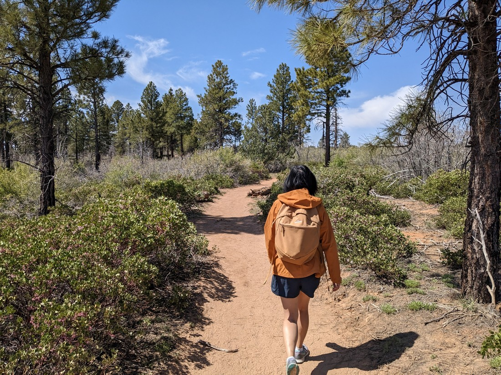

Like Bryce Canyon, we came to Zion last time we were in North America.  And same again - we don't really want to just repeat walks that we've already done.

Last time we were here we did Zion's most famous walk to Angels Landing as well as some other small ones.  There were two big ones that we did not attempt.

The first was the Narrows - a walk-as-far-as-you-want slot canyon where the stream is the path.  This is the most popular walk in the park as anyone can do it.  But once again snow is causing us problems on this trip.  The river levels in Zion are three times higher than the maximum for people to be able to safely do this walk.  So we can't do that one.

The second was Observation Point - a hike up from the bottom of the canyon to a viewpoint on the very top.  We didn't do this last time because we could only do one strenuous walk and we chose Angels Landing because it was easier and more iconic.  Unfortunately only several months after we were there a rockfall damaged the path to Observation Point so badly that there are no plans to fix it.  So it looked like we might be blocked on being able to attempt this one either.

But then I started researching it.  Turned out there was an old trail to Observation Point.  Rather than starting in the canyon, the trail comes from a small sideroad in the hills outside the canyon.  The problem is that road is so bad that it's really not a good idea to drive low two-wheel-drive cars on it.  But we were in luck - a nearby ranch runs shuttles along this road.

So today we set off to reach Observation Point.

It actually wasn't much of a challenge.  The land outside of the Zion canyon is rather flat.  So it turned out to be one of the flattest walks we've done in a while.  It was certainly easier than the 800-900 metre elevation gain that the original trail climbed.  People did note that as a result the walk wasn't as scenic.  But there were glimpses on scenery along the way.

> This is pretty amazing, and this isn't even the canyon we're here to see

Then after an hour or so of walking the ground turned red, the colour of Zion's iconic canyon walls - a sign that we were close.

And we came through the trees and were greeted with this sight:

> Welcome to Zion

Zion is not my favourite park.  It is very popular and that makes it very busy.  But I'll acknowledge that it certainly has some great viewpoints.  While the rim is hot desert, the high walls mean the bottom of the canyon is spared from a lot of the sun's heat.  As a result it is a lot greener than anything we've seen recently.

Fun fact - Angels Landing is clearly visible in these photos.  It's the small peak in the middle.  It really doesn't seem that high from all the way up here, but at least you know everyone who was up there climbed their way up.  There's no second path like there is with Observation Point.

We sat for quite a while overlooking the park - because why not?  While we were there some chipmunks started running around.  They're clever creatures - they could certainly tell what we were doing (snacking on trail mix) and could certainly tell where it was coming from (the bag on the ground).  They scurried around, trying to get a moment when our bag was unguarded, until eventually we zipped it up.

> Very cheeky - a bit too unafraid of humans

It feels a bit cheating visiting Zion this way.  But there really was no reason for us to venture down inside the canyon again.  But at least we got to revisit Zion.

Although our visit wasn't over.  Once we were done and caught a return shuttle back to our car, we continued on.  There is a highway (of sorts) that runs through Zion.  I think I forgot to mention it last time we were here but it is a very scenic drive.

It weaves around and between the rocks until it gets to a tunnel.  But right outside that tunnel is a walk we failed to do last time.  We tried to, but both times we drove by we couldn't get a carpark.  Well this time we managed to snag one.

This path was quite varied.  Sometimes we were scrambling over rocks.  Sometimes up steps.  Sometimes walking along very thin ledges with guardrails.  Sometimes we walked through an alcove in the cliffside.  It made quite a good walk.

> Plus it wasn't too long, nor overly busy

And like a lot of good walks it had a stunning view at the end:

Nowhere near as high as Observation Point, but still high enough to make you just stand there staring in wonder.

So, that's three National Park's done.  No disappointments so far - although I guess that was partly because our expectations were appropriate for each.  Eg, Great Basin was never going to have wonderful hikes or views at this time of the year but we knew that going in.  Last time we were in Zion our experience was hurt by the number of visitors trying to do the same thing we were doing.  Turns out all we needed to do to have a good time when visiting Zion was to... not really visit Zion - only looking down at it from above.

> "You did well Zion this time"

