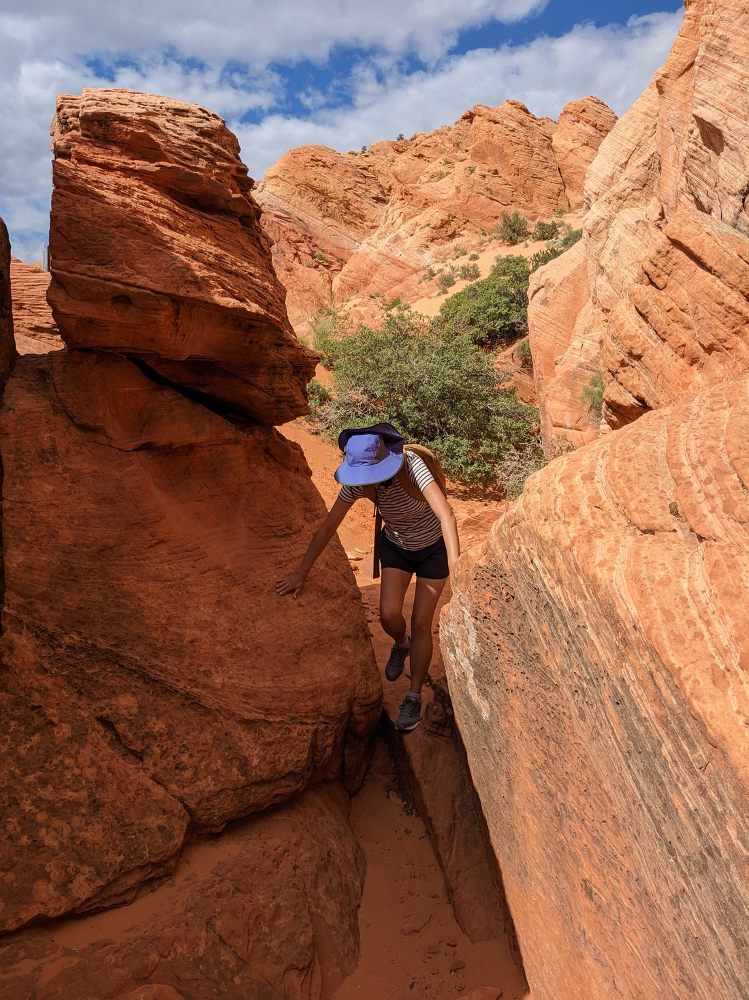

We had two nights booked near Zion National Park.  The first day we spent doing the stuff in Zion we really wanted to do.  What to do for the second day?  Is it worth returning to Zion to do something we don't care as much about?

We instead decided to do laundry today.  Then after laundry we decided to go to Walmart to get supplies as we might not be in a big town for a while.

So kind of a rest day.  We'd done a few days of walking, and we're not walking machines yet so a rest was good.  But it got to mid-late afternoon and we were like, "let's go do something!"

So we hopped in our car and drove to a nearby walk that I'd read about briefly called "Babylon Arch".  It was in a place called the Red Cliffs Conservation Area.  And in my brief read I had failed to notice the description about the road to get there.  To sum it up - it was fine, then it was dangerously sandy, then it was rocky, then it was sandy again, then it got questionable...

> There was a warning sign about four-wheel drives being recommended, but the sign was already 400 metres along the road.  Not going to turn back now sign - I'm already committed.

We got to the end of the road on Google Maps (which was not the end) and there was another car there so we just parked beside it.  Good thing too - the next section would have been impossible in our car.  I guess that was why the other car stopped.  So we had to walk the rest of the way along the road to get to the trailhead.

While we were doing this, another couple were walking in the opposite direction and I overheard the girl say, "Should we warn them?"  Obviously my reaction was, "Warn us about what?"

So they told us a tale about taking the wrong turn and ending up in the middle of nowhere (the word he used was "bumblefuck"), getting separated and losing each other, and then to top it all off - they were never able to find the arch.

That was a bit scary.  As I mentioned - we had not done much preparation for this walk.  Presumably they were more prepared and they had a miserable time.  Fortunately they were able to direct us to the the start of the trail.

The trail was definitely not well marked.  There were markers but they were very infrequent.  They were more just confirmations that we were on the right track.  Instead we resorted to following the footprints.

You see, this area was rather sandy.  The trail often looked like that section of the beach where the sea doesn't reach - just uneven holes as the sand cannot retain the shape of a footprint.  The trick was to go wherever we thought the most footprints were.

> Although sometimes the path was just rock, and people don't leave footprints on rock

We did not always get this right.  Often there would be a junction and I would have to scout ahead to see whether a particular trail had a sign, or whether it petered out as the people who walked this way previously gradually realised that it was not the right direction.

> Hard to spot a trail in that mess of rock

Then at one point the trail came down a big hill and started splitting again and again.  I left Betty back at the first junction and ran (as best I could in sand) along each branch, trying to work out which branch was the right one.  But I was having no success.

Seeing Betty up on the hill I waved, which she interpreted to mean, "Come this way."  Whoops.  Betty might be coming down the sandy hill and this isn't even the right way.  But fortunately as I was looking back to Betty I spotted something...

> Found it!

Turns out I had taken a wrong turn much earlier and missed the arch altogether.  If I hadn't had been looking back then I would have continued to not find the path and probably given up.  So that was nice - we found what the previous couple could not.

It wasn't much of an arch, but still - at least the walk was a success.  Betty proceeded to spend this pause to empty all of the sand out of her shoes.

> There was a lot - we definitely picked the wrong shoes for this walk

But this was a bit premature as we still had to walk back up the hill we had just come down.  This was basically like trying to walk up a sand dune.  Every step was also half a step backwards.  Exhausting, and by the end Betty probably had more sand in her shoes than she did before she emptied them.

> Betty's serious hands-on-hips says this was steeper than the picture makes it seem.

Fortunately we were easily able to navigate the trail in reverse.  The red, rocky terrain was quite varied so there were frequent landmarks we remembered.  And as you can see - visually it was rather pleasing.

And like Red Canyon and the Arches trail - this was just a random walk not some special national park.  We only saw two other people and so it usually felt like we had the whole place to ourselves - very nice.  Of course, if it was a national park then it would have had a much clearer and nicer path but as long as the path is decent enough then we'll always prioritise peacefulness instead.

> Nice that no one will see our ridiculous poses

And since we were successfully able to navigate our car back along the unpaved road then this hike was another success.  It won't be one of our favourite walks of this trip.  As it was just a walk on a random day, it may not end up being that memorable.  But it was a nice mini adventure that I can happily immortalise in this blog post.
