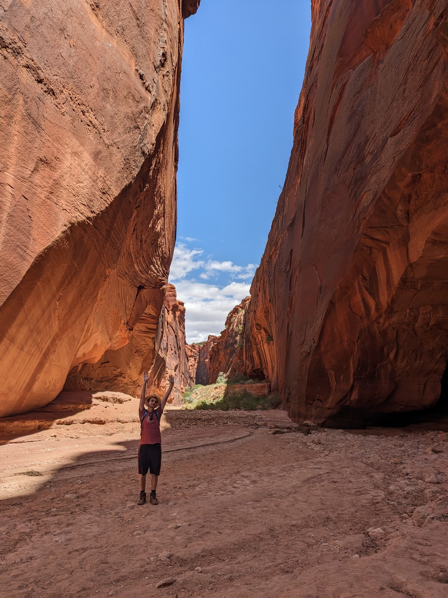

We've had several days of hot desert walks recently but I ought to remind us all that our plans had to change recently because of too much snow.  Before we even left New Zealand I read that Utah got more snow than usual this year and it was taking longer for it to clear at higher elevations.

Today our plan was to visit Grand Canyon North Rim.

Grand Canyon North Rim is at a high elevation so gets snowy.

Due to Utah's additional snowfall this year, the road to Grand Canyon North Rim is impassable and will remain that way for another month.

Okay, so what are we going to do today then?

While researching different areas on our route today I found a walk that was supposedly quite popular.  In fact, to do the walk you needed to buy a pass from the Bureau of Land Management (although infinite tickets are available).  To me this suggested that this might be an interesting walk and we should try it.

Unfortunately this did involve 30 minutes / 13 kilometres of unpaved road driving.  It wasn't quite as bad as yesterday (not as sandy) but still not pleasant.  A podcast was needed to distract us from getting impatient with how slow we had to drive.

I'll also note that to do this walk we had to make a special trip back to Walmart to buy a pen.  Turns out we didn't have one and we needed one to sign in at the trailhead.  Bit of a weird errand to run.  Also a bit weird to be trying to find the one stationery aisle in a massive Walmart store.

To start the walk led along a dry creek bed.  We had driven 2.5 hours to get here and it was now quite hot.  Desert walking is not that fun when it is hot.

> Hard to believe there is a creek here sometimes - you would never think so from the footprints

But it is actually a bit of a lie to say the start of the walk is a dry creek bed.  Because in reality the whole walk for today would be along a dry creek bed.  And after 20 - 30 minutes of walking it became evident why this walk was so popular.  You see, the sides of the "ordinary" creek started getting taller, and taller, and then closer...

> It's a slot canyon!

A slot canyon is a canyon carved by a stream into solid rock making a narrow canyon.  And when that stream dries up (because in this case it only flows after rain storms) then it can make quite a scenic walk.

And the biggest relief is that the high, tight walls made the temperature very mild.  In fact, I would go so far as to say it was perfect.  Maybe even a bit chilly.

There are a lot of these slot canyons around (in Utah and Arizona anyway).  There is a famous guided tour of Antelope Canyon which charges about $100 per person to visit.  But why pay big money when there are plenty like this around for free.

> Well, almost free - the pass did cost a nominal amount

And what a canyon it was too.  In fact, Buckskin Gulch (which was the name of the main canyon) might be the longest and deepest slot canyon in the world.  The BLM webpage describes it as having 26 kilometres of "unique formations and undulating sandstone walls".

> And that description wasn't wrong

But we weren't here to walk 26 kilometres.  This walk was an all-you-can-eat buffet of a walk - just go however long you want to go and then stop.

I think we ended up walking for almost two hours into the canyon.  Not sure how far we got.  I think I have the GPS coordinates somewhere but the exact number isn't really that important.

And as you can see in that time we got a lot of photos.  I'm kind of padding out my explanation of the walk here so I can justify adding so many.  I've also noticed there's also a lot more portrait photos than usual since the narrow canyon meant there was little point in doing landscape shots.

And I suppose I should really mention about how tall this canyon was.  So tall.  It's really hard to imagine how long it would take water to carve such a tall canyon.

After (possibly) several kilometres of tight canyon it eventually did open up to a rather sunny wider canyon.  And then we were being hit by the full force of the sun again.  So it got warmer.

> Luke brought enough water but not an easy way to drink it

At this point we asked ourselves, "Okay, how much further are we going to go?"  This canyon was longer than we could walk in a day (there and back).  At some point we had to turn around.  I told Betty, "two more corners".  Although the stretches of canyon at that point were so long that I think it took 20 minutes to walk two more corners.  After seeing more of the same, it was time to turn around.

Something to note about slot canyons is that they can become really dangerous if it rains.  All the water from a wide area can get funnelled into a canyon like this.  To show how much water can run through, at the start of this walk there is a wooden ladder to help navigate down a particularly steep section.  That ladder got replaced recently.  Here is where the old ladder ended up:

> Around a kilometre down the canyon from where it ought to be

And when the canyon does flood, there really isn't anywhere to escape to.  After all, remember that I said that this was probably the longest, tallest slot canyon - can't climb the walls and can't outrun the water.  But I had checked the forecast today and it had predicted a 0% chance of rain.

This was a reasonably popular walk - exceptionally popular given its remoteness.  But it wasn't so popular that it felt that we were always running into people, and since the canyon had frequent corners we often couldn't see anyone.  However something we didn't expect is that the canyon would bounce sound around quite a lot so even if we couldn't see anyone, that didn't mean we couldn't hear anyone.

There was one group in particular that we kept leapfrogging whenever they stopped, or we stopped.  I can't blame them for chatting while hiking but our experience would have been nicer without them.

Something else that distracted us on our walk was a moth.  We found a moth struggling and stuck in a big mud puddle.  Being the nice person she is, Betty made me go into that mud to fetch it out.  So we left it to finish freeing itself from the mud as we walked further into the canyon.

But then on the way back we noticed that the remaining mud had dried and essentially glued the moth to the rock we left it on - trapping it again.  Feeling responsible we freed it again, and this time did our best to remove all the mud that we could.  And the way we did that was essentially by waterboarding the moth.

But afterwards it seemed to be better.  It was flapping its wings in a more moth-like way, but it wasn't taking off.  We figured it must still be drying itself, or resting.  So we left it on a (dry) rock to recover.

> Here's mothy, mostly free from mud (although there's still some on its head)

Mothy, if you're reading this, we hope you're okay.

Overall a good walk.  It sometimes feels risky driving out on these roads to do walks in the middle of nowhere with no cell phone reception.  I'm still terrified that we'll get back to our car and it either won't start or a tire will have deflated.  But at least on this walk there were a lot of other people doing it with us.  And as I've noted before, if a walk is popular then chances are it is worth checking out.
