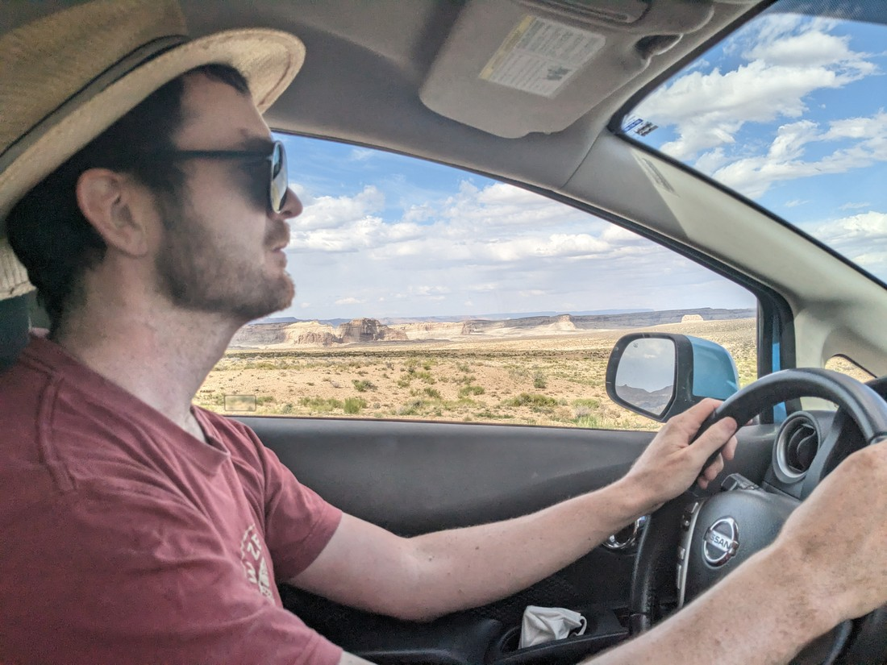
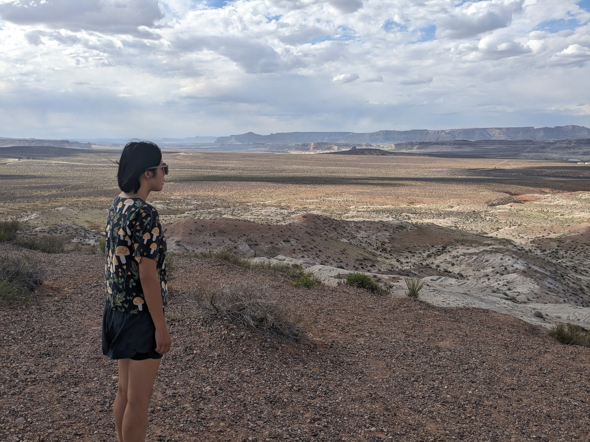
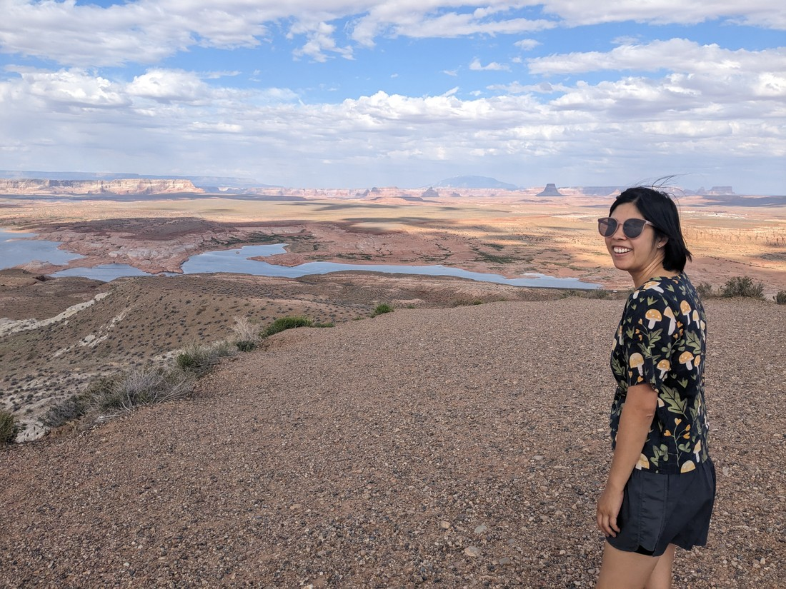
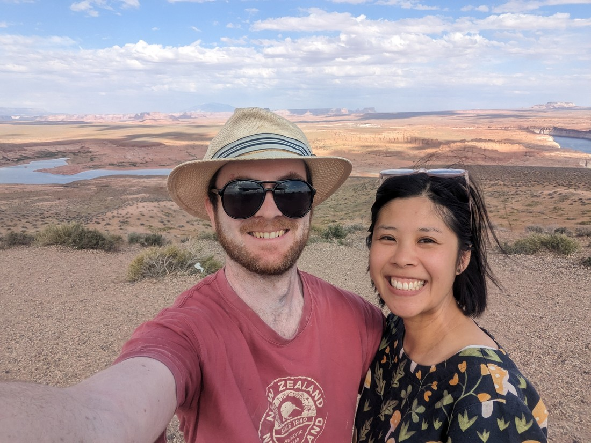
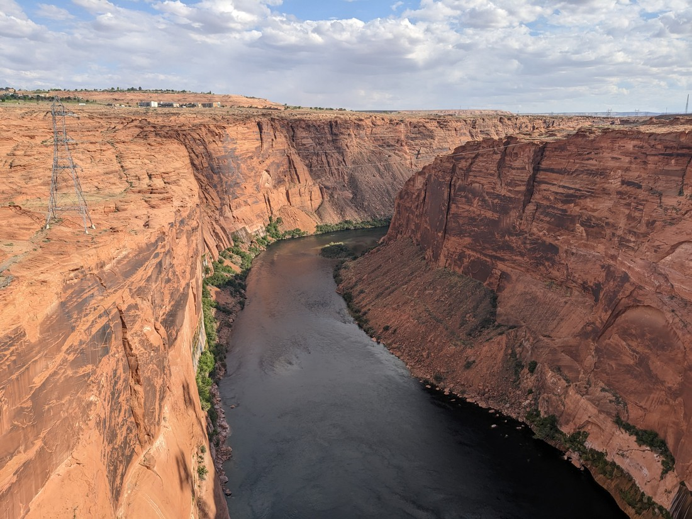
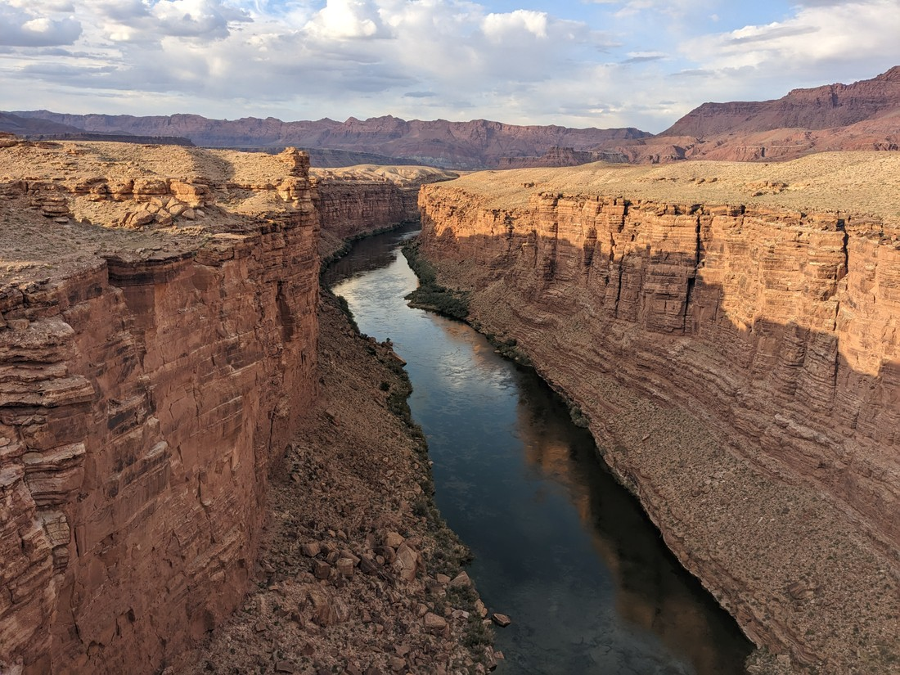
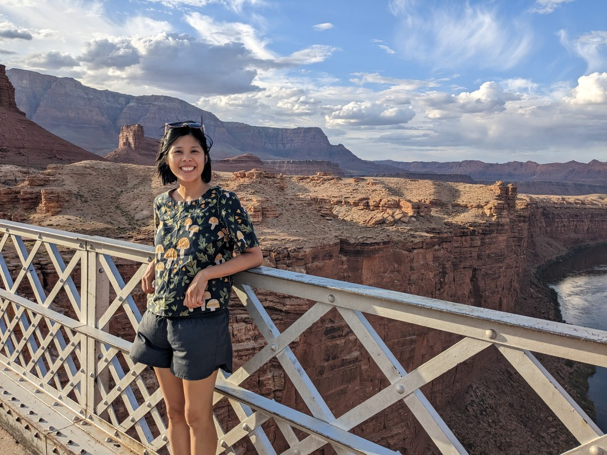

For this trip I've been sticking to writing one blog for every one day.  Actually that's not completely true - earlier I wrote one blog for two days.  Well I decided to split today into two blogs.  The slot canyon walk was a notable walk and a longer than usual story, but then we did a couple of things afterwards.  They're not the most interesting of things but I wanted to write them down so they'd be remembered.

We drove away from the Buckskin Gulch the same way we'd come in - which was not the quickest way to our accommodation.  The quicker way would be to continue south, but then we'd be spending a long time on the unpaved roads in the middle of nowhere.  We decided it would be nicer to get back onto regular highway roads sooner, and just go the long way round.  Plus, this meant we could drop by a nearby town for dinner.

> This is Betty's point of view for hours each day.

Well, like many interstate roads that we've been on, this road was rather scenic.  Big stretches of open flat land with hills in the distance.  As we were coming up on the town of Page we spotted a sign for a scenic viewpoint, which we decided to stop for.  This viewpoint ended up being a hill, giving us a full 360 degree view of everything.

> Hills look small in the photos, mostly because they are so very, very far away.

It's kind of weird.  It feels like there's a lot to see but really all we're looking out at is vast stretches of nothing.  But it's a very pretty nothing.  Technically it is the Glen Canyon Recreation Area, so it is designated as a park of sorts.

> Poor lake, very dry - but also the most water we've seen in a long time

Overall It was a very enjoyable place to spend 15 minutes, standing and staring (would have been longer but we had places to be).  And as we were standing there I had a thought.  We were never supposed to be here.  We were supposed to have gone to Grand Canyon North Rim today, which would have taken us on a very different road and we would never have come this way.

> Lucky us

Despite saying that, I'm sure we would have had some incredible scenery wherever we went today.  It seems hard to go anywhere in this part of the country without the scenery being beautiful.

Next along the road was the Glen Canyon dam.  I didn't get a good photo of the dam, but I did get a good photo of the canyon it was in.

> We're standing 213 metres above the river - highest arch bridge in the world when it was built in 1959.

And after dinner we headed on to Marble Canyon, which was where we were staying.  That was also a very stunning, high walled canyon.

> This one is only 142 metres above the river, but at the time of it's construction was also the highest arch bridge in the world

Looks a bit similar to the Glen Canyon photo, which is not coincidental.  Same river - the dam was upstream from here.  In fact, this river is the Colorado River which also flows through the Grand Canyon, which I'm sure we'll be seeing again.

And outside the canyon we had the beautiful Vermillion Cliffs, further proving my point that this landscape will be stunning regardless of what we would have driven down.

Tomorrow we're headed for Grand Canyon South Rim.  South Rim was probably my favourite place on our last visit to North America.  But then it was also our first canyon we'd visited.  On this trip we've seen a large number (albeit one digit) of canyons already, plus some magnificent and vast scenery on several highways.  Will Grand Canyon still stand up as the wondrous place we remember?

