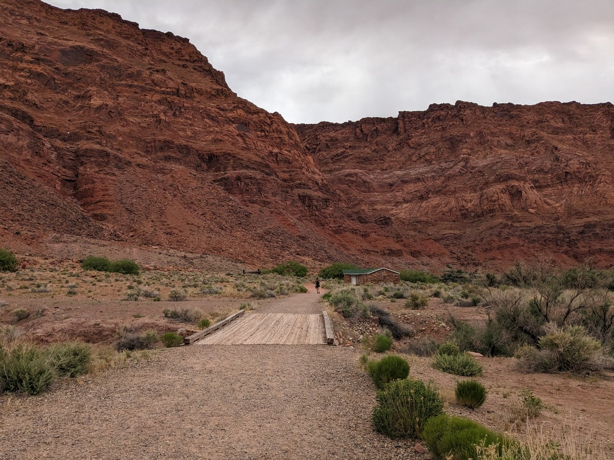
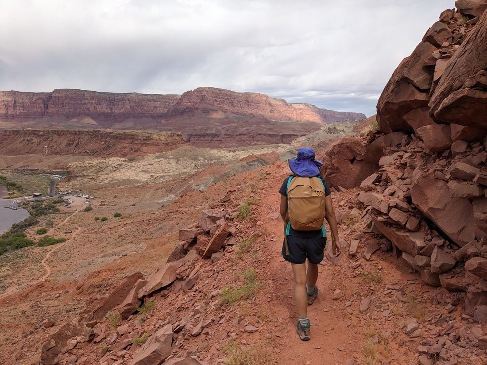
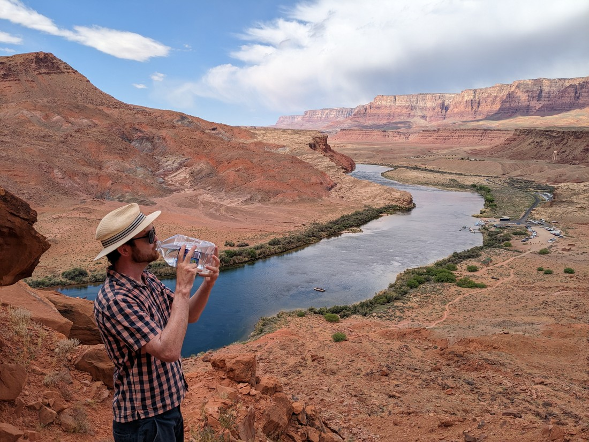
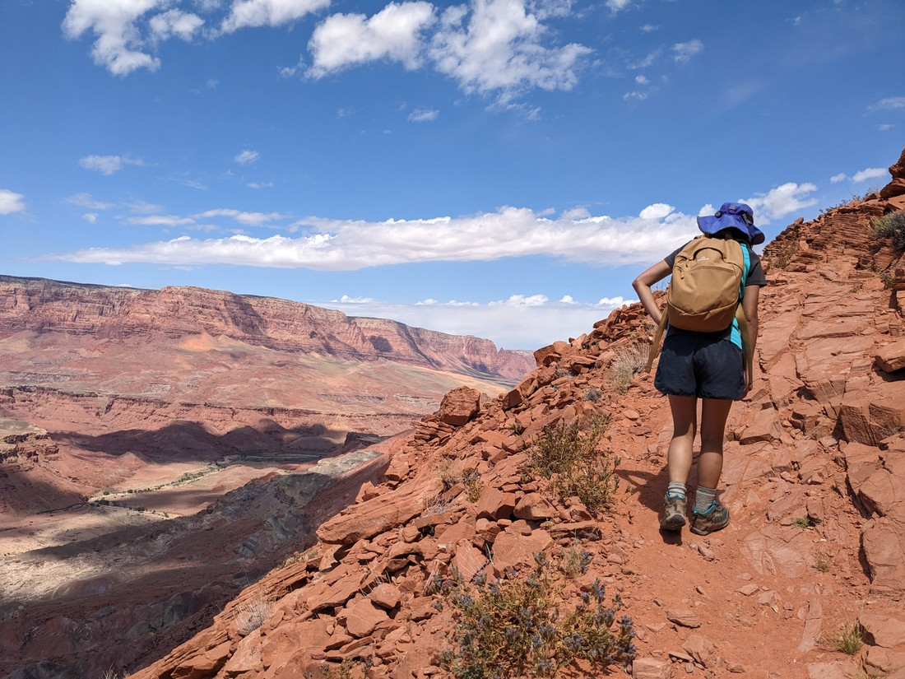
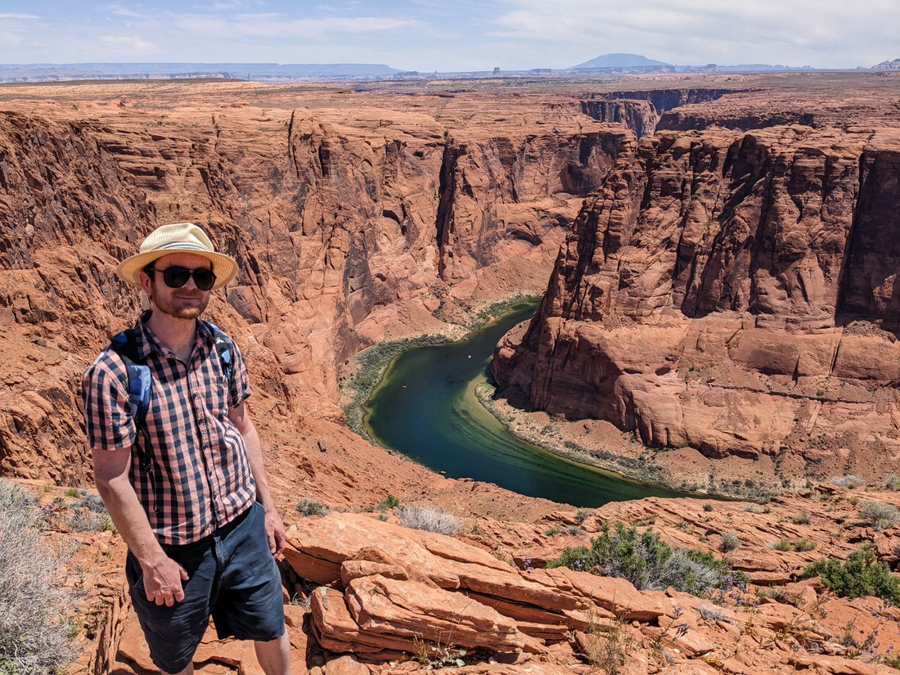
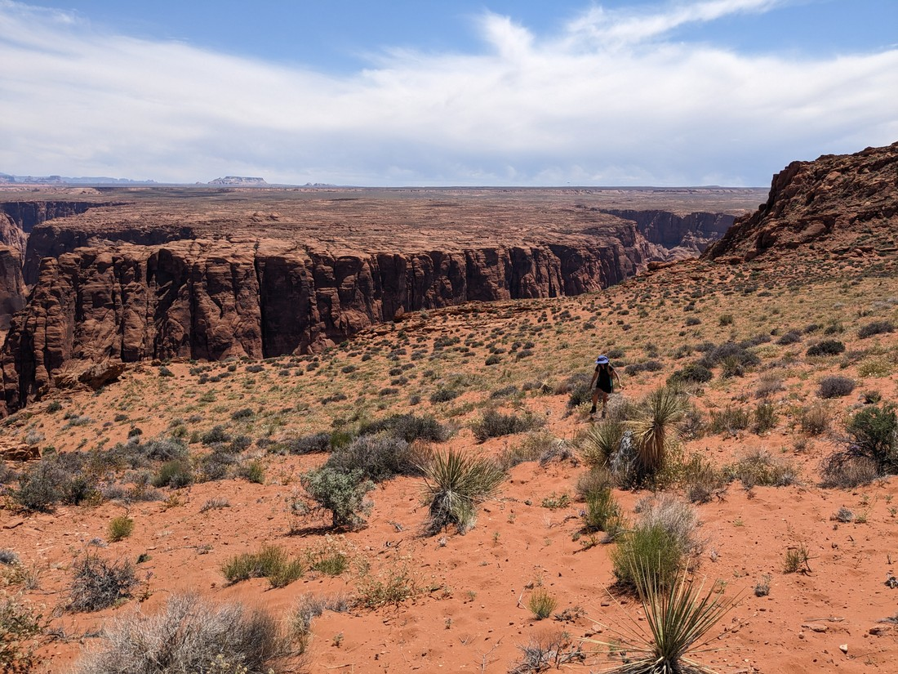
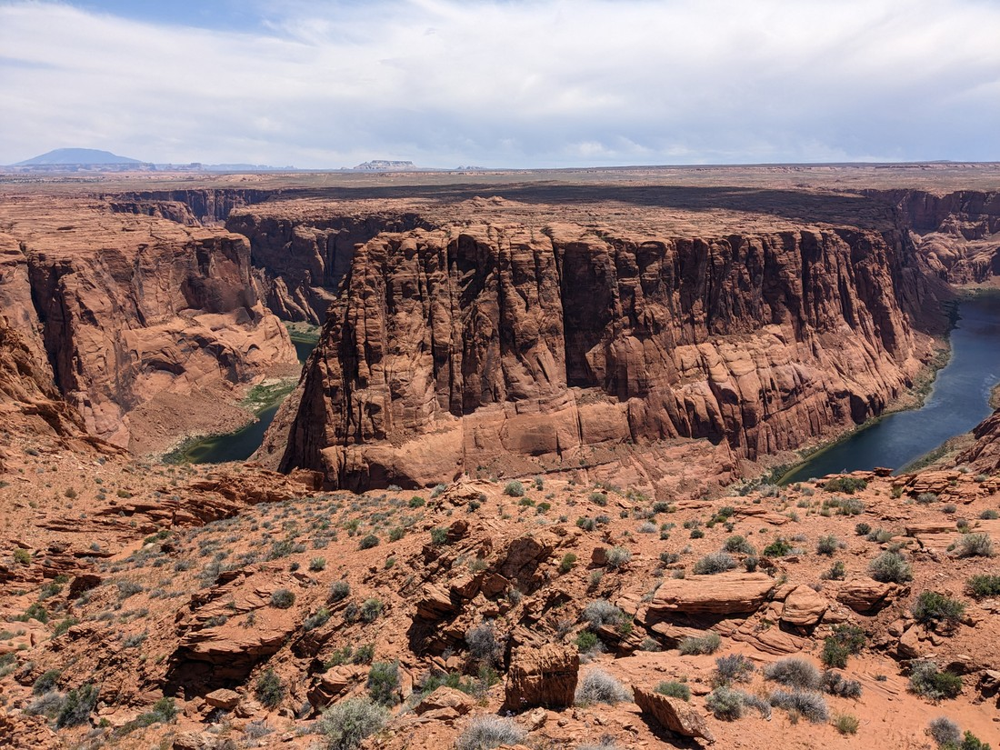
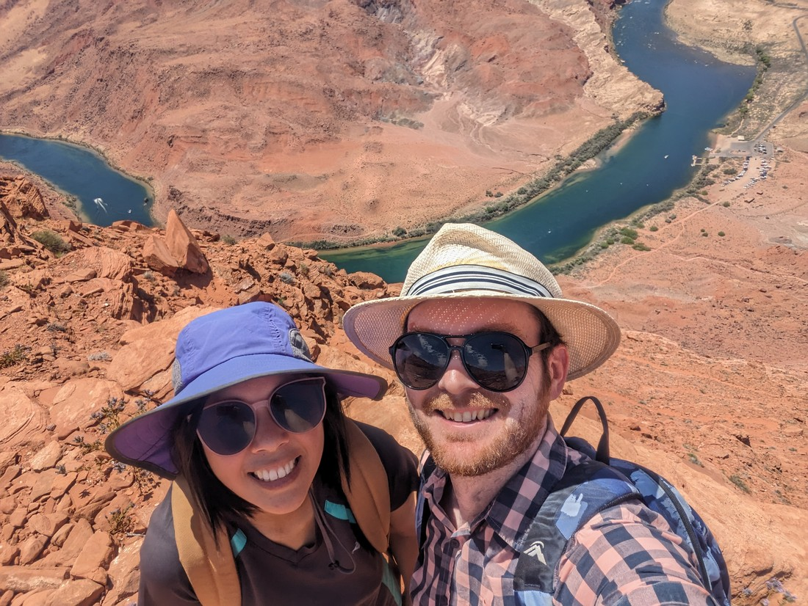
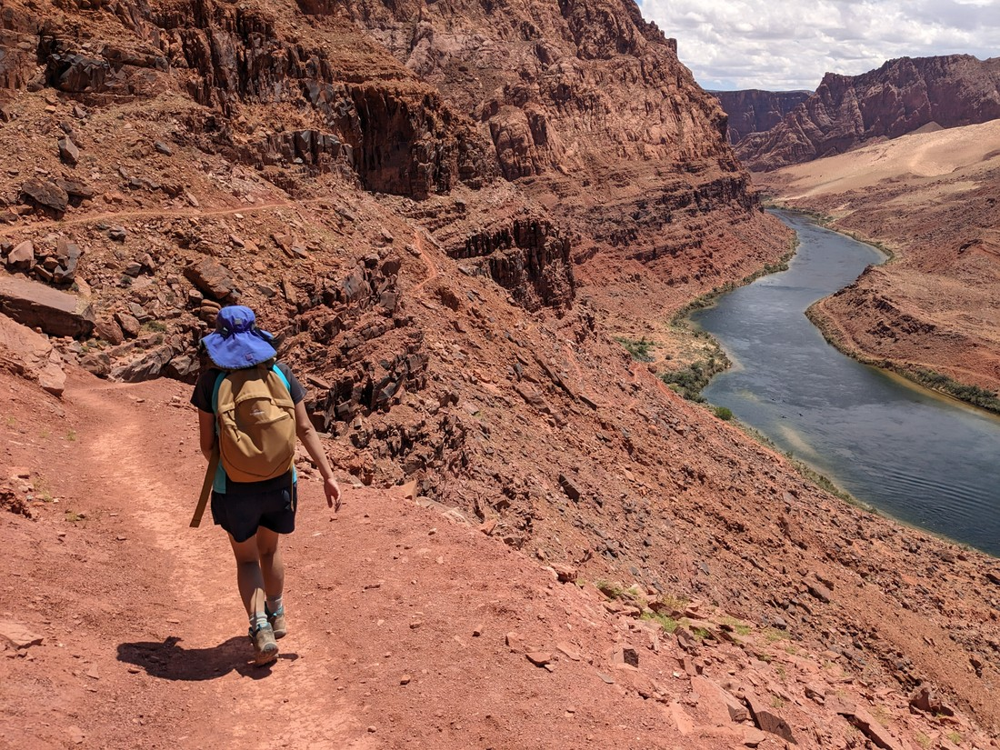

Today we woke up in the middle of nowhere (not really an exaggeration).  Our plan today was to travel to Grand Canyon South Rim, which would involve passing through only a single small town.  And there wasn't really much to see on the way.

So what do we do today?

I gave Betty some options and she agreed to a "hard" walk near we stayed.  In her defence the other options weren't very exciting and it was quite overcast so perfect for an uphill walk.

> And here's the hill we're going up

The description of the Spencer trail is that it was built by two men in 1910 for Charles G. Spencer to get his gold mining supplies transported down a sheer cliff.  Now that I say that out loud it's kind of rude that the trail is named after the boss and not the men that built it.  Anyway, "sheer cliff" is very accurate.  We were walking past rocks and over rocks, and that was about it.

> And it definitely had the "sheer" part too

And remember when I said before that it was quite an overcast day.  Yeah, that didn't last.  The skies became blue with clouds, and we relished when the sun happened to be behind one of those clouds.  But eventually those clouds started occurring less and less often.  And it got hot.

> Big water bottle is back!

I wouldn't say we're unprepared for "hot", but if we have to tolerate high temperatures then at the very least we need a reason to tolerate it.  It wasn't the most interesting of walks.  All around us was just rock - no variation.  We understood that at the top of this walk was a view that rivals Horseshoe Bend (a pay-to-see viewpoint nearby).  Well, the path up overlooked a bend in the river that looked a bit like a horseshoe.  Was this all we were going to see at the top?  A marginally better view of the thing we've been staring at since we started walking?

> "Please let this hard, hot walk not be for nothing"

When we made it to the top, we found that it was flat.  We could see around and further up the river there looked like there might be a horseshoe-like bend.  So that's good news.  Officially the trail had stopped but we had heard there was a secondary trail to a viewpoint of this alternate Horseshoe Bend.  The instructions said to "follow the cairns".

Well, there were cairns.  Two of them in fact.  But they were both within ten metres of each other.  And they were both near the trail we just walked up.

Not sure how that helps.

Well, we made a bee-line for the nearest place that could be a viewpoint of the river.  It turned out not too bad.

> While that is a horseshoe, I don't think this view rivals Horseshoe Bend.

We figured there might be a better viewpoint at the base of the horseshoe, which we expected where the unofficial trail to lead.  So we set out to try to find that trail, if it even existed.

> Definitely doesn't seem like there's any trails around

We actually did find a trail.  So we followed it.

Then five minutes later we lost it.

It just kind of petered out.  It seemed like this trail might have been walked by dozens of people like us trying to find a viewpoint, then giving up and heading back.  This was as good as we had got before we decided to also give up and turn back.

> The other view was better

We could have spent a whole bunch more time, exploring and trying not to crush the desert plants and insects - but as I said before it was hot.  So we called it.  Once back at the top of the trail we did manage to get one photo of us pretending like we were having the time of our lives.

> I exaggerate.  We were fine - just hot

All that was left was to hike down.  We took our time.  Afterwards we made a detour back to the nearby town for a Taco Bell resupply of calories and cool soda.  Then we headed on.

I guess a lesson to take from today's adventure is that not every walk is going to be a winner.  Not every place is going to have interesting sights worth a walk.  But we know there's still of lot of interesting stuff around, so we're not going to stop trying to find the adventures that are winners.
