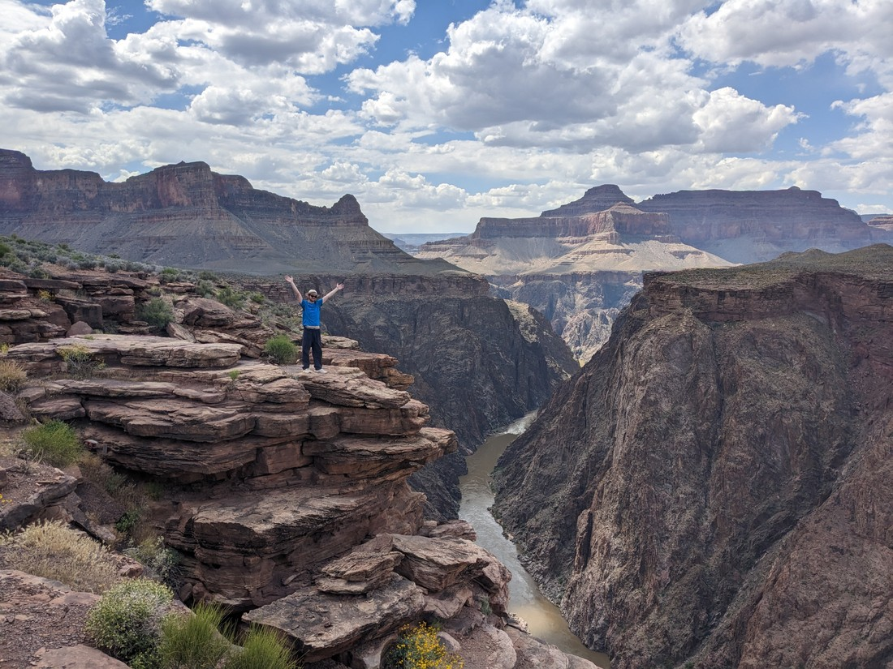

We arrived at Grand Canyon South Rim quite late (thanks to our hot walk that day).  There was almost not enough light to take our usual sign photo

> Okay, it wasn't that bad.  There was plenty of light.

We were staying on the rim.  Upon arriving we unloaded and took one look at the canyon.  I pointed into the canyon and told Betty, "That's where I want to go tomorrow."  Sticking out into the middle of the canyon was a plateau with a trail running the length.  I later learned that this point at the end of the plateau was called Plateau Point.

> You can't see it but Betty is wearing her "less-than-enthusiastic" face

Betty wasn't very impressed.  It was hard to gauge how long it would take to walk there - which likely meant it would take a long time.  But after visiting Grand Canyon last time I had decided that what I really wanted to do was to experience the canyon from inside.  Last time we walked about 30 minutes into the canyon, but it still just felt like we were right near the top.  One of the most popular viewpoints was five kilometres into the canyon, but even after five kilometres the path still hadn't reached the bottom.  I don't think I was going to be satisfied just with that so this time I wanted to go further.

There was a note in the guide advising anyone wanting to walk to the campground (at the bottom of the path) and back in one day to consult a ranger first.  The point I had pointed to was much further than the campground - a 19.2km round trip.  But perhaps worse that that was the near 1km in elevation that would need to be hiked up.  And because the trail started at the top and ended at the top, all of that elevation that needed to be climbed would be at the very end of the trail.  We're used to mountain hiking and this is basically the opposite - an inverted mountain.

I read an account of someone who started walking at 1:30pm so they they wouldn't need to do the uphill until the heat of the day had dissipated.  That sounded like a good idea.  They did note that the last bit was done in the dark - but that was fine with us as we had brought headlamps.  This plan was more pleasing to Betty because the alternative which would likely involve getting up early.

The next day we woke up and did usual things (breakfast, dressed, second breakfast etc).  Then we headed over to the visitor centre to see if they had any relevant hiking info - just in case.  I was intending to ask for advice, but I decided not to bother the lady there.  So I stood there reading the information on the wall and there was a poster that said something along the lines of:

"Could you run the Boston marathon?  Well Margaret Bradley ran it in just over three hours.  But when she attempted a hike in the grand canyon, she underestimated both the heat and the distance she needed to travel and died from heat exhaustion."

Well that poster made me suck up my pride and go talk to the lady.

She was not opposed to our plan but she noted that it got very hot at the bottom on the canyon and there would be five kilometres of walking in direct sunlight with no shade to get to Plateau Point and back to the nearest shade.  She suggested taking three litres of water each, headlamps, salty snacks, electrolytes, and a water purifier in case the one working tap on the trail broke and we needed to drink stream water.

I was comforted that she was at least supportive - and we had everything she suggested, except for the water purifier.  I would just make sure I packed enough water.

When we got back to our room Betty said to me, "I'm bored - maybe we should just go now".  It was just passed 10 am.  The pamphlets all recommend avoiding hiking between 10 am and 4 pm.  But it was kind of overcast so it didn't feel too hot.

So we set off.

> Backpack full of water and Powerades with light snacks in my carry bag, cause my backpack isn't very big

I will also note that Betty commented that in the guide this walk was estimated to take 9 to 12 hours.  She then pointed out that 12 hours would take us to 10:30 pm.  I think I replied with, "Don't worry, we'll be fine."  I'm not sure she was convinced.  At worst we could turn back early and not go the full distance.

Although after less than five minutes I had realised that I had worn the wrong shoes.  My toes were already sore, and we'd only just started walking.  I decided that my boots could easily have the same issue so I would have to just accept the pain.

Anyway, at first we were sharing the trail with a lot of people, who were likely doing short excursions into the canyon and then back up.

Then we had to share the trail with some other things.

> Turns out mules use this trail to carry supplies (presumably to the campground) but also to carry tourists who would rather not walk it.

Poor mules.  They're doing all of the walking, but receiving none of the gummy bears that us humans receive for walking it.

We stopped at the 1.5 mile shelter for a bathroom break (and a snack).  Then another short stop at the 3 mile shelter (and another snack).  After that we were in the last 1.5 miles of switchbacks which would take us to the bottom.  Well, the bottom of this part of the canyon anyway.

> 1.5 miles is roughly 2.5 kilometres, and for some reason everything on this trail was spaced 1.5 miles apart.

When we were approaching the campground we noticed something odd.  It was actually rather... lush.

All this time I had considered the Grand Canyon to be this barren land, but here there were trees and they were thriving.  It made sense now why the campground was called the Havasupai Gardens.  It wasn't just a figure of speech - there was actual life here due to the stream than ran through this area.

This was supposed to be the point where we would decide what we wanted to do.  We could either continue with our plan to reach Plateau Point, or we could do the safe option and go no further.  We'd already left most of the other walkers behind so this was quite far.

Well, we were feeling rather good, and the weather was still overcast.  So we decided to make a push for our ultimate destination.

> There was a short water breaks of course

The next part of the trail was as open as the advice lady had described but our luck held out and we had overcast skies all the way out there.

Although while we had been walking down, we could hear distant thunder - though it didn't last.  When we were walking out to Plateau Point, a ranger stopped us and said that while she thought the thunderstorm had passed, if we ever saw lightning we had to come straight back.  I guess lightning is dangerous out in the open where it could strike anywhere.

But we had none of that and we made it to our destination.

> We survived!

And what I had hoped had come true - being out in the middle of the Grand Canyon felt great.

> Betty usually makes me do the corny jumping photos, so she must have been happy if she was willing to do one herself

We had a view in every direction

> This walk has been sponsored by Safeway

So we stopped here quite the while, staring at the gorgeous sight around us.  This was also the time we had to eat our lunch.  While up on the rim we had bought some overpriced sandwiches, just so we'd have something other than snacks to eat.  Betty later called hers the worst sandwich she's ever eaten

> That face says it all

I would say she wasn't wrong.  For $32 for two sandwiches, you'd expect more than some slices of sandwich meat and cheese.

> Though unlike Betty I did finish mine

Amazingly the low temperature held out while we at the viewpoint.  At no point did we feel like we were being baked.  It was a very nice place to be.  On the walk down Betty had been doubting whether Grand Canyon was worth its grand reputation, but I think Betty was now coming around.

> Just look at that happy face.  And the other happy face.

But while we were happy now, we still had all of the hardest part of the hike left to do.

> Gotta get back up there

Still going to stop to take pictures of course - such as with with this strangely tall plant we found.

> It's much, much taller than all the small shrubs around.  Also prickly.

Here is a picture of Betty at the gardens.  This is right before the trail starts to curve upwards to make the 989 metre vertical climb back to the top.

> Still happy, for now...

And while we were walking up, it was still overcast - which was great.  We were thanking our lucky stars for the perfect weather.  It even started raining, covering the trail in tiny wet drops.  This was also quite cooling.

But then it didn't stop raining.  The drops on the trail started merging, until the top of the whole trail was moistened.  We were getting a bit wet, but that's okay.  We were wet from sweat anyway.

But then it started getting heavier.  With no shelter we just kept going.  But then it started causing problems with our grip.  The path was now turning to mud, and in parts it was becoming quite slippery.  In addition there was now puddles of water, dyed bright orange by the canyon dust.  There's about two hours where no pictures were taken, to keep the phones dry.  But after the rain ceased I was able to grab a photo of one of these puddles.

And to make matters every so slightly worse, these puddles and the mud have now dyed my shoes a slight orange colour.  I don't think they'll ever be the same again.  I definitely chose the wrong shoes.

> Sun is coming back

By this point we were nearing the end - the last 1.5 mile stretch.  I had been worried how Betty might cope on this walk, since she definitely wilted in the heat during the previous day's excursion.  Well, much to my surprise it was me who struggled through the last 2.5 kilometres.

Was I dehydrated?  I feel like I had drunk plenty of water.  Was I missing electrolytes?  I had consumed an entire Powerade as well as salty snacks.  Ultimately I put it down to a choice I made at the start - which was to ensure that we would definitely have enough water.  The weight of that water was not insignificant, and after eight hours of carrying it, my body was struggling.

But we were almost there, so I kept on.

> Here's the final few steps out of the canyon - we forgot to take a "hooray, we did it" picture

We ended up finishing in quite a reasonable time.  And even better, we had a great time throughout.

We had prepared for heat.  We had anticipated being baked in the sun at Plateau Point.  We had planned to wait out the afternoon sun at the camp listening to podcasts.  But it turned out that none of this ended up being necessary as the temperature was always fine.  We hiked almost solely in what should usually be the hottest part of the day - all thanks to clouds.

Thank you clouds.  We hope to see more of you while we are in this part of the country.

