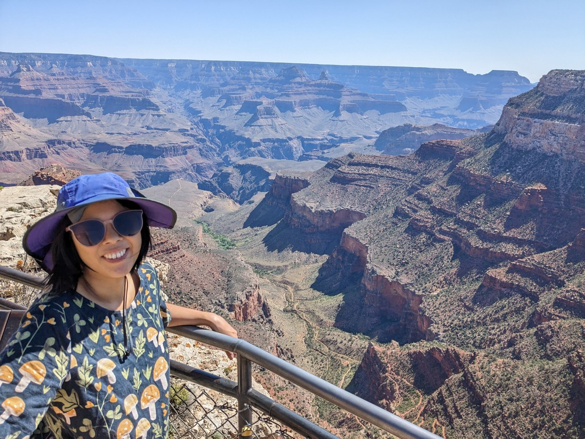

After our success yesterday, we now had to figure out what we wanted to do today.  No point rushing to our next destination - let's check out more of the Grand Canyon.

Here's me at the top of the trail - a picture we forgot to take yesterday.

Here's a view of the start of that trail

> This is perhaps the first kilometre of a 7.5 kilometres descent

And here's a view of the lower portion, and bottom of that trail

> The path to Plateau Point is the one just above the brim of Betty's hat.

So those views were all within walking distance of our accommodation.  Unfortunately because of how "grand" the canyon is, to get these views we did have to walk several kilometres.

We then decided to checkout another viewpoint which was known for being quite popular.  So we drove to the official visitor's centre to park and then walk from there.  That ended up being even more kilometres to walk as while it looked close on the map, it was in fact another 3.7 kilometres around the rim to our destination.  Man, it's really hard to judge distances on a map sometimes.

> Snacking up cause we have to walk again

It wasn't all bad though.  It was a nice flat walk with frequent views of the canyon and occasional views of animals.

> They seem to just munch on anything

The place we were walking to was called the South Kaibab Trailhead.  This happens to be another trail into the canyon - built as an alternative to the Bright Angel trail.  Yep, we're headed into the canyon again.

But don't worry - we're not going far this time.  Just down to a place called Ooh Ahh Point.  As you could imagine from the name, this was a place that offered rather decent views of the canyon.

> I definitely ooh-ed, but I'm not sure I ahh-ed

It was pretty good.  Of course, since we hadn't walked that far the views were not too much different to what we had seen on the rim.

Now just to walk back up again.  Wait - what's this?  Why are there images of us walking further along the path into the canyon?

> Can't be

That's crazy.  Didn't we do a big hike yesterday?  

> Stop! Surely our legs and bodies can't handle it.

I blame Betty for this.  Something about that walk yesterday really hooked her, and she wasn't yet sated.  She wanted more Grand Canyon.

> She's got that crazy look on her face

But in her defence it was a really nice walk, and the ridge below the viewpoint was a very nice place to be on a day like today.

> I can be crazy too

I definitely see why this trail is more popular for people doing excursions into the canyon.  The path down is really nice and there is a nice multi-directional view at the turnaround point.  The Bright Angel Trail was in a lot narrower offshoot from the main canyon so the view was not as good on the way down.

But to be clear, this walk was nowhere close to being as long as the the one we did yesterday.  Mind you, we had already done a bunch of kilometres along the rim before we even got to this trail - so we weren't exactly fresh.  But surprisingly our legs were holding up fine.

But there was one larger issue, which you can see behind Betty in this photo

Yep, the skies were blue.  Basically no cloud cover.  And with the time being approximately midday there was basically no shade either.

Now it was time to walk the 2.5 kilometre, 360 metre elevation gain back to the top in full Grand Canyon heat.

> Definitely missing yesterday's clouds.  Could do with being rained on about now.

It was a slow climb.  Much more frequent stops than yesterday.  But we did make it.  And fortunately Grand Canyon has a shuttle bus so we didn't need to retrace the 3.7 kilometres back to our car.  We could take the bus.

It was now time to leave Grand Canyon.  We had a couple of very successful days.  Before returning, we were questioning whether it was such an excellent place to visit.  After all, it basically just has two walks.  Either into the canyon, or along the rim.  And while that is still true, we can confirm that it was still superb.

There was one more stop before we left the park.  I had heard of an old fire lookout tower in the forest nearby.  We figured it was something different, so might be worth checking out.

I guess this was another walk.  And despite what we've just done over the last two days, I guess technically this counts as the steepest walk in the park.  All vertical elevation, no horizontal distance.  It was short, but wasn't easy.  And despite being so high, you couldn't really see much.  Trees mostly - which I guess is the whole point of the tower.

Overall, a fine minor excursion.  Definitely not a must-do, but I figured I'd include it here since it was something very different.

Now it's definitely time to say goodbye to the Grand Canyon.  But that's okay because there's still lots more things to see and do.  The next few places to visit are all going to be completely new to us.  Hopefully they can also live up to what we've seen so far.