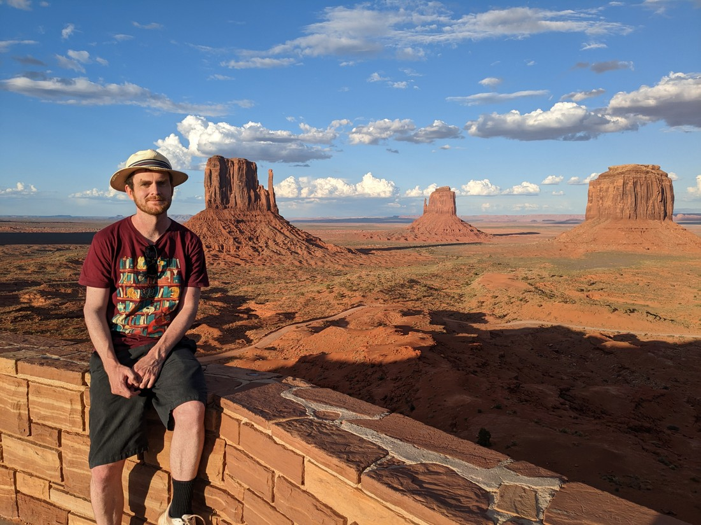
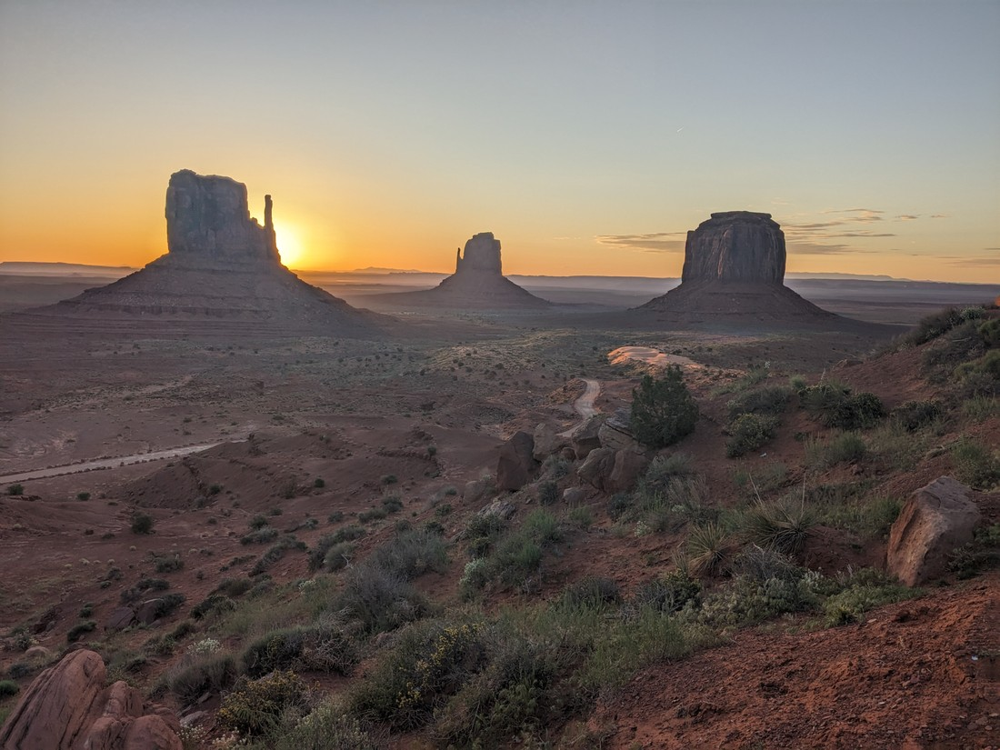
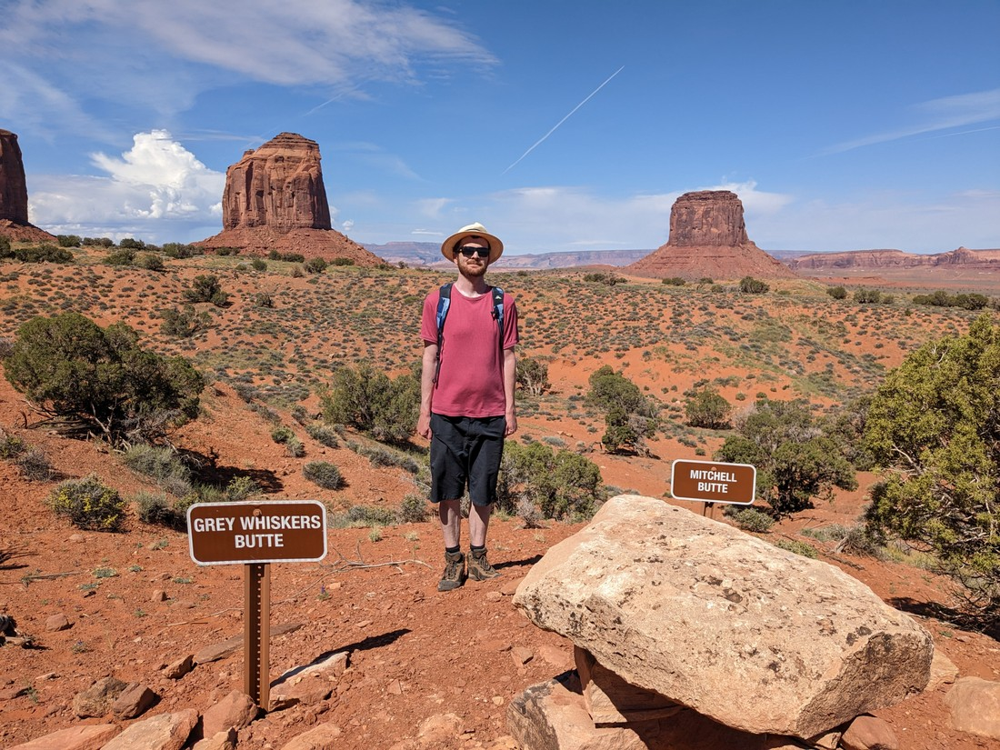
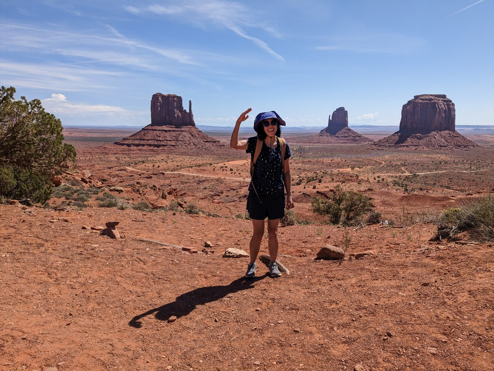
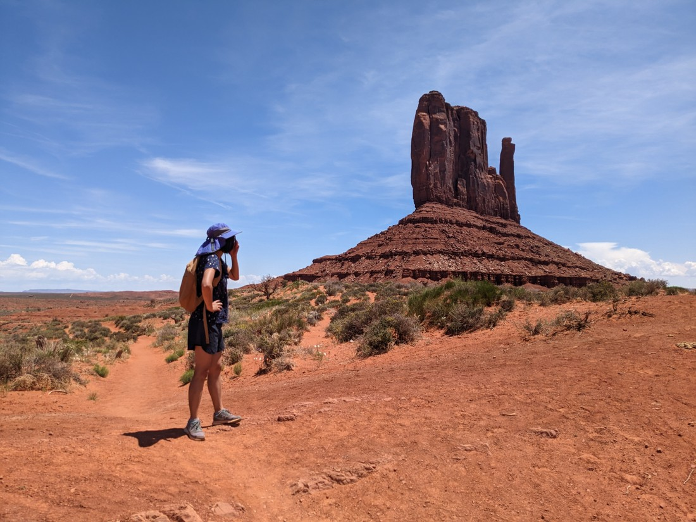
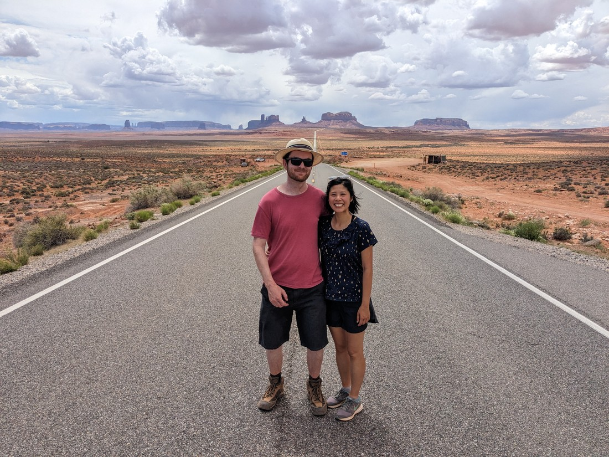

Let me start with a complaint. In this trip we have been hopping time zones a bit.

Our first night on the road was in Oregon, which is in Pacific Time (19 hours behind NZT). Then we headed east and we entered Mountain Time (18 hours behind NZT).

And that should have been it. We weren't ever going to be heading west again, nor will we be going far enough east to reach the next time zone.

But instead, despite being further east, the two days we had in Nevada were back in Pacific Time.

"Okay, now it's sorted," we thought to ourselves. But no. After four days in Utah we entered Arizona.

Arizona is in Mountain Time, but they don't observe daylight savings time. This effectively makes them the same as Pacific Time. Okay fine, four nights in Arizona and then we get back to real mountain time.

But there's more. The Navajo Nation is a Native American Reservation inside Arizona, and they observe daylight savings. And while we were only staying one night in this area, we crossed this area every day that we travelled in Arizona. This effectively meant that the time would jump forward and back when we drove through these areas. "Fortunately" our in-car clock automatically updates for us.

And it doesn't stop there. Inside Navajo Nation there are enclaves of the Hopi tribe - a separate Native American Reservation, and they \*do\* observe daylight savings. And inside one of the Hopi reservations is a Navajo enclave, which again does \*not\* observe daylight savings.

Fortunately when we were driving we never entered the Hopi reservations. But just before we arrived at Monument Valley, our next accommodation, we saw the "Welcome to Utah" sign - except then a few minutes later we got hit with "Welcome to Arizona" again.

As I said, our car updates automatically. But can we trust it to account for all this complexity? My phone has a US SIM card, so that updates automatically - except only when I am in service for my provider, which usually excludes the parks and small towns we visit. And for all the rest of our devices we have to set the time, but we've been forgetting which devices we have changed and when.

So as a result, it feels like we've spent several days where we aren't sure what the time is.

Anyway, regardless of what the time was, we arrived in Monument Valley quite late. Having no idea how much time was left in the day I insisted we grab a couple of photos and then we retired for the night.

> Clearly there was a lot of daylight left. But give me a break, we had driven far.

Monument Valley is an area of the Navajo Nation with a bunch of huge red stone pillars seemingly arbitrarily sticking out of the desert. It's really quite photogenic, and it has become quite the tourist attraction. The hotel we were staying in has like a hundred rooms facing east towards these monuments. Supposedly it is incredible to watch the sun rise over the valley from your own personal balcony.

But, being me and Betty, we didn't pay the expensive room rates. Instead we booked one of the five west facing rooms. These were originally built for employees, not guests, so they didn't need to have the fancy views. But jokes on the rich people - we had a lovely view of the sunset. And of the carpark.

Anyway, I decided I would get up early anyway and go watch the sunset from the restaurant courtyard. (Side note - I had to check and double check my alarm to ensure I hadn't made any time zone mistakes). So 40 minutes before sunset I was out there and I watched as the sky got lighter, and the sun started peaking over the horizon.

And it was kind of lame. The monuments are an excellently bright red colour. But not at sunrise - cause then the light in shining onto the opposite side of the rocks. I mean, the view wasn't horrible, but I was certainly not blown away by the sunrise. I told Betty not to bother getting up and went back to bed myself afterwards.

When we got up again, it was time to do some walking.

> Just another butte

The first loop we did was 3 kilometres, and it didn't really go anywhere. It just kind of did a circle in the middle of the desert and that was it. Just slightly different angles of the monuments.

> I waved to Betty for her to move slightly to a better position. Betty misinterpreted my instructions and just waved back.

The next loop we did was six kilometres, and this time it did go somewhere. It looped around a single monument. So we got to experience that monument from all angles, but as for the rest, same as before - just slightly different angles.

> This was one of the "mitten" buttes. It's not exactly a cultural name, but its definitely appropriate.

And after walking nine kilometres, it was starting to get really hot. I don't think I've seen Betty's face redder than it was on this walk. I will note that we did have plenty of water, but even with water it wasn't overly fun.

So then we left Monument Valley, a bit disappointed. It seems like a place you go to try and take your own magical photographs of the scenery that has been photographed millions of times before you. And that's about it. (At least for hikers like us).

We did make one more stop though. 10 minutes outside Monument Valley is a piece of road where after 1170 days of running, Forrest Gump decided he was tired and went home.

> Give or take a hundred metres or so

That's not really relevant to us of course. We're still just getting started.
