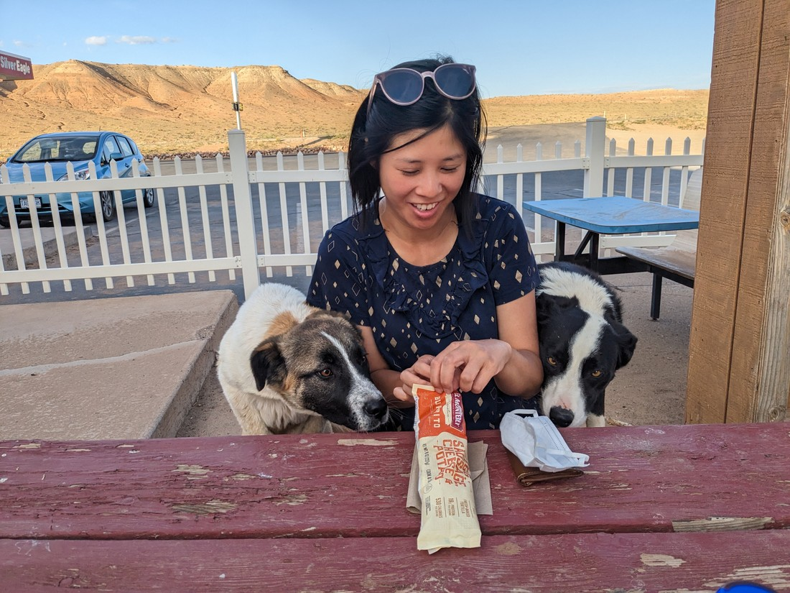

As you may have surmised from the previous blog post is that we were less than impressed with our time in Monument Valley.  But we had only organised one night there so after doing the walks, it was now time to move on.

The problem was that the walks (and recovering from the walks) had taken all morning, and then some of the afternoon.  And we had a decent distance to drive today.  And on that drive there was a whole park I wanted to visit.  And we couldn't afford to arrive at our final destination too late because this was going to be our first night of camping - so we had a tent to set up, which is much harder to do if the sun has set.

But it wasn't worth worrying about the tent issue quite yet.  Our first stop was to get lunch in a town called Mexican Hat.  (Side note - we think this town is called "Mexican Hat" because there's a rock nearby that looks like a person wearing a sombrero).  This town was very small and our only option was a petrol station.  They had some hot dogs, but there were no buns nearby.  The cashier lady offered us some plain white bread and (having no other option) we happily accepted.  Combined with a slushy drink and an ice cream, this was quite a good lunch.

Our next stop was a little park outside of Mexican Hat where we could see "Goosenecks".  These turned out to be a series of very tight hairpins in the nearby river.  It sounded scenic, but unfortunately the rest of the scenery was very "quarry-like".

> Not very scenic but was worth a short

We then headed on to a park called Natural Bridges National Monument.

> "Why do I have to always be in these photos?  Does it really need to be consistent?"

I was going to again brush off having to explain what a "National Monument" is (since I didn't know) but I actually decided to look it up this time.  National Monuments exist to preserve one nationally significant resource.  This is different to a National Park, which contain a variety of natural resources and (usually) cover a large area.  That sounds a bit like splitting hairs, but it is pretty clear for what NBNM is here to protect - three natural bridges.

Here is the first one from the viewpoint:

It's hard to spot because the viewpoint was far away.  There was a path down to the bridge, but as I said before we were running short on time.  Which was a shame, because the canyon looked really interesting.

> It also got quite cold at this monument

On the drive to our next stop Betty read the definition of a "natural bridge" from the brochure and how they differed from arches.  A natural bridge is made from water flowing underneath.  This was a surprise - I had thought water created arches.  Well, it turned out I wasn't wrong.  Arches are also the result of water, but more from precipitation and seepage rather than being eroded by a stream.  This made sense - we had never seen an arch over a stream.

We had a couple of short walks recommended to us that would suit our timeframe.  The first was to a viewpoint overlooking some ruins from an ancient people.  It was hard to tell what they were and we had to rely on the pictures from the info board.

On our way to the second walk we of course stopped to see the second natural bridge.

> This one is a bit easier to spot.  Also now it was warm again.

I really wanted to walk down to the bridge, so we could gaze up at it rather than from a far distance.  I did the math in my trying to work out how much daylight we likely had left, how much driving we had left, and how much time we were likely to spend in the rest of the park.  This was tricky math to do because I didn't know the exact numbers for any of those variables.  I couldn't Google when sunset will be because we hadn't had cell phone coverage since breakfast.  Same for getting Google Maps to predict how long driving will take.  Ultimately my calculations came to the conclusion that we probably didn't have an hour to spare on this walk.

Fortunately the walk to the third and final bridge was short enough that we could justify it.  And what a bridge it was:

> So massive, and yet seemingly so fragile

Here's Betty in front of the bridge to give some perspective of how large it was

> Really big - and such a nice feeling to be underneath this time

They certainly left the best to last.  And what was nice was that we barely had to share it with anyone.  Despite all the amazing things we were seeing, the park was rather quiet.  Perhaps because it was a weekday?  Perhaps because the park was it was in the middle of nowhere?  Perhaps because people consider National Monuments to be inferior to National Parks?  Regardless, it was really nice not to be among the bustle of other tourists.

> Hooray - no one had to be digitally removed from these pictures

We ended up walking along the canyon a bit, unwilling to quite say goodbye to this park just yet.  It looks like there is a half-day trail from bridge to bridge which would take the hiker along the canyon.  If only we had time for this.  Maybe we can come back another day.  This park is two hours from our accommodation for the next five days so maybe we can swing back this way for a day trip.  We'll have to see.

So all that seemed to be left was to drive on to Capitol Reef National Park.  This was where our campground was situated.  But as we drove, we noticed something - this backroad was really scenic.

Again - almost anywhere we turn we seem to find beauty in the landscape.  I had been a bit mopey almost all day since I knew we had to rush through a lot of good stuff today.  But our previous bridge encounter and this road perfectly cured that mopeyness.

After an hour of driving we passed a sign for an elevated viewpoint.  Even though I keep mentioning that we didn't have time to spare, we had to make a stop so we could just stand there and admire all that was around us.

Betty went so far as to say that she think Utah might be her favourite place to visit.  That sounded weird (given Utah is primarily known for Mormonism) but there wasn't really a counterargument.  Bryce Canyon, Zion, Natural Bridges - all excellent.  And there was three National Parks and two State Parks in Utah still on our list to visit.  Utah certainly is a great place to be in late Spring.

As we approached Capitol Reef, the sun was definitely starting its descent towards the horizon.  We stopped at the small town outside and rushed to a burger joint / convenience store to grab dinner.  The burger had a number of customers, none of which had their food yet so we had to grab some things from the store instead.

Betty grabbed a microwave breakfast burrito.  I grabbed a chicken waffle sandwich.  One of those things turned out to be amazing while the other was terrible.  You can probably tell from the following photo which one was amazing, as even these random dogs thought so too.

> We ended up having to eat in the car

Arriving in Capitol Reef, we pulled into our campsite and efficiently put our tent up and inflated our mattress.  And as we finished the last few things, the daylight faded from the sky and things became hard to see without a torch.  So just in time then.

Overall it was good afternoon - but its such a shame it was a rushed afternoon.  We experienced so many good things, it was just a bummer that they had to be all stuffed into half a day.  It wasn't that this leg of the trip was planned poorly.  The main issue just was that Natural Bridges National Monument was in the middle of nowhere with no accommodation nearby - so we always had to try and fit it into a day of travelling.

Moral of the story is the same as the previous blog post - Monument Valley is a bit overrated.  How about a bit of Natural Bridges National Monument and Route 95 instead?