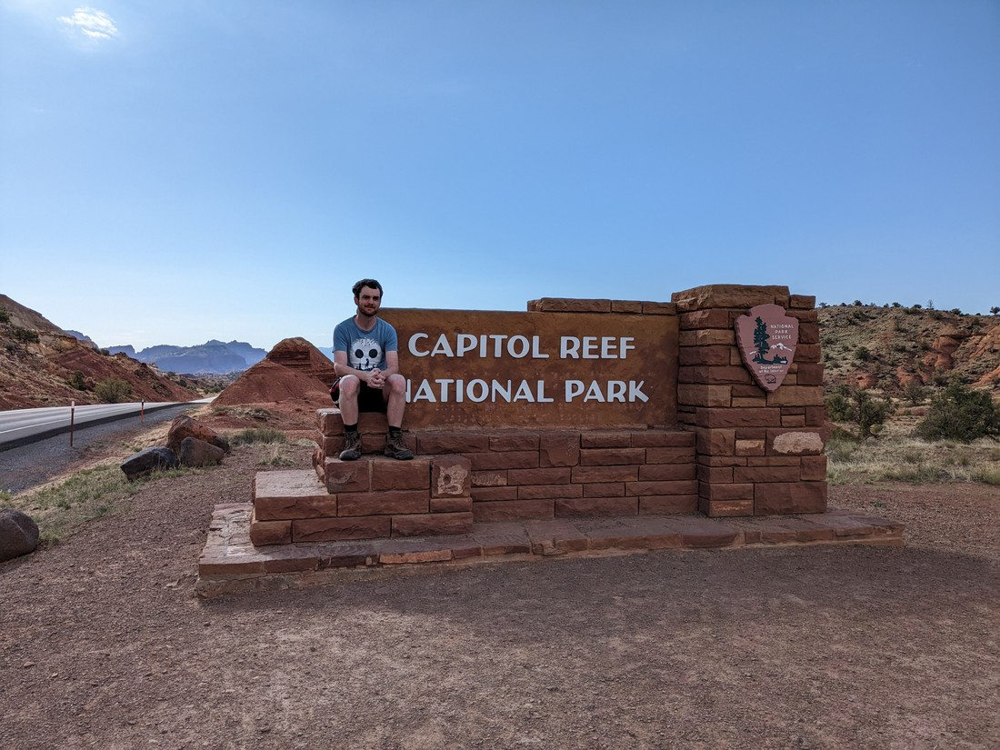

Today we have a new National Park.

> Always exciting

Capitol Reef - the name doesn't give much away about the park.  I think the "Capitol" part is referring to some rock that looks like the Capitol building.  Really not sure about the "Reef" part.

We arrived yesterday, but really late.  We didn't have time to do anything but set up our tent and then go to bed.  The only thing we really remember is lying there listening to a very one sided conversation another camper with a strong accent was having with someone who clearly just wanted some quiet time.

The next day we awoke, broke camp, and then went to the visitor centre.  We decided to first drive the scenic drive.  That turned out to be fine.  Really nothing special.  Like many of the parks we have visited, Capitol Reef has some unique rock formations, but for some reason they just don't seem as amazing as what we've seen previously.  I think it might be due to the colouring.  They're usually just a standard rock colour, rather than the wide array of oranges, reds, and browns we've seen elsewhere.

So we didn't actually stop or take any photos on this scenic drive.

Some facts about Capitol Reef is that in the centre of the park is an area with a lot of water and shelter from the surrounding desert.  Despite being in a National Park, there is a working orchard in this centre, plus many trees that you wouldn't expect to find in the middle of elevated Utah.

> Been a while since we've seen trees this green

Next we pulled over at a stop that promised "Petroglyphs".  These turned out to be etchings in the rock by the indigenous people.  They were located up on a cliff face, which was pretty lucky as this has kept them out of reach of vandals.  The drawing style almost looked modern.  Betty said the pictures looked like a child drawing their family.  I said the pictures looked like a child drawing the monsters under their bed.

> Apparently there was more but some of the rocks fell out of the wall relatively recently

Then we travelled on a bit further to check out Hickman Bridge - a natural bridge in the park.  Overall it was much like the ones from the National Monument that we saw yesterday.

> So pretty good

And we got a bit of a view out over the park.

> Scenic - but not super scenic

At this time it was still early so we decided to fit in one last walk before lunch.  It was called the Great Wash, and as we now know a "wash" is basically a creek that is not a creek all the time.  Like the ones we've seen before, this one also became a sort of slot canyon.

The walls were extra tall - probably a lot taller than the Buckskin Gulch.  But it never did necessarily feel like a slot canyon.  The walls never got that close.  Overall it was a nice walk, and an easy walk - but like the rest of Capitol Reef it was missing some sort of spark or feature that would make it stand out.

> Here's the narrow part

We lunched in a small town just outside of the park, and then we had a choice.  Do we go back to Capitol Reef or do we do something else?  While we had basically only spent a morning in the park, there wasn't a lot else that we wanted to do.  So we decided to spend the afternoon doing laundry.  We had been fitting in a lot these last few days, so a shorter day was nice.

Except as we are sitting there waiting for our laundry, we hear a voice we recognise.  It's the loud, strong-accented man from the camp the night before.  The one that likes to talk to everyone.  We put our heads down to avoid having to make conversation, but we hear him talking to everyone else letting them know that today is also his laundry / shower day.

While we did manage to avoid him most of the afternoon, we did cross paths in the general store where he recognised us from the campsite.  I was surprised that he remembered us - we hadn't spoken to him, nor had we done much at all.  I guess we might have looked out of place - a couple of city dwellers clearly out of their comfort zone.  He spoke high praise about the campground - said it was his favourite place ever.  Fortunately he never questioned how we knew him, so we didn't have to say, "You were the one that talked loudly for 30 minutes while we were trying to sleep."

And weirdly, this guy was not the only person we ran into today.  We bumped into someone Betty knew at the gas station.  This wasn't someone she knew personally, but someone who had previously produced travel videos on YouTube.  I suppose a small town in Utah is just a likely place as any to run into a professional tourist like her.

> Fun fact: her dog did not like me

So that was Capitol Reef.  Really it's only problem is that is nestled between some of the most amazing parks in the country.  But I can understand that it has fans - we know at least one person who (loudly) loves it.  We still have two more Utah National Parks to visit.  At the very least our visit to Capitol Reef might have lowered our expectations for future parks - which is useful, as it will mean there's a higher chance we're pleasantly surprised.