Today we're going to Arches National Park.  Well, kind of.  We have a camping reservation there and so there's no rush to get there just yet.  Instead we can spend the day elsewhere.  But as mentioned previously, there wasn't anything else to do in Capitol Reef.  We could drive all the way back to Natural Bridges, but that would likely result in another day where we're rushing to put up a tent before the sun set.  But there was also another park nearby - this time a State Park.

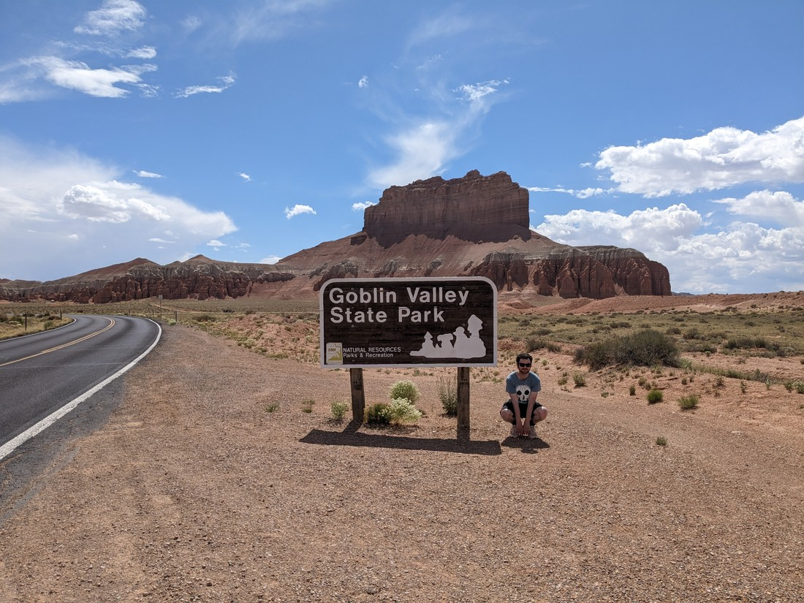

> Doing my best goblin impression.  Also, I am not good at impressions.

State Parks are a bit weird for us.  They're definitely lesser to National Parks, as by definition they have not been deemed of national historical importance.  However, which do you think would be more expensive to visit?

Well since we already have a 12 month pass to all National Parks and Monuments, they feel free to visit.  On the other hand there is no annual pass for State Parks so they can cost up to $40 NZD for a visit, so feel quite pricey despite by definition being less important.

So despite the picture above, we deemed that this park wasn't worth visiting.  Instead we drove really close, then continued on to another reasonably well known slot canyon walk that wasn't part of any park.

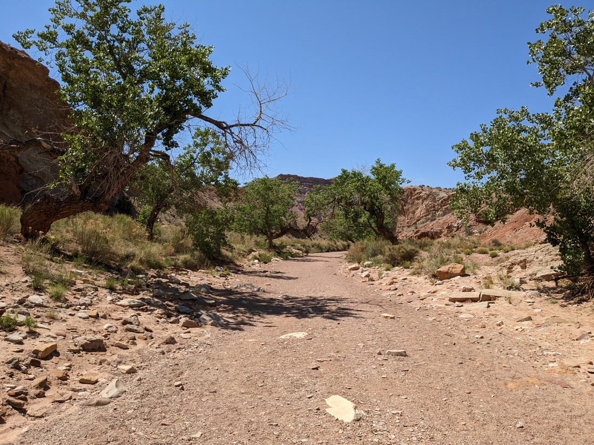

> Like Buckskin Gulch, it started with a walk along a wash

This walk was interesting to us for two reasons.  The first was that the road was paved all the way there - a rarity for a walk like this, and very much appreciated when it is.  The second was that at times the canyon got very narrow - much more so than any slot canyon we've seen previously.

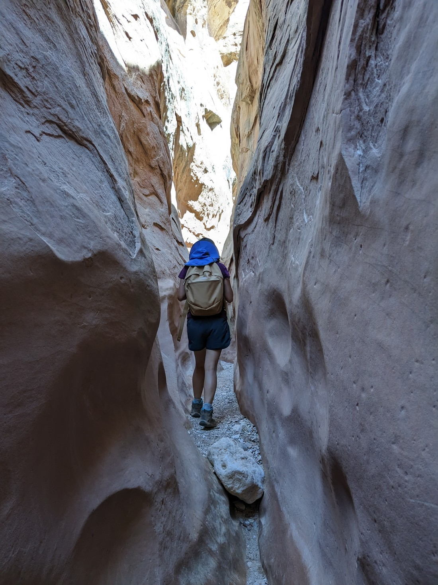

> Seems claustrophobic but it wasn't really

The other thing of note about this walk is that many parts of the tight canyon still had pools of water in it.  Of course Betty will take any opportunity to avoid getting her feet wet.

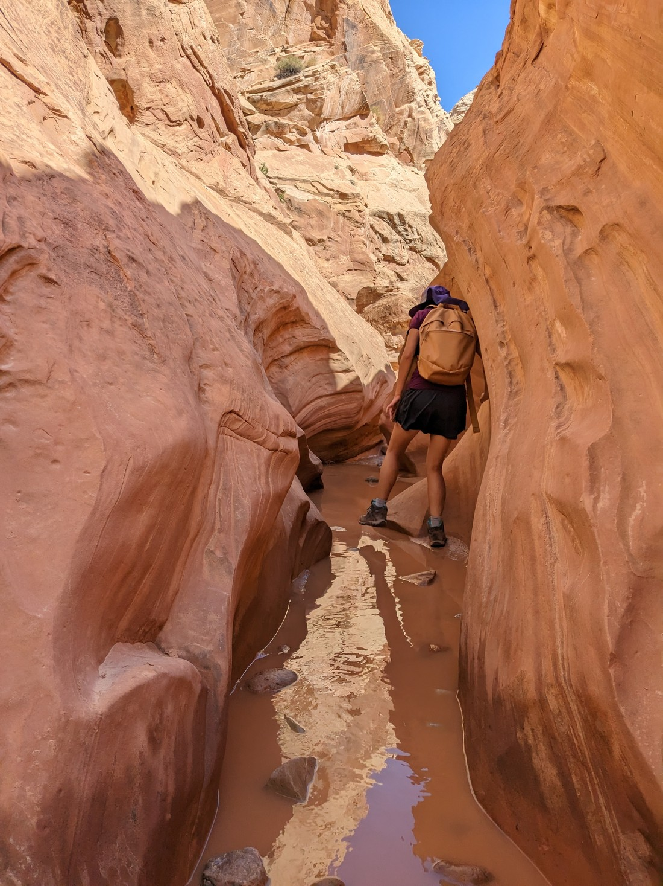

> Using rocks as stepping stones.  Actually I suppose stepping stone are rocks.  That was a lazy metaphor thing.

But at some point it was a losing battle.  For once she accepted defeat and waded in, soaking foot, sock, and shoe alike.

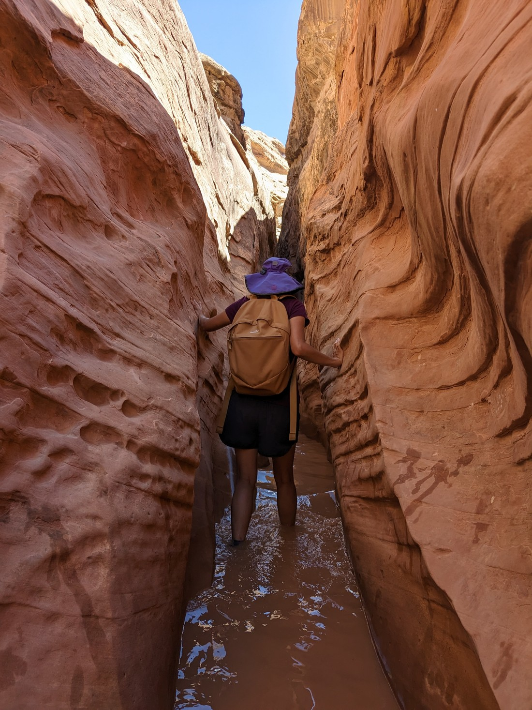

> Going barefoot was briefly considered, but keeping them on was definitely correct based on what else we then had to do

But it wasn't all wading through water in this canyon.

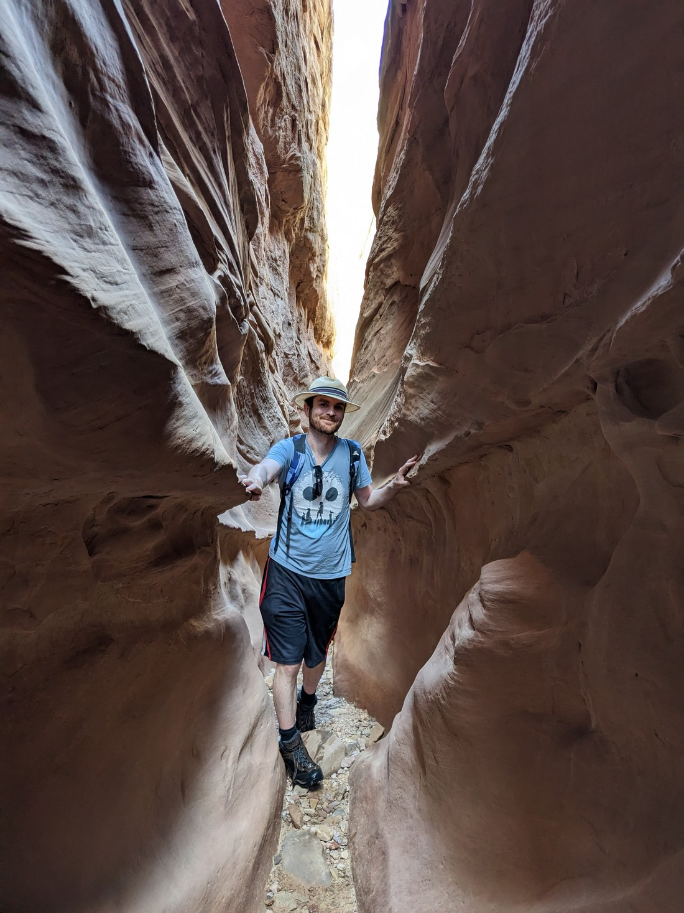

> Are my laces not done up here?  I wonder if I knew that in this photo

Though there was a fair amount of it.

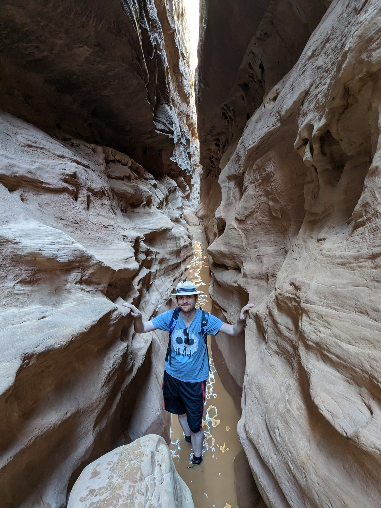

> Certainly looks like the right laces are loose and floating now.  What is going on?

Eventually the walk stopped being about tight, wet squeezes and started being about clambering over boulders and other objects.  It really reminded us how inflexible we are.  Hiking has been strengthening our muscles - but only a few.  There's certainly a lot of muscles that haven't been being utilised and they were not happy that today was they day that they were needed.

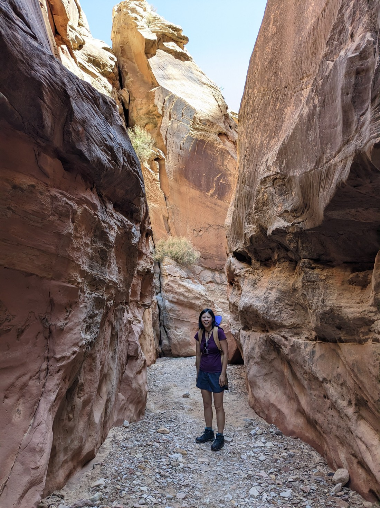

> Fortunately wet shoes did not (noticeably) make the rocks any more slippery

The canyon wasn't as spectacular as Buckskin Gulch, but it was certainly interesting.  Frequently the walls seemed to flow like waves, making us have to weave back and forth through the narrow canyon.

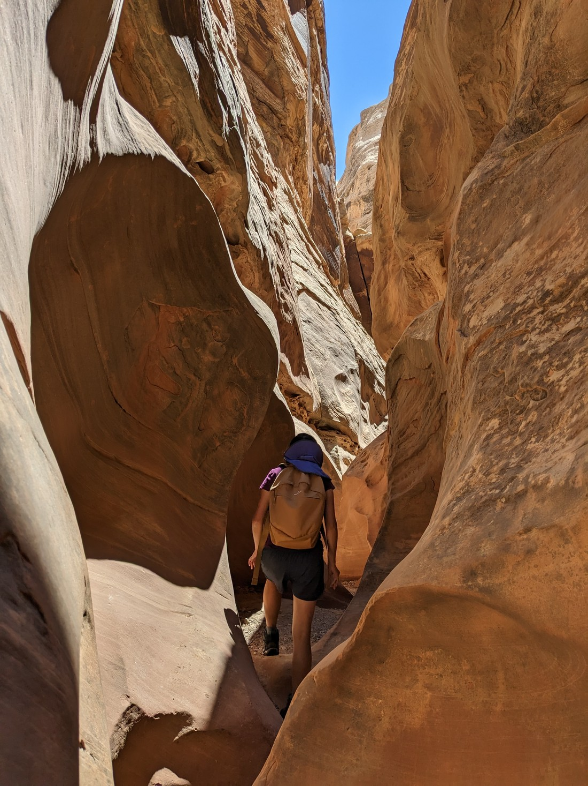

> It was really hard to photograph Betty here, as she was turning a corner every two seconds

But this wasn't the whole walk.  In fact, it wasn't even half.  Eventually the slot canyon opened up (as they always do) to a much wider canyon, and then we basically exited it altogether.

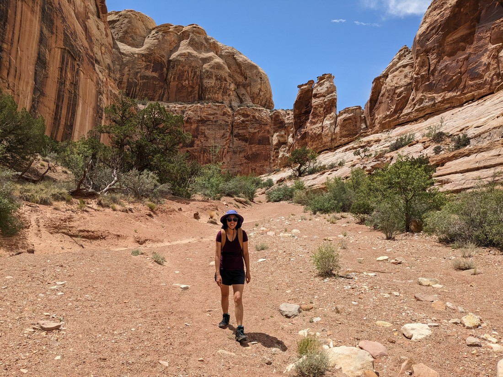

> Betty looks happy, but she's really unhappy we're now in the hot sun again

And the fun part about this walk was that this was a loop.  After leaving the canyon we then walked along a four wheel drive track to another canyon, which would take us back to where we started.

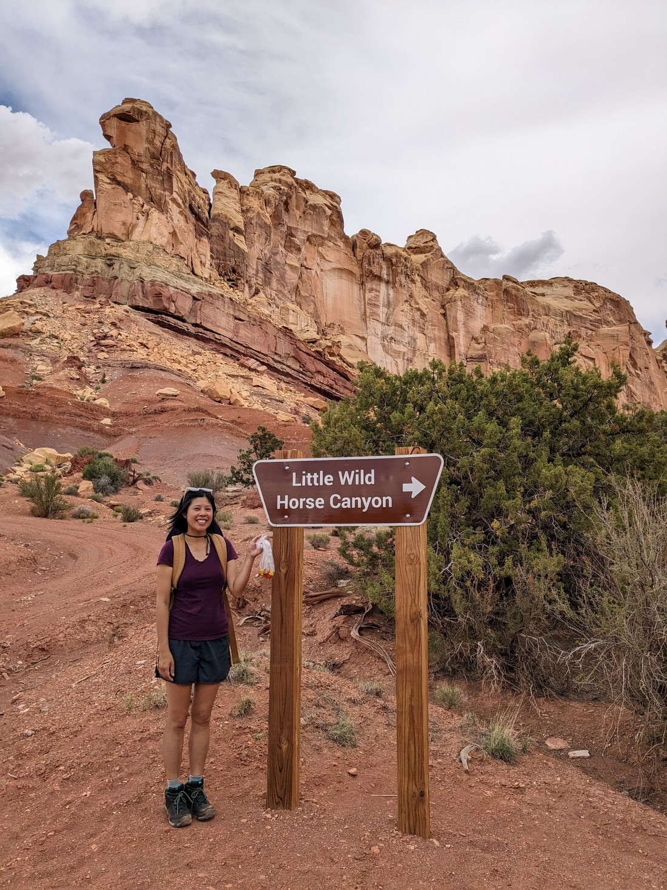

> Oh yeah - this canyon was called Little Wild Horse Canyon.  I forgot to mention that.  No idea why it was called that.

But while we were walking from one canyon to the other, we were looking out over the landscape and we could see thunderstorms.  The lightning wasn't frequent, but it was definitely happening.  And as I said in a previous post, a flash flood can be deadly in a slot canyon.

But there wasn't anything for it.  All we could do is hurry along and hope we didn't get lightning struck or flooded.

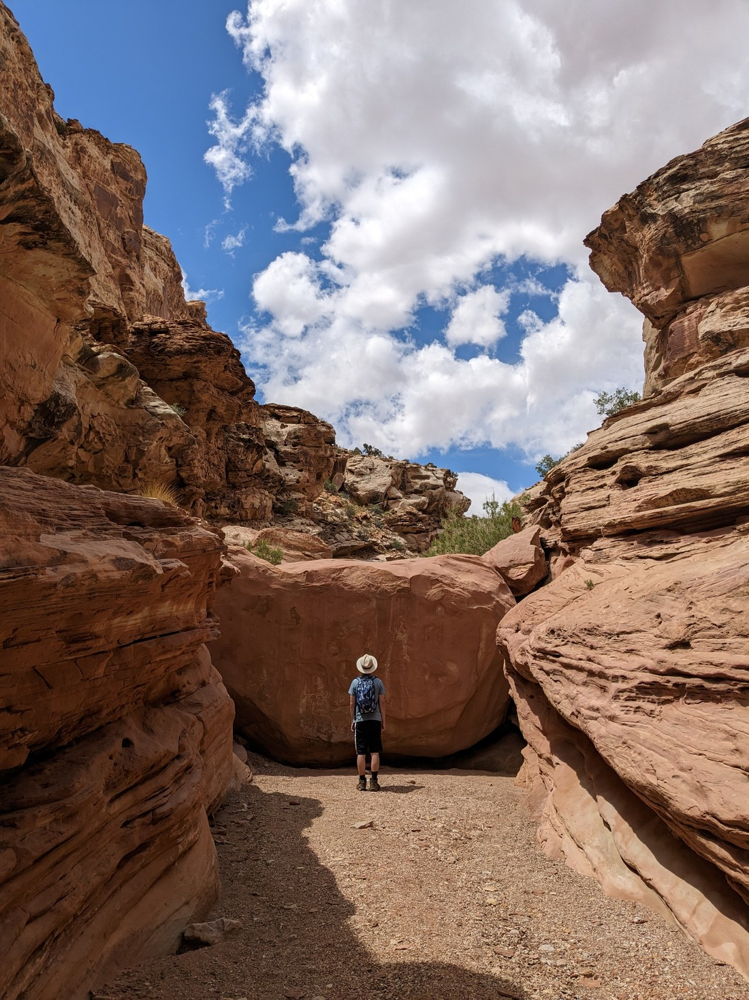

> A very inconveniently placed boulder

The second canyon was definitely less notable than the first.  More interesting than the one we saw yesterday in Capitol Reef, but lacking the special stuff that the Little Wild Horse canyon had.

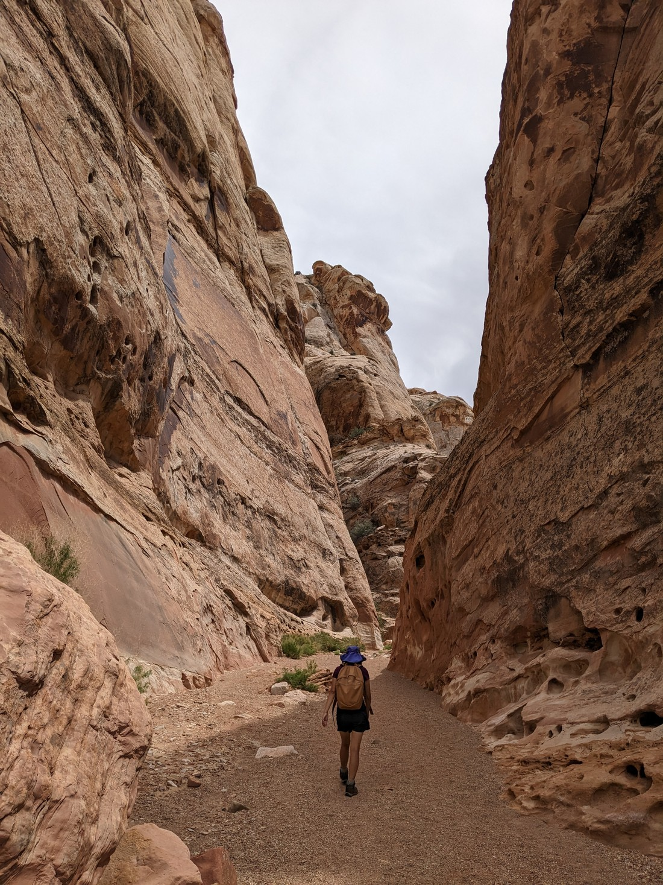

The walk did outstay its welcome a bit - but that's fine.  Walks can't always magically be the right length.

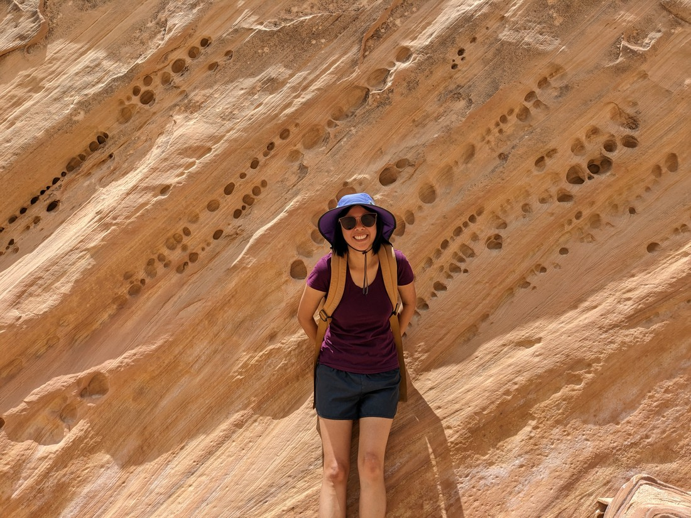

> In this moment Betty had scolded me for not taking close up pictures of the canyon wall.  I thought the holes wouldn't look interesting in a photo.  I was wrong.

After finishing, we drove on to find lunch / early dinner and to find supplies that we could take camping.

When organising this trip, I wasn't sure how much time we should spend at each place.  Since we're not employed right now there was no need to condense the trip.  But there was also no reason to spend multiple days in areas with nothing to do.  Overall I think I have struck the right balance.  We are finding time to do stuff like this outside of the main parks, but we're not struggling to come up with things to do and see.

Next up we have four days in or near Moab.  This was done on the assumption that there would be a lot to do there.  We'll see if I was right.
