Arches National Park does not make the best first impressions.  The entrance and sign (see below) are at the bottom of a big quarry-like hill of rocks.

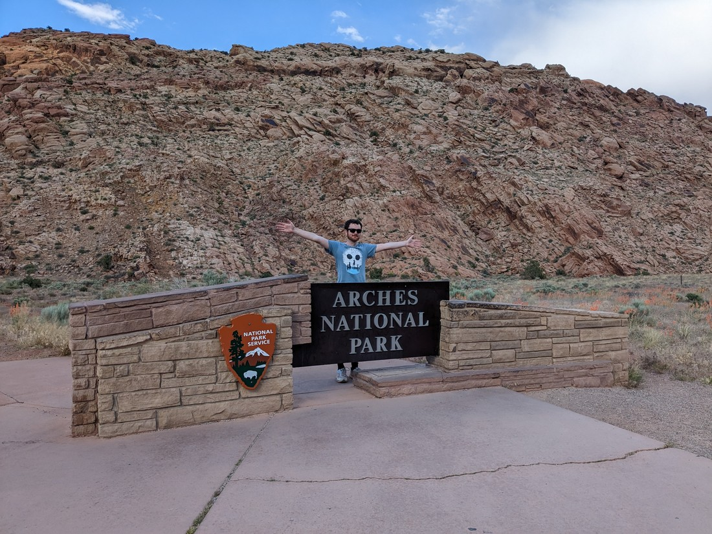

> Here's the sign but where's the park?

Okay, there probably is more to this park.  After all, this park limits the number of visitors that can enter each hour.  You either have to book well in advance (which I didn't) or book the night before (which I also didn't).  However the reason I was apparently so unprepared was because I had booked a camp site inside the park.  As far as I could tell this would allow entry to the park at whatever time - though I was reluctant to fully put that to the test.

We arrived quite late in the day - after 5pm I think.  We found that at this time of the day there is no restrictions on entry.  Seems like all the booth people have gone home for the day so we could just drive in.

The road took us up the hill, and I was actually quite stunned with what we found.  The park is the usual red sandy desert we've seen before with a lot of green shrubs.  But sticking out of the desert in many places are rocky structures.  They don't really seem like the monuments we saw at Monument Valley.  They look more like walls or buildings.

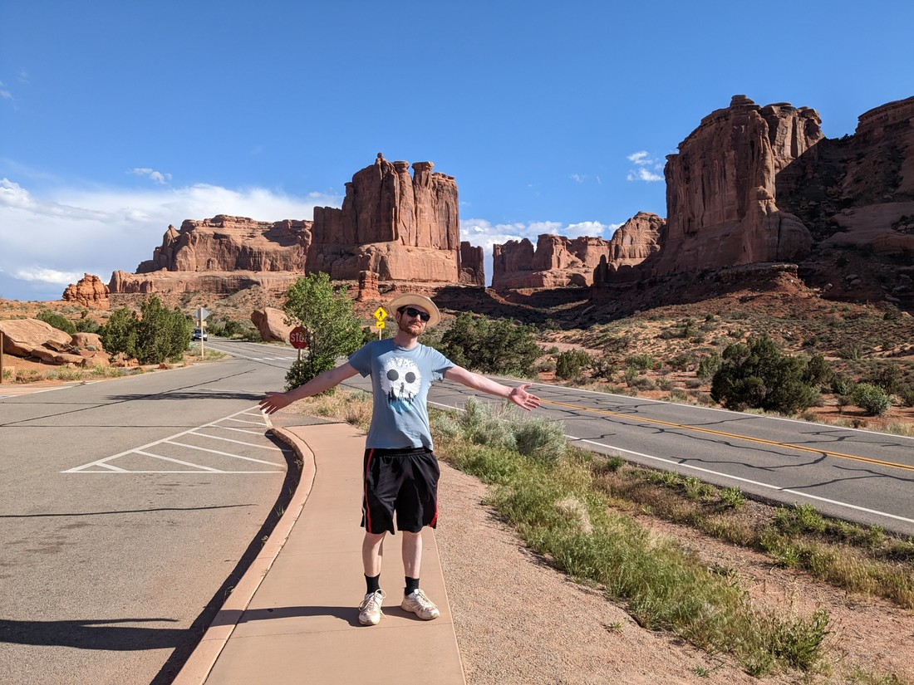

> Here's the park!

The perfect bronze colour, the vertical shapes, the strange almost-legible markings - it felt to me like we were driving through the ruins of Greek temples (if the Greeks were giants and they built their buildings out of pottery).

We slowly made our way to the campground, which was at the end of the park.  As this was not a short distance we did make one stop to do a walk to an arch called the Skyline Arch.  This was certainly an arch, but we may have picked one of the most uninteresting arches to start with.

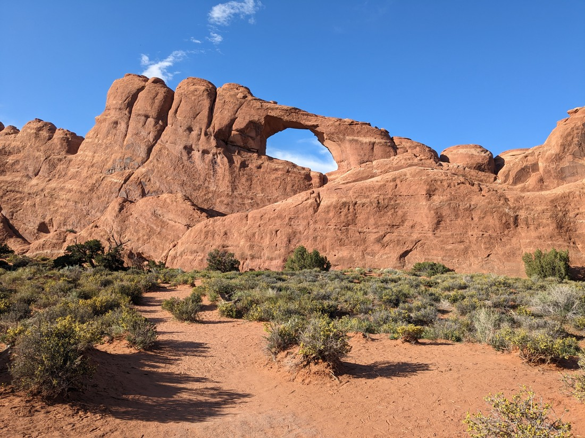

We didn't sleep well that night (for reasons I'll discuss in a later blog about our camping adventures) but we awoke the next morning and figured we should still try and do some walks.  There was one that started 10 metres from our camp site so we figured we should start there.

While we got a hint of it during the Skyline Arch, but this walk confirmed something that we were concerned about.  Despite having plants all about, Arches is definitely the sandiest park we've been to.

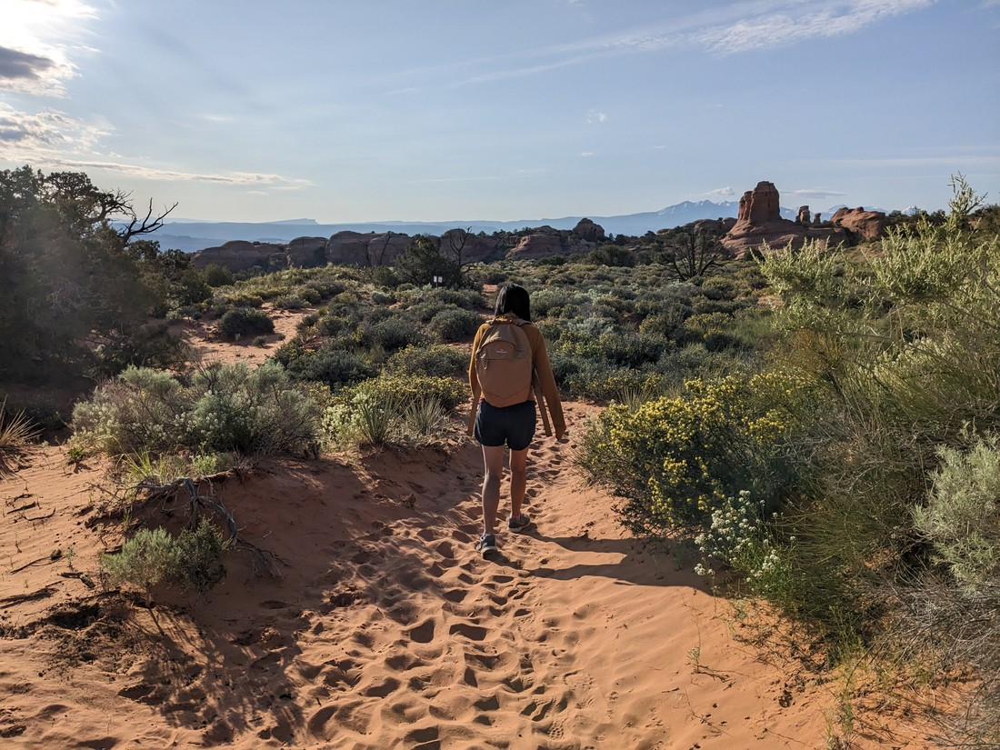

While fun at the beach, it turns out sand dunes aren't that fun to try walk on for long periods of time.  Betty's shoes also had the habit of filling with sand in no time - confirming her thought that they probably need replacing.

This walk took us to two arches - the Tapestry Arch and the Broken Arch.  The Tapestry Arch wasn't much to look at, but surprisingly the Broken Arch was very much intact.  It's called "broken" because there's a crack in it that will likely result in the arch collapsing.  But the park must not be too worried about that because the trail goes right through the arch.

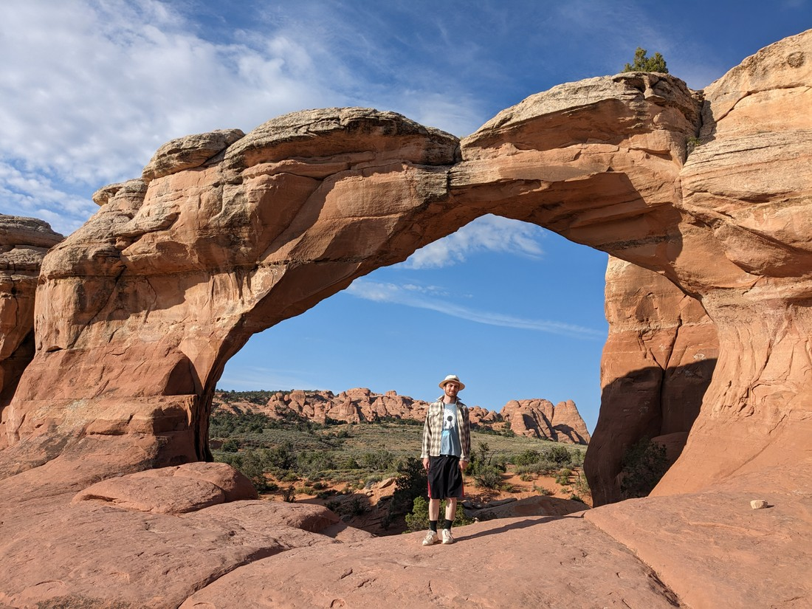

We then drove to a nearby parking lot to walk a trail to more arches.  There was the tunnel arch (not pictured cause it was up high and not all that pretty).  There was the Pine Tree Arch:

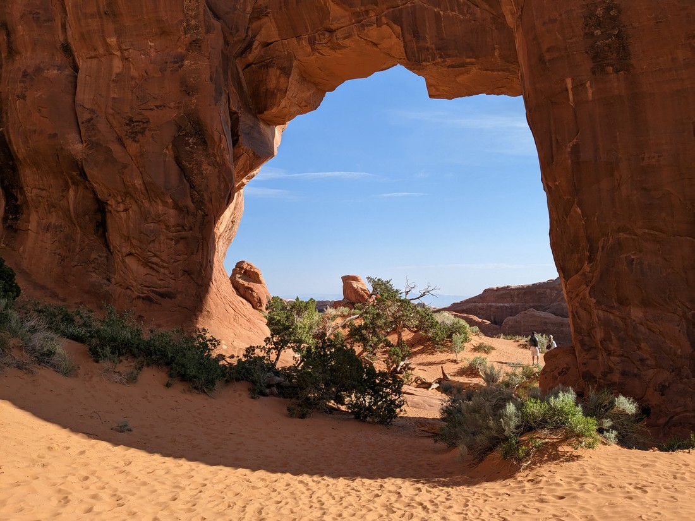

No idea why this is named the way it is.  It seemingly made more sense to call it the Tunnel Arch since you could walk through it - not unlike a tunnel.  (Not that we did - too much sand)

And there was also the Landscape Arch:

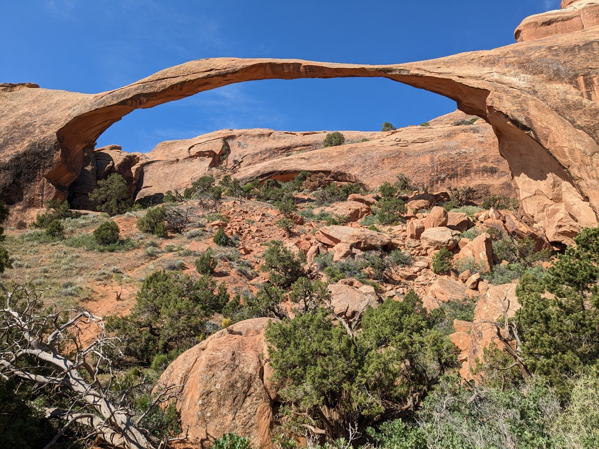

> Almost 100 metres wide and 1.8 metres thick at its thinnest point

Which was huge, but also seemed like it could be better named.  I thought when I saw this that this must be the famous Delicate Arch because it looks so delicate and fragile.  Like a bit of snow settling on top would cause the whole thing to collapse.  This one is not available to walk through, because parts of it have fallen off.

By this point it was late morning, and it was getting quite hot.  For some reason Arches National Park gets hotter than any park we've been to so far (at the times we visited them anyway).  We were tired, hot, and grimy (because there were no showers - it's a desert campground after all).  So we decided to call time for today.

We headed to the nearby town, had some fast food, and chilled out under trees or at the library until we could check into our motel.

But by this point we'd only seen half the park.  After being impressed with how the rock structures looked in the late afternoon / pre-sunset sunlight I suggested to Betty that we at least give Arches National Park one more chance.  The idea would be to return late in the day when the temperature had dropped, and we also didn't need to worry about the entry limits.  We figured, why not tonight?

Our first stop was to Balanced Rock.  This was not an arch but a comically large boulder, balanced on a spire which looks insufficient to hold its weight.

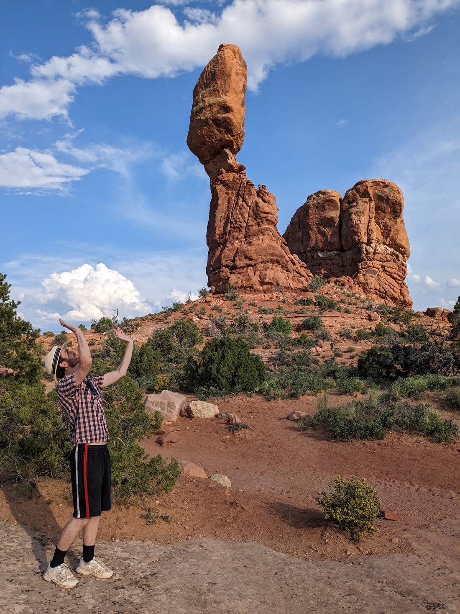

This was not a long walk, maybe 15 minutes.  Afterwards I missed a turnoff we ended up at the Fiery Furnace - a series of tight canyons which can be walked with a permit, or just photographed from a viewpoint (which is what we did).

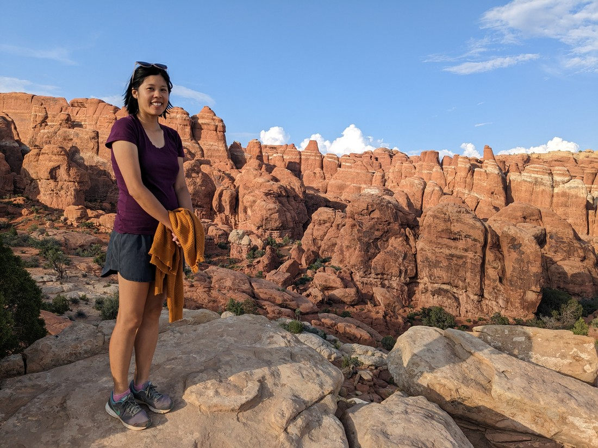

> May as well take a pic

Then we went to see the famous Delicate Arch.  This arch is shown on perhaps half of all the Utah issued number plates.  It's usually the arch featured on all the Arches National Park advertising material.  We couldn't come to Arches and not see it.

Unfortunately the walk to it was too long for us to attempt this late in the day so we had to be satisfied with a walk to a viewpoint.  That viewpoint turned out to be not all that close.

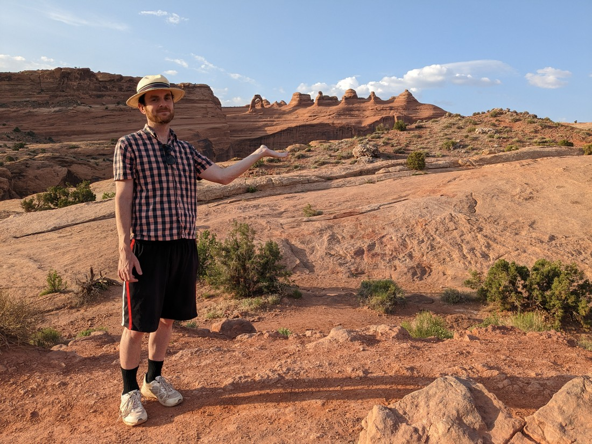

The arch is huge.  We could see people lining up underneath to take photos with it, being dwarfed by the size of the arch.  But from this distance it was also a tiny thing.  But oh well, can't do everything - at least we've seen it.

Next was a stop with a view over the valley and the nearby mountains.

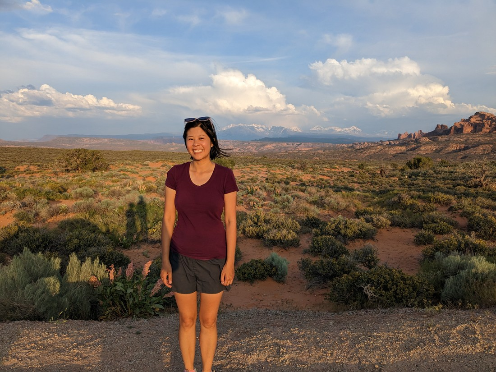

> Sun is definitely moving towards the horizon now

And our last stop was a few more arches.  There were a couple of window arches.  Here is one:

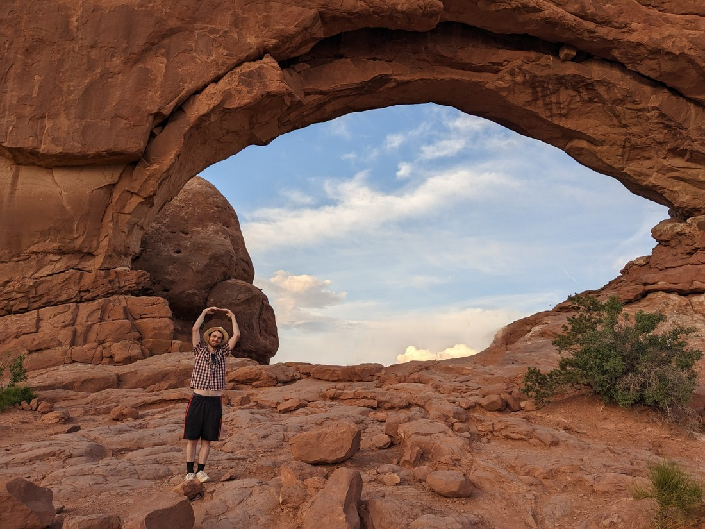

> Cue funny pose

Before we go further I think I will acknowledge something.  Arches is a busy place, even at this hour right before sunset.  In fact, this area was possibly more popular right before sunset.  We saw several people lining up in a certain position.  Undoubtedly, they were here to photograph the sunset through one of the arches.  But anyway, here's why I am talking about how busy the park was at this time:

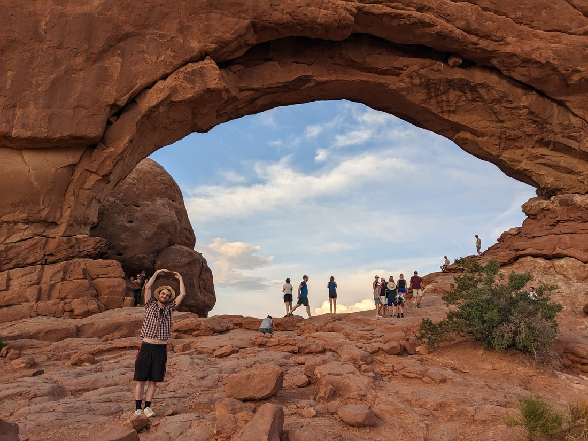

> How embarrassing that all these people saw my funny pose

People love to swarm the arches that you can stand under.  I can't blame them for that, but then people also love to just hang around under the arch.  That's a bit annoying.  But the whole park isn't busy it's just these few spots.  Here's a photo of roughly the same place:

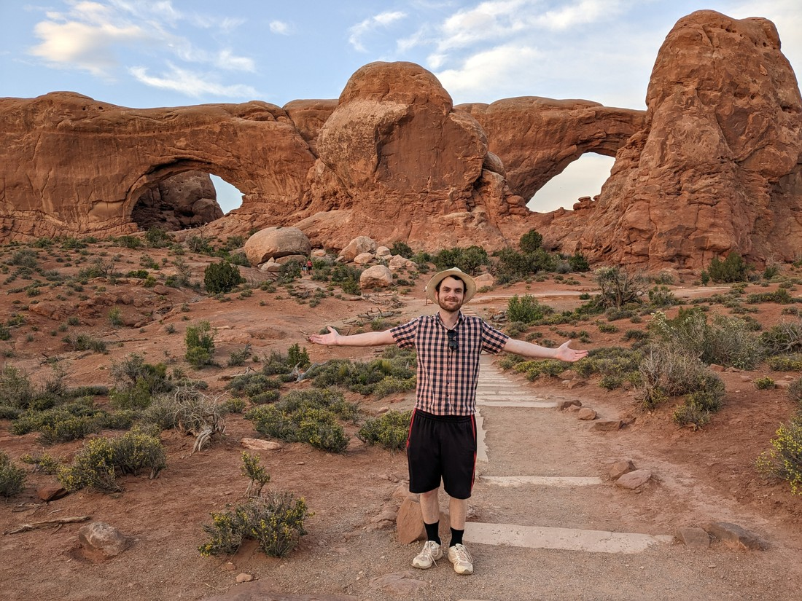

> Lots of space around, but you can still see people in the back

It was now time to watch the sunset.

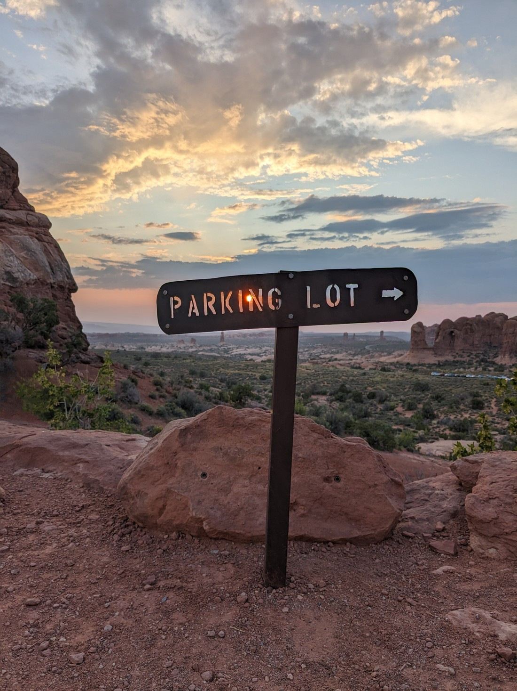

> And take our own artistic photos

Arches National Park was a bit divisive for us.  I was happy with our time in Arches.  Betty was less enthusiastic.  But this is mostly my blog so I get to say it was great.  We certainly had a great time when we returned in the evening and picked the walks that didn't involve sand hiking.

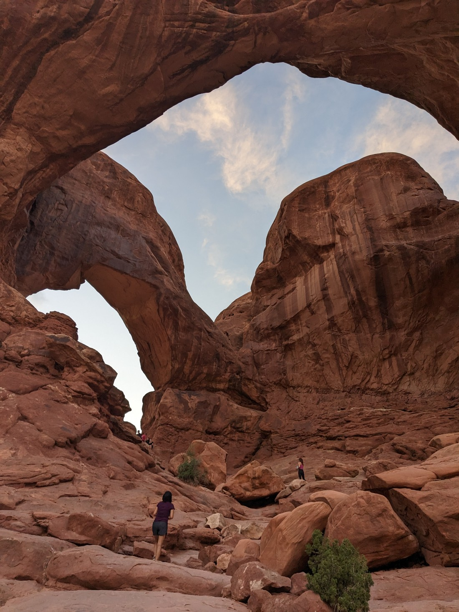

We're going to be staying nearby for three more nights, but good news Betty - this isn't the only park nearby.  It's not even the only National Park nearby.  I imagine you'll definitely have a good time here even if Arches wasn't your cup of tea.

