Okay, so it's now been two days in Moab area but we still have two to three days left in this area.  That should be a fair amount of time - but how do we spend it?  We definitely want to go to Canyonlands National Park.  Being a "National" park means at least someone in the government at some point thought it was good.  People often tend to rate it very highly, but they note that to get the most out of the park you need a four-wheel drive car.  We don't have one, but it's still a National Park so we'll still want to check it out in those two to three days.

So, why wait?  Why not just go today?

I really overcomplicated it.  Why \*not\* just pick the place we most want to go and go there?  So that's exactly what we did.

Unfortunately we did not leave all that early.  I had walked several blocks to get breakfast cereal because I mistakenly thought it was closer than it was.  And then we had to eat that cereal.

When we did arrive at Canyonlands we found a long line to get in.  We weren't even sure how long the line was, but we figured we may as well just wait.  Probably 30 to 40 minutes later and we were in.

I'd looked at a list of most highly regarded walks in the park.  They all tended to be under an hour so our plan was just to do a bunch of them.  There is only really one road through the park so we just followed it until we saw a sign for one of the ones on the list.  The first one we came to was the Mesa Arch trail - which is a trail to the Mesa Arch.

This is perhaps the most popular walk in the park and when we arrived at the arch we found a line for people taking pictures.  But it was just a short line, so I insisted we join in.  When it was our turn I sat on the rock beside it and Betty took the picture.

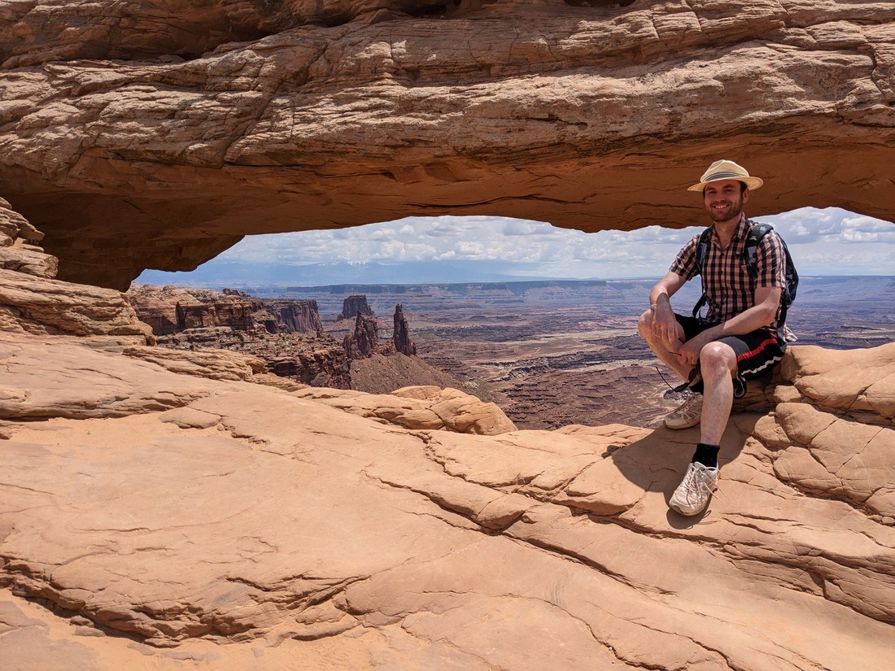

It was in this moment that I saw what was behind the arch, and likely the reason why this arch was such a popular photo opportunity.  The arch sat on the rim of a canyon, and behind the arch was a rather excellent view.

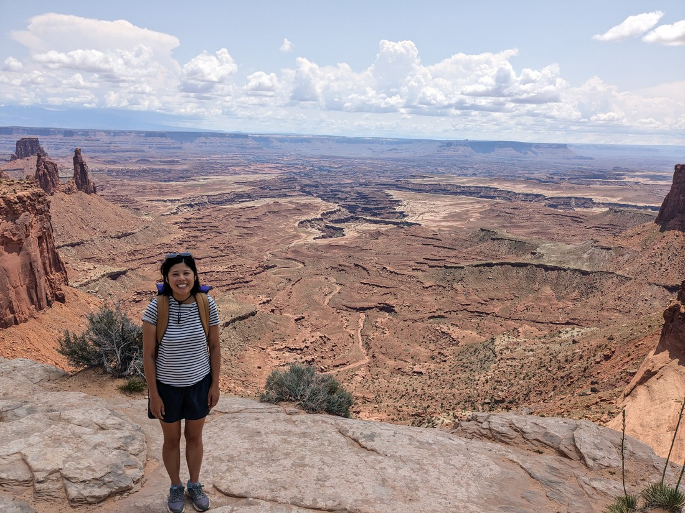

The arch itself isn't all that impressive - but it is something that adds a bit more uniqueness to this particular spot.  Something I also didn't realise before I sat down was the rock by the arch was literally the edge of the canyon.  Had I leant back a bit too far, then I would have been plummeting straight down.  Sometimes we do like to take photos like this:

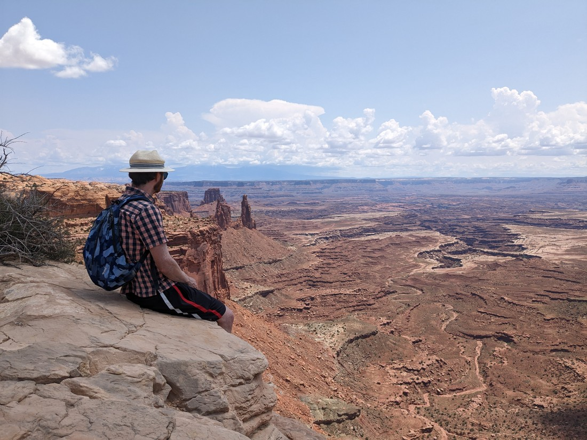

But that's only because beneath my legs is another ledge, out of shot of the camera.  At no point will we ever try to do this with the real canyon rim.  Because what's the point?  We can fake it easily enough to get the same photo, without any of the risking our lives.

Anyway, we stayed at the Mesa Arch rim for a while before heading back.  Then we moved on to the next stop - a walk to Grand View Point.  We figured that if a point is going to have a name like that then it probably is worth a stop.

While the Mesa Arch had a bit of a walk to get from the carpark to the rim - the rim at Grand View Point was basically next to the carpark.  But there was a longer walk along the rim to the point.

We've seen a few signs recently (mostly in Arches) where it tells hikers not to build cairns.  This is because cairns are used by park rangers to help show where a trail goes.  This can be quite important because it's not always possible to clearly mark a trail that goes over rock or sand.  But it also not ideal because cairns are sometimes hard to spot, or could be moved, broken, or even confused with random piles of rock.  Well, Canyonlands has a solution for that:

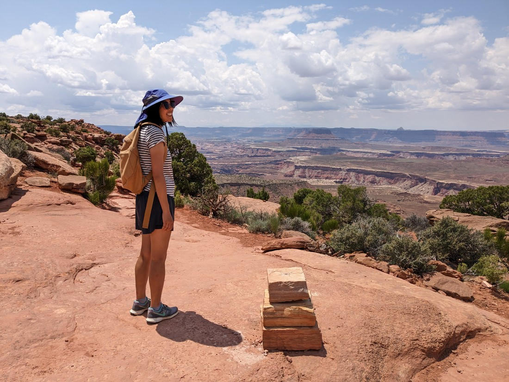

> A slightly different pile of rocks

The cairns are still technically made of rocks - but they are immovable, and cannot be faked or confused with random rocks.  Probably a bit more work to set them up, but they were definitely effective.

Anyway, here's a bunch of pictures from along this rim.

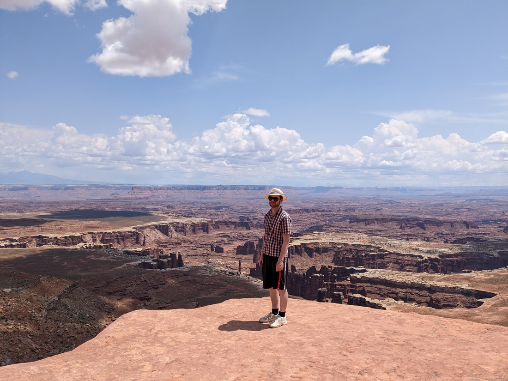

> Take note ...

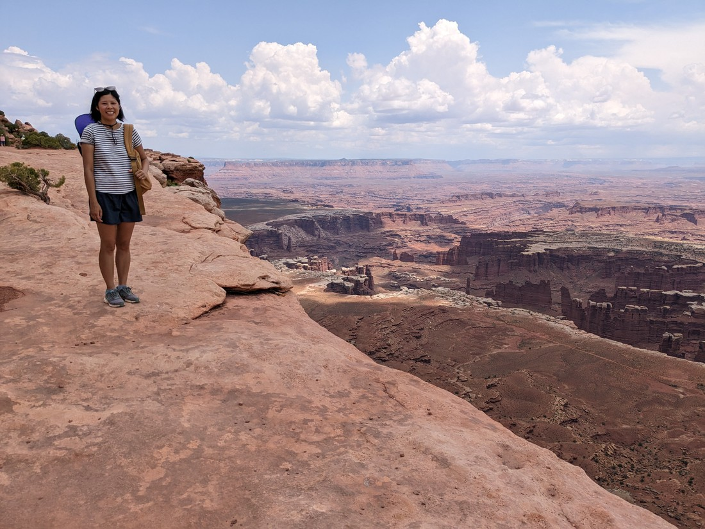

> ... we're always standing ...

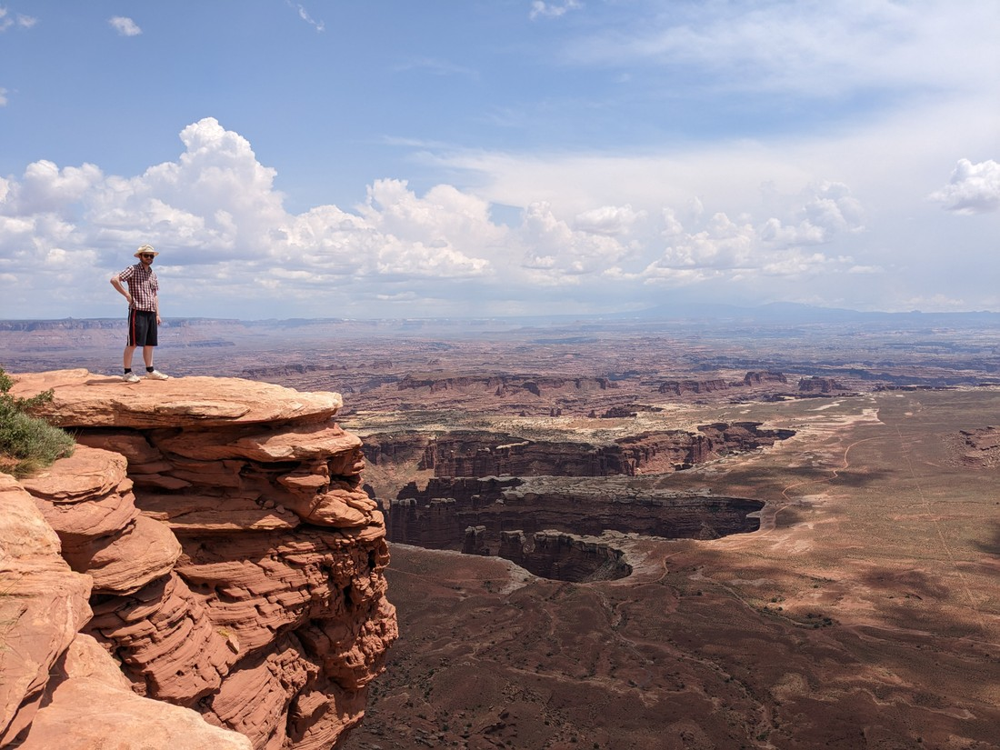

> ... a healthy metre from the edge ...

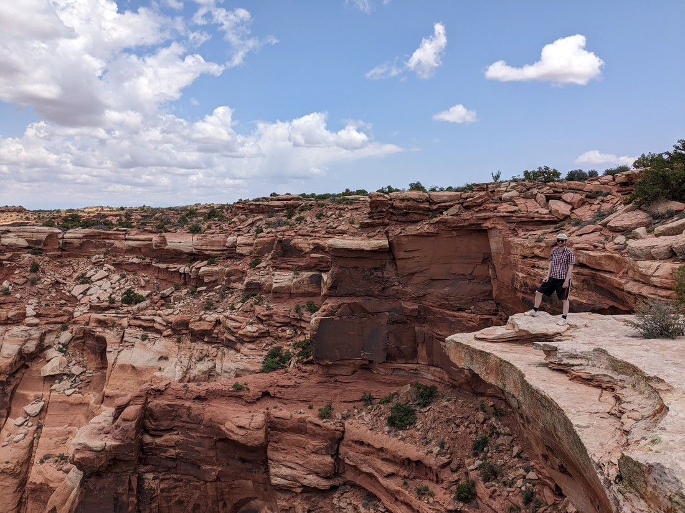

> ... but still looking cool

We were having a good time in the park, but we also hadn't prepared all that well.  So we had to leave for hunger reasons.  On the way out we remembered to do what we didn't do on the way in - take a picture of the sign.

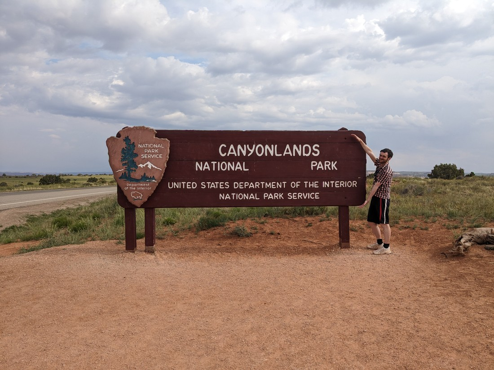

> To be honest, most of the time we forget to take a photo on the way in

After we had eaten we were back.  There were still two things we wanted to do.  One was an entire side road that we hadn't been down.  The other was just a walk, but we figured we'd do that first.

Something I haven't mentioned yet is how grassy the park is.  Driving through the park feels like you're just driving through a field.

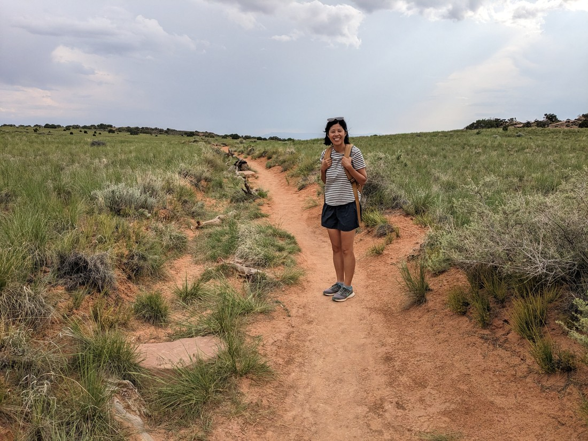

Although the grass is just on the surface - it's still sand underneath.  But at least it's packed sand, not like that loose sand in Arches.

And what did we find at the end of this walk?  Why, more rim views of course.

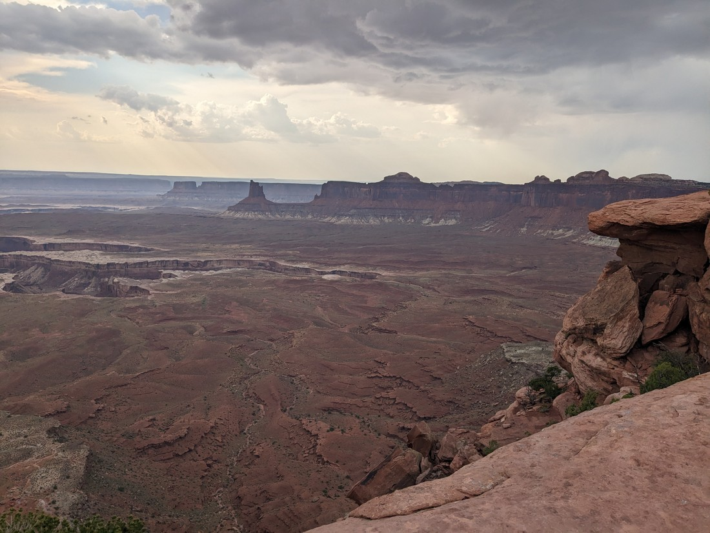

> What else?

Unfortunately at this rim we started to hear distant thunder.  We thought we could see the storm too, and it seemed like it was coming this way.

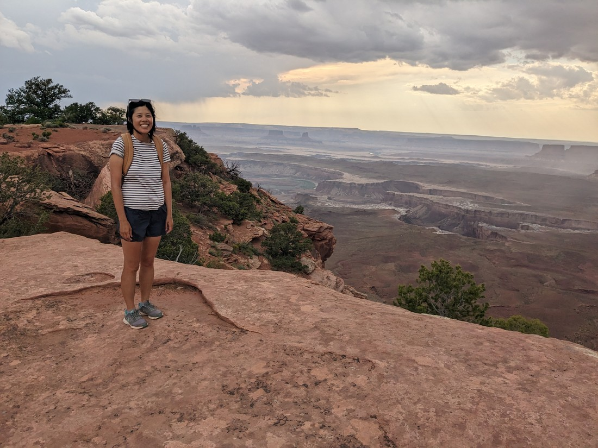

> Last happy face before time to head back

And on the way back it started raining.  So we had to run a bit.

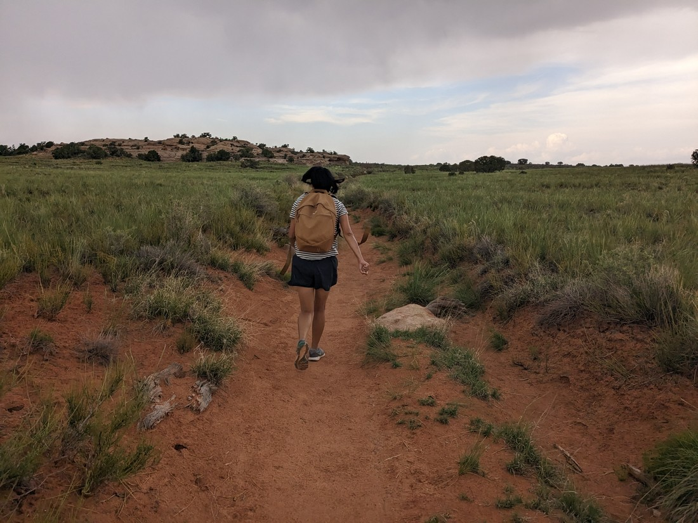

> It's gaining on us!!!

So we decided to call it a day.  No late night sunset hiking for us like we did yesterday.

We got a lot done today, partially because it was just a bit less hot than in Arches.  I'm talking like 26 degrees Celsius instead of 29 degrees Celsius.  So still hot, but with a cooling breeze, much nicer.

It was a good day.  We're definitely going to be ranking Canyonlands up there with some of our existing favourites.  Maybe not right at the top - it didn't quite inspire the same amount of awe that Grand Canyon did, nor did it have the variety in walks that Bryce Canyon did - but it's definitely up there.
