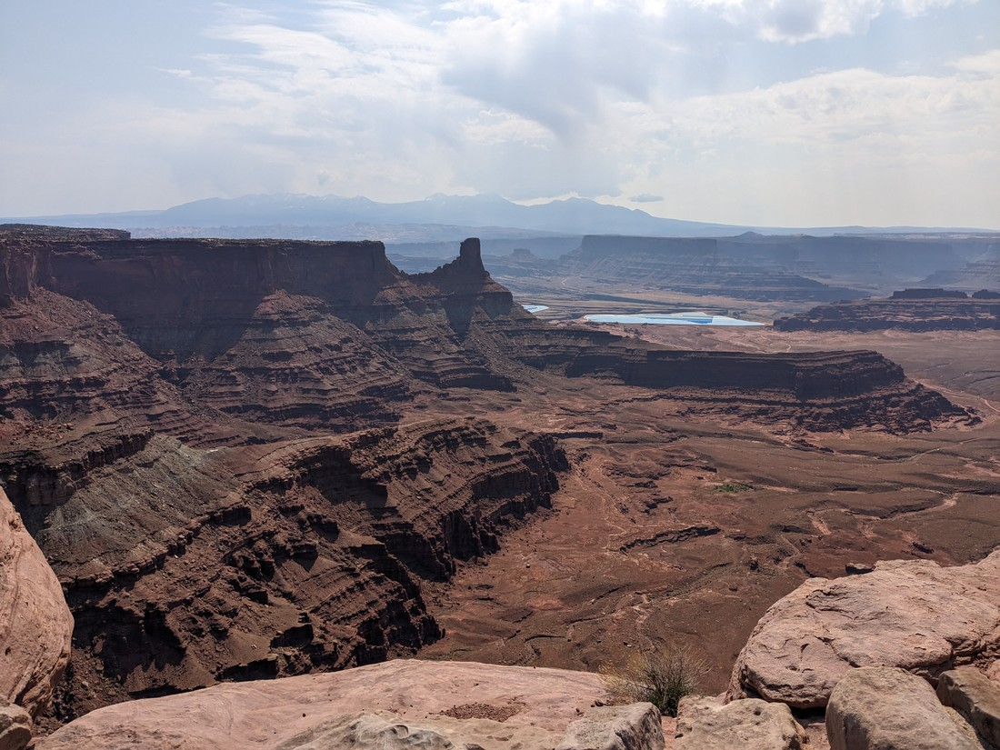
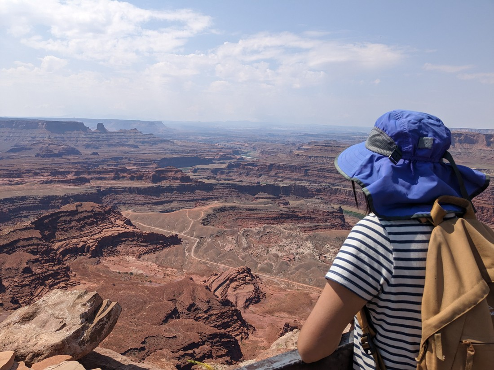
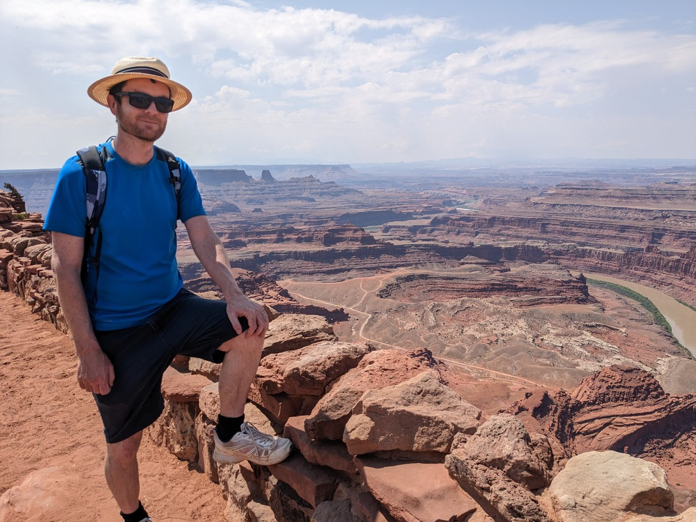
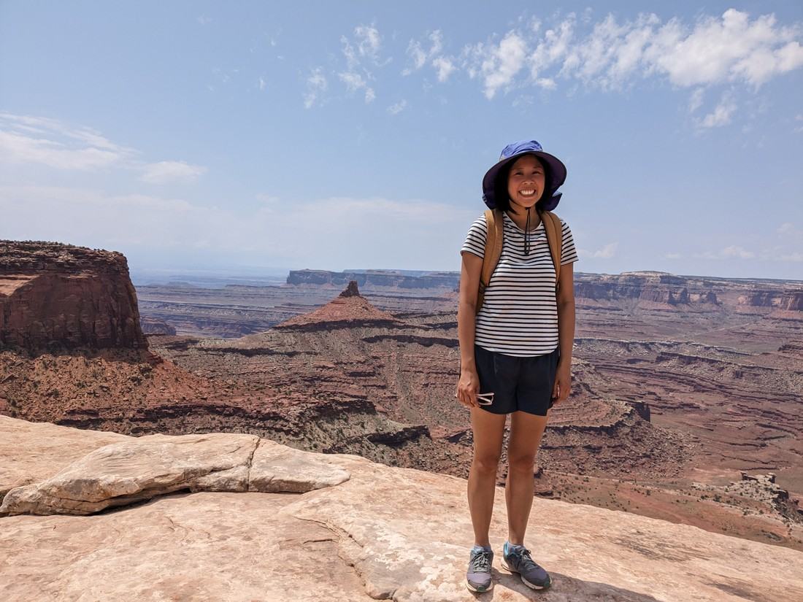
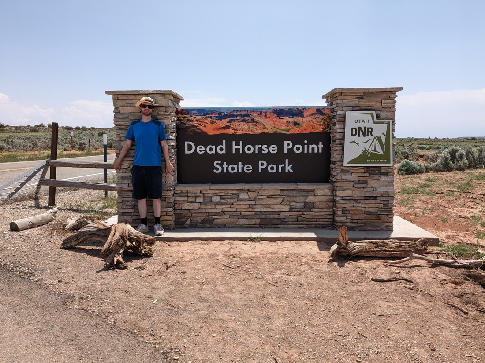
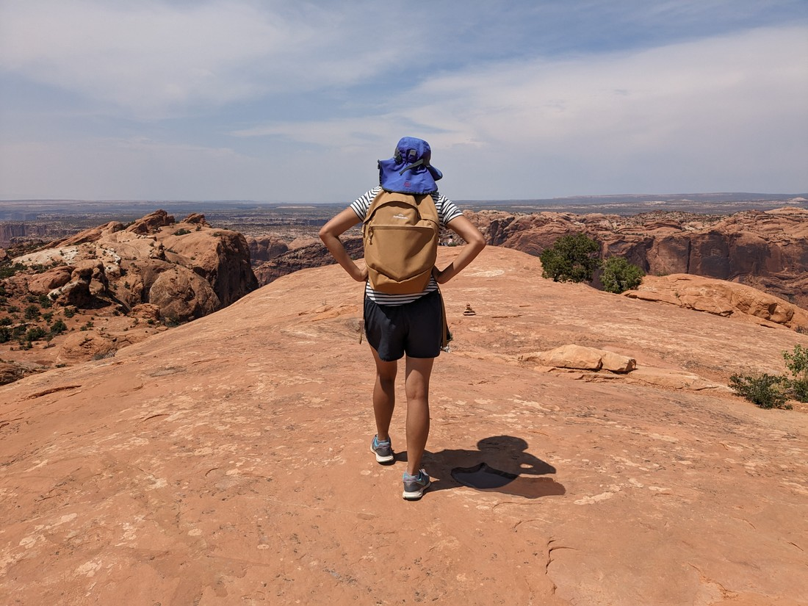
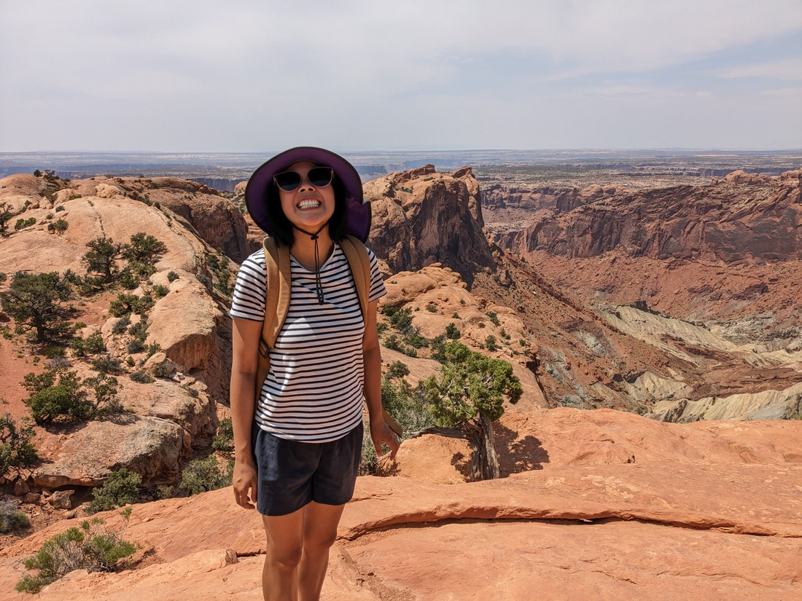
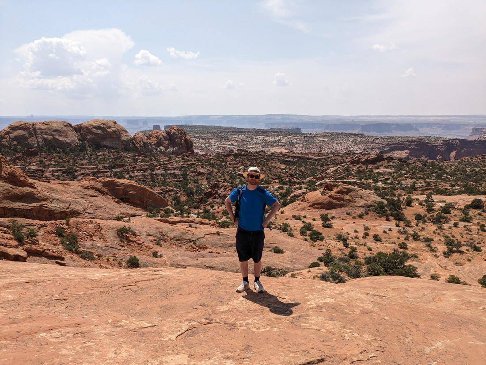

Dead Horse Point State Park is a park so near Canyonlands, that it makes you wonder why it is not part of Canyonlands.  To get there you drive the same 30 minute road from Moab, but you turn off a few minutes early.  Since we liked Canyonlands yesterday, we figured it would be worth a trip to DHPSP.

The park was described in a review as a cross between the Grand Canyon and Horseshoe Bend.  Geographically they're not wrong.  The park is basically a big peninsula with canyons on three of the four cardinal directions.

We parked at the visitor centre and began a walk around the edge of the canyon.

We've visited some great places in the last few weeks, but sometimes I look at the photos and the greatness does not come across in the pictures.  These pictures ended up pretty great - but both Betty and I didn't find the park that interesting.  Sure it had frequent views...

...but for some reason we felt these views didn't compare to those at Canyonlands.  The views at Canyonlands appeared vast and sweeping.  The views here were less so.  Sometimes the closer view can be better as it allows more detail to be seen below - but here the detail just didn't seem that interesting.

Maybe it was the weather.  It was still fine, but the skies seemed hazier than yesterday.  Maybe Canyonlands wouldn't have impressed us if yesterday's weather had been like today's.

And like yesterday, we forgot to take the sign photo on the way in, so here it is on the way out:

Okay, so that was an okay few hours spent.  We did learn from yesterday and we actually brought our lunch this time, so no need for a rush back to town when hunger set in.

So what now?  Well, you know what other park is nearby that we didn't see all of yesterday...

It turns out there wasn't much we hadn't seen.  We basically just did one walk up to a viewpoint over a crater-like canyon (that may have actually been a crater - I didn't do my research).  It was good, and the walk more varied than what we walked in DHPSP.

> See!  Look at that happy face.

And so that's us done for Canyonlands.  I should have mentioned this first thing on yesterday's post, but last thing on today's post works too: this is just one part of Canyonlands.  It is called Islands in the Sky.  There are at least two more parts of Canyonlands that the public can visit, but while they have a lot of roads, most of those roads are reserved for off-road vehicles.  I'm also guessing that the other parts of Canyonlands are the parts we look down upon from the Islands in the Sky rim walks.

I'm sure the other parts of Canyonlands are great too, but it might have been for the best for us to stick with the more conventionally touristy part.

And tonight will be our last night in Moab.  Tomorrow we're leaving Utah and off to Colorado, but I don't think we'll be in much rush.  While we don't have any major parks left in this area, there always seems to be other walks on random backroads.  Tomorrow we'll try and find one or two of these, before finally saying goodbye to Utah.