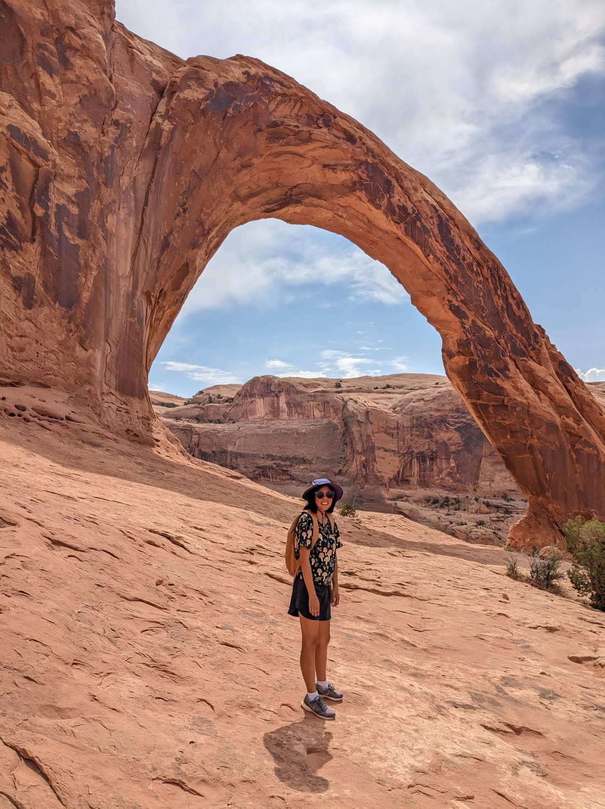

Well, our time in Moab is almost up.  It has been four great days of sun, more sun, and being intimidated a bit by all the people driving around in offroad vehicles.  Today we'll be heading to just past the Colorado / Utah state border.  But what to do before we leave?

I found a nice long walk with a fair amount hills to climb.  Betty then found a much less long walk, with less hills to climb.  So we did Betty's walk.

The reason we did Betty's was mostly that it was closer.  If we finished it quickly we could then potentially do my walk.  But also, apparently there was a couple of pretty decent arches at the end of the trail.  After maybe half an hour of walking we rounded a corner and got a glimpse of them:

The first was a pothole arch - where a pool of water on top of the rock eventually makes a big enough hole that it connects with the cave underneath.  They're decent arches - this one was pretty round.

But boy do they not compare with the standing arches.  This arch was called the Corona Arch (I don't know exactly why - I looked it up but found nothing).  And while I acknowledge that Delicate Arch would likely have been impressive if we had gotten up close, this was easily better than anything we saw at Arches National Park.

I mean, just look at the size of this thing.  And we can walk through it.  And being along a trail in just a random part of Utah, we didn't have to share it with that many other people.

> Though a few people did have to be edited out of a couple of these pictures

We walked through the arch to see if the path continued on.  Rounding the corner we found nothing but another gorgeous view.

> Interestingly, a train track carved its way through this gorge.  That'd be a really scenic ride, though I suspect it's mostly for frieght.

After hanging round the arch for a while, there wasn't much else to do but head back.

Taking a lot more photos along the way, of course.

Then we headed along a side path to another arch.  This was not one we had intended to see, but this place was so scenic that we felt like we had to see more of it.  The arch ended up being another pothole arch:

> Getting quite hot now - some time in the shade is certainly desired

So another excellent walk Utah has provided to us, free of charge, as a reward for scouring the internet for other less popular interesting places.  It is a shame to see Utah go.  We've spent a lot of time here, and we've seen a lot of things.  But there is undoubtedly so many more walks and sights we could have seen if we had stayed longer.  But, we always have to say goodbye sometimes.

> A different selfie angle

As we drove out of Moab, we decided to take the scenic road.  This was scenic, though we made no stops.  Interestingly, right before it joined the highway again it went through a ghost town called Cisco.  This sounded cool - a town that people just abandoned after it got bypassed and lost all its services.  But I was a bit disappointed.  It was clearly not fully abandoned.  There was a few signs but the big one was "Cold beer".  Ha - nice try, but I've read the Odyssey.  I know how Sirens work.  Also, you're not going to lure us with your promise of alcohol.  Next time try "Cola slushy" - that might work.

So, that brings a close to our time in Utah.  But now we have Colorado - completely unchartered territory for us.  I'm not sure what to expect.  This part of the trip (like the rest) was planned and organised late last year so I couldn't know what hikes and activities will be available.  I'm sure we'll find plenty - but we'll just have to wait and see.