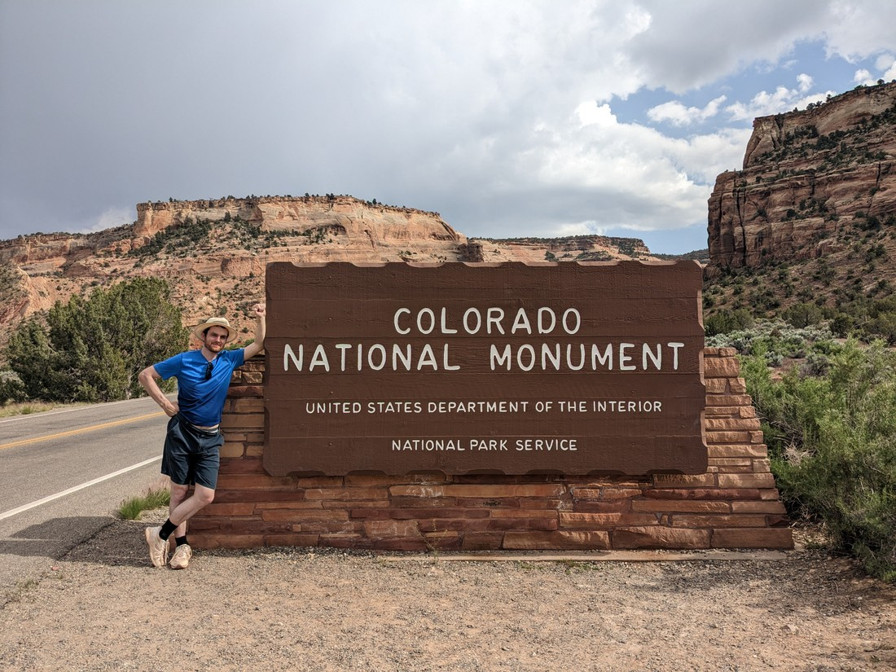
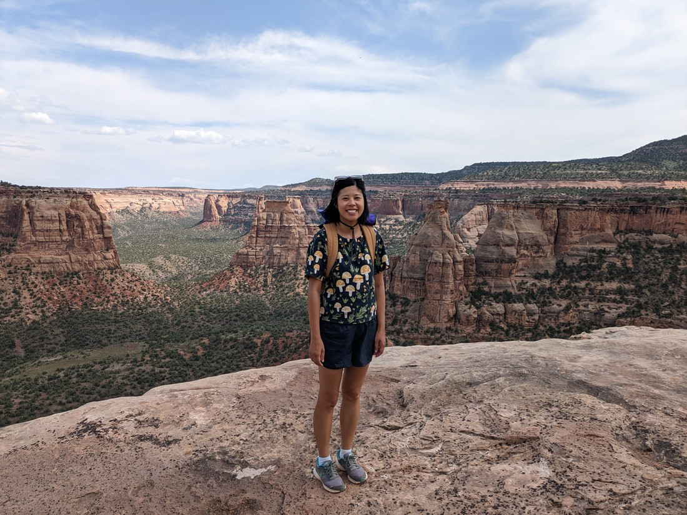
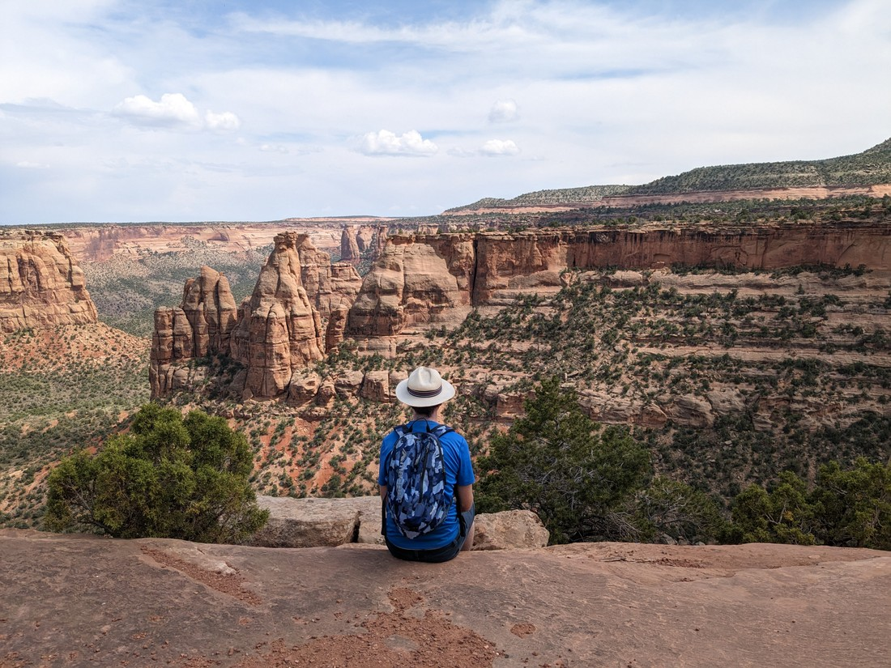
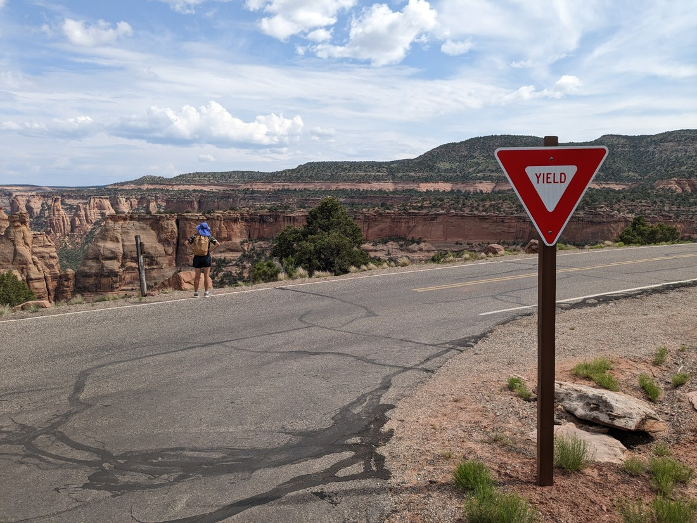
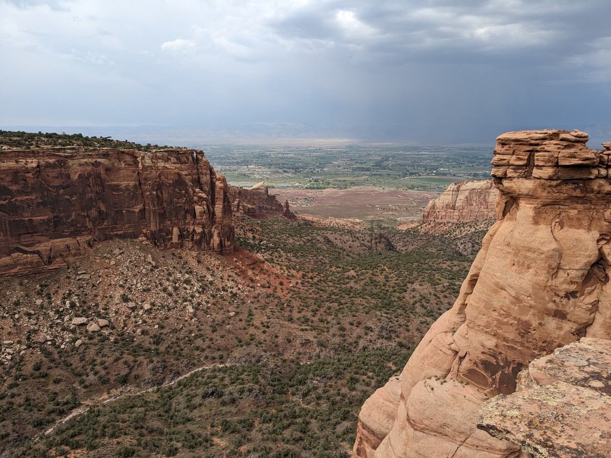
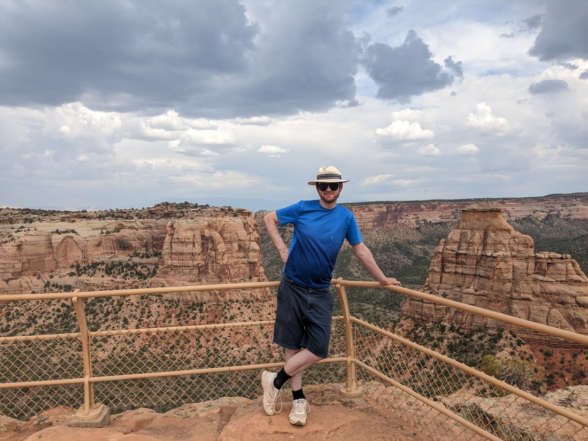
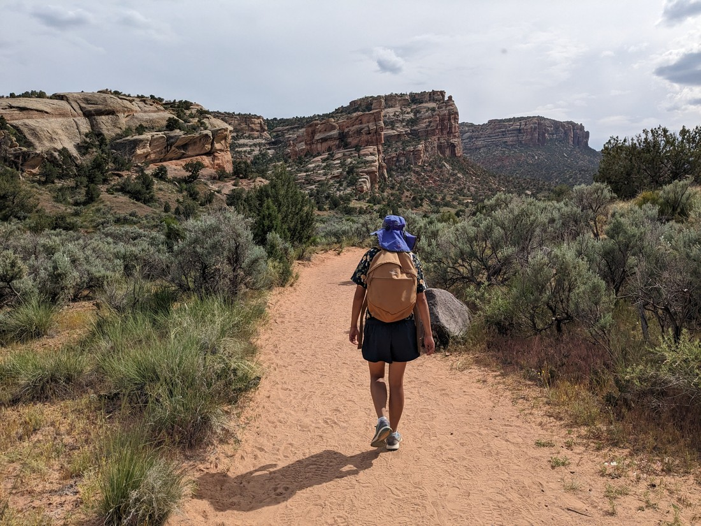
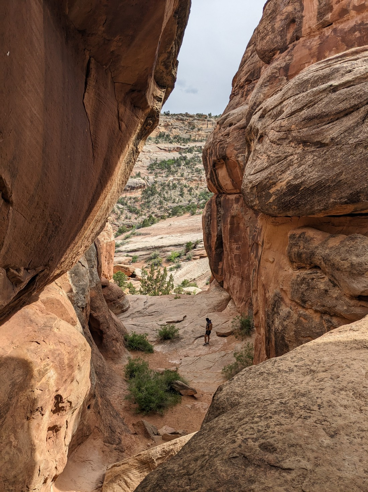
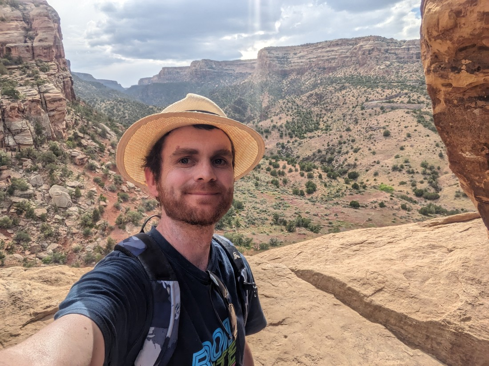
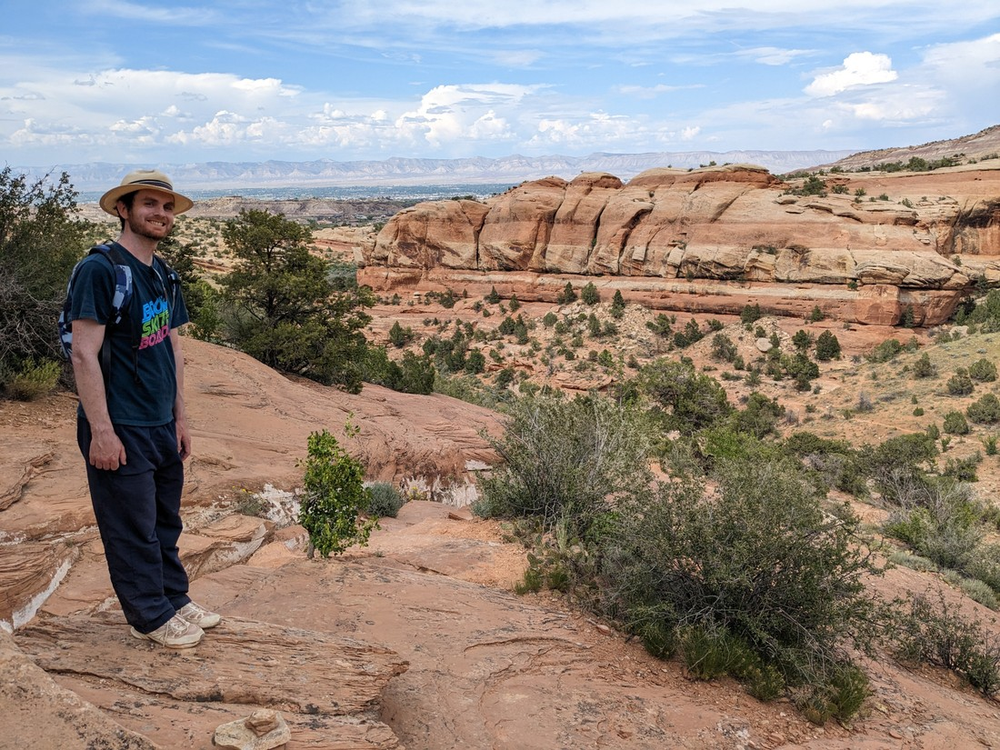

Our first stop in Colorado was the nearby Colorado National Monument.  Which is a park.  I know "National Monuments" are parks but every time I keep expecting some sort of statue or something.

Like most parks, we started by stopping at the visitor centre.  And like many parks, there is a decent walk to be had at the visitor centre.  The park is basically a series of canyons in the hills overlooking the nearby plains (which is where the cities and farms are).  And the first walk we did was along the rim of one of those canyons.

It was certainly scenic.  But for some reason Betty and I weren't overly wowed.  I'm going to put this down to us having seen many similarly amazing sights, many of which were larger.  It's probably really unfair seeing these canyons straight after touring many large national parks.

What I'm saying is that we couldn't really be objective.  Our opinion about Colorado National Monument was tainted because we had just spent a couple of weeks seeing larger and better canyons.

> Of course, we still got some enjoyment out of it

And I might take this opportunity to discuss something completely unrelated to the park.

USA doesn't have Give Way signs.  They still have triangular, red and white signs at intersections.  But they're not "Give Way" signs.  They are "Yield" signs.

> I might be biased but I think "Give Way" sounds better.

In a similar vein, there's no such thing as round-a-bouts here, but there are traffic circles.  And no one indicates at all when going round them.

But anyway, back to talking about the park.  After our first rim walk we headed to the next stop.  This was basically a walk along the other side of the rim.  But as we were parking we could hear thunder.

It seemed like there was a thunderstorm over the plains.  As we learned in Grand Canyon, viewpoints are not a place you are supposed to be in thunderstorms.  But the rule then was that we were okay until we see lightning.  We figured we should be able to get this short walk done, even if the storm decided to head our way.

> Didn't get struck by lightning but did get struck by many raindrops

The next day we had a little time in the afternoon and so we decided to visit another part of the Colorado National Monument.

This walk was to a place called the Devil's Kitchen.  It was a cool name for a thing, but we weren't expecting that much.  And honestly we didn't get much.  The "kitchen" turned out to be a room of sorts - if you can call an area mostly surrounded by rocks a room.  

> Welcome to the kitchen

It wasn't much of a view so I climbed up to a "window" but still didn't see anything to change our mind about this park.

> Though I am a sucker for a photo op

Like Dead Horse Point State Park, this is a park that I don't think we can be objective about.  It's probably quite a good park.  We didn't have a great time, but we didn't have a terrible time either.  Is this a sign that we've been going to too many parks, and the ones that are just "good" aren't going to leave a lasting impression?  Maybe.  But if that's the case then hopefully there's still a lot of great parks ahead of us.

