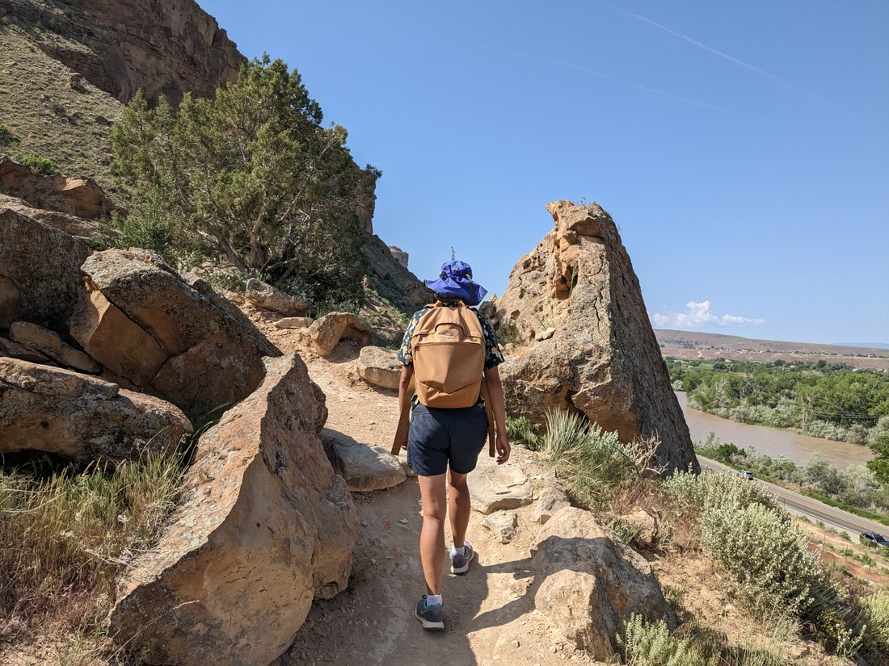
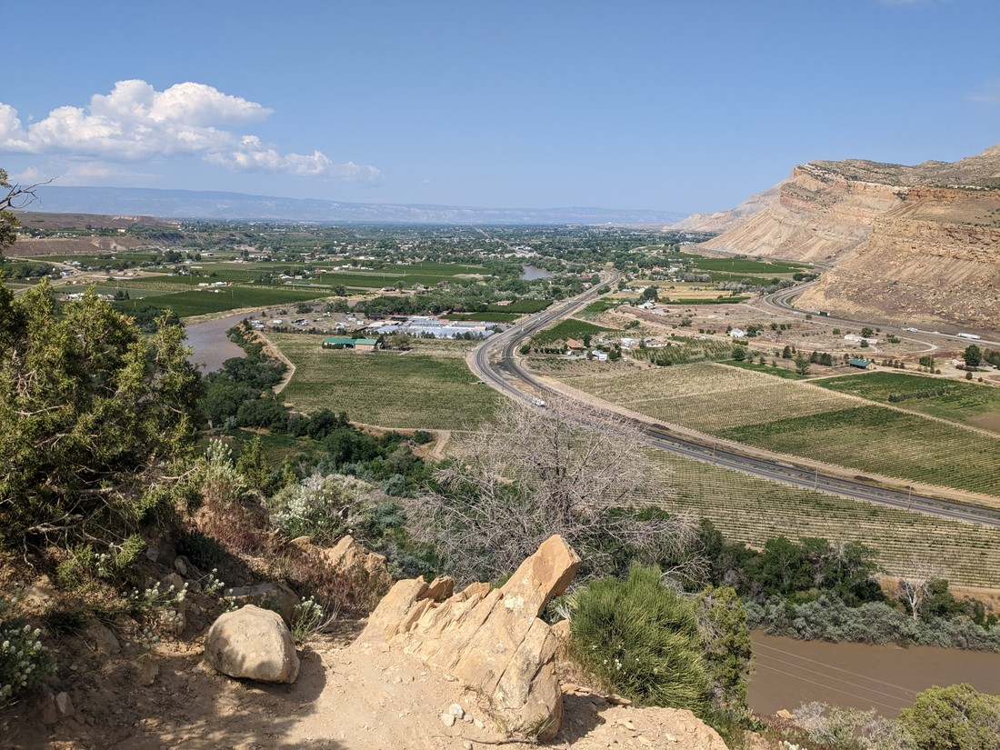
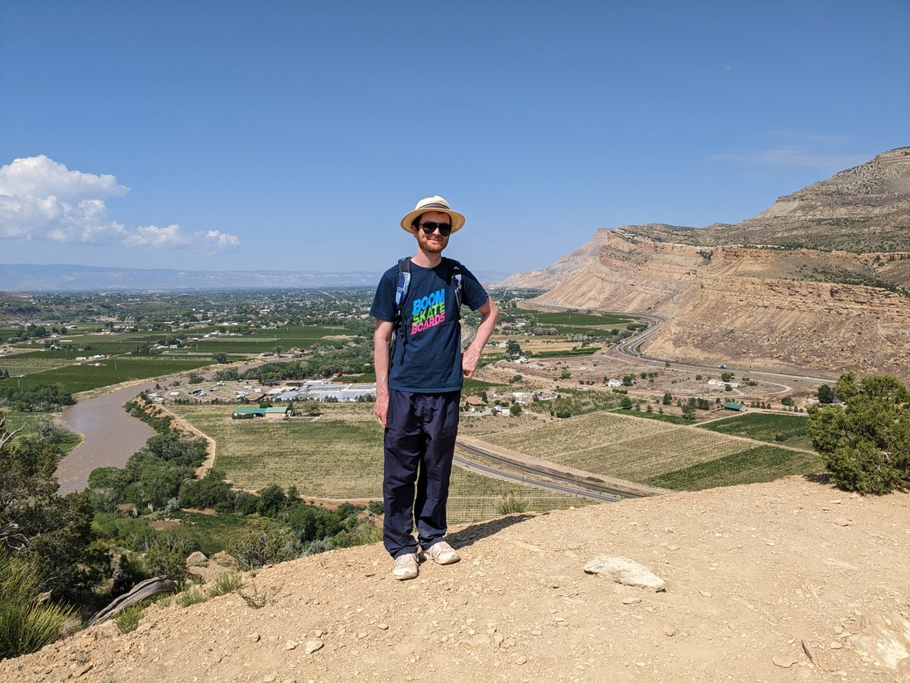
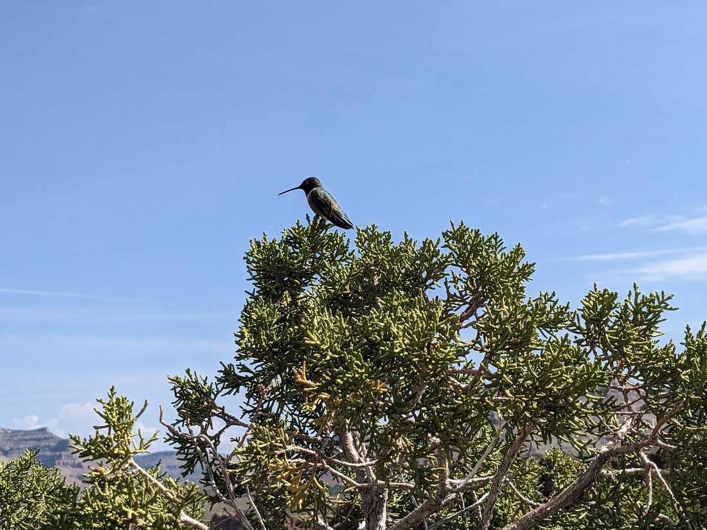
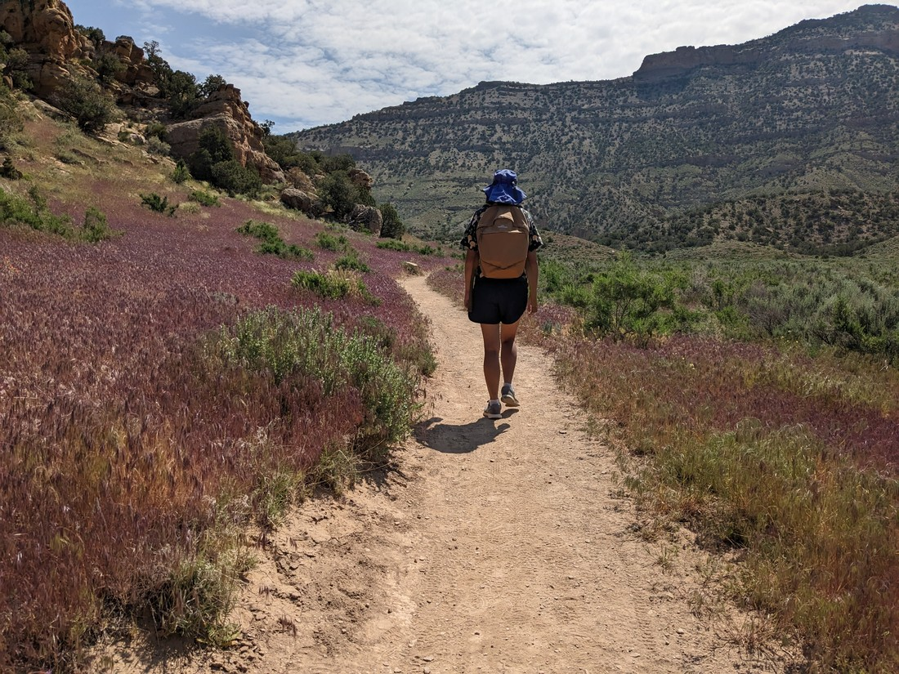
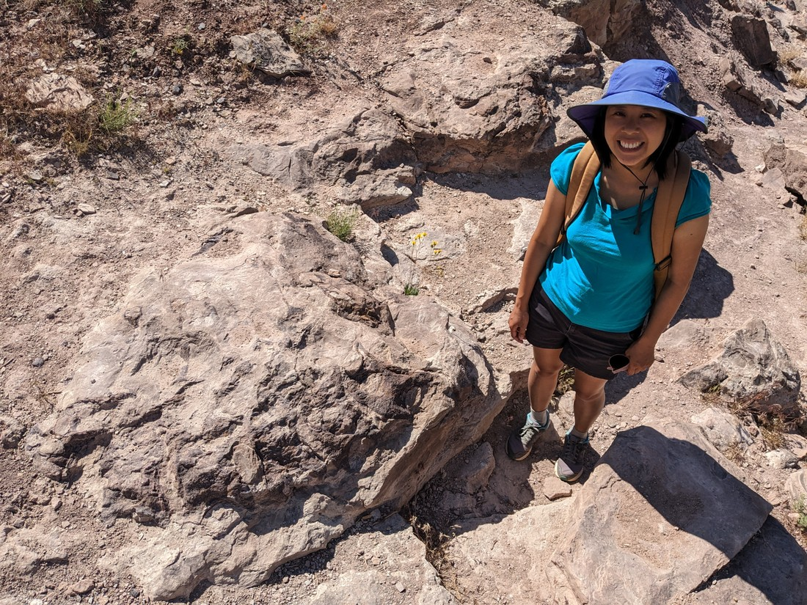
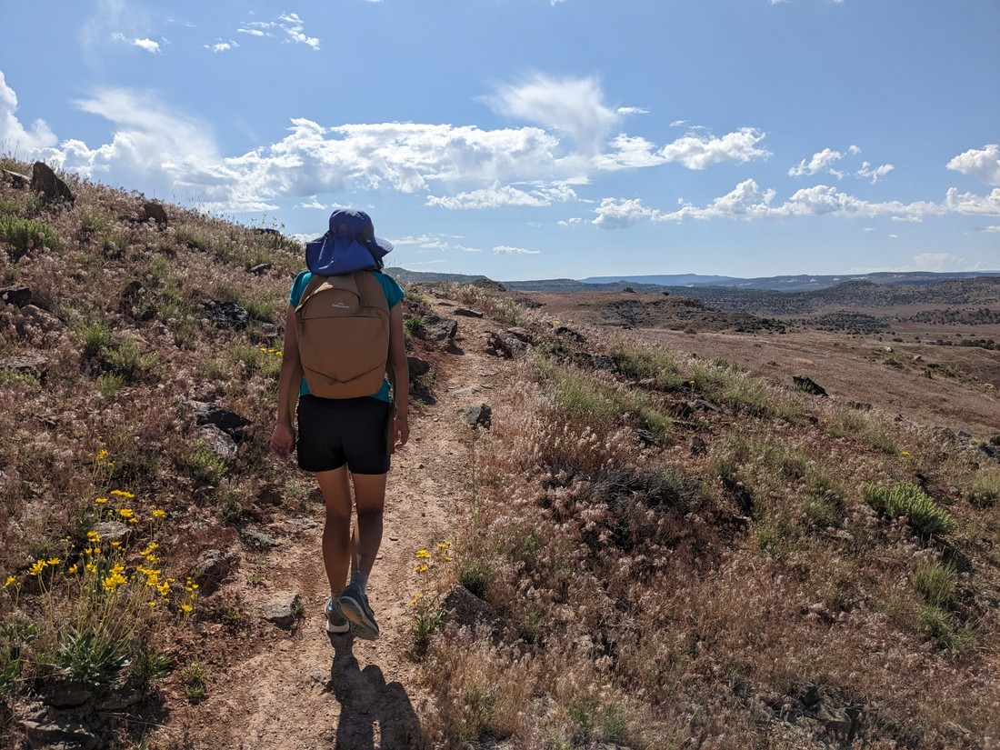

We woke up yesterday wondering, "Should we go back to Colorado National Monument?"  It underwhelmed a bit yesterday.  Probably will underwhelm again if we just rushed back there today.  So instead I found a walk nearby called the Palisade Rim Trail.  There was nothing too special about it, other than having a mix of hills, views, and other things.

> Here are the hills, views, and other things

The views it gave made it clear that we're not in Utah anymore.

> Look at all that green

The walk itself wasn't notable at all, but at the same time we did enjoy it.  I guess it helps when you go into a walk with no expectations.

There was one unique thing we spotted on the walk.  We overheard a noise and saw what looked to be a large insect hovering around a bush.  But the thing was - it was a bit too large for an insect.

I'd call this a hummingbird, but last time we were on this continent we mis-identified a marmot as a beaver so I'm reluctant to identify anything new.  But we looked up what a hummingbird is supposed to look like, and we're pretty sure it looks like this. 

After lunch and a shopping trip we gave Colorado National Monument again (see previous blog entry).

The next day we decided to try a trail called the Trail Through Time.

> Technically all trails are a trail through time, unless you walk really, really, really, really, really fast

This was a short and seemingly unremarkable walk except for one fact - this walk featured actual dinosaur bones lying in situ.  This sounded neat - dinosaur bones in a museum can feel a bit fake but seeing them untouched in the ground would be a novelty.

Well, it wasn't quite that great.

The picture above contains one Betty and one to two dozen dinosaur bones.  These bones are fused in the rock.  There is a picture nearby explaining the various parts of the juvenile dinosaur that died here, but it's not easy to tell what is bone and what is not.

But overall it was a nice walk.  Lots of long views of the surrounding and the distant mountains.

Not every walk has to be a winner.  Some walks can just be a pleasant way to spend a morning or an afternoon.  Of course, we have come all the way across the world to get here - we probably shouldn't always be satisfied with just "pleasant".  Or maybe we can.  Holidays can be whatever we want them to be after all.