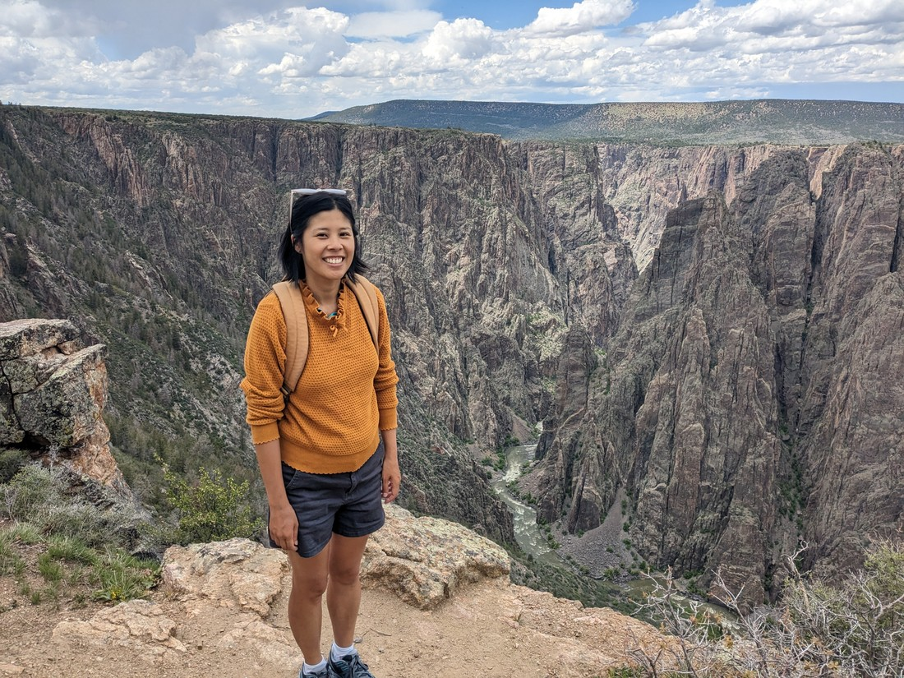
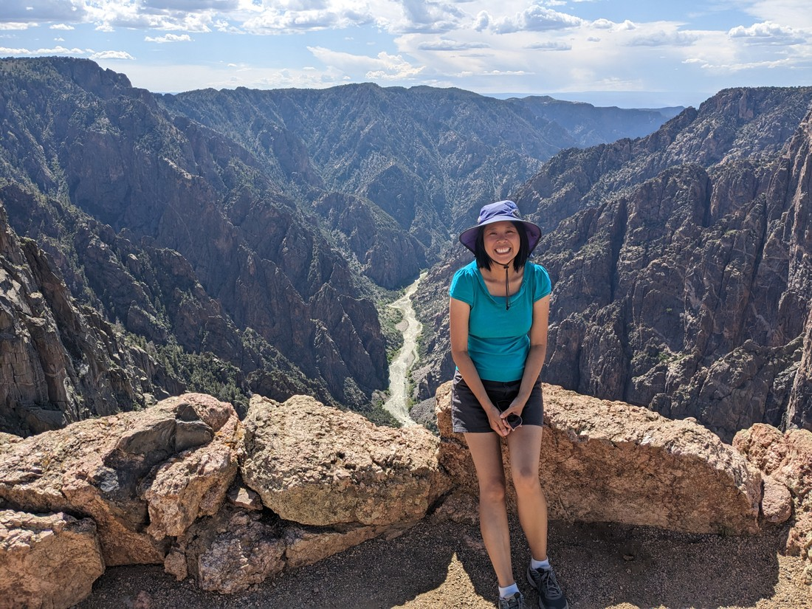

So why are we coming to Colorado?  Well, they do have some National Parks.  Not as many as Utah, but some.  Here is the first:

> We accidentally took the picture with the wrong sign (instead of the welcome sign, this is the sign pointing to the park)

Black Canyon of the Gunnison is another park that is considered underrated - which I now think is code for "not as good but not bad either".  The park was a bit similar to Grand Canyon.

> Well, a mini Grand Canyon

It had two rims - the southern one much more popular and easier to get to than the northern rim.

> Welcome to the south rim

It had a road going along the rim, which you could drive along and stop at the various view points.

> Which obviously we did so

It had a really difficult trail into the rim.

> This is not it - just a random trail I decided to include here

In fact, we deemed the trail to the bottom not worth attempting.  Even though the canyon is a lot smaller than Grand Canyon, there isn't a well made trail down into it.  The bottom of the canyon is also deemed to be "wilderness" so the park can't deliberately change it, such as adding trail markers. It's also really steep.  So steep that GPS won't work properly (which makes it even harder to follow the trail).  In fact, one of the info boards described the south edge as having a 93 degree angle.  It's been a long time since I have done high school maths, but wouldn't that mean it is worse than vertical?

> Smiling because of the guard rail, otherwise this would be the edge of a very steep cliff

All that we ended up doing was just driving along the scenic drive, visiting view point after view point.  None of them were overly unique, but none of them were bad either.

Well, the last one was a bit different.  The walk to the viewpoint was 30 - 45 minutes whereas the rest had just been five minutes.

> And as a result, had a bit more elevation over everything

We actually struggled a bit on this walk.  There didn't appear to be anything hard about it.  It was just slightly up hill.  But I guess the uphill walking combined with the higher elevation and higher temperature than we're ordinarily used to is still getting to us.  I would have liked if we'd become acclimatised to at least one either the temperature or elevation by now, but I guess that isn't going to happen.

So this was just another park for us.  We liked it better than Colorado National Monument, and had more fun at it then a couple of the National Parks we've visited, but overall it wasn't anything special.  It was definitely worth a stop, and because we were in the right mood it was still an enjoyable afternoon.

