To start this blog post I'm going to summarise some of the decisions made when planning this trip.  Some of this will be a repeat of stuff I've said before, but I'll keep it brief.

We decided to do some holiday travel in the USA because we had to enter Canada by a certain date, but at that date the interesting Western Canadian parks would still be very snow covered.  We instead decided to start by traveling south to the warmer USA.  Utah, being very desert-y was as warm as expected - perhaps too warm.  But there was a fair amount of days that we wanted to spend down here before heading back up.  Canada isn't just going to defrost in a matter of days after all.

So we decided to spend some time in Colorado.  It was known for being scenic, mountainous, and for having friendly locals.  It's basically Canada, but without the poutine.  However unlike Utah, Colorado doesn't just have a bunch of major National Parks to focus on.  Google Maps clearly shows a lot of green areas, but not where we'll definitely find exciting places that will become memories.

Since we couldn't fully plan out each days' activities before we even started, I had to make assumptions about where we might want to go and how long we might want to spend there.  Actually that might not be accurate.  "Guesses" might have been a better word than "assumptions".

Today we had a scheduled 1.5 hours of road to travel.  We were travelling from small town to small town.  When scheduling this day, I probably left an allowance for if we had wanted to do Black Canyon of the Gunnison National Park today.  As detailed in my previous blog, we had done the southern part of the park yesterday, and the northern part of the park looked not worth the unpaved roads we'd have to drive on.

(Whew, that's a lot of paragraphs of explanation for a blog post that based on the title, clearly isn't going to be all that exciting.)

Point being, we were going to have to make do with whatever sights we could see on this 100 kilometres (approx) of road.

The first stop was just south of BCotGNP.  It was a short walk that followed a stream towards the canyon.

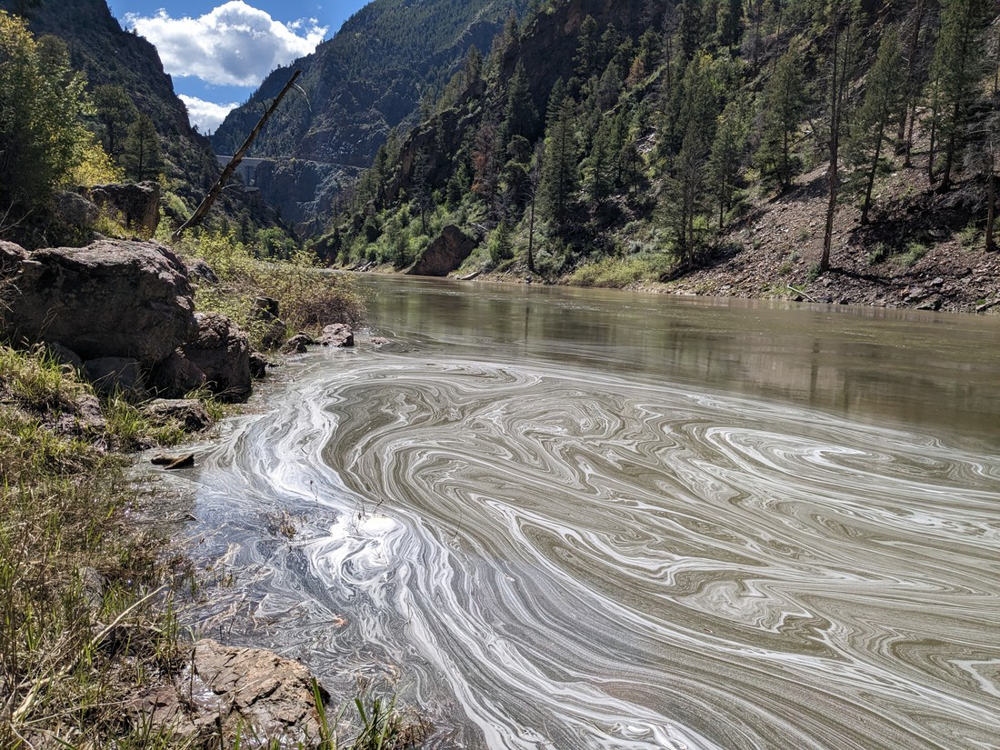

It was fine, but it ended a bit quickly.  There was supposed to be a bit of walking into the canyon, but the river was too high and so the trail just came to an abrupt end at one point.

There was an interesting dam nearby though.  It just looked like a giant grey wall from down at the bottom.

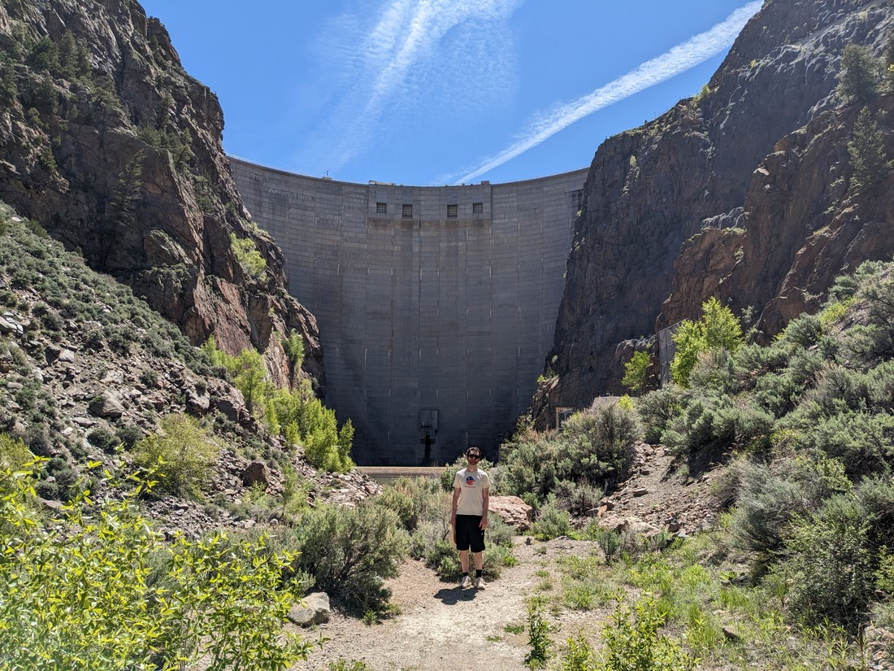

Apparently there used to be a railway through this canyon.  The evidence of this is a historic engine on a random piece of track high above the river.  That certainly made us want to stop and have a look, so I suppose that means whoever put / left it there did good work preserving history.

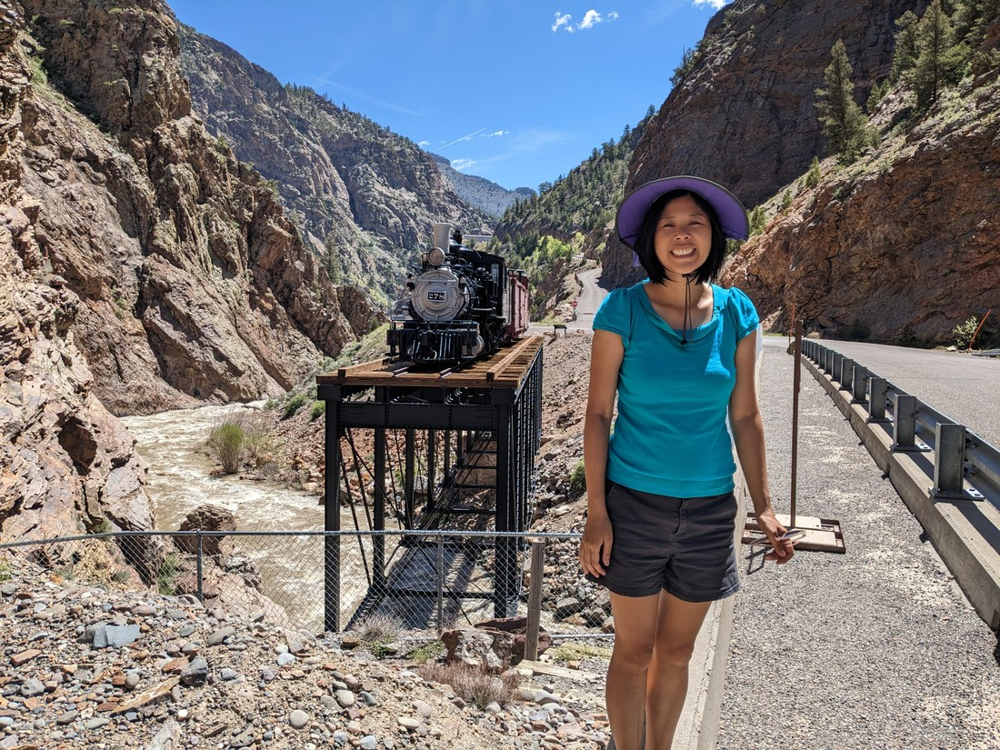

The other walk we did was at a place called Pioneer Point.  Here is the view from the point:

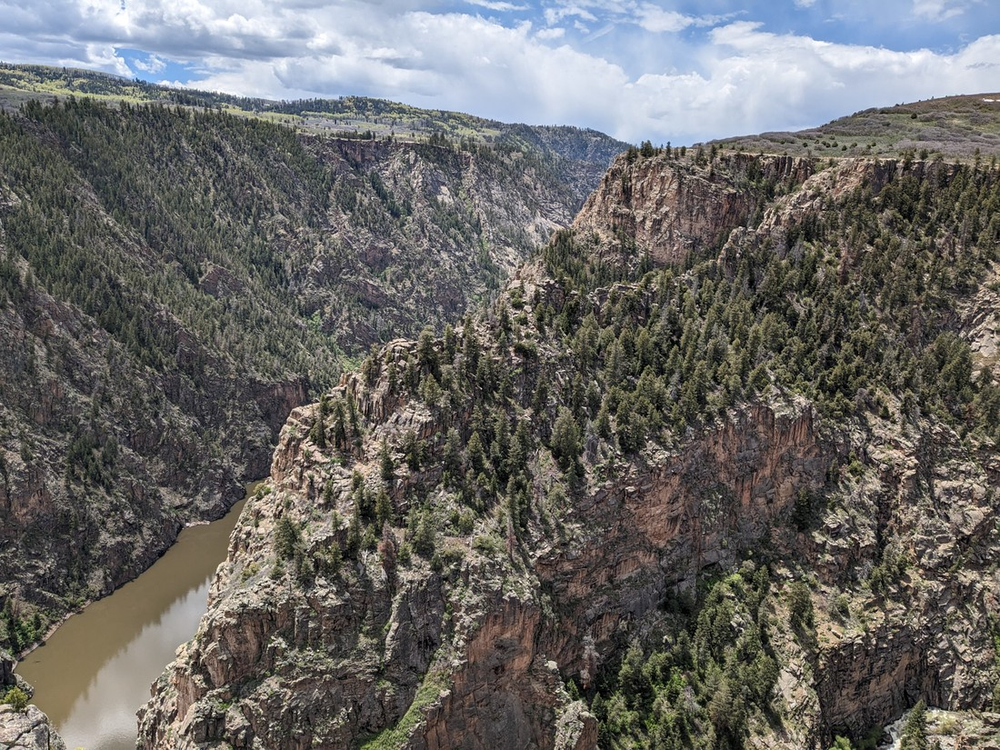

And here is the view of me with my back to the view at the point:

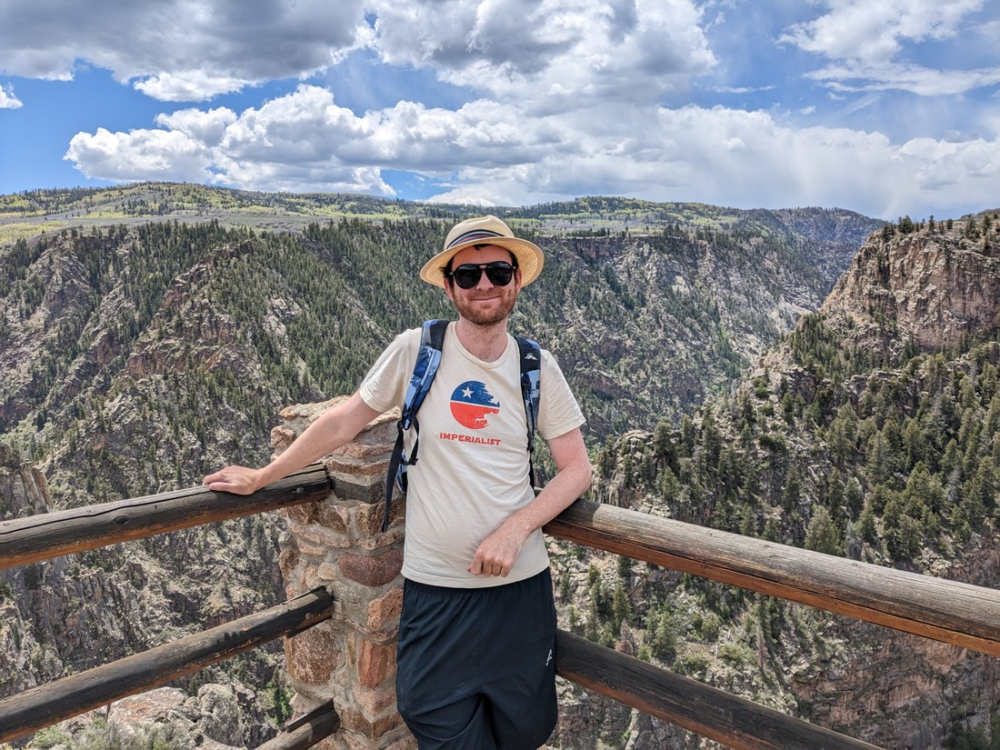

The walk was a bit backwards, like a lot of canyon walks.  The most scenic part of the walk was at the very start, and it just got less and less scenic until eventually you have to turn around.

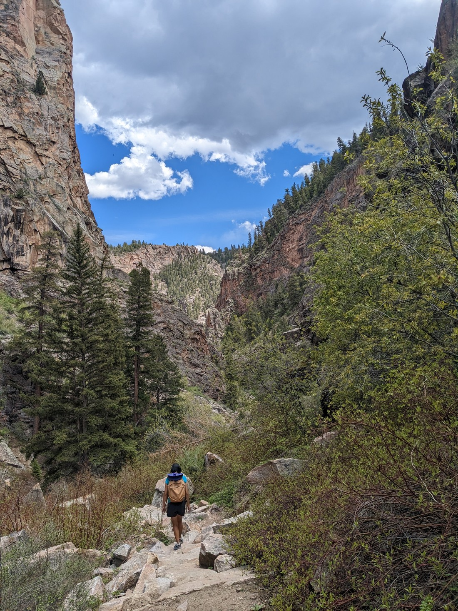

Towards the bottom of the canyon we found some interesting cave-like holes.  While they may look like ordinary holes, there was something noticeably unique about them - and this is not something that will necessarily come across in the photos.

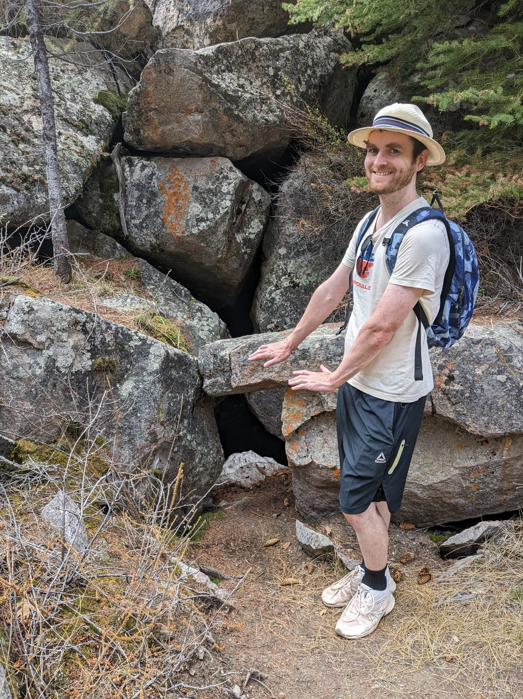

You see, they seemingly magically emitted very cold air.  This is because they were all filled with snow.  I guess a hole in a canyon doesn't get a lot of sun heat, so it stays nice and cold and the snow stays nice and unmelted.  It definitely was nice for a couple of hot hikers like us.

Like the morning's walk, the river at the bottom was somewhat out of control.  We have seen plenty of snow still on the mountains, but I imagine a lot of that snow has melted off relatively recently - which would explain the high river levels.

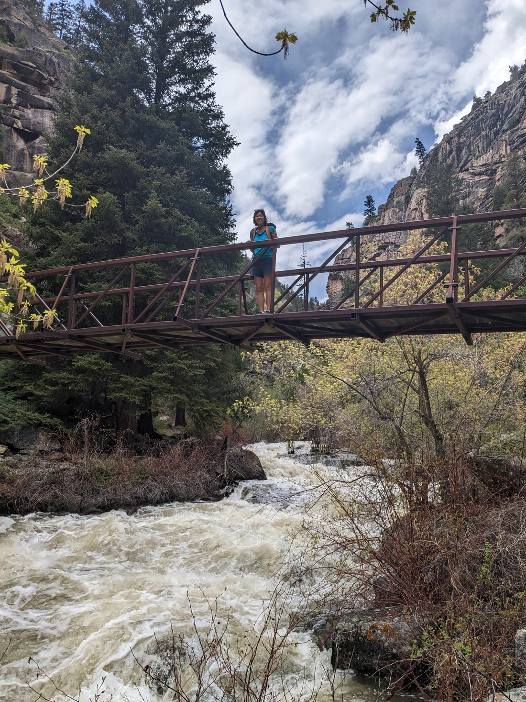

> It was certainly gushing

And like the morning's walk, at one point in the walk the river just took over the trail.

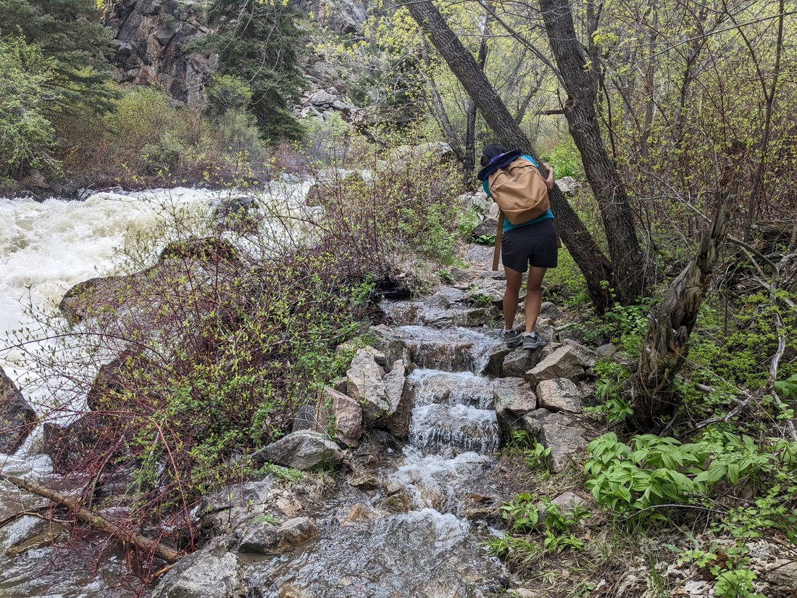

> Does this count as a waterfall?

We did manage to carry on for a bit, but there was no point.  The river was consuming more and more of the path so it was inevitable that we would be stopped some time.

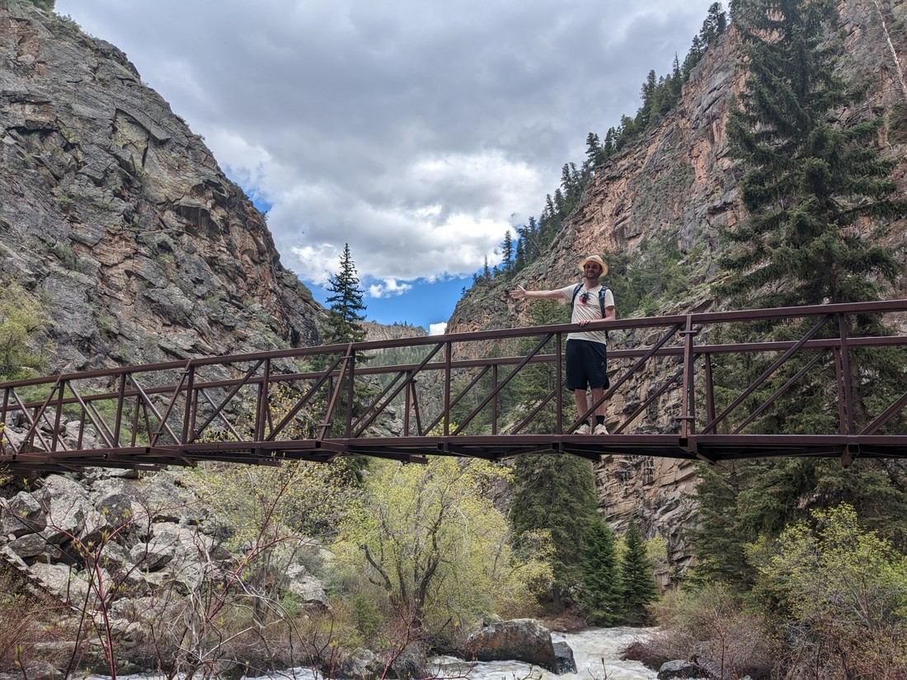

Now all that was left was to hike back up.

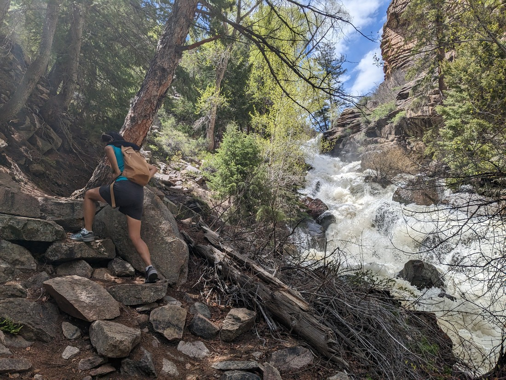

The afternoon walk was certainly interesting.  It's always nice having a canyon rim view, as well as a view from inside the canyon.  But overall this was just another day of walking for Luke and Betty.

In Utah we were able to find some amazing hikes in random places, outside of the major parks.  I guess the afternoon walk was pretty great, but perhaps it was just too similar to walks we have seen many times in New Zealand.  Utah was new and different, while Colorado is a bit of the same.  But at the same time, I am still excited about seeing more of Colorado.  Utah might be a magical place with equal parts canyons and Mormons, but the point of travelling is not just to sit in one place for ages.  The point is to see the world.

Tomorrow we'll be driving over to Eastern Colorado - which is where Colorado's major cities are.  At the very least I'm sure we'll find some new things to experience there.