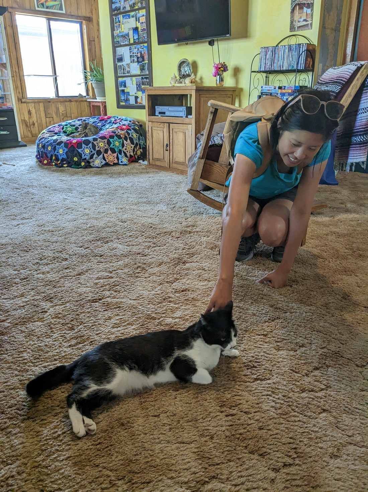
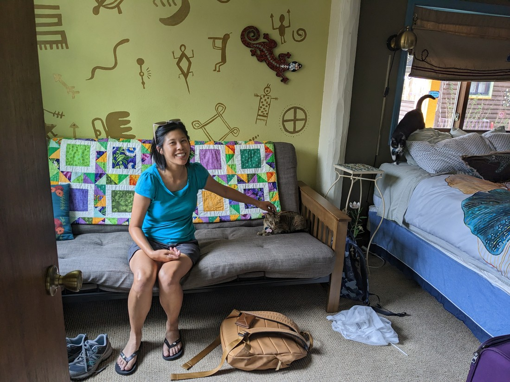
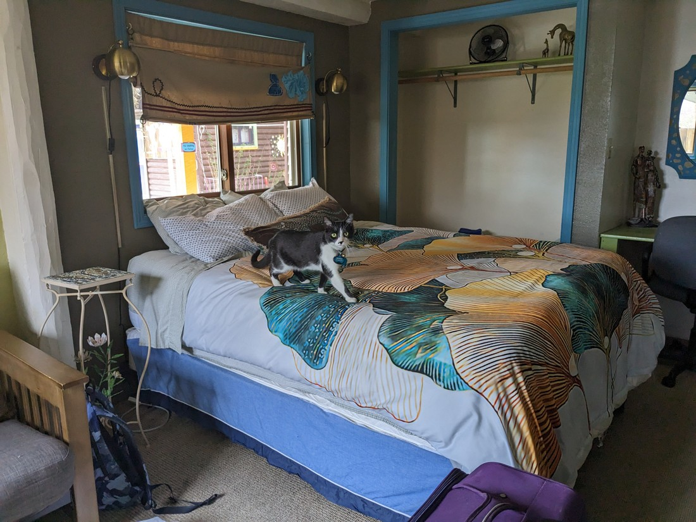
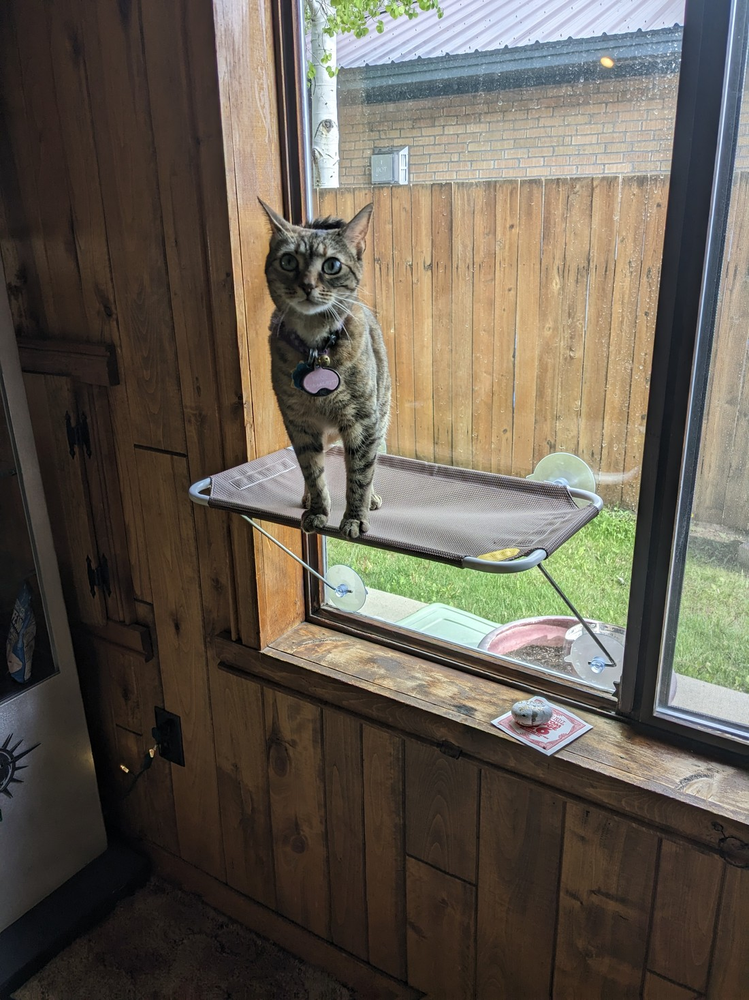
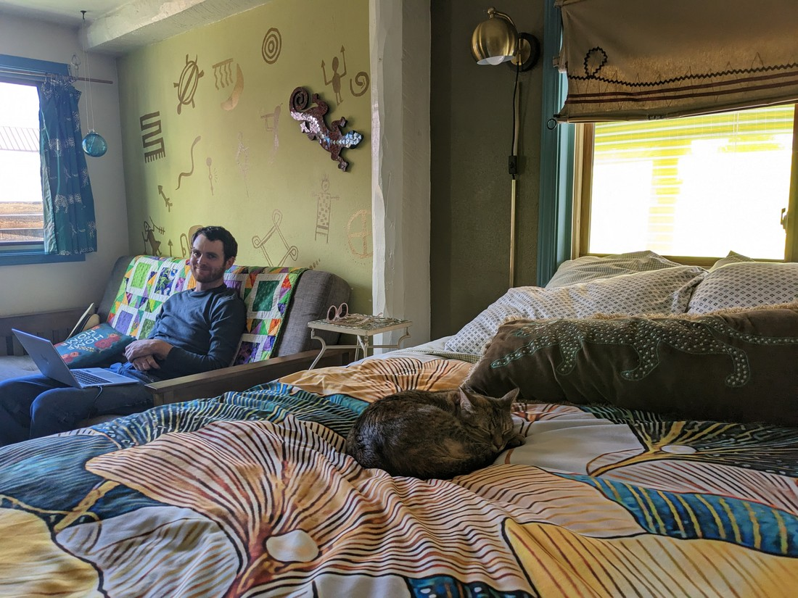
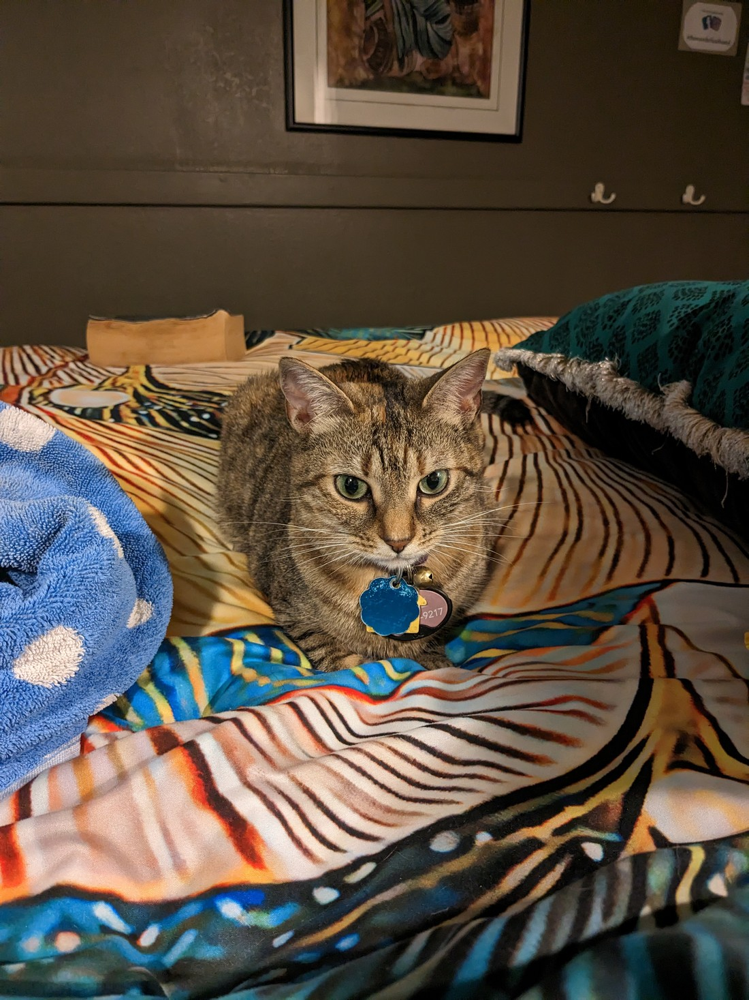

Tonight I had booked a room in a hostel in a town called Gunnison.  As I wrote before, there wasn't any particular reason why we were staying here - it just seemed like an appropriate amount of distance to travel in a day.  While usually its just simplest to book ordinary motels, I did book some hostel rooms to add some variety.

Anyway, the reason this hostel is getting its own blog post is not because of the hostel itself, but because of a couple of feline occupants that also happened to be staying there.

> Important note: there's two cats in this photo

We were instantly greeted by them (or maybe we just made a beeline to them when we entered).  But we did have to get our stuff into our room.  Fortunately for us the cats followed us.

> Perhaps they don't get to explore this room that often

The black and white one was Pepper

And the tabby was Nixie.

And by their size, both were clearly very young and new to the house.  But both really friendly.

But I didn't like Nixie that much.  Because she parked herself on my side of the bed and then went to sleep for several hours.

> Relegated to the couch

So anyway, this blog was just an excuse to save some pictures of cats.

> Pictures of naughty cats

Hopefully we'll be posting lots more of these, as hopefully there will be many more accommodation places with resident cats.
