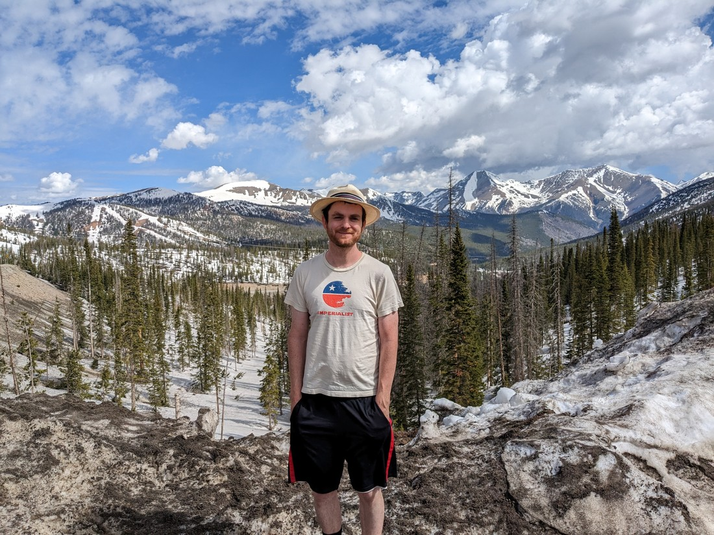
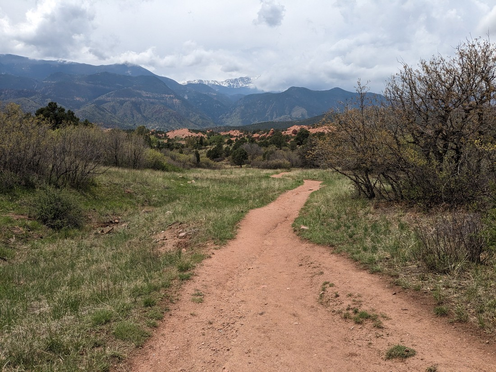
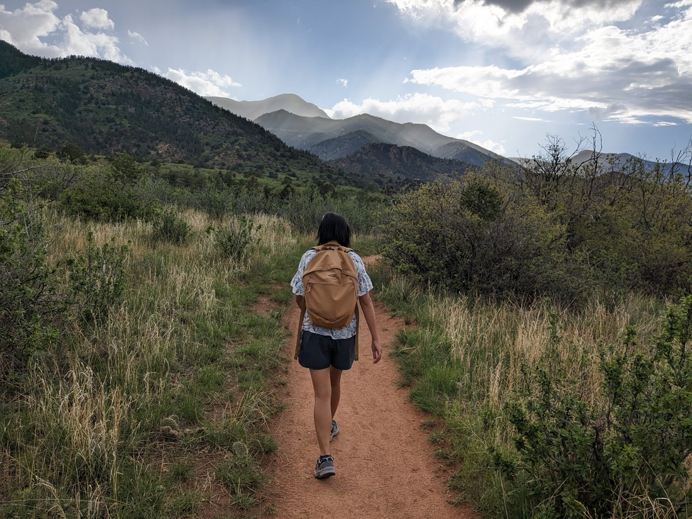
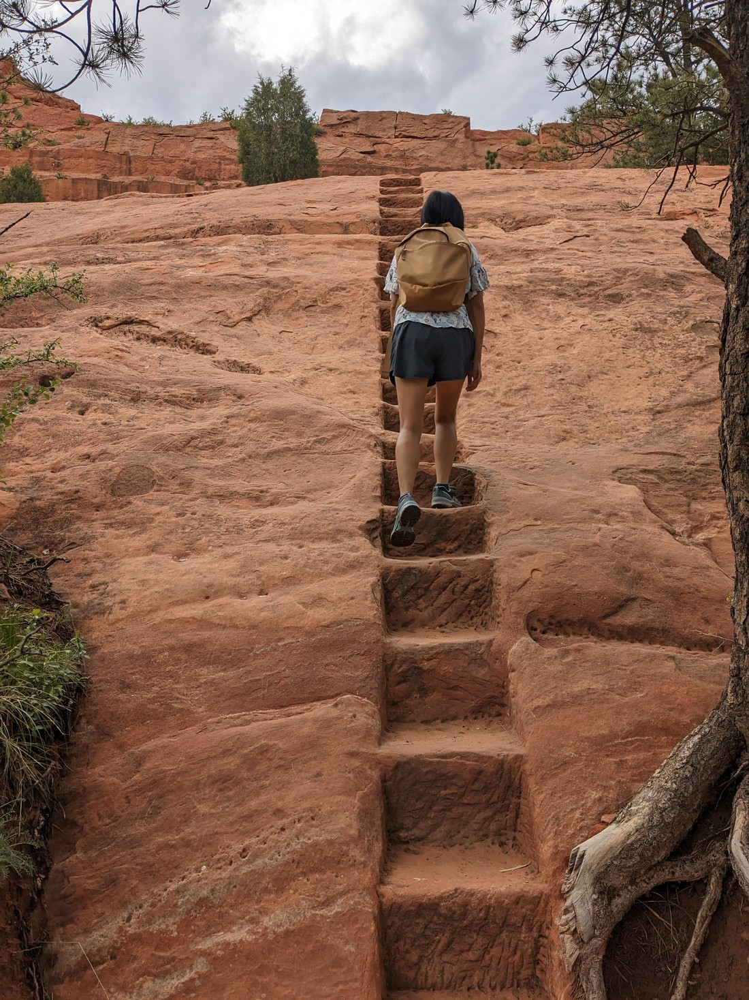
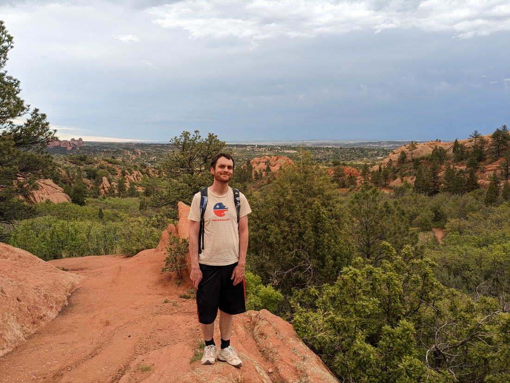
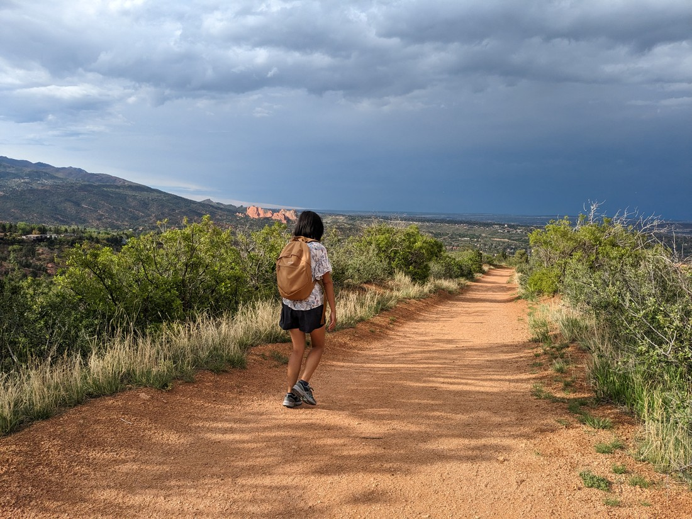

Hostels are bustling places and so we made a choice not to breakfast before we started driving.  Instead we told ourselves that we'll stop at the first scenic pull-out / picnic spot.  That spot ended up being the top of Monarch Pass, at 3,448 metres in elevation.

> We ate our breakfast in the car, though the air was warm enough to take the above picture.

After Gunnison, the original plan for this trip was to travel South to Alamosa, which was next to the Great Sand Dunes National Park.  However we found out a while ago that walking on sand is not all that fun so we instead cancelled that accommodation and booked a new motel in Colorado Springs.  And since Colorado Springs is a pretty major town, we decided to head straight there today.

After arriving and eating, we checked out a park that was basically inside the town borders called Garden of the Gods.

It was extremely okay.  There were a number of large red rocks sticking out of the landscape, which were quite scenic.  But not that many.  There were trees and bushes around.  But they weren't that interesting.  The above picture was the only photo I took of that park.  It definitely didn't leave much of an impression on us so I'm not going to spend any more time talking about it.

We were lacking in motivation a bit today, but we did figure we should at least do one more outing.  So later that day we travelled to another nearby park called Red Rock Canyon Open Space.

> "Open Space" is a bit of a weird name.  How does this differ from a regional park or conservation area.  Fortunately for me writing this, those will be questions for another day.

This park was much more interesting than the Garden of the Gods park.  For starters, it had some history.  It wasn't just a park with some rocks.

> There were also steps!

The park had previously been quarried - so many of the large red rocks had giant ledges carved out of them.  Not natural of course, but it did make them more interesting to look at.

> Kind of like more steps, but for some very giant people

The park was also quite elevated, being at the mountain edge of the city.  There was a fair view out over the city and the surrounding plains, which was quite welcome.

> Not the best view, but better than not staring out at the horizon

It was also a lot less crowded, but that could just be due to the time of day.  Being late, there were some very threatening clouds in the sky.  And as we got to the furthest point we were planning to walk to, it started raining.

> Skies are definitely much scarier than in the previous picture

It was looking like Luke and Betty were going to get quite damp, but fortunately the rain didn't last long.

So overall, an okay day.  We probably could have picked more interesting things to do today.  Probably the reason we didn't was just because we have another whole day here.  But I suppose now the pressure is on to do something more impressive tomorrow.  I mean, surely Colorado Springs has something worthwhile to justify us driving all the way here?  Well, we'll just have to see tomorrow.