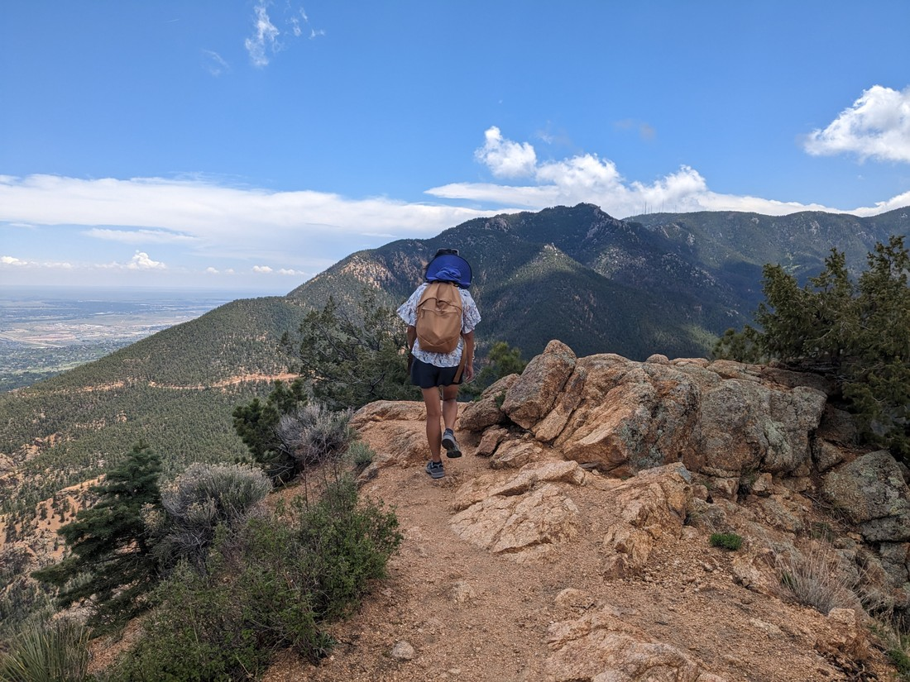
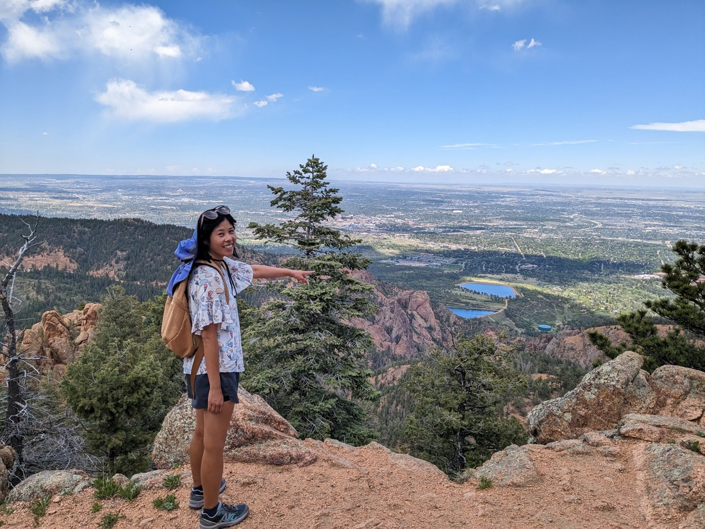

We were tossing around a few options for things to do today.  There were several touristy places we could pay a small fee to see.  There were also a few walks to do.  But like usual we woke up and couldn't really decide on what we wanted to try.  Our first choice was to check out the nearby zoo, but it was booked out until late afternoon.  Well, it is now Memorial Day weekend so it's kind of expected things like that would be busy.

I had tried to sell Betty on a walk up a mountain (actually two mountains - Mount Cutler and Mount Muscoco), but she countered with one that sounded less strenuous called the Seven Bridges trail.  So we drove to the North Cheyenne Canyon park where this walk was located.  Although actually, this was where both walks were located.

It was quite busy here - again probably because it was a Saturday that was also sunny.  We happened to drive by the parking lot for the Mount Cutler / Muscoco walk.  It was full, which wasn't unexpected as I knew that was a very popular walk.  But as we drove through the canyon, we found that every parking lot was full.  It got to the point where we just said to ourselves, "We'll just take whatever park we get and just do whatever walk is nearby"

We arrived at the end of the canyon, which had a big parking lot, and was also the lot for the Seven Bridges walk. And like all the others, it was all full.  There were plenty of cars just driving around in circles so not much more to do than to drive back down the canyon.

Mentally I was thinking, perhaps at the bottom we'll turn around and have one more drive though to find a park and if still nothing then we'll take it as a sign and go somewhere else.  But we didn't need to do that because we did find a park.  And it was right beside the Mount Cutler / Muscoco trailhead.

So we walked that trail

> Definitely not what Betty was hoping for

Mount Cutler turned out to be not all that hard.  We were at the top before we knew it.

And it was a surprisingly good view.  I mean, I knew this track was likely popular for a reason - but you never know.  First it had a lovely view over the surrounding forest and hills.

But also, we walked a bit further to an overlook that overlooked Colorado Springs.

We weren't always going to commit to going all the way to Mount Muscoco, but since Mount Cutler had been quite easy and quite scenic, we figured we may as well give that one a go too.

> Again, definitely not what Betty was hoping for

It wasn't quite as easy.  The track was a fair amount longer, and not as straight forward to hike.  But we got there.

The views were similar.  It was the same mountains, trees, and city we were seeing.  The only difference now was that they were farther away.

But that did turn out to be a good thing.  The world seems so much bigger when you're standing on top of a high peak.

Afterwards we ate, and figured we had time for one more activity before we needed to start driving the 2.5 hours we needed to drive today.  Betty had found an interesting sounding thing to see in the heart of Old Colorado City.  When we got there, two things were really obvious.  The first was that there was some serious hailstones being thrown down from the heavens.  (So we waited in our car for a bit).  The other was that there was definitely something going on in Old Colorado City.

It was called Territory Days.  It turned out to be a market of sorts, with live music, inflatable kids activities, and stalls.  Lots and lots of stalls.  We regretted having just eaten because there was so much to choose from here.  "Funnel cakes" caught our eye.  How does one involve a funnel in the cake making process?  Another spectacle was the turkey legs.  People were walking round gnawing on these giant bones surrounded in meat.  I saw some prices and they weren't cheap - $20 I think.  But I would say there probably was $20 of meat on those bones because they were so massive.

Despite walking past several city blocks of stalls, we stuck to why we were here.  The place was called Magic Town, and it was inside a building.  And while the "magic" part was a bit of a stretch, the "town" part of Magic Town was bang on the money.  You see, this attraction was literally a little town.

Sculpted over decades, it was a whole series of little (but still somewhat big) buildings, all filled with people, and completely full of character.

You could peer inside the buildings at its occupants, going about their business.  In some rooms we'd find a painters studio, complete with painter.  In another we might find a kitchen with someone cooking.  It really did feel like you were peering in at scenes you shouldn't be seeing.  In one window there was literally someone changing clothes.

In these windows was the first part of where the "magic" in Magic Town would come in.  Sometimes you'd be staring in and the scene inside would almost instantly change to a different scene.  Usually a whole different room, perhaps a whole different size, with different people and furniture.  And again, these rooms are all three dimensional - there's no 2D pictures here.

What was happening is that there'd be a pane of partially transparent glass inside.  When a strategically placed bulb was lit up, the pane would be transparent and it would show what was behind it.  When that bulb was dark, the pane would act as a mirror and reflect the scene just round the corner that couldn't otherwise be seen.  It wasn't always easy to tell where the mirror was - it usually looked perfectly like two different rooms were alternately occupying the same 3D space.

The other magic that would happen was that we'd stare down the alleyways between buildings, and see a bit long alleyway stretching far beyond the sculpted building in front of us.  This was another mirror trick.  The alleyway would have corners which would again be disguised by simple mirrors but giving the illusion that these scenes were much bigger than upon first glance.

> This alleyway had both tricks, plus a hologram of people talking

And to make things just that bit more fun, there was a scavenger hunt to do.  We each got given four questions of things to find such as "Where is the birdcage?" or "Where is the Hawks banner?".  Because the buildings were all teeming with character, there was a lot to look through to find the answers to these questions.

Overall it was an excellent place to visit, especially for a rather cheap entrance fee.

There was definitely more we could have done in Colorado Springs.  There were other walks and other museums.  We could have spent more time here, but we had to move on.  This visit in itself was a bonus as Colorado Springs was left off the original itinerary.  I don't know if there is enough here to warrant a special visit later down from Canada to do more things, but never say never.
