After Colorado Springs we had two nights in a place called Leadville.  This boringly named town is supposedly the city at the highest elevation in the United States.

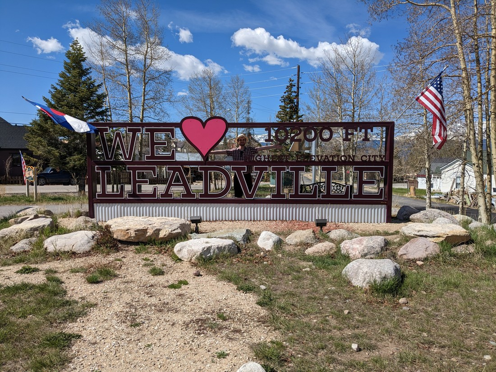

> And it shouldn't have come as a surprise to us that it was quite cold.

The high elevation wasn't why I decided that we should stay here.  Instead I noted that we should check out the famous ski town of Aspen.  But accommodation there was pricey and Leadville was the cheapest alternative I could find nearby.

But now that we're here, there was no necessity for us to visit Aspen.  But what else is there to do?  Leadville is at alpine elevation so there's not a lot of forests about.  Any trail that gains altitude at all is going to be covered in snow and likely the road to that trail is going to be snow covered too - despite the many, many snow plow vehicles we saw around town.

I looked up Aspen's highest rated trail and found that it was a walk to a particular alpine lake.  I imagined it would look quite stunning this early in its defrost cycle.  Only problem was that it would involve paying for a shuttle to get there.  In addition, we'd have to also take a bus to get to the shuttle departure location as the alternative would be to pay something like $50 for parking.  These shuttles and buses would likely eat up a lot of our day so we decided not to pursue this walk, and to instead just make do with whatever walks we could find on the road from Leadville to Aspen.

Our first problem was that we overshot the turnoff to Aspen by 20 minutes.  Good thing we didn't have a shuttle to catch otherwise we might have been 40 minutes too late.

The road to Aspen needed to go over a mountain pass, so the road progressively climbed, until we started seeing snow.  And it was actually quite the sight to behold.

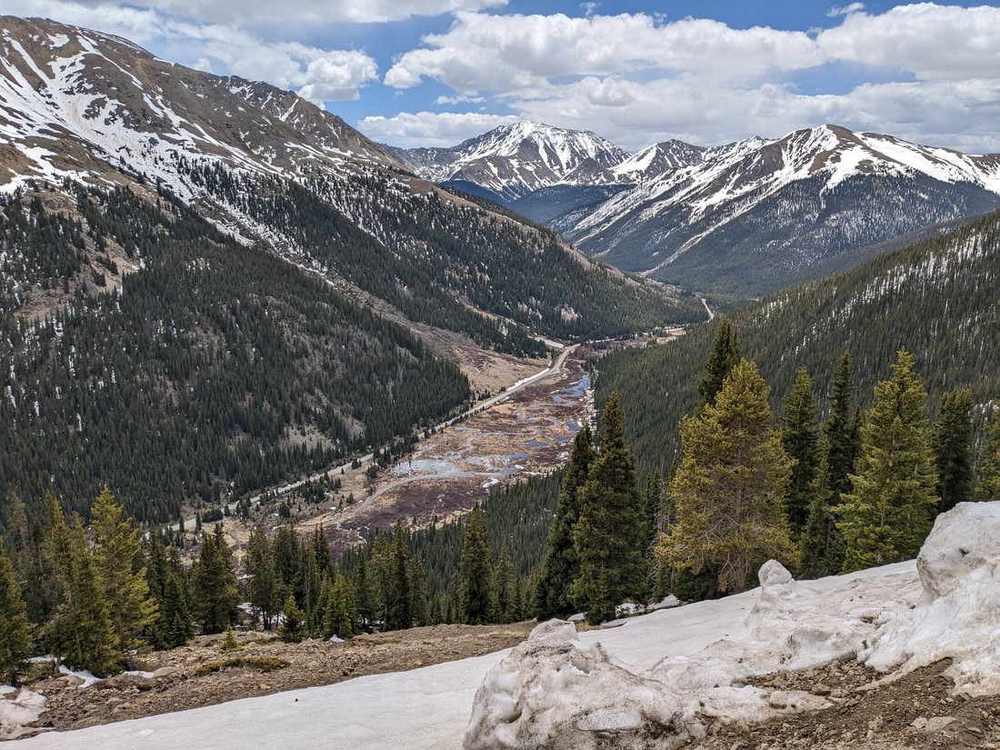

Like in Leadville it was pretty cold already so Betty opted to stay in the car for the above photo, so I had to make do without her:

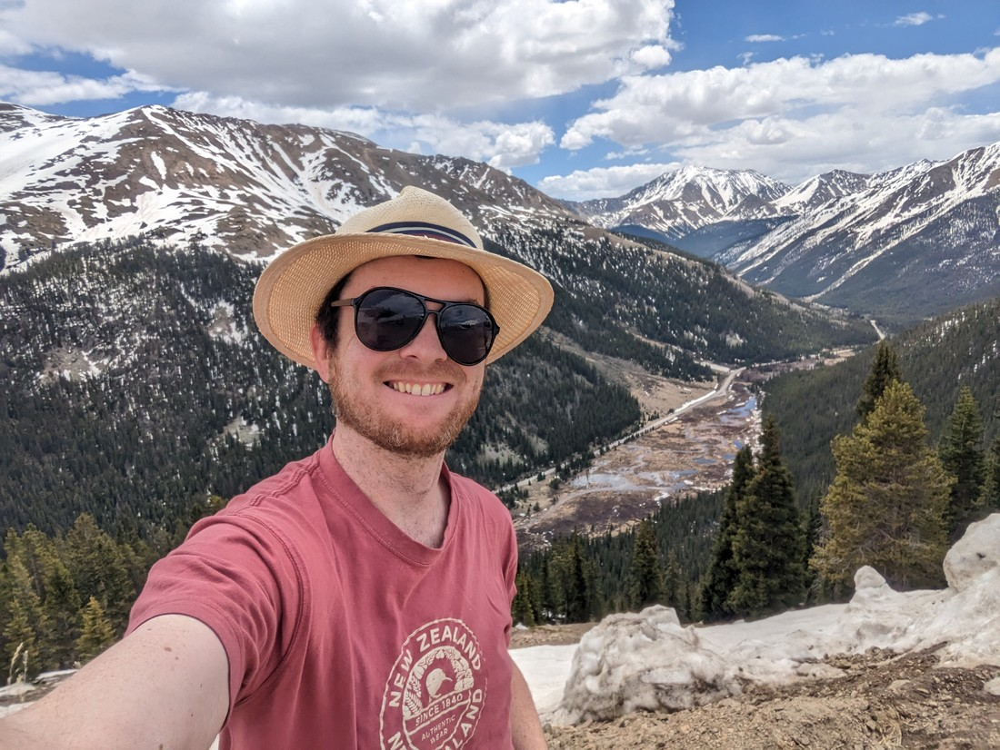

The top of the Independence Pass still had a metre of snow, but fortunately the road had been fully plowed.  Sometimes the snow sat like frozen waves along the side of the road - the clear remains of a plow tossing snow off the road and then it freezing into a wave shape.  It's a wonder at all that the road was open, but I guess its always promised to open for Memorial Day weekend.

Our first stop was close to the top of the path.  It was a trailhead to two lakes - one close and one a bit further.  However because it was so close to the top of the pass, of course it was still snow covered.

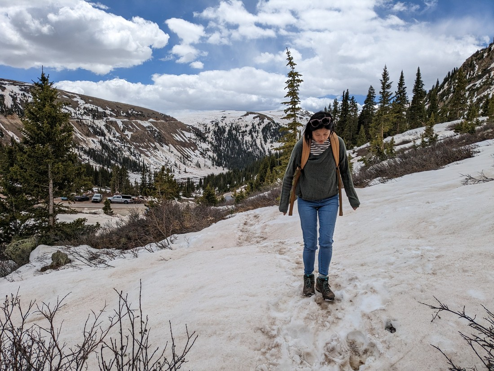

> Betty walking very, very carefully

There were track of previous hikers, but following the actual trail was completely impossible.  Standing on the snow there was no way to tell if we were following the intended route, or just an approximation.  At least the signs reached above the snow level, though they were little help.

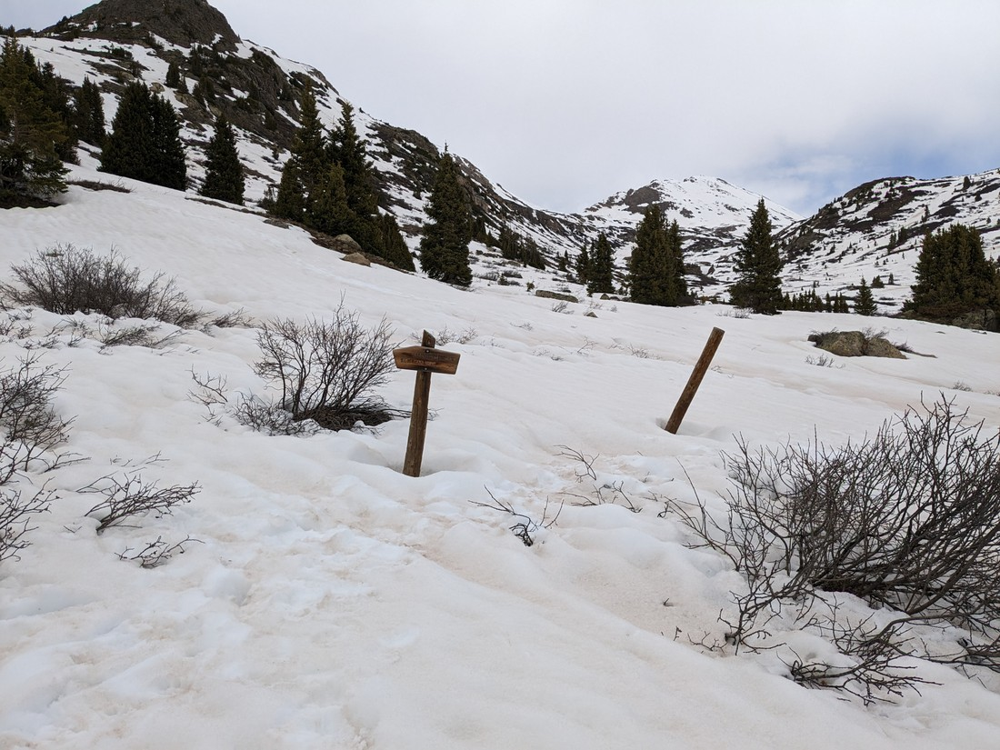

I told Betty that we'd just go to the near lake, and not worry about the far lake.  The map at the trailhead clearly showed it was a very short distance.  But it turns out that very short distances can take a long time while trudging through snow.  Soon after we came to the realisation that the lake wasn't going to be in front of the hill we were hiking towards, and instead would be on top of it.  Gah, tricked again by a map's lack of a third dimension.

I did want to see the lake so I tried to climb the snow covered hill but soon came to the conclusion that it just wasn't worth it.  Fortunately the way back down was a lot more fun than the way up.

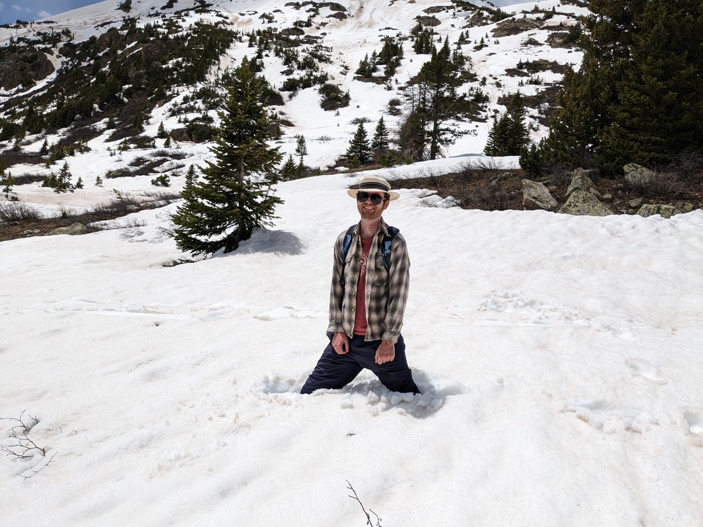

> This is the outcome of Luke attempting to run on snow

Our next stop was a ghost town.

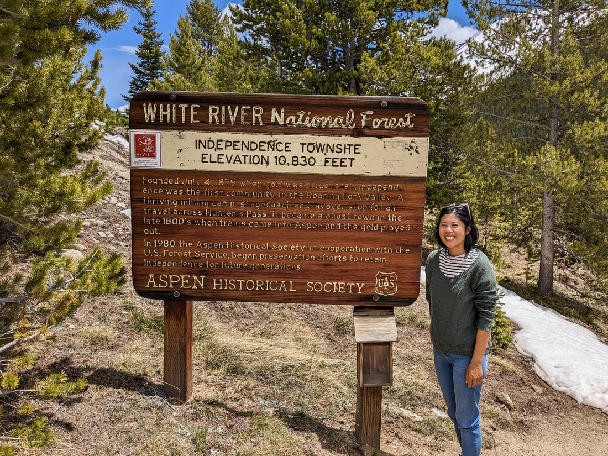

And unlike the one in Utah, this one was actually deserted.  I completely understand why.  Who would want to live in this wintery pass with nothing nearby?  It definitely wasn't a good idea to try and build a town here in the 19th century.

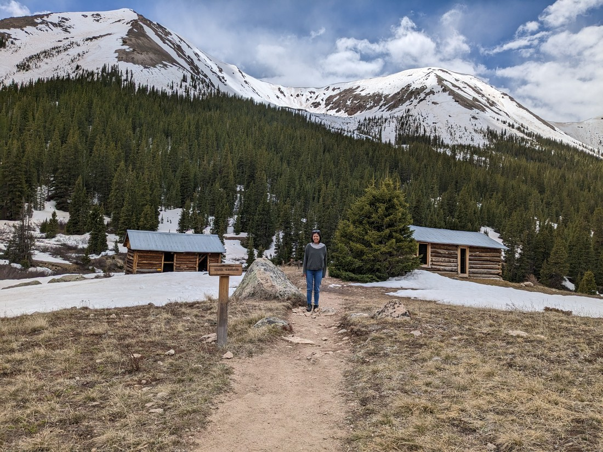

My understanding is that these buildings aren't even original buildings.  Instead these are replicas created for tourists like us.

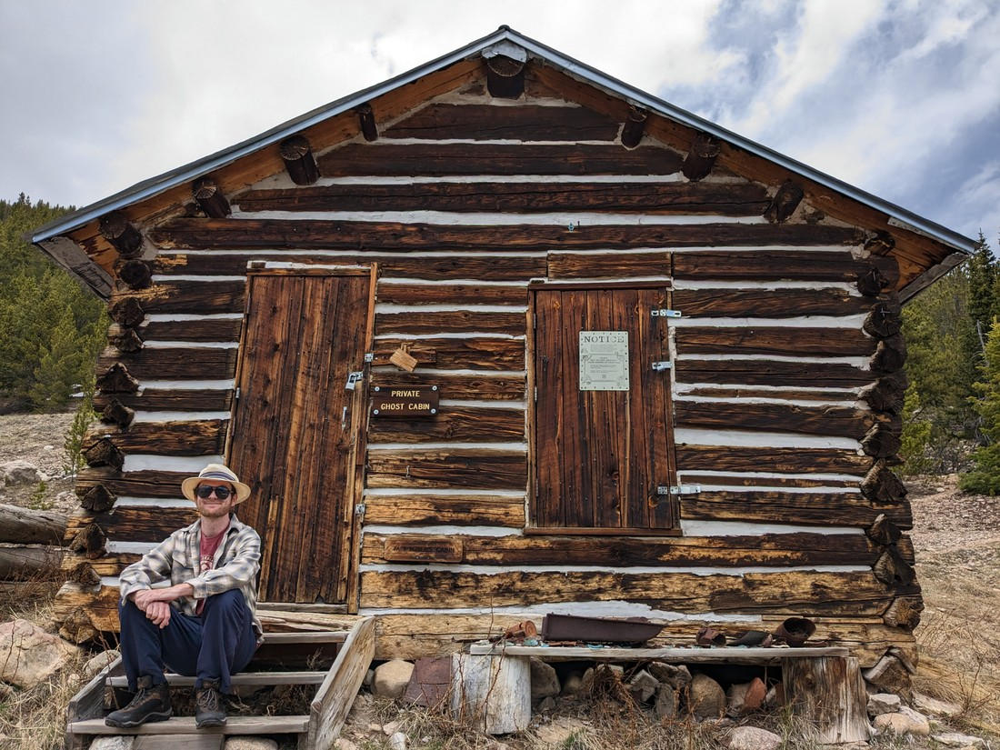

> They certainly seemed very drafty - hope the original construction was better

The next stop along the Leadville to Aspen road was a walk called the Grottos Trail.  The "grottos" ended up being some caves.  But the signs nearby called them ice caves.  This was an apt name, because they were filled with ice.

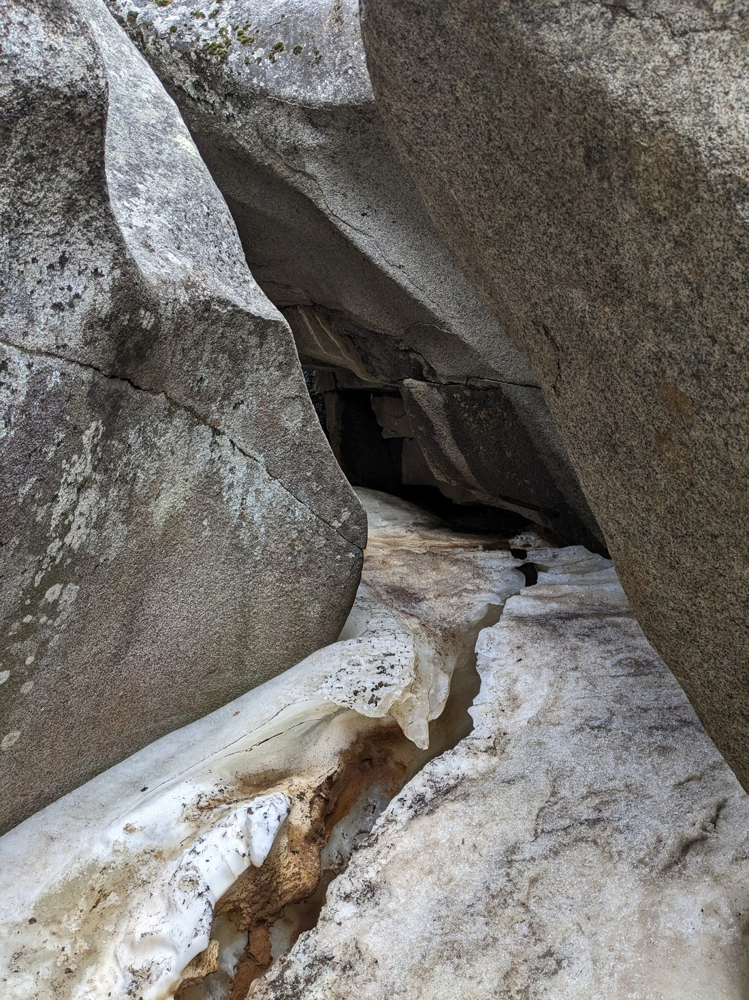

It was a bit dicey trying to enter the caves.  The above image is the way in.  The ice on the right is big enough to walk on, but it is on a slope and being ice, very slippery.  I had to resort to crawling to make sure I didn't slip over.

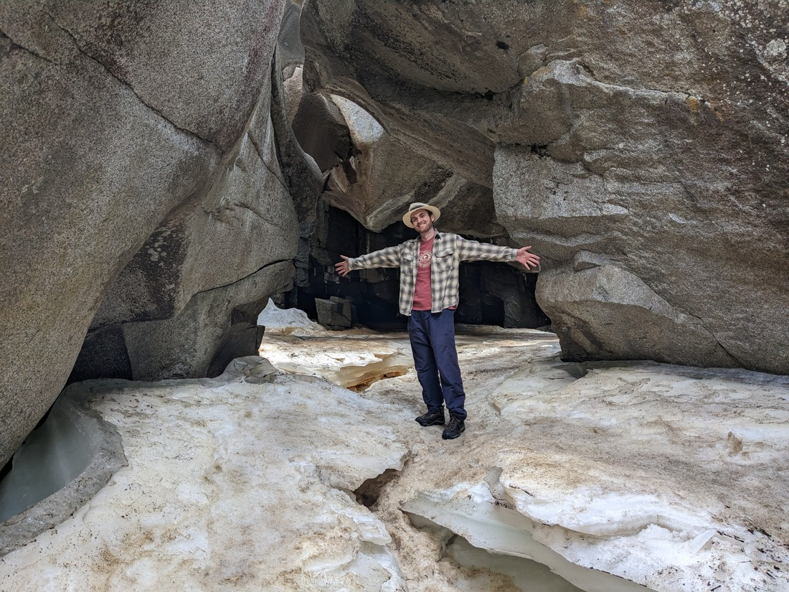

> But we made it inside!

And then on the way out I had to crawl again.  That crack in the middle showed that the ice was 1 to 2 feet thick.  I definitely didn't want my leg to slip down there.

There were also some rapids of sorts nearby.  They were described as "cascades" which is not a term I've heard used to describe part of a river.  But I suppose it is accurate.  With all the snow melt running through the valley, the water was definitely cascading over the rocks.

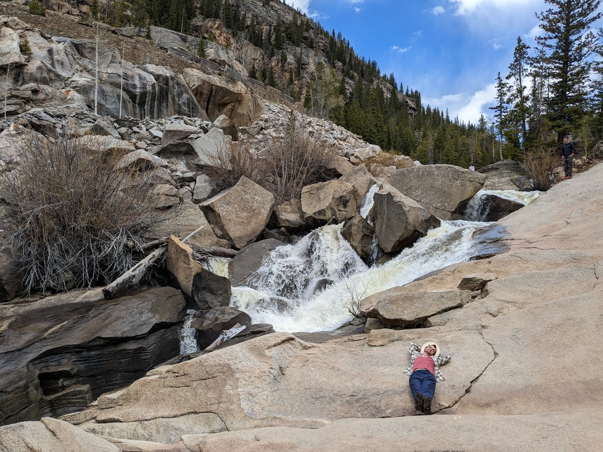

It was only after visiting the grottos that we made it to Aspen.  It definitely seemed like a town.  But what better way to see Aspen then to see it from above?

Naturally this did mean we had to hike up a hill.

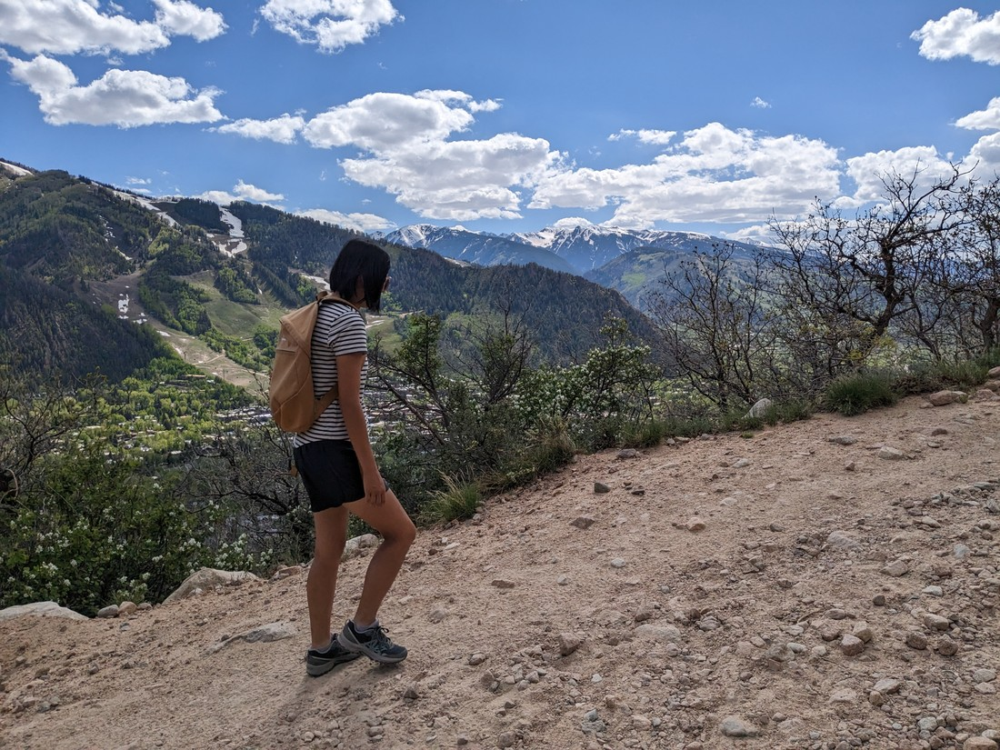

Aspen was certainly less snowy than I had expected.  Coming from Leadville and over the Independence Pass we'd certainly seen a lot of snow by this point.  But it turns out that Aspen isn't as elevated - a mere 8,000 feet (compared to Leadville's 10,200).  As a result, the town was completely snow free.  Of course there was snow on the surrounding mountains but the town was lush and warm.

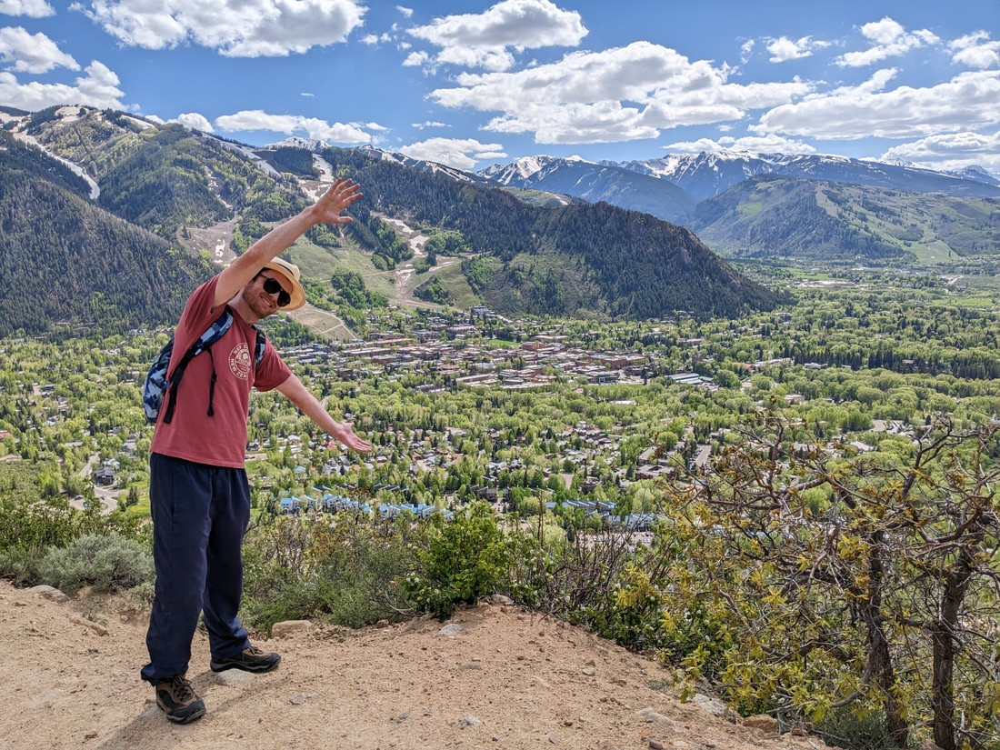

> Perhaps too warm for a hilly hike

After our hot walk up the hill, we then went searching in the town for their best ice cream shop.  That proved hard to find, so we just resorted to finding any ice cream shop.  But after driving round for 10 minutes we came up empty handed.  It was a warm day in a long weekend, but no ice cream in Aspen?  I guess it make no sense for a permanent ice cream shop in winter.  Skiers probably want something warmer after skiing.

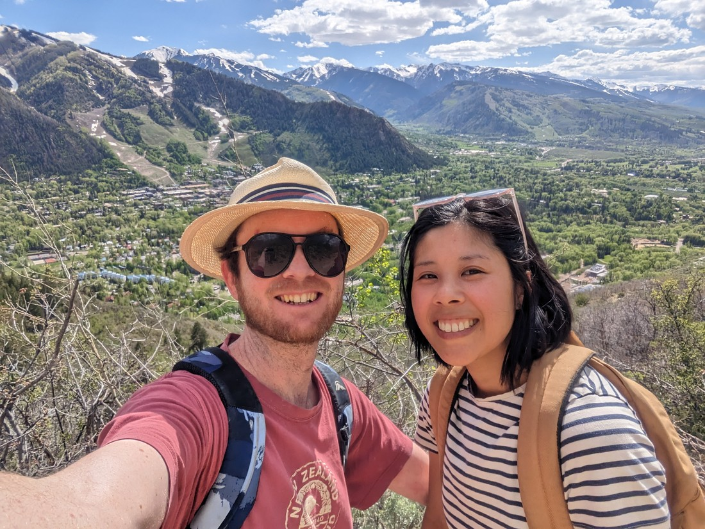

> Look at these sad faces that didn't get any ice cream

After a big day out it was now time to head back to Leadville.  I think we were able to source some ice cream in Leadville, but we chose not to - opting for something warmer and more dinner-y.

So that concludes our day trip to Aspen.  Betty questioned why I suggested we drive all the way there, but then didn't really spend any time in the town itself.  It wasn't really about the town - it was about experiencing the scenery that made Aspen a famous destination.  I may have missed out on seeing two different alpine lakes but we at least did get to visit a nice variety of places.