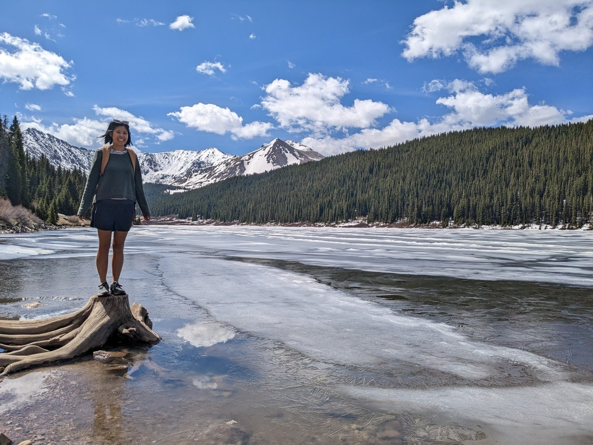
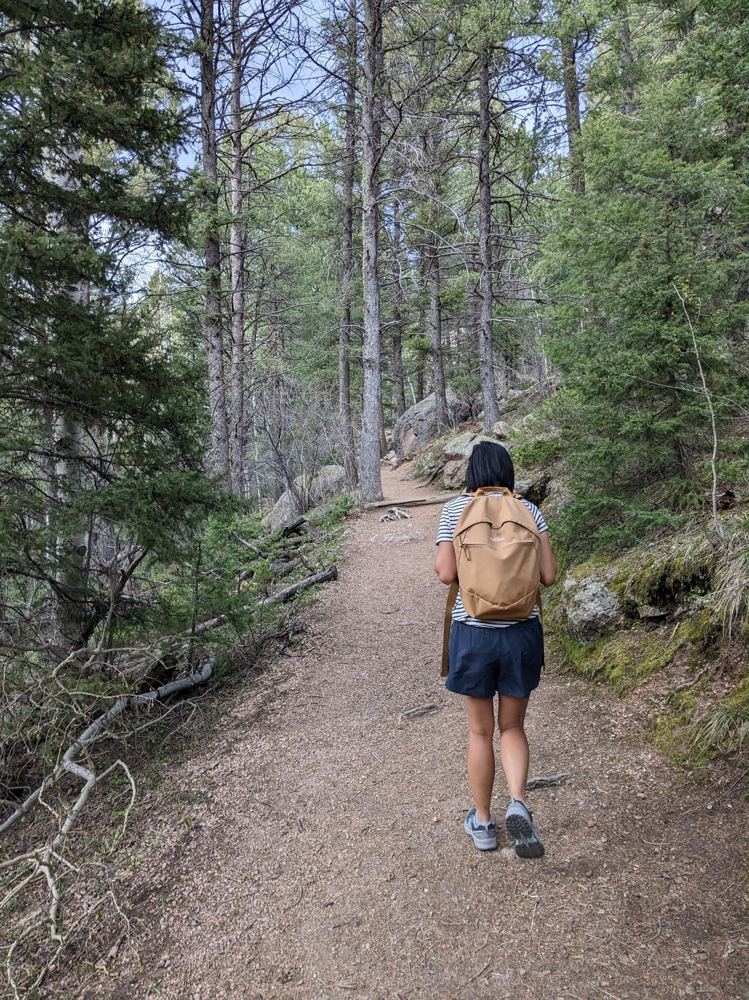

Today the plan was to drive to Denver and do Denver things.  Well, not quite.  There is a lot of parks outside of Denver so the plan was to drive to near Denver and do near Denver things.  But first we have to get there.

On the way we passed over the Fremont Pass, which according to Wikipedia is 3,450 metres in elevation.  If the pass was a mountain in New Zealand it would be New Zealand's fifth highest mountain (or maybe third because Mount Cook somehow takes the top three spots).  There were some lakes at the top of this pass and because my dream of visiting an alpine lake yesterday had been shattered, I thought it might be nice to stop.

We found one lake on the way back down the other side with a place to stop, and boy was it a scenic lake.

> Actually technically it probably shouldn't be called a "lake" at all.  Google Maps calls it a dam reservoir.

As you can see above the lake appeared quite patchy.  There was clearly a lot of ice about, though at the sides it appeared ice-free.  Naturally I wanted to stick my hand in the water to see exactly how cold it was.

> I get silly at high altitudes apparently

And surprisingly the top of the water was solid.  Even the parts that appeared ice-free were covered with a layer of ice.

> It's hard to see but I'm holding a big pane of ice.  It's also hard to see but my hands are very cold right now.

Being quite a nice place to stop, we decided to follow an unknown trail along the lake.  This wasn't one of our planned stops for today but look at the joy it brought some of us:

As we walked, we began to see more and more clearly thick bergs of ice.  That got us wondering - could a person stand on one?  Clearly the time of ice skating was long passed as the lake had definitely begun thawing, but that didn't mean we couldn't attempt it.

My first attempt at seeing how much weight the ice could hold didn't go well.  I stood on a log and put increasingly more and more weight onto my foot and predictably the ice broke and my foot went straight through into the cold water.

> Had a very cold foot for a while after that

Betty wanted a go and found a spot with a thicker piece of ice.  Problem was that it wasn't quite within reach of the shore.

We could potentially have jumped onto it, but then we'd be standing on the edge of a piece of ice and it would definitely have toppled, if not broke.  There was no way to get on to a middle of a piece of ice which would maximise the chance of us being able to balance properly.

Wisely we decided to move on.  We walked to near the end of the lake and turned around.  Overall it was a very excellent stop and we might have spent up to two hours by the lake, admiring its beauty and debating how risky we wanted to be with our attempts to stand on ice.

Once we arrived near Denver we went straight for a park called Red Rocks.  This park was interesting in that in addition to being a park, it was also a concert venue.  I read that to visit this park you should arrive early in the day as in summer months there is a performance each night more often that not.  I checked - there was a performance every night that I could see.  When we arrived they were just staring to lock the park down to get it ready for the night's performance, so that was a bit of a bust.

Our next stop was nearby, to a place called Dinosaur Ridge.  It was a bit of a road (well, former road) with some fossils and stuff from dinosaur times.  Well, I thought there was going to be fossils.  Every info board we passed seemed to be trying to pretend that the random piece of rock it was next to was important in some way.

> Apparently lots of dinosaurs walked on this rather steep hill

But we didn't come here to look at fossilised ripples, or what a dinosaur footprint looks like from underneath, we came here to see dinosaurs.  Fortunately there did eventually turn out to be dinosaur bones, but they were similar to that other place we visited.  I guess bones just aren't as interesting to look at when they're still encased in opaque rock.

After checking into our motel and resting for a bit, we decided to do one more walk.  This one wasn't that far south of where we were staying (in southern Denver) but it took a while to drive there.  That was because we had to drive 9 miles on an unsealed road.  That doesn't sound too bad, but when the speed limit is technically only 20 miles per hour then it could take half an hour to drive that distance.

I pushed to do this walk today, because the top of the walk gets closed off when there is thunderstorms, or a risk of thunderstorms.  And today had the lowest risk.  But what did we start to hear as we hiked up?  Thunder.

We decided to push on.  It was actually blue skies overhead, with no rain.  Maybe the storm was not nearby.  And we had previously been told to head back only if we saw lightning.  But then we passed a bit of a view, and I spotted something I really didn't want to see.  Behind the nearby ridge we saw a lightning strike.

We paused and waited.  A minute later we witnessed another lightning strike in the same area.

Crap, what do we do?  Every step up towards the top is just increasing the danger if the storm did come our way.

I will throw Betty under the bus here - she decided we should push on.  And while it may not have been the correct call, the sound of thunder did stop within 20 minutes.  And it never did rain.  The storm must have either dissipated or moved on to somewhere else.

When we got the the top it was reasonably clear - and this is what we found at the top, and why this random walk in the middle of nowhere is quite popular.

> Cause everyone loves steps

At the highest point in this ridge was a bunch of steps up to an old watchtower.

And maybe a watchtower that is still used today.  There was a sign inside detailing the number of days of operation this year, which was only seven - but that's seven more than most firewatch towers are occupied for nowadays.

Naturally the tower had been built up here because it could see quite far over the forest and surrounding mountains.  And of course, the reason we wanted to be up here was because it meant we could see far over the forest and surrounding mountains.

At this time of day, the setting sun made it really pleasing to be up here.

When looking at this walk, it didn't look too hard.  Well, on paper it is not a hard one.  The distance was recorded at 4.3 kilometres return, and the elevation change was only 265 metres.  Neither of those numbers are small, but nor are they large.  And yet the walk was supposed to take 1.75 hours to complete.  I wondered if it was due to the elevation?  We're still at a reasonably high starting elevation, which does make breathing while hiking up hills difficult.

But up here I understood why the walk usually took longer than I would have expected.  This was a really nice place to be, and just stand, and stare.

After returning down the steps we tried to find some nearby viewpoints, with no success.  Eventually we had to return to our car.  It probably was good we didn't spend any longer up there as it was dark by the time we got back to Denver.

So that was another day of Luke and Betty doing stuff.  What did we learn from today?  Well, I guess we learned that some places will be good stops and some places will be bad stops.  Did we know that already?  Yes, probably - but I don't always know how to sum up these blog posts sometimes.  Sometimes I ramble and sometimes I just end them abruptly.  Is this a sign that I've now written too many blog posts?  Maybe, but since we're still in the middle of USA, there's certainly a lot more to come.
