Denver is a pretty big town.  I'd give you some facts here, but facts are confusing.  Apparently Denver has a population of only 711,416 but that is misleading.  The metropolitan Denver area includes other towns and it's population is in the millions.  And it only makes sense that a area that big would have a pretty big zoo.

Like a lot of places nowadays, the number of visitors is controlled.  In order to enter you need to buy a ticket online and it will be for a particular timeslot.  We bought a ticket for the earliest timeslot we could which was 11 am - one hour after the zoo opened.

Being a weekday we hoped the zoo wouldn't be as populated with kids as much as it would be during a weekend.  But when we arrived we noticed many school buses parked in a row.  This is not the first time this has happened.  And again, I suppose it makes sense.  The city of Denver likely has a large number of schools, and odds are a not insignificant number of them might have a field trip to the zoo on any one particular day.

The two enclosures next to the entrance were the lions and the penguins.  Neither were really doing anything so we started walking round the big loop that was the zoo.

We saw zebras and giraffes, kind of walking round slowly or standing in the shade

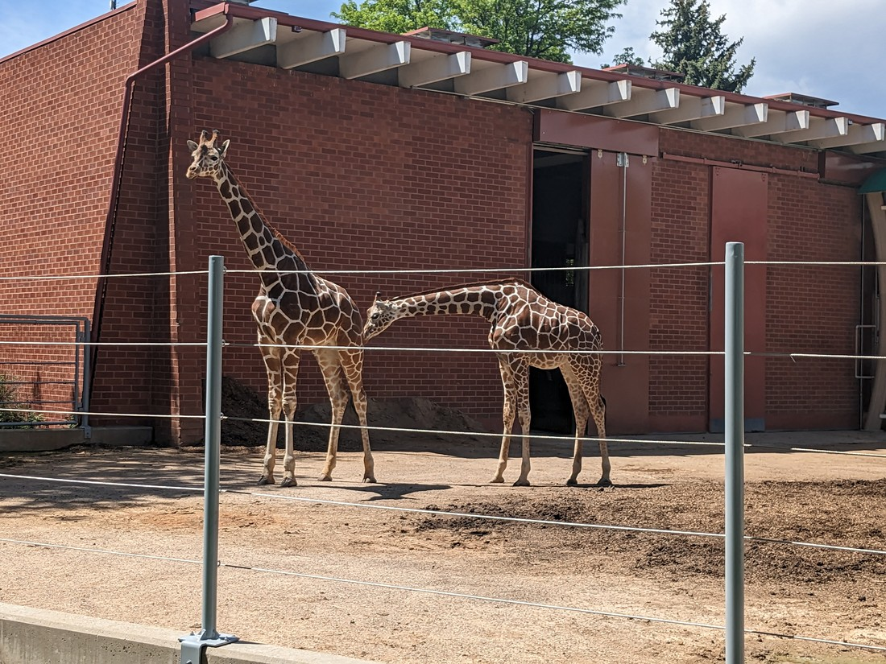

> Well, except for one moment when one giraffe sniffed another giraffe's butt

We walked past the bear enclosure, but unfortunately none were home.

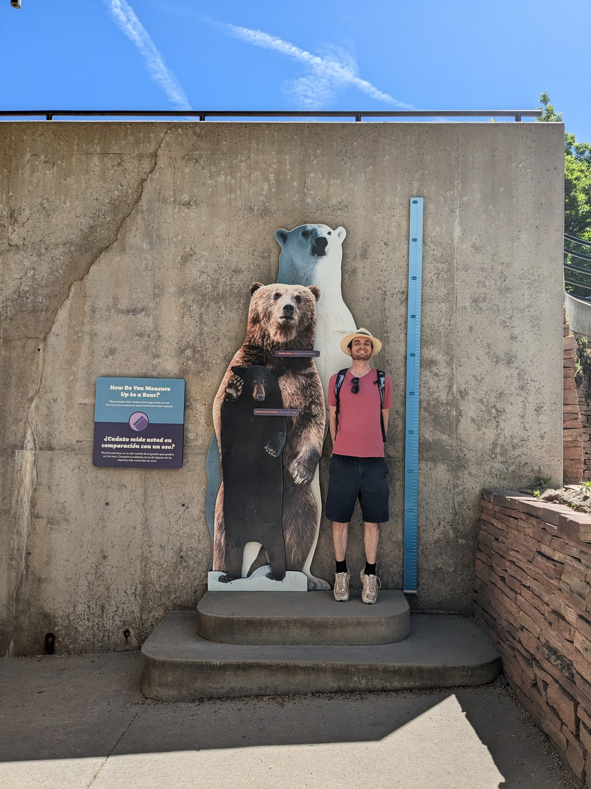

> Woo - taller than a black bear (when I'm on tiptoes)

There was a reptile / tropical house that greatly resembled some of the Vancouver Aquarium.

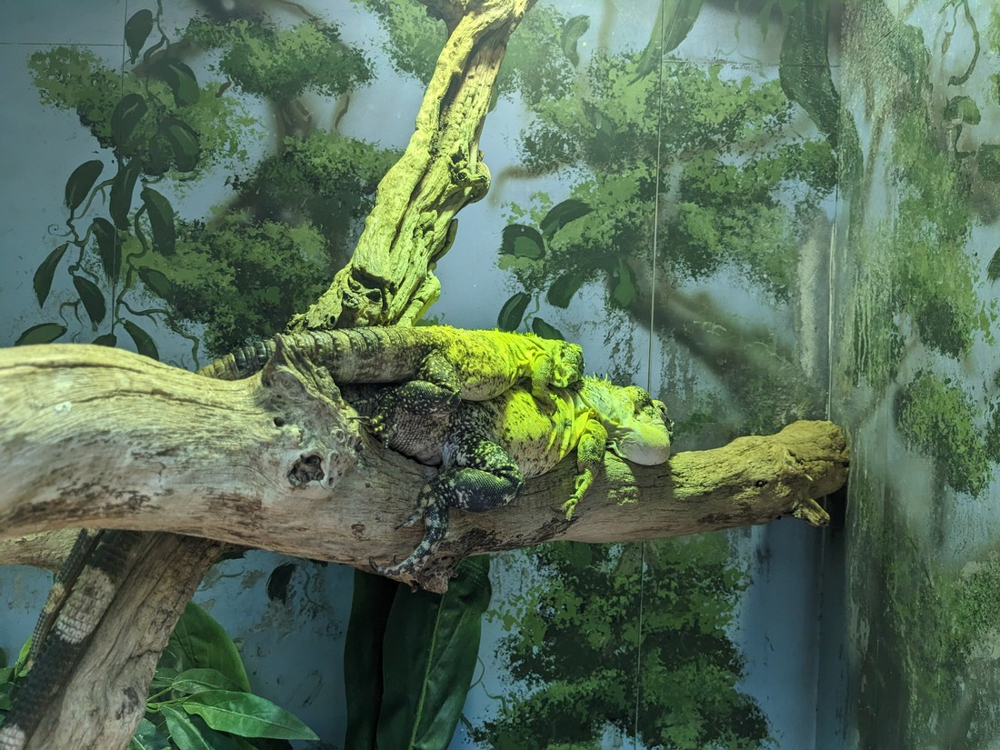

> Best place to take a nap is on top of another lizard

But the trip to that house got cut short because it was time for the seal demonstration (which just happened to be nearby).  The seal demonstration involved one seal at a time being let out, and given instructions or gestures by its trainer.  It would then copy that gesture or complete that instruction immediately.

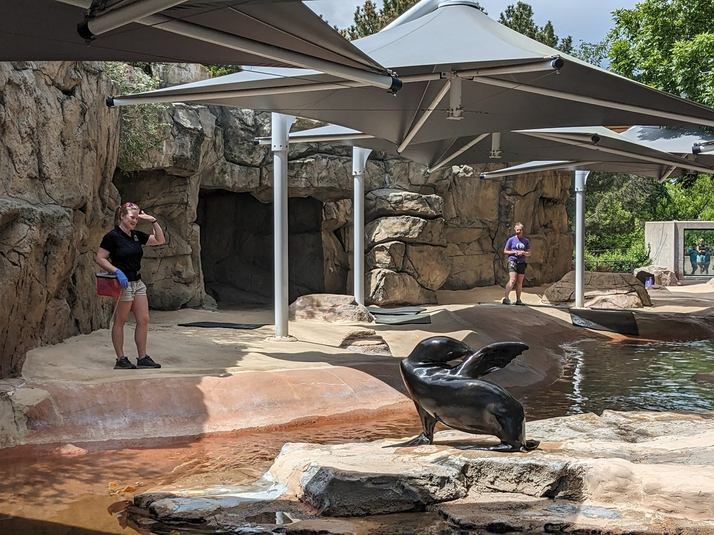

There were a lot of different instructions proving that seals are really smart.  Well, at least when they're hungry because after every instruction the seal was rewarded with a fish.

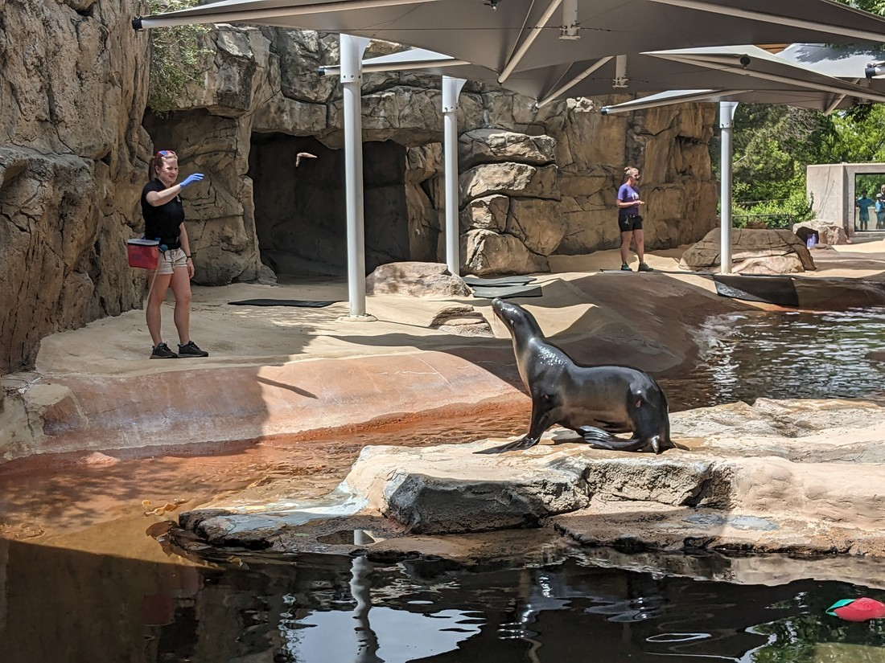

We returned to the reptile / tropical house to continue round.  They apparently had sloths but we could not spot any in the trees inside the dome.  But this trip was also cut short because we had to rush to go see the lion demonstration.

The lion demonstration turned out to be a bit different.  I wasn't really expecting there to be trainers interacting with the lions - they are cats after all and we all know it's not really possible to teach a cat tricks.  Instead we found that seven pig torsos had been placed around the enclosure.  The "demonstration" was just feeding time for the lions.

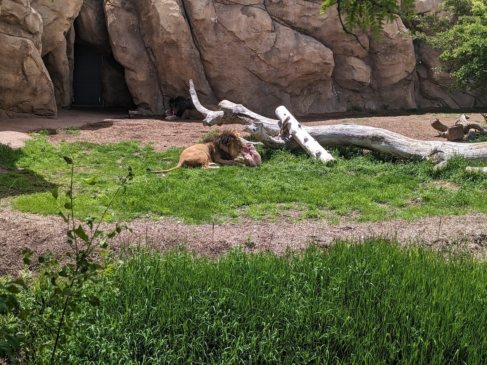

Like the seal demonstration, a girl shouted out facts and info through a microphone while we all gathered (jockeying for position).  She told us that apparently the lions hadn't had carcasses this large in three years.  This was because the lions had been having some bad stomachs recently.

When the four lions came out they each went for a different piece of pig.  Three grabbed their torso, and carried it somewhere shady.  Then each just kind of lay there trying to tear pieces of meat off the bones.  They certainly weren't making it look easy.  We must have watched for twenty minutes and it didn't seem like any lion made much of a dent in their meal.  I guess they're just not used to having to work this much for their food.  And I suppose they're probably also not used to having this much food available.

Eventually we did move on.

We found the tiger enclosure, but it was all the way in the back sleeping.  We found some animals which looked suspiciously like common donkeys, but apparently were a rare animal we hadn't heard of.  We also saw camels:

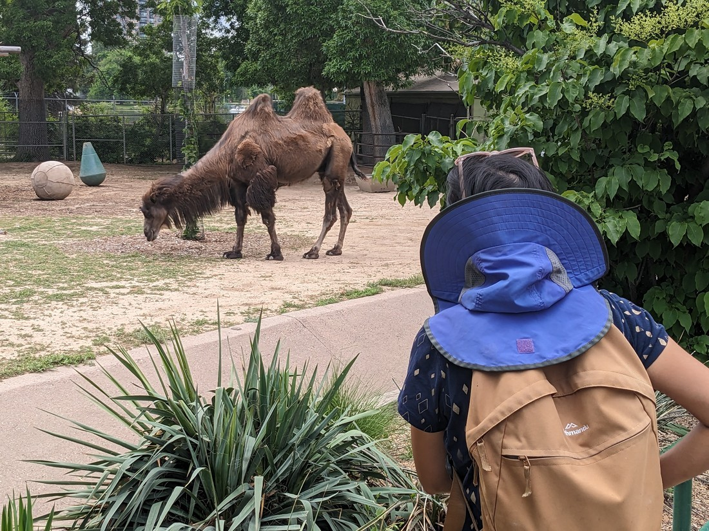

> Two very wobbly humps

And elephants:

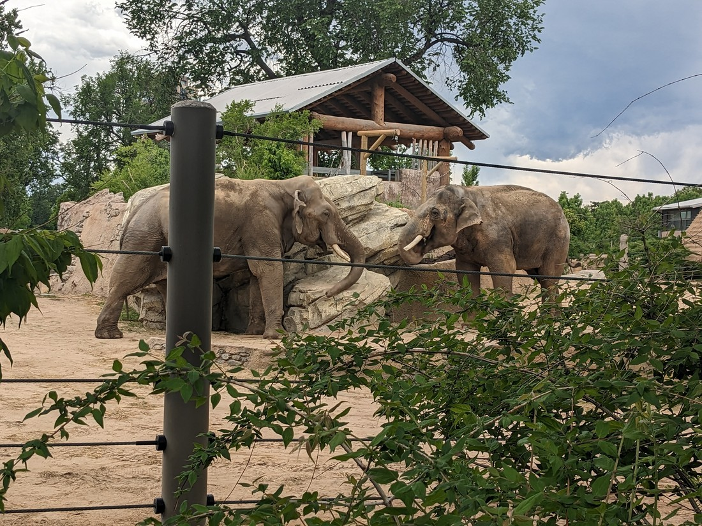

> They were alternating between chewing the same stick

There were also bongos, rhinos, and kangaroos.  In another building we found a really loud bird that was so loud I thought it was a kid screaming.  Unfortunately, the fishing cat shared this same building, but he mustn't have minded because he was also fast asleep.

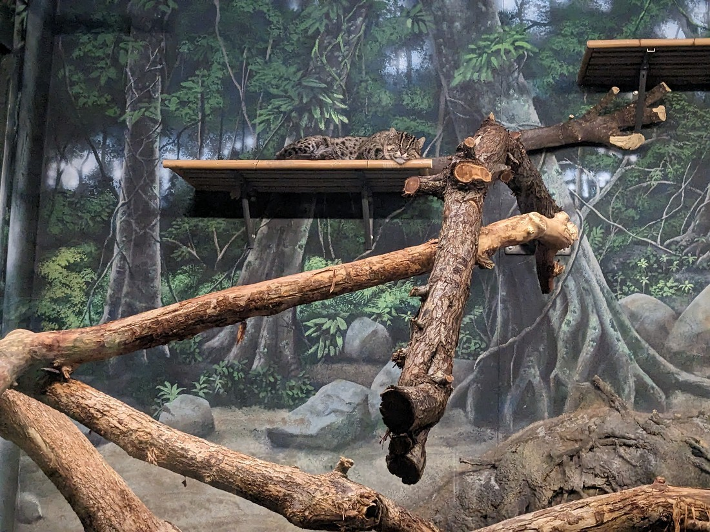

> Just like a housecat

Then we came to the hippos.  Even though they are one of the big five animals in Africa, I'm not sure I've ever seen a hippo before.  And if I have, certainly not this close.  I know they are one of the most dangerous animals and should never be approached.  Despite their apparently slowness and cute roundness, they can be territorial and fierce.  And when it yawned you can tell exactly how dangerous it could be:

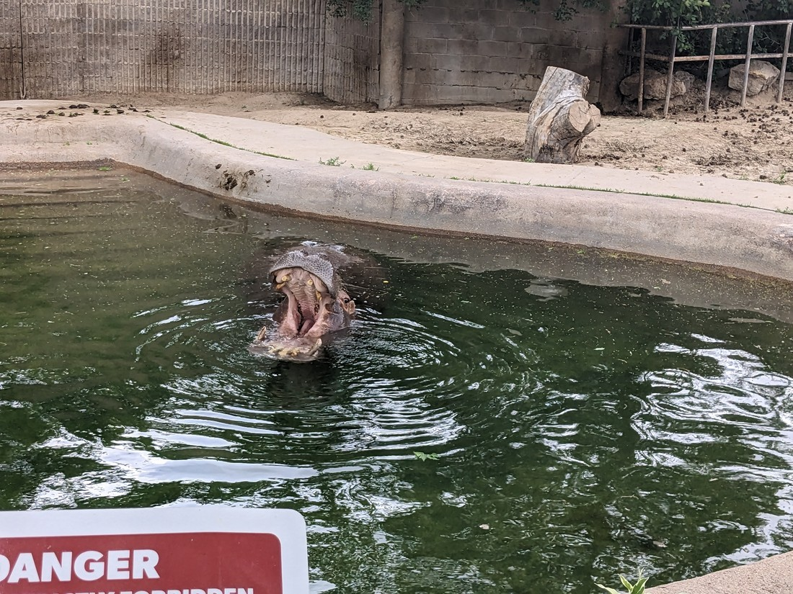

> That's a very strong jaw and some very large teeth

We continued on and saw a magnificent flock of flamingos.  Surprisingly, in the bird section there was also a New Zealand Kea.  Then we checked out various monkeys, before having to rush back to see the elephant demonstration.

The elephant demonstration turned out to be a bust for two reasons.  The first was that none of the elephants were interested in participating.  A huge audience had gathered in an arena at one end of their enclosure, but the elephants were all chilling out elsewhere.  The other reason was that it was stormy and the demonstration had to be called off due to lightning risks.

As we trudged back to where we had left, we stopped by the hippo again.  It was out of the water and walking round.  In fact it walked right up near the observation barrier.  Unfortunately we were standing quite far away so we didn't get a good look.  As it stood there with its bottom against a wall, we wondered what it was doing.

Then it started flinging its tail in circles.

Then the people closest to the observation barrier started fleeing.

I don't know much about hippos but I now know they like to use their tail to fling their poop all about.

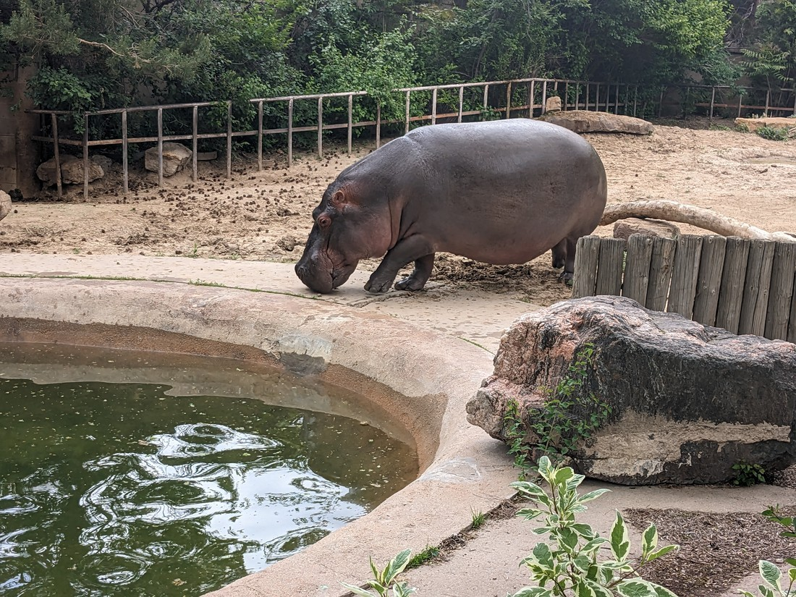

> Don't look embarrassed - you know what you did!

As we continued on we also dropped by the lions again.  They had basically all stopped eating and were just lying in the shade again.  This one had collected three of the seven carcasses and was guarding them by one of the glass windows, so all the little kids could get a good look.

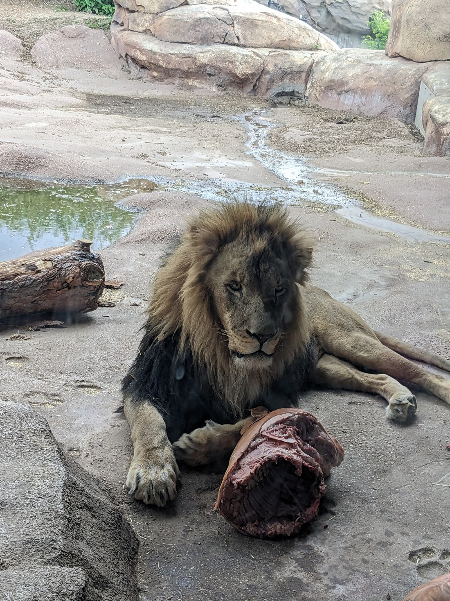

> It's the circle of life.  Lions eat pigs.  Pigs eat carrots.  Carrots eat lions.

We'd now been at the zoo quite a while, but we weren't ready to leave.  Instead we started going back round and checking out animals to see if they were now doing anything interesting.  The tiger had moved closer, but was still just sitting / sleeping.  Betty commented that it seemed silly to build such a huge enclosure for a tiger.  It had one of those things where the tiger had a bridge and it could walk over the visiting public, but Betty doubted a lazy, sleepy tiger would ever expend the energy to get up there.

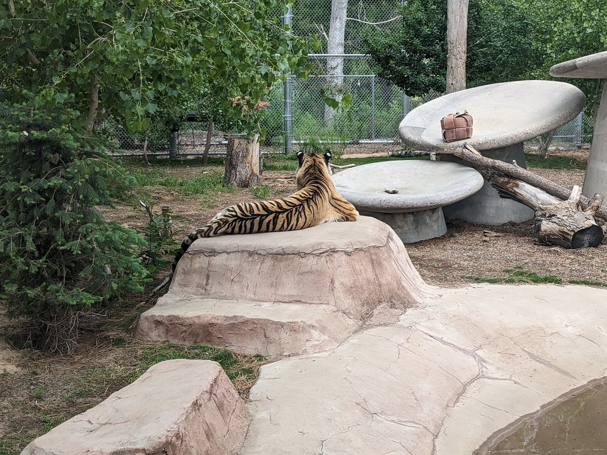

The sloth was still nowhere to be found.  A volunteer shared of photo of a new baby sloth but the mother had gone into hiding from all the noisy children.  I really couldn't blame her - there had been a lots of school kids around.  Although, now that it was after lunch and the weather had got a bit stormy there did seem to be a lot less people about.  The penguin demonstration was up next and we had no trouble getting a good viewing spot.

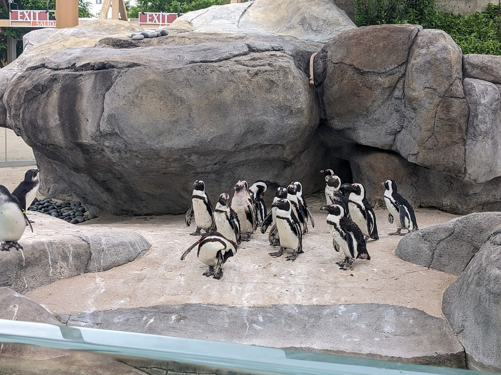

The penguins had gathered an hour early in the middle of their enclosure.  Clearly they knew what was going to be happening shortly and wanted to be ready.  The demonstration for them also turned out to be just a feeding.  We were quite amazed at the size of the fish being given out, and sometimes tossed (and caught).  The announcer girl (who had been the same announcer for each demonstration) explained that there wasn't really a limit to the amount of fish a penguin could choose to eat.  It all depended on how much fish they felt like eating as sometimes they need to build up large reserves because they know they won't be eating in a while.

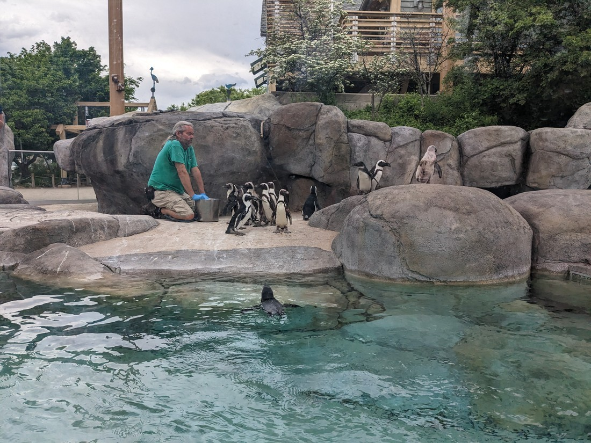

> Apparently the penguin in the water was very young and very new to swimming - but loves it so much it won't ever get out of the pool

After the demonstration we just started going round the zoo once more.  I didn't mention this earlier but despite basically just being a loop, it wasn't always the easiest zoo to navigate around.  This was partly because it was huge.

We wanted to check out the fishing cat again so we went to the monkey house.

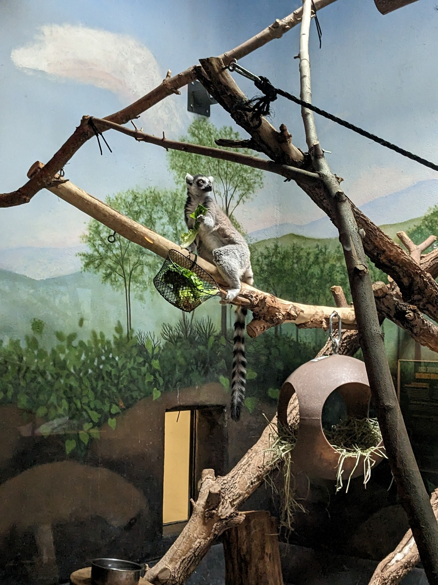

But it turned out that wasn't where the fishing cat was.  We had remembered wrong.  Instead it was over near the elephants, which was 70% of the way across the zoo.  So a lot more walking.  When we did get to the fishing cat, it was awake and walking about - so that was nice to see.

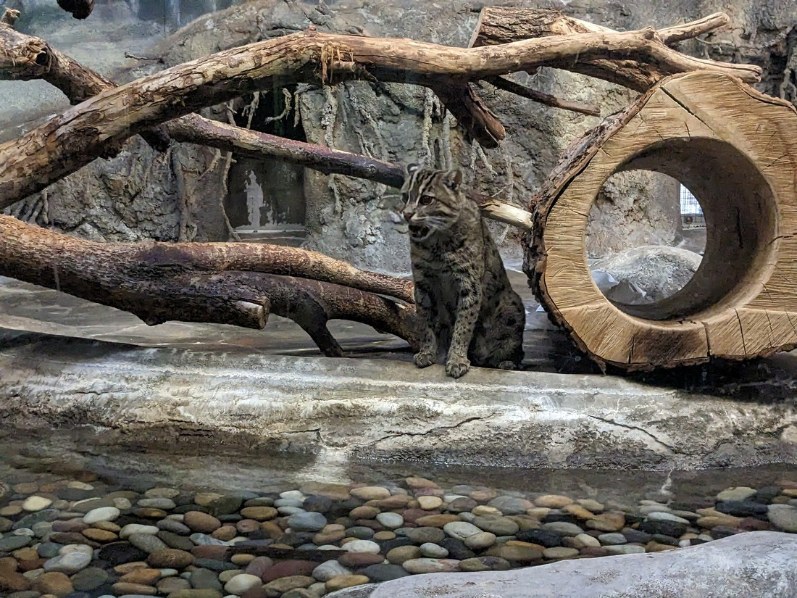

By this point we had been at the zoo for five and a half hours.  We hadn't eaten, we hadn't really even stopped for a break.  This doesn't really count as a hike but we must have clocked up some serious mileage just walking from enclosure to enclosure.  And while we did stop frequently to admire the animals, we were never off our feet.

We checked on the tiger one last time and amazingly he was up.  And not only was he awake, he was UP.

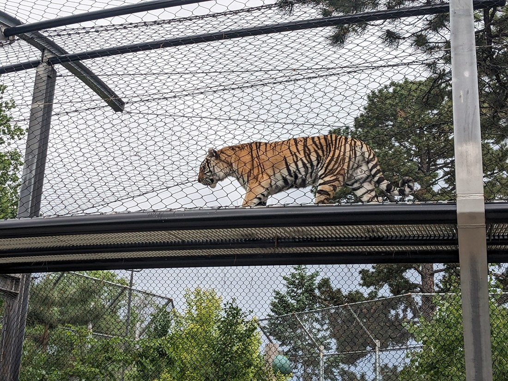

Turns out he does use that bridge that Betty doubted he would ever use.

I had plans for stuff to do after we went to the zoo, but there was now no time.  We had spent too much time looking at animals.  But this certainly wasn't a bad thing.  Our options was to either stare at animals or stare at trees so animals sure seemed the nicer alternative.

So we just ate and then returned to our accommodation, partially fighting rush hour traffic to cross half of Denver.  Overall a very nice day.

The zoo was not perfect.  Many of the enclosures were uninspired.  More often than not the animals were just lying in the shade or sleeping - though I can't really blame them for that given the weather.  There were also no bears to see, which had been a highlight of our previous trip.  But overall we did get a pretty good deal of entertainment and exercise from a couple of zoo admissions.  Whatever the zoo lacked in other ways, in made up in sheer hugeness and variety.

We'll certainly welcome further opportunities to see animals, but this might not be so readily available.  There aren't any more large cities on our itinerary until we get to Calgary so there might not be many zoos or wildlife parks about.  Hopefully we'll be able to see some wild animals, but those are never guaranteed.  They also can be dangerous if not viewed from a really far distance.  But either way, we do intend to see more animals on this trip.

