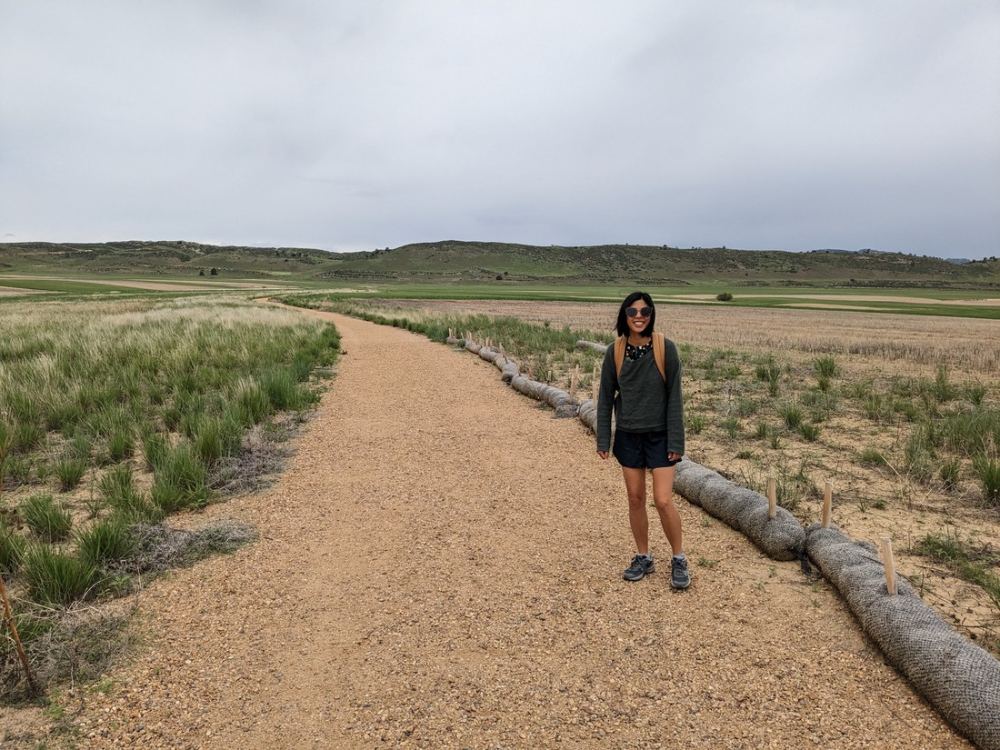
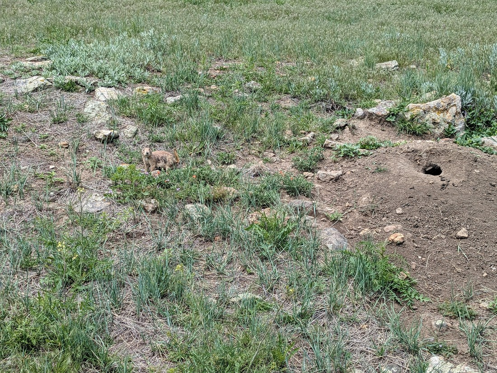
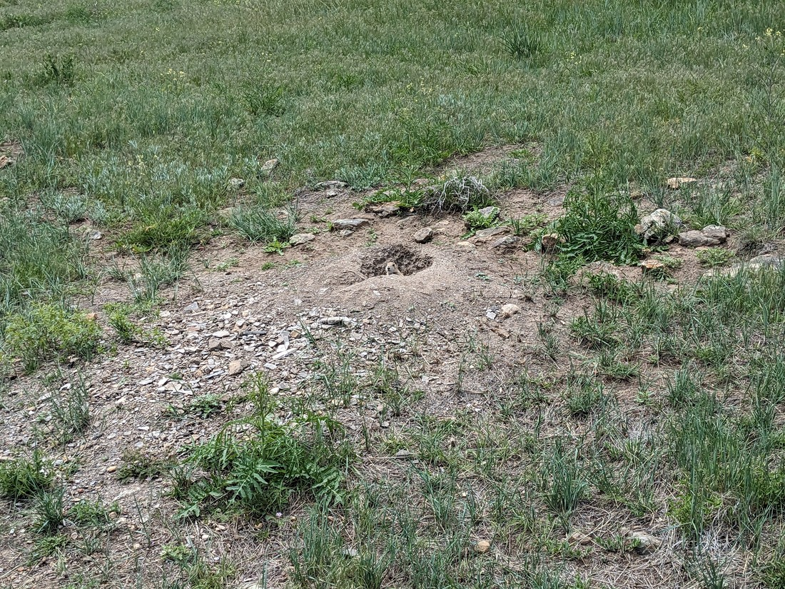
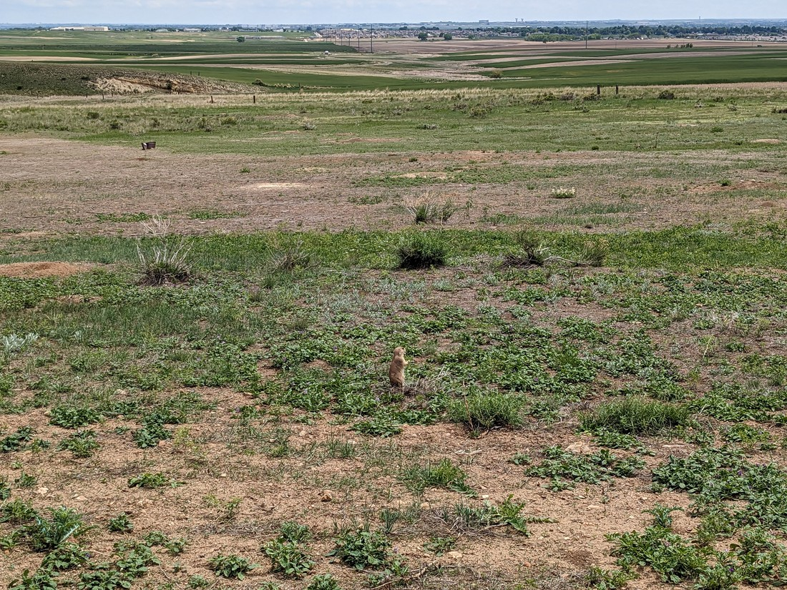
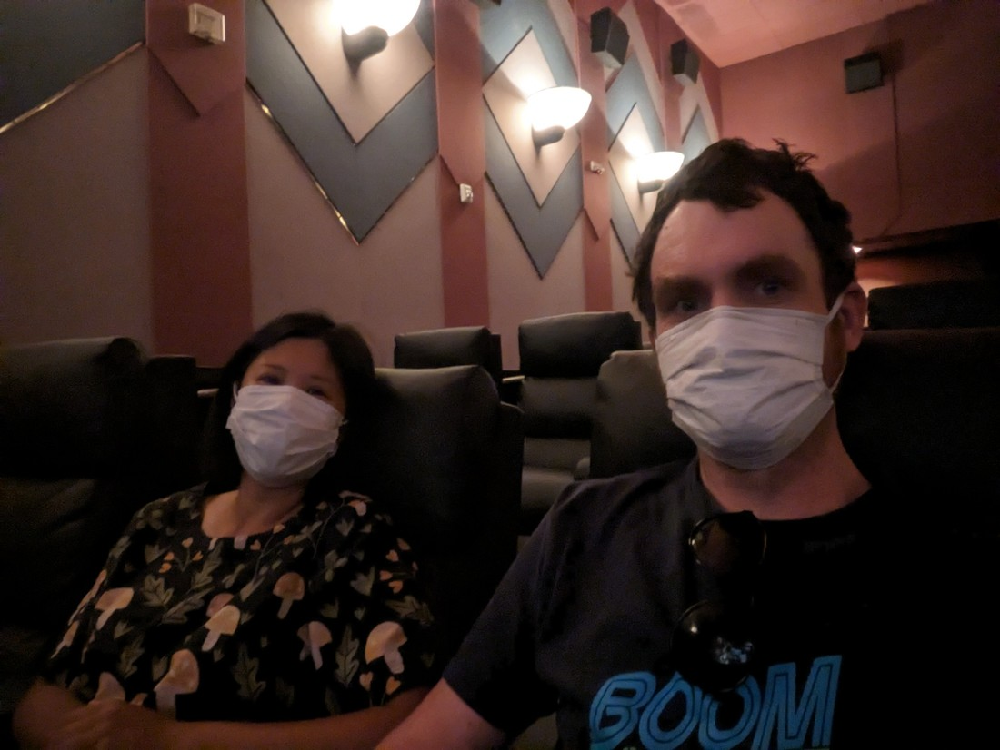

We could have returned to Rocky Mountains National Park today. We didn't have an entry pass, but we wouldn't need one if we could get there early enough. However since we booked the cheapest motel we could regardless of location, we ended up being quite far away. Plus we couldn't leave early otherwise we'd miss our complimentary breakfast.

So, what did we want to do today? We didn't have far to travel. There also weren't any notable parks nearby. We were also quite tired because our cheap room in the cheap motel was right next to a busy road, which kept us awake for part of the night. This was a bit unusual - we were getting used to sleeping through loud noises. Especially when our motel rooms have fridges - those often aren't all that quiet.

Betty found a walk called Prairie Ridge. It wasn't known to be a very good walk - just a trail through some flat grassland. But the deciding factor for us was that prairie dogs could be seen from this trail. We hadn't had any luck anywhere else at seeing prairie dogs so we thought we'd try here.

As expected, the trail was rather straight forward. It also was a very cloudy day. We made sure to pack our rain jackets into our backpacks, as they might be needed.

This definitely wasn't a popular walk either - we saw no one else on this trail. After 20 minutes of walking we were getting to a junction with another trail and we hadn't seen a thing other than grassy fields. But at this junction we spotted some things.

Hooray - prairie dogs. The description of this walk wasn't a lie. There were dozens and dozens of them here.

They certainly weren't used to seeing people. Some would let out an alarm-like shrieking sound when we were nearby and most would disappear into their burrow when we got close. Sometimes a lone prairie dog would let out a squeal and do a gesture like it was trying to start a Mexican wave. And sometimes it would work with another copying the action and so on, creating a sort of actual Mexican wave.

There was an info board nearby which explained that prairie dogs were important for the ecosystem. However one the main reasons it gave was that they could be preyed upon by larger predators like coyotes. I'm not sure the prairie dogs would be too happy to know that the only reason humans are letting them live here is so that they might eventually become snacks for a hungry wolf.

After we returned to town and had lunch, we decided to do something different this afternoon. We went to the movies.

We saw an animated movie about various spider-themed super-powered heroes. Sounds silly, but it ended up being really good.

The movie tells the tale about Gwen Stacy, a girl who moonlights as a web slinging superhero. She can't tell her Dad about her secret life, as her Dad is the police captain trying to capture the mysterious Spider-Woman (Gwen). It all culminates in a moment where she is forced to reveal her secret to her father and her father tearfully chooses to continue and arrest her anyway. Even though its a silly movie about people getting super powers from spider bites, I was really engaged with Gwen's tale. She is given the choice to team up with another band of heroes and leave her father and everything behind, and I truly empathised with her.

Then after all that, we got some opening titles. Turns out the story of Gwen Stacy was just a bit of backstory before the real story started. But at that moment, I felt like I had already seen an entire movie - even though it had only been 15 minutes. And the following two hours didn't disappoint either.

And that's it for today. Not every day is going to be full of amazing walks and sights. Overall I think we spent this day rather well considering the relatively few options in the area. Tomorrow we'll be leaving Colorado and starting our trek back towards Canada. What will find on the way? Not sure yet.
