Today was another day of Luke and Betty driving.  We're heading north through Wyoming to South Dakota.  Something we did note while travelling is that Wyoming is a rather boring state to drive through.  Lots of grass, basically nothing else.  It is the least populated state in the USA and I certainly believe that.

Our destination today is Mount Rushmore.

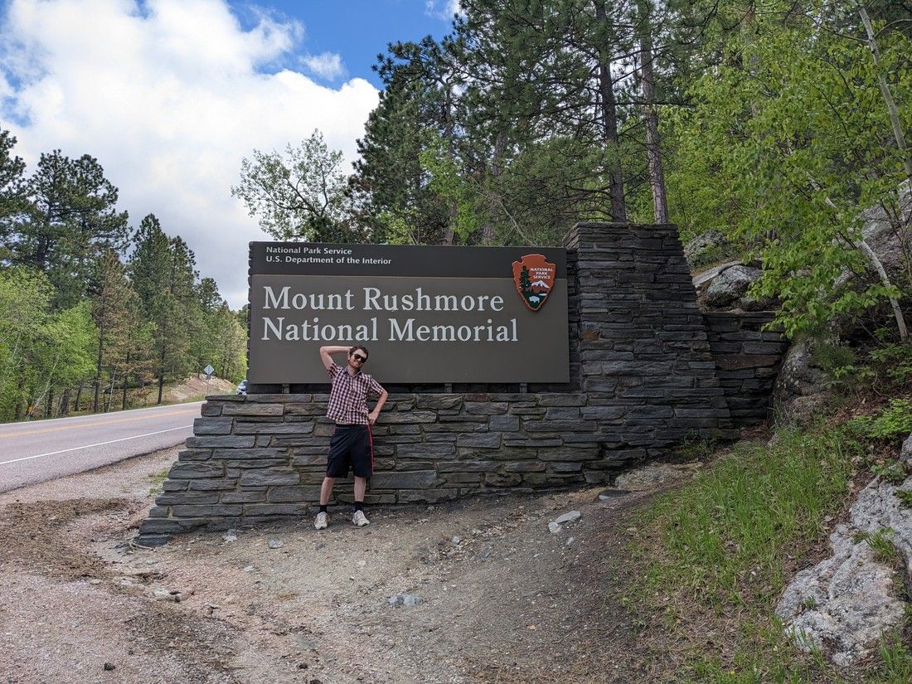

> I'm trying to vary up the poses.  As a result this one just came out weird.

We hoped that our National Park pass would get us in since it was a "National Memorial" but no such luck.  However entry was only $10, and surprisingly it was an annual pass entry so I guess we can come back whenever we want.  Anyway, here's the view of the mountain:

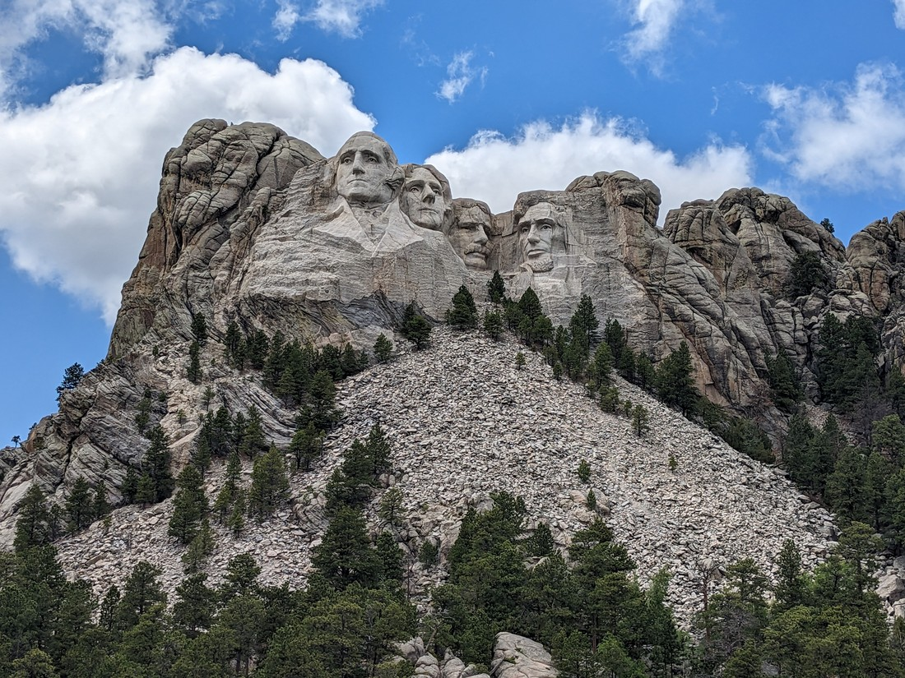

And here's proof we were actually at the mountain:

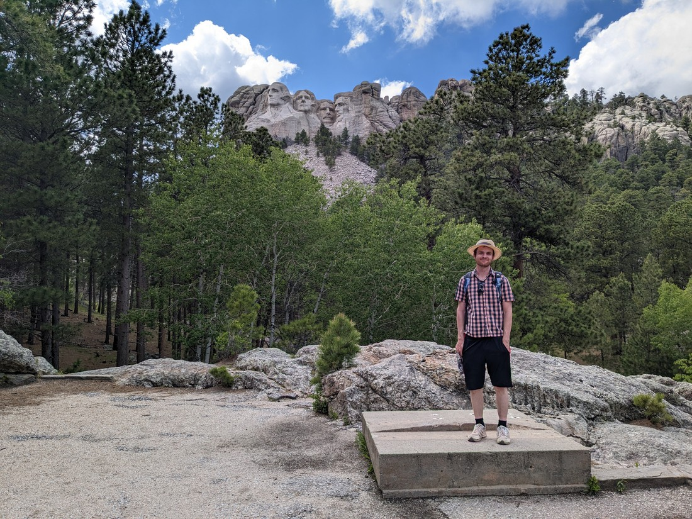

And here's the view of the mountain from the studio with the artist's miniature version of the mountain:

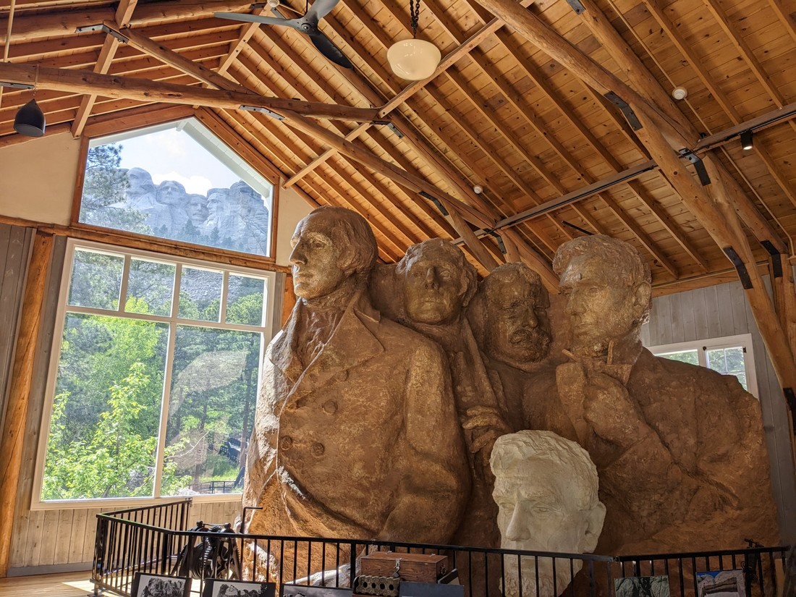

> Which was built after most of the faces had already been carved

We spent a fair amount of time here but other than a short walk there wasn't much to do.  As we left we decided to find something else to do before retiring for the night.  There was a scenic drive nearby with some walks so we headed there.

Upon arriving at the scenic drive we found out that it was part of a Custer State Park which would set us back $20 USD.  Price seemed a bit steep considering we just wanted a short activity for an hour or so.  Instead we drove back to a pull-out that we had just passed which looked like it had an umarked trail that might lead to a viewpoint.

It wasn't quite a viewpoint, but there was a bit of a view.

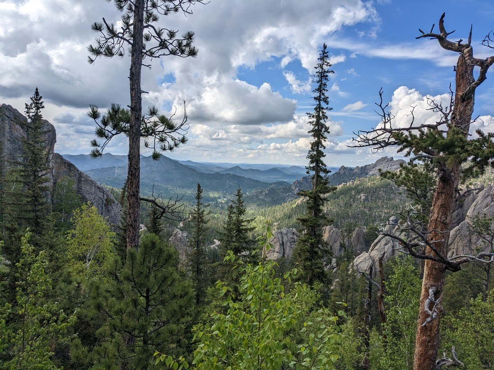

In fact, the trail kept going.  And having nothing else better to do right now we kept going.  Eventually we found ourselves at a junction which finally told us what trail we were on.  It was called the Sunday Gulch trail while the other trail was the Sylvan Lake trail.  Both were part of Custer State Park and both were only supposed to be walkable if you'd paid the entry fee.

We decided that it was unfair.  We honestly had no idea what trail we'd been walking.  We decided to keep walking and we did the Sylvan Lake loop trail.

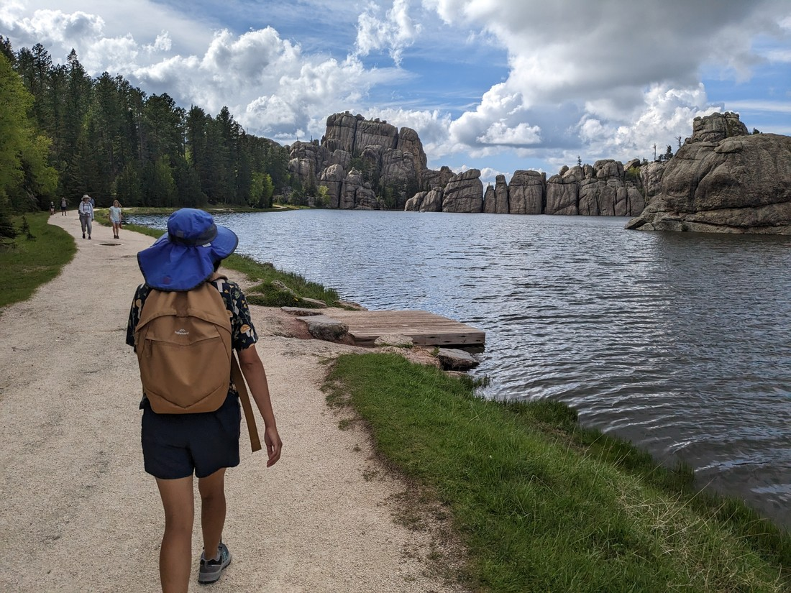

> In for a penny, in for a pound

The lake was interesting.  One side was really rocky with a bit of a dam in the middle.  The rest of the lake had no embankments and therefore we were pretty sure it was man-made (kind of obvious since we'd already seen the dam).  There were also a lot of people about.

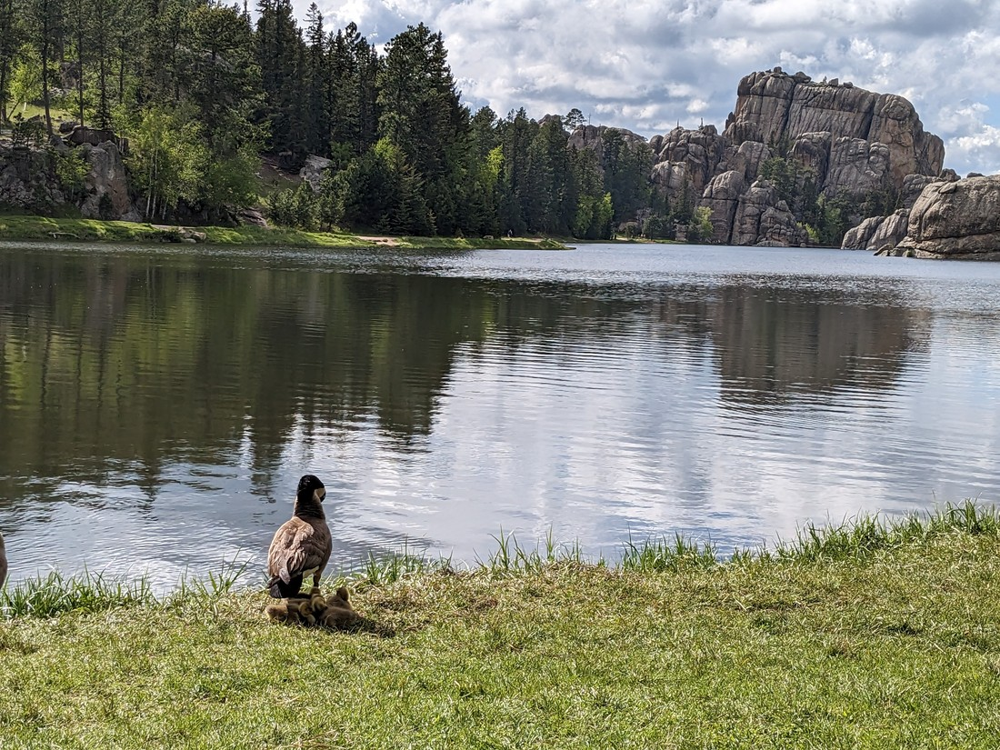

> They're hard to see but there's ducklings in this photo.

Did they all pay the entry fee - or did they also know the sneak-in route that we took?  When we were going to leave the lake area, an old couple asked us where the path we were taking lead.  We didn't want to give away that we'd snuck in.  Perhaps these septuagenarians are actually park rangers in disguise.

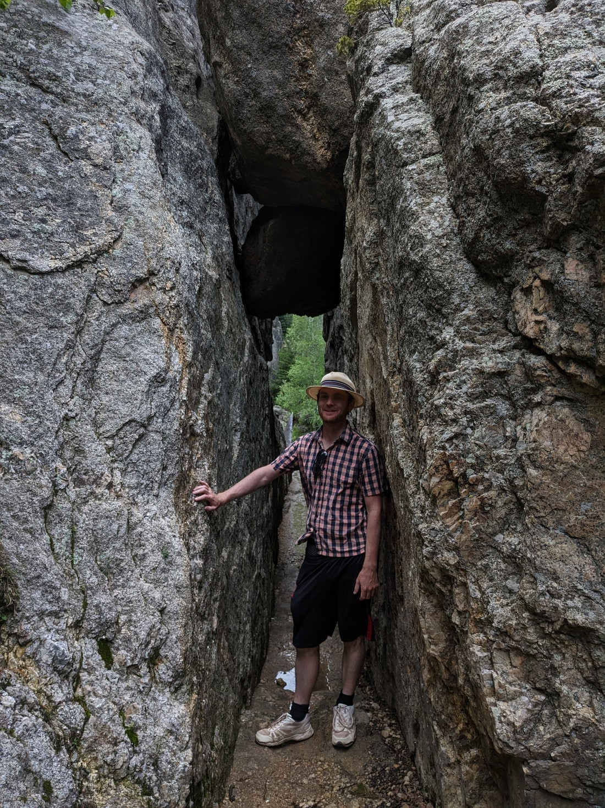

But obviously we were fine and didn't get thrown in park jail.

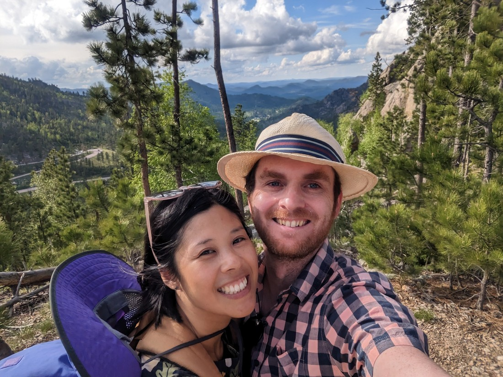

> Two criminals relishing in their crime

At our accommodation we found that it had a games room and so some foosball and pool ensued.  Betty once again proved that she is a natural at pool and kept sinking balls at a faster rate than me.  Of the five games we played, only once was Betty not able to sink all her balls first.  Unfortunately for her, she then went on to foul in three of those four games and so despite her clear dominance, Betty only won a single game.

Then later that night at 8:55pm I asked Betty, "Want to go out again?"  Mount Rushmore is lit up in the evenings and we both figured we may as well see it.  The lighting ceremony would start at 9:00pm but it was only ten minutes drive away.

As we walked out of the parking building at 9:07pm, we could hear the ceremony still taking place.  "Oh good," we thought to ourselves, "we're right on time".  But the ceremony would go on for at least another half an hour.  And it was the most American thing that I have ever seen.  Lots of patting themselves on the back.  But that being said, we did learn things.

We knew Washington had formed the country.  We knew that Lincoln had won the Civil War.  But we didn't know much about Jefferson and Roosevelt.  We learned earlier in the day that Jefferson was mostly responsible for the abolition of slavery (or at least he got the ball rolling).  However the ceremony cited the main reason is that he bought the Louisiana Territories (basically the whole middle of the continent) from France.  And what about Roosevelt?  He seemed to have the least deeds.  Well, we learned that basically he actively embodied a lot of the qualities that American's hold dear and therefore was obviously very popular.  I guess that's a good a reason as any.

When the mountain was lit up (while the whole audience stood to give a rendition of The Star-Spangled Banner having been preceded by a rendition of America the Beautiful - so American) it looked something like this:

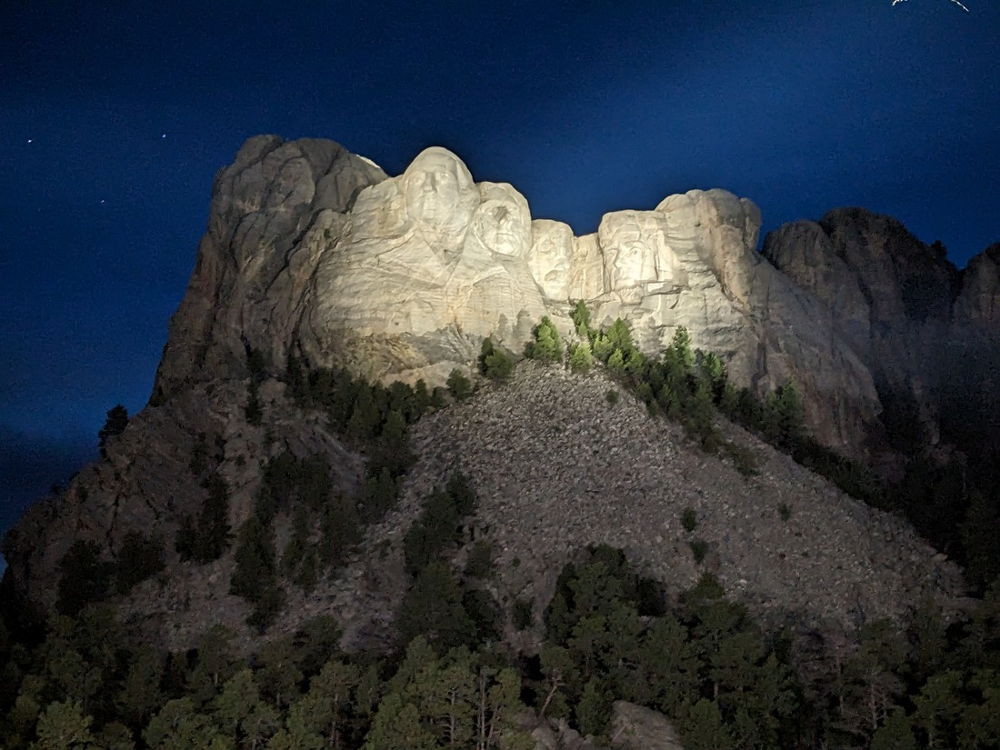

Honestly, a bit disappointing.  I guess it makes sense that floodlights would bleach the whole mountains so that the intricate detail could no longer be noticed.  And since the lights came from a long distance away, a lot of innocent bats were caught in the beams.  In several parks so far we've read about the problems of light pollution and ways it can be minimised.  Seems like Mount Rushmore is just ignoring those problems (so American).

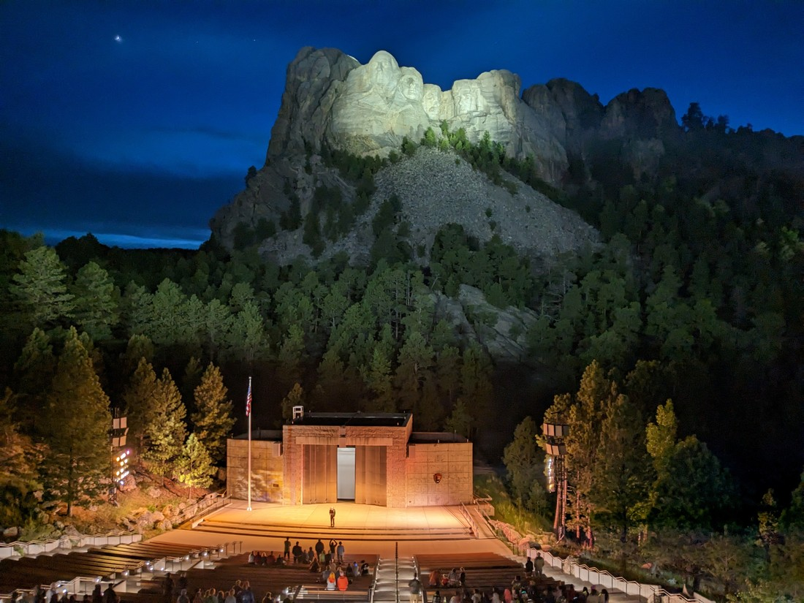

At the end was a flag folding ceremony by military veterans in the audience (so American) and we were told to make our way home safely because there was a storm coming.  A very ominous way to end the night, but the announcer wasn't wrong.  We'd been hearing thunder after the national anthem.  We drove back to our accommodation watching the sheet lightning in the distance.  Fortunately I think the storm went right past.

Mount Rushmore really feels like a landmark that ought to be visited.  And having now visited it, we can't really disagree.  But that being said, it is a long way from most other things in the USA.  The only reason we were here was because it was close enough to our route from Colorado back to Canada.  And it was a good day today, so I'm glad we could make it.

