Today we're travelling to Badlands National Park where we're going to be camping the night. Despite its National Park status there doesn't seem like a large number of things to do in Badlands so today we have to find things to occupy our time before we drive there.

First we went on a short walk to a viewpoint overlooking a thing called a Stratobowl - which was the name of a launch site for several record breaking altitude balloons in the thirties.

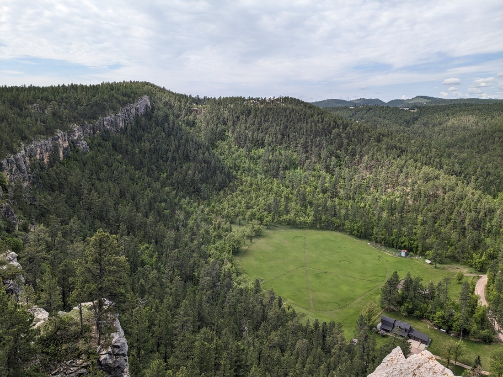

In was a fine walk and a fine view at the end, but that was about it.

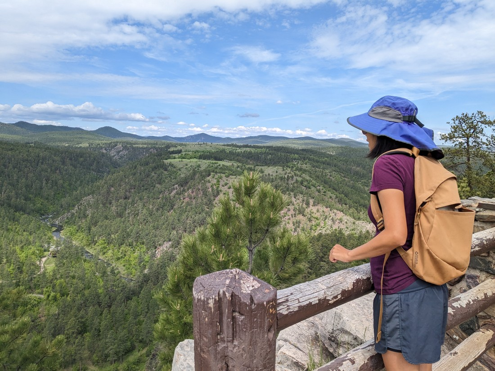

Then we went on another walk to a Buzzard's roost viewpoint. Betty had to ask what a "buzzard" was - to which I confidently replied with the wrong answer (more on this later).

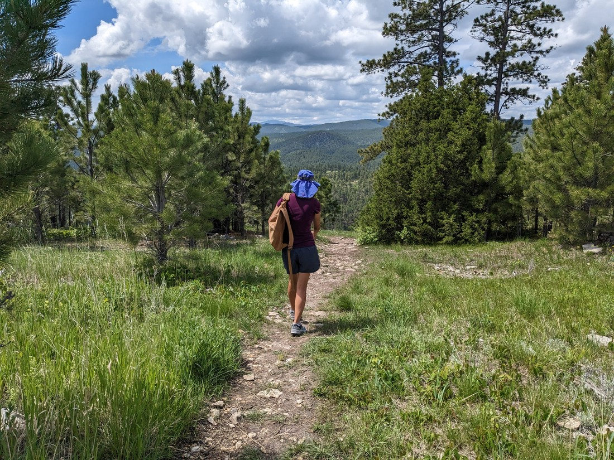

This walk wasn't all that nice. The trail wasn't well kept, although there was a better view at the end.

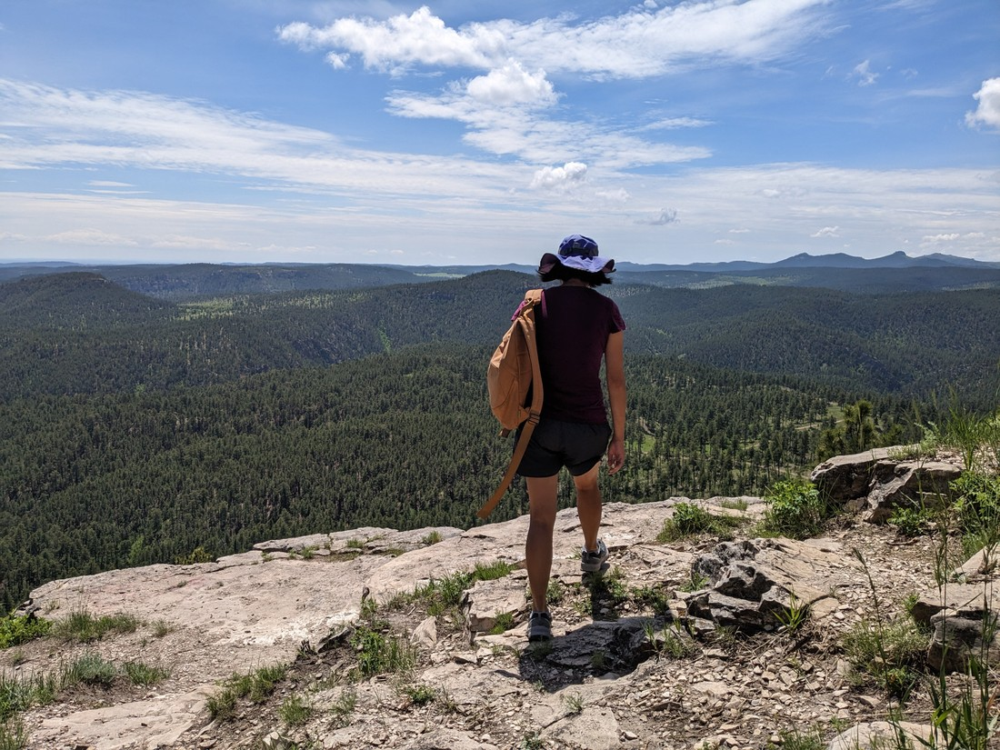

Well, a better view if you like your view to have lots of trees.

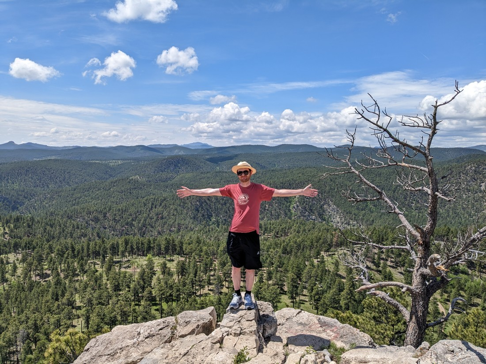

> So many trees

We took a different route back and got kind of lost. This was because there were more trails on the ground than there were on the map, which got me confused.

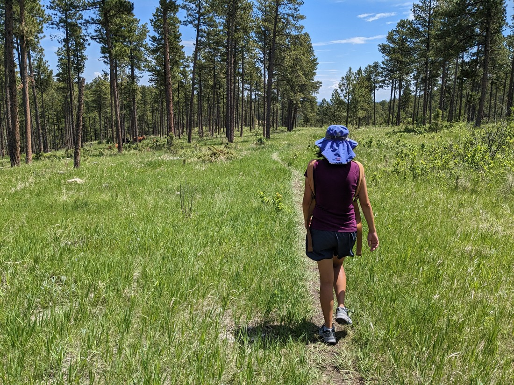

> Definitely wasn't due to my map reading abilities

So those were a couple of perfectly okay walks. Not exactly memorable. So for the afternoon we decided to do something different. We headed to a place called the Reptile Gardens. It was a wildlife park that specialises in reptiles. Upon arriving we learned that the alligator show was about to start. So we figured we'd go see.

Inside a kind of arena was a stony area with a fake stream. In the stream was a few real crocodiles but weirdly, lying around the arena were fake crocodiles - made out of concrete perhaps? I believed this for almost five minutes before I learned that crocodiles just like staying really still if they have nothing better to do. So instead of five crocodiles with 15 fakes, it was actually 20 very much alive crocodiles.

The performer came out and gave us some facts and jokes about crocodiles and alligators. Some of them we learned (like the bit about staying still) and some we did not (still can't tell alligators and crocodiles apart). He then announced that he was going to show us how to defend ourselves from crocodiles. But first he needed a volunteer.

Fortunately by "volunteer" he meant a crocodile. After walking round the arena, he made his decision and pulled a crocodile out of the water by its tail. This was quite the sight to see. He then dragged it along the ground. When he stopped, the crocodile (clearly unhappy with the situation) decided it wanted back in the water so it started walking, leading to this amusing sight.

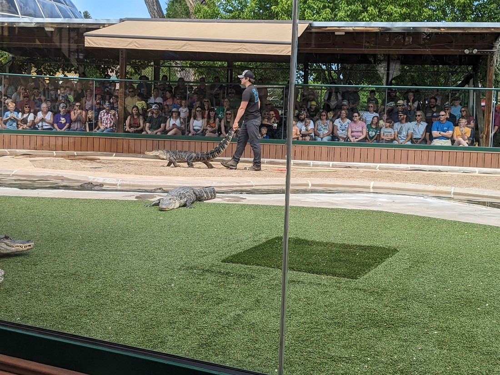

> Like walking a dog, but terrifying

Eventually he pounced on the poor crocodile and showed how they can be restrained. However, while doing this a number of other crocodiles decided to come out of the water while he was in the middle of explaining. As a result the performer was constantly looking around, regularly stopping mid sentence to keep an eye on these crocs, and occasionally scold them.

After this demonstration it was now time for feeding. He explained that to ensure the crocs didn't think of him as food, they have been trained to associated "food" with a green bucket. He then proceeded to bring out the green bucket and start tossing bits of chicken from inside it.

This resulted in all the crocs doing their best to swarm him for food. And since they are unpredictable and dangerous animals, he was literally running around the arena to avoid them. At times it looked like he'd cornered himself but he always did managed to find a way out. It was really quite frightening to watch. Obviously we knew he was fine. This show is done five times a day. We knew the danger here was part of the show. But even knowing that it certainly did make our hearts race.

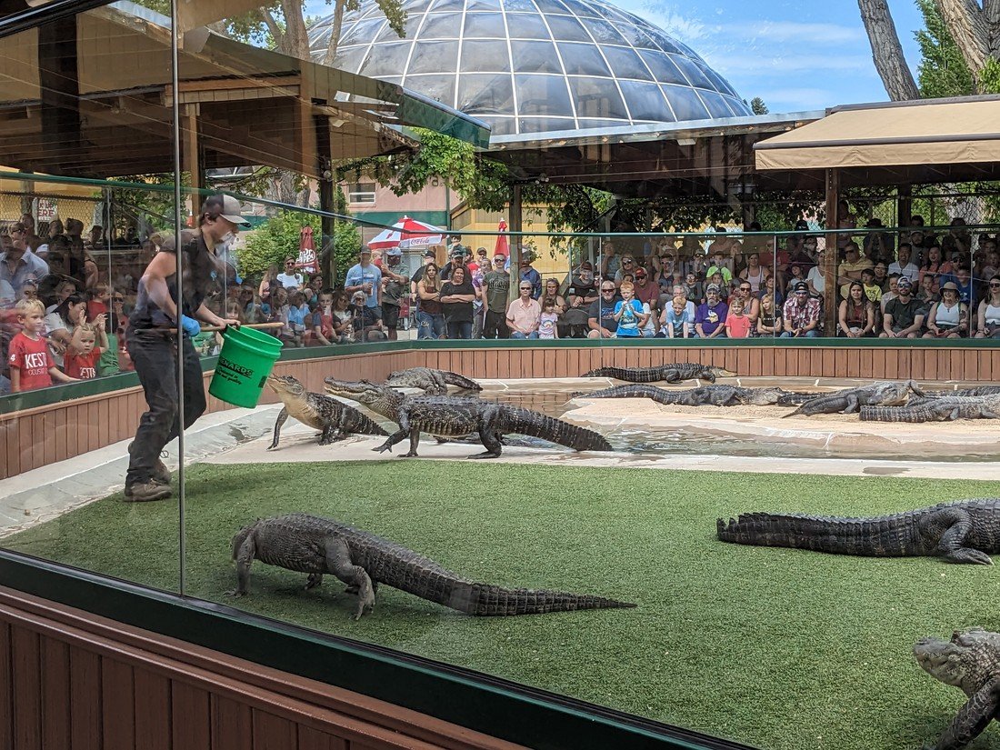

After the show, we were all given the opportunity to pat an alligator. But it turned out to be a really small one. Nonetheless we took the opportunity as this was something we might never get to do anywhere else.

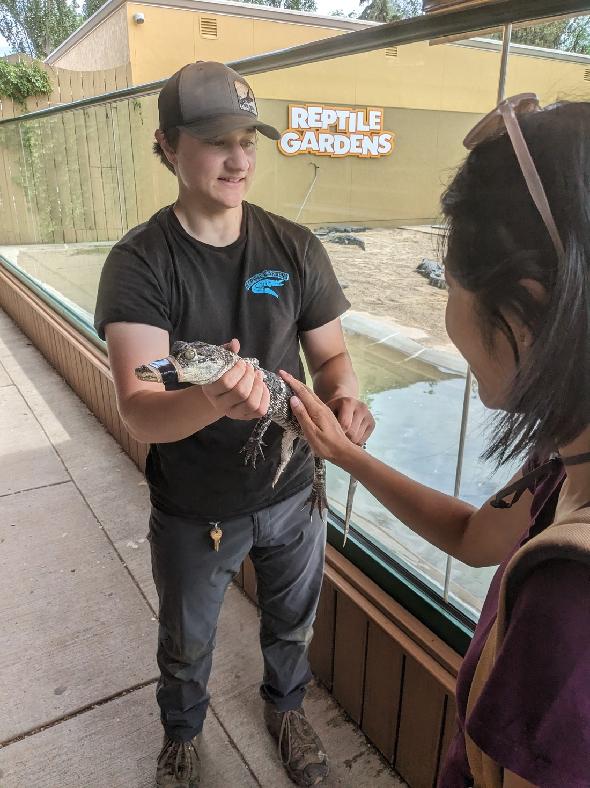

> Definitely looks like it doesn't enjoy the petting

We then started around the park, and the first area we came to was for birds. This was where I learned that I was wrong to tell Betty that a buzzard was like a vulture - they are actually closer to a falcon. We also got to see a magnificent owl up close:

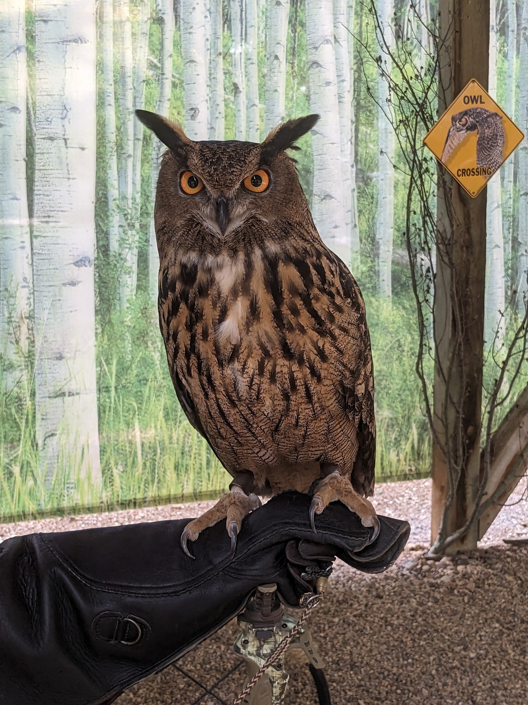

We even got to hold a bird, although that bird ended up just being a pigeon:

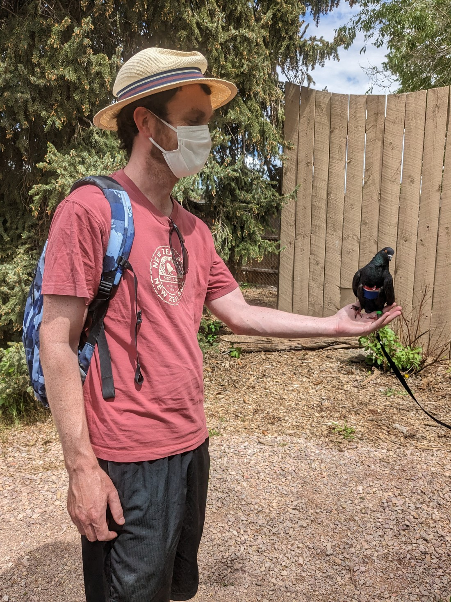

> Probably was a special pigeon - I wasn't paying that much attention

There was this guy who probably ought to be scary, but just looked ridiculous:

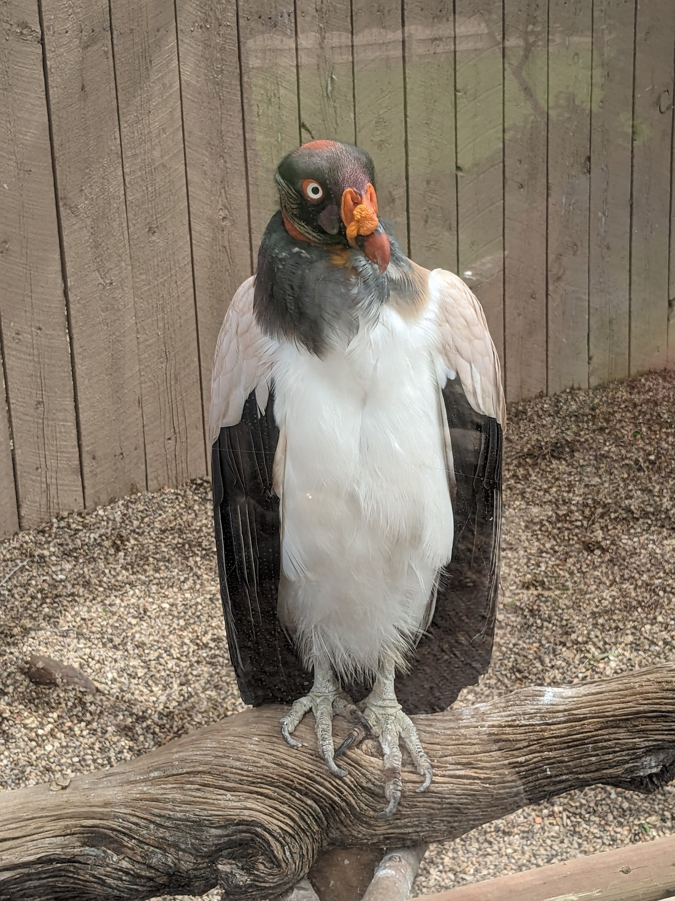

With the alligator show and the birds, a whole hour had passed and it was now time for the snake show. This was done by the same performer as in the alligator show.

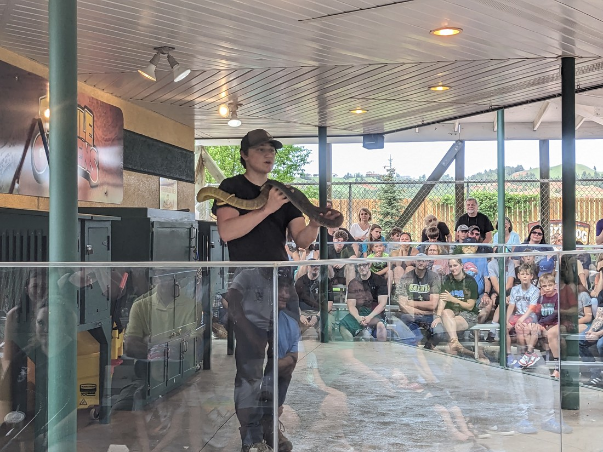

The show had the same mixture of facts, jokes, and danger as the alligator show had. He would bring out some especially dangerous snakes that everyone wants to see. Then he would toss them on the ground, where they would naturally be unhappy and lash out at him.

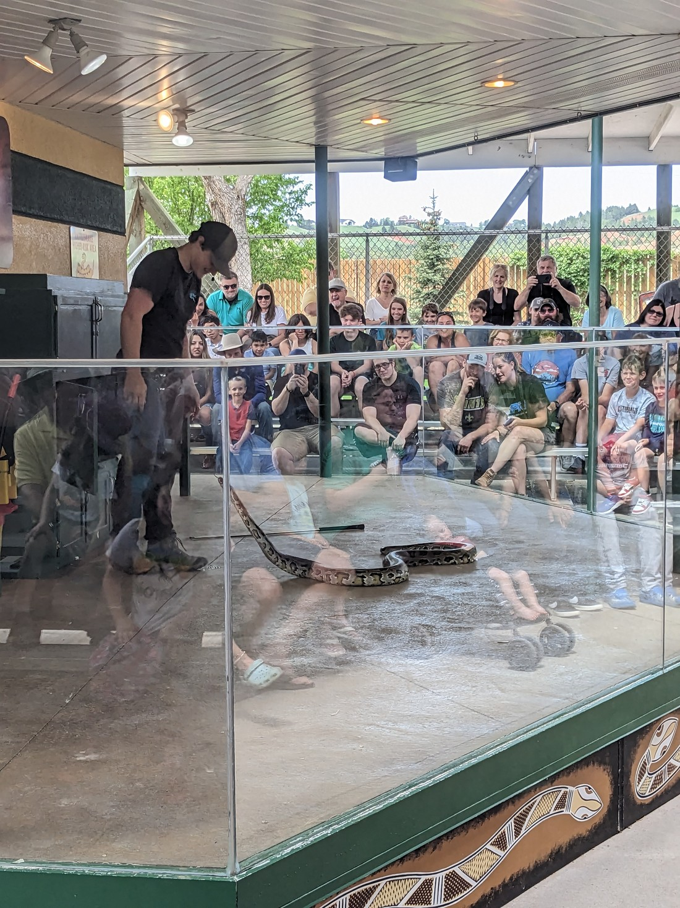

It was quite an interesting show too. We learned that a cobra's hood only appears when the snake wants to appear frightening (which occurred when it got dumped out of a dark box into a bright open stage). We also got to hear what a rattlesnake sounded like. It wasn't what I imagined - more of an ongoing noise than a rattle. We also learned that there are four families of reptiles - the lizard/snake family, the crocodile family, the turtle family, and the tuatara family. Turns out a tuatara is very unique in that it is the only reptile of its kind.

And like the alligator show, we also got to pet a snake at the end.

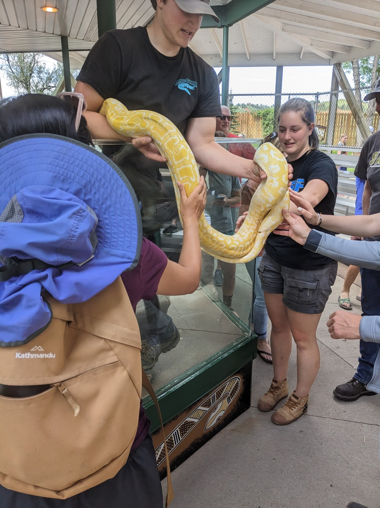

> Even Betty (who is notoriously anti-snake) gave it a pat

After the show we continued on round the park. The next area was dedicated solely to prairie dogs.

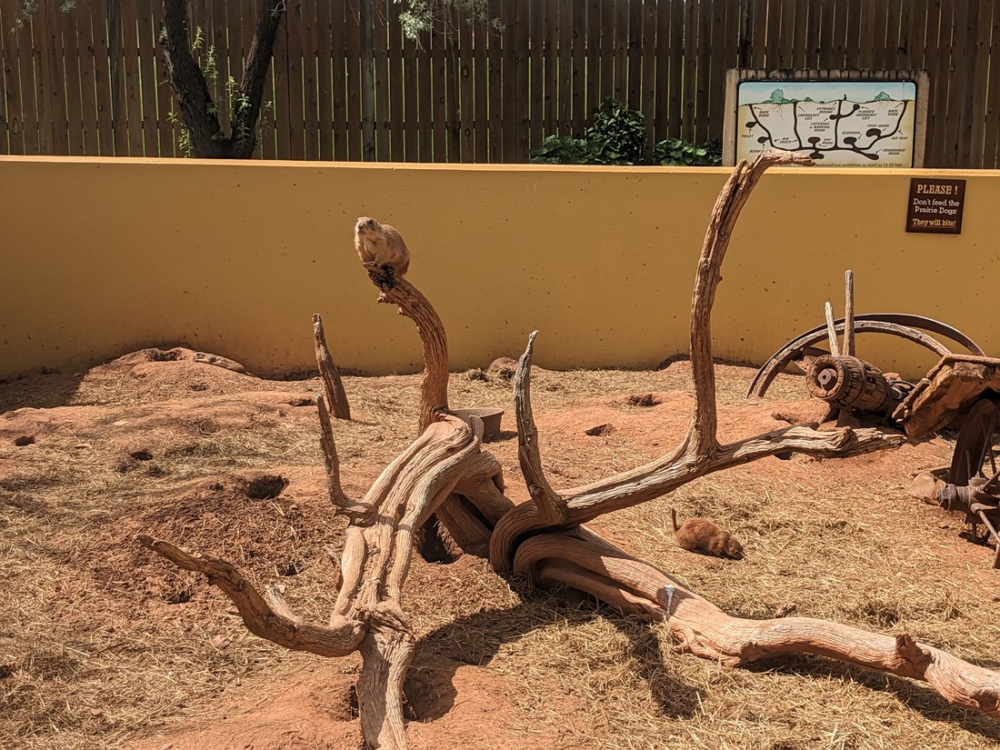

So turns out we didn't need to do that walk two days earlier - we could have just seen them here. And here they were much more okay with being surrounded by humans and so we were a lot closer. But that being said, there is always a bit more of a thrill when seeing a wild animal rather than a captive one.

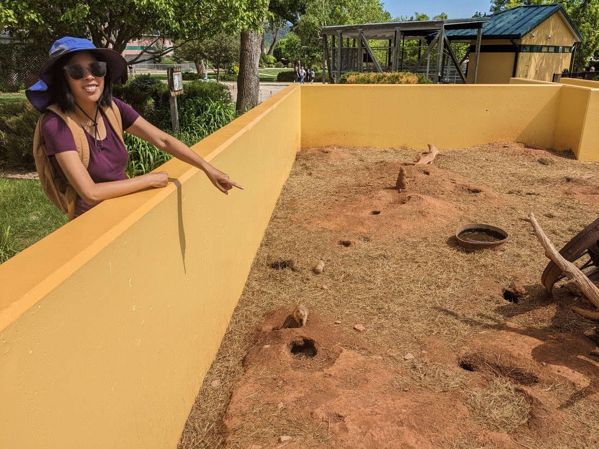

The next section actually had reptiles - a large number of turtles and a number of large turtles.

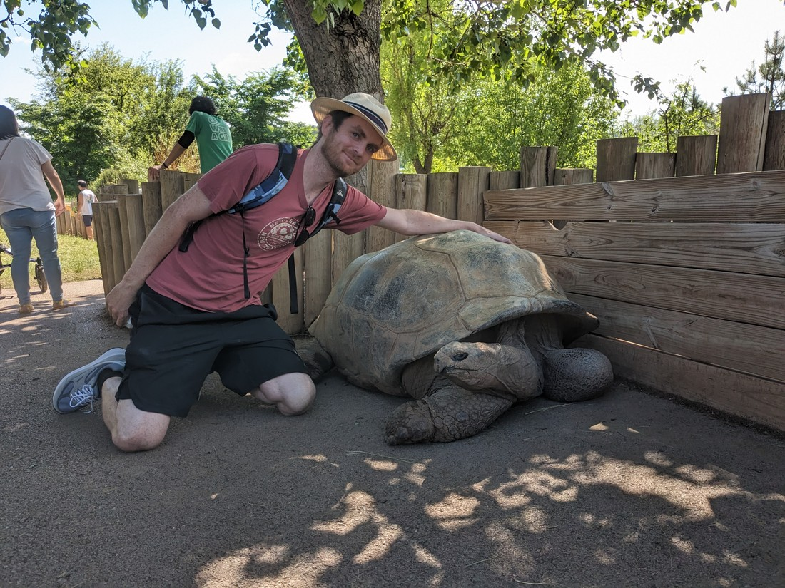

Then it was back to non-reptiles. There were several kookaburras, and then this lone bald eagle:

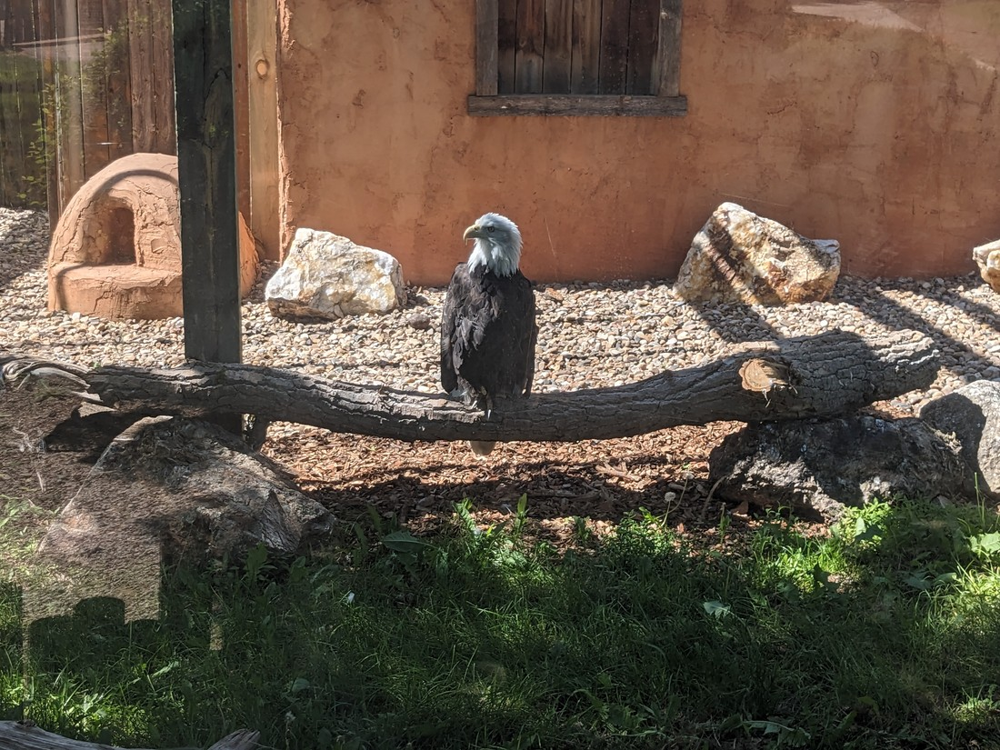

> Don't know how they got their name - it doesn't look "bald" at all

At this point the alligator show was starting again, as it was on every second hour. I convinced Betty we should watch it again, because it was quite the spectacle.

The jokes didn't get as big a laugh this time. This was the last show of the day so there was less audience - but I also imagine many that were there were like us and had seen it before.

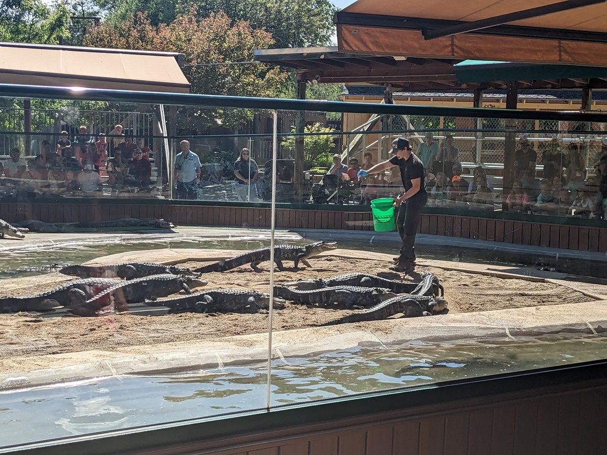

> Still the same sense of possible danger

After this show there was a whole building we needed to check out, which had enclosures for a wide variety of reptiles and other species. Turns out this was where most of the reptiles were. Here was the usual game of "play find the animal" then moving to the next enclosure and repeating.

Getting quite late in the afternoon it was now time to head to our camp site. Like I've said many, many times - this was another good day. We did spend more money than we would otherwise have spent - tourist attractions are pretty expensive compared to just walking outdoors all day - but it was worth it.

There's certainly a lot of touristy things near Mount Rushmore. I guess people have been travelling here for a century, and after they've gazed at the mountain for 10 minutes they probably ask, "What else is there to do?" No point driving all this way just for 10 minutes of staring at rocks. There is one more attraction I had my eye on that I hope to fit in tomorrow, but we'll just have to see. First we have to survive a night of camping, which I look forward to telling you all about in the next blog post.
