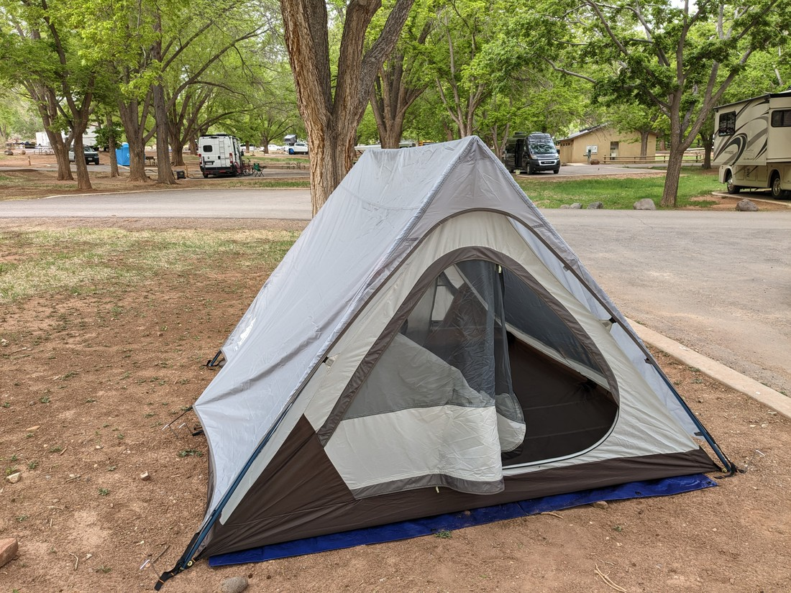
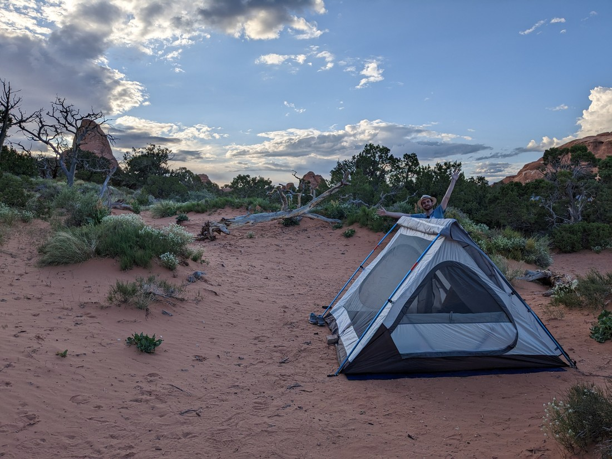
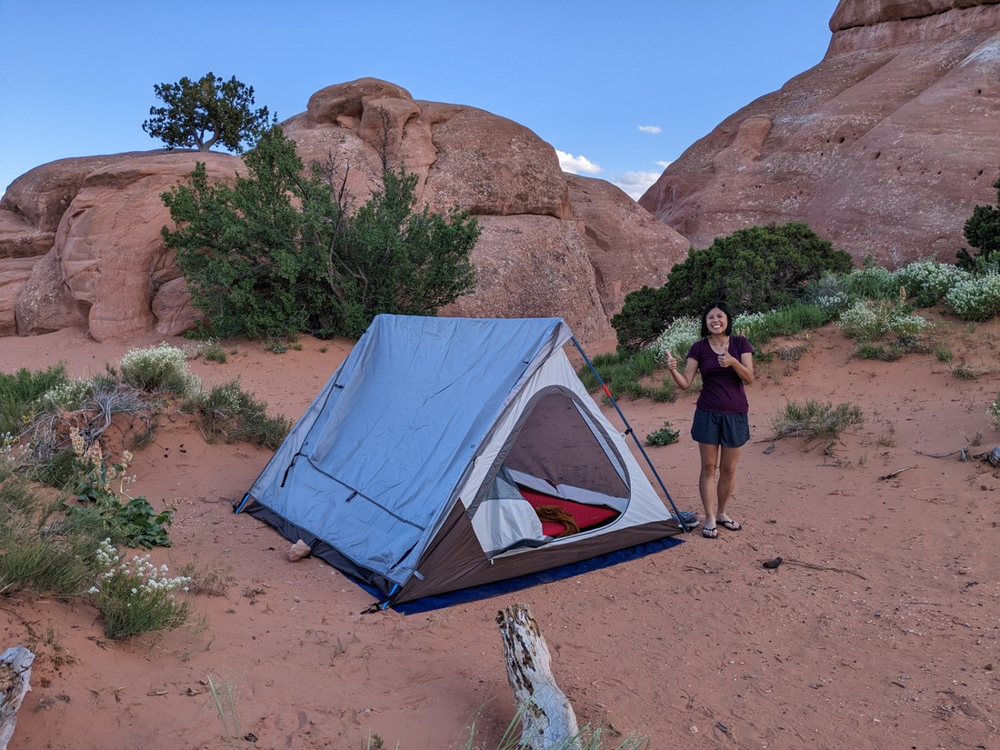
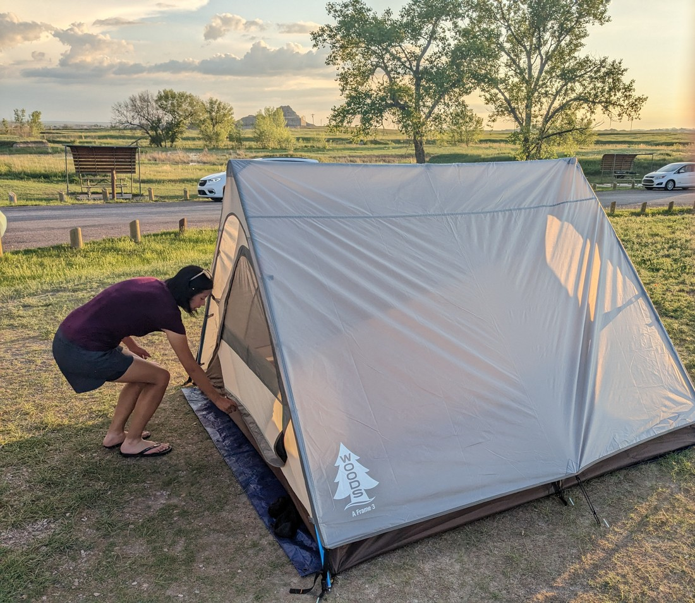

Well, it's about time I wrote this blog post.  I thought I'd hold off posting this until we had done all our camping in the USA.

We ended up only camping in USA three times.  Based on my original plan it was supposed to be five.

One camping stop got changed when we decided not to visit Great Sand Dunes National Park.  This night was rebooked as a motel because we now needed to travel further and a motel gave us more time and options.

The other camping stop was Rocky Mountain National Park.  Looking at the weather we decided not to camp here as the low for the evening was likely to be about 2 degrees Celsius.  We did not feel confident to be camping at this temperature.  Both our sleeping bags could technically handle that amount of coldness, but online reviews disagreed.  So we rebooked this stop as well.

Okay, on to the nights we actually did camp.

Our first camp was in Capitol Reef National Park.  This was a nice camping ground in a bit of a canyon with plenty of trees giving a lot of shade to the campground.  There wasn't any visual barriers between campsites but otherwise it was a really nice place to tent in.  We arrived late, put our tent up, and basically just got ready for bed and then slept.  The next morning we woke, breakfasted, and went on our way.

One not so ideal feature of both the Capitol Reef and the following campgrounds is that while they had water, they did not have showers.  This meant we had to give ourselves a bit of a sponge bath to clean ourselves up a bit before bed.  Of course, I had not thought this through so I had to resort using an old sock to remove a bit of the sweat and sunscreen (and dust that had stuck to the sweat and sunscreen) that I had accumulated throughout the day.

Our second night of camping was in Arches National Park.  This campground was more scenic as it was amongst the bright red rocks that Arches is known for.  There was also plenty of space on each site and plenty of bushes and rocks that meant it felt a lot more private.

Immediately we did have a problem.  Sand.  It was nice to look at but you just know it's going to get in everything.  The sand also caused an issue when we tried to peg down our tent.  The tent pegs didn't stay secured when in the sand, and below the sand was clearly rock or something as the pegs would just come to a stop when pushed into the ground.  Oh well, the tent stays up pretty well by itself so we can probably get away with not pegging it down.

The next issue with this campsite popped up about half an hour later.  Betty was in the tent and reported that ants were now crawling all over the inner.  Looks like we had pitched our tent right next to an ant hill.  Well, since we hadn't pegged anything down we could just move our tent somewhere else.  Problem solved.

The final issue occurred at about 10pm.  After the sun went down, the wind started getting progressively stronger and stronger.  I guess the campground was on a bit of a ridge and the wind just blew right through our site.  It was pushing one of the tent walls a lot.  This is when we realised how important those pegs were.  Without them, really the only thing stopping the tent from blowing away was us sitting inside it.

As the wind increased, I resorted to lying along the wind facing side to hold the tent down.  Sleep was going to be impossible with the tent flapping all over me.  And with our fly flapping loose in the wind as well, I don't know if sleep was going to be possible for Betty either.  As I lay there I also begun to worry about the structural integrity of the tent.  How strong was the materials and the seams? Would our tent hold up in its current state?

Eventually I made a call.  We were going to abandon camp.  We weren't going to just wait and pray that the wind died down.  So we stuffed our sleeping bags and partially deflated bedroll into the car.  Then we took the poles out of the tent and wrapped it up into a ball and stuffed it into the car as well.  Then we got into the front seats and wondered what to do.

It was now 11pm or so.  It would likely be too late to find a motel as most motels would no longer have front reception working this late.  We couldn't really go anywhere else and set up the tent, because then we'd be having to try and resurrect our tent in full darkness.  We came to the conclusion that all we could really do was try and get as much sleep as we could in the car.  It would be warm enough, but would it be comfortable?  We couldn't lower our seats back much at all because with everything haphazardly stuffed in, there really wasn't much room.  

This was a low point.  As it became midnight, I sat in the drivers seat lamenting the decisions that had brought us here.  The only solace I had was that out the window I could see the full starry night sky.  Looking at the positives, at least this horrible camping outing had given us the chance to gaze at the stars.

Despite being in a near sitting position, we were both able to sleep a bit in the end.  I woke before dawn and was able to watch the sun rise.  Like in Monument Valley, I'm not sure I see the appeal.  When the weather is fine, sunsets are so much nicer.  Then (as mentioned in a previous blog) this day we just did do some easy walks in our sleepy state and then headed into town.

On the lawn of the visitor's centre we took our our wrapped up tent and refolded it.  It looked fine.  While it looks nice, the shape and design of the tent might be flawed since the large sides might catch the wind and there might not be sufficient guidelines to hold it in place.  However, the real issue in Arches was the problem with the pegs.  We noticed the next day that other people had managed to peg their tents down, so maybe it was possible and we just hadn't tried hard enough.  Fortunately none of the other campgrounds we plan to stay at will be as sandy and rocky as Arches.

As mentioned above, our next two camping nights were cancelled so there was a long gap before we had to camp again.  Our third and final USA camping night was in Badlands National Park.

This one was a bit different because the campground was run by a third party.  The one clear bonus of this is that the campground had showers (although this might just have been because the campground isn't in a desert).  However don't get too excited - the showers seemed like a just a hole in the cubicle wall and had no temperature settings.  I also thought they were "cold only" showers, until I realised that if they were truly cold then I wouldn't have been able to stand them - so I guess they must have been slightly heated.

The campground wasn't sheltered, which made me nervous about the potential for it to get really windy.  Also bugs were an issue.  They didn't appear to be biting, but I did find some itchy spots on my leg the next day.

But there ended up being no major issues.  In fact it went really well.  Betty and I both woke early in the morning feeling refreshed.  I think we were up and had the tent packed up by 7:30am - a time unheard of for most of our travels.  This was good because we had a lot to pack into today.

So overall, due to our experience at Arches, the results of our camping escapades was definitely "mixed".  But we definitely had some nice times.  I think on more than one occasion Betty commented that it was nice to be out amongst nature (although nature then later blew us away on one of those occasions).  Which is good - cause the plan is to do a lot more camping in Canada.

I checked the current weather and all future parks we plan to visit have temperatures much higher than what we would have encountered at Rocky Mountains National Park.  And with one exception, all the Canadian campgrounds will have showers so no more makeshift sponge baths.  I am hopeful that the Canadian parks will be more sheltered, being in valleys amongst trees, so maybe less windy - we'll just have to wait and see.  One thing we might have to invest in is more books for occupying the time between walking and sleeping.

Canada will be another story.  I'm sure there will be some troubles, but hopefully there will be a lot of enjoying being in nature.  We'll just have to wait and see how it goes now.

