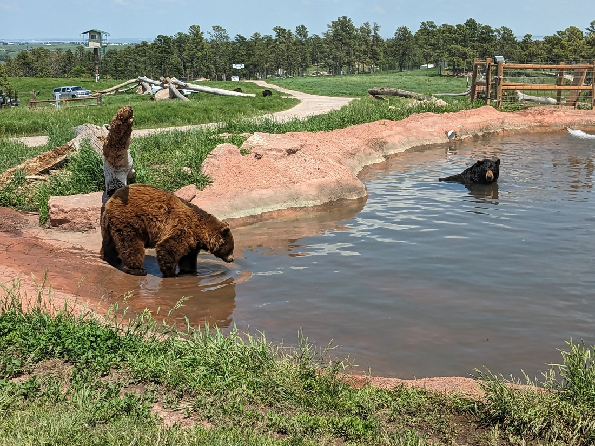

As we were leaving the Reptile Gardens yesterday I saw a sign that said something along the lines of, "If you liked this place, check out Bear Country USA".  The "Bear" part made me take notice.  I would like to see a bear.  The "Country USA" part made me confused.  Aren't we already in USA?

Bear Country USA turned out to be a wildlife park, but with a very American twist.  Americans seem to love drive-through businesses.  Drive-through coffee, drive-through tacos, and especially drive-through ATMs - I was really surprised at how many of those we've seen.  Well, Bear Country USA is a drive through wildlife park.  The animals are loose and the visitors just drive through observing them.  Like a safari.

Well, not quite.  We soon found out that the animals are still basically in enclosures - it's just that those enclosures are really large.  And we can't drive anywhere we want.  There is a sealed, one way road that takes visitors through each of the enclosures.  Fortunately the road was very well laid out so that it didn't really matter where in the enclosure the animals were, likely the road would take visitors close enough for them to be viewed.

We entered and were told to keep our windows up in the park.  As a result, these photos aren't likely to be the best quality as they are likely to have some reflections.

The first couple of enclosures were nothing special.  We've seen deer from afar before.  But one of the next enclosures was a wolf enclosure.

It turned out that it was a wolf (singular) enclosure, but that was fine.  We were able to drive right past the rock he was sleeping on.

Then there was the bighorn sheep enclosure.  Not too excited about sheep, but I will agree that their big horns are quite the sight.

Like the sheep, I wasn't too enthusiastic to see the next enclosure was for a mountain goat.  I guess it's nice that this place has variety, but it wasn't "Singular Mountain Goat Country, USA" that we chose to come to today.

Fortunately the next enclosure was what we had all been waiting for - it was the bear enclosure.

It was the largest enclosure in the park and the road twisted through it.  And there was a reason why it was the largest enclosure - there were a lot of bears.

> We called this bear "Butt Scratching Bear" because that's what he did for about five minutes

Apparently the park has between 150 and 200 bears, though not all of them are on display at any one time.  There were probably only 30 to 40 or so in the enclosure.  But that's still a crazy number of bears.  I don't think I'd seen that many bears before in my whole life.

But it wasn't all fun and games.  In fact there was a lot of lying around.  Many of them seemed visibly hot.  I guess for the visitors' benefit there weren't really any trees in the enclosure and so shady spots were few and far between.  Sitting in our air conditioned car I did feel a bit sorry for these very furry animals.

But while there wasn't any shade, there was one place where the bears could go to cool down:

There were some definite bonuses about being in a car.  We could essentially get up close to the bears in the enclosure since we were protected in a metal box.  We had air conditioning, and a nice comfy trip while we went around.  There was also no risk of being surrounded by a crowd, again thanks to our big metal box on wheels.

> Bear at the back is enjoying the water inlet, while bear on the left is shaking like a dog

But there were some disadvantages.  Because the path was only one-way, once we moved on from a spot or enclosure then we couldn't come back.  Also, because we were surrounded by a big metal box, no one else could share a good viewing spot.  They either had to wait essentially in a queue or drive past.  Now, we didn't mind that we had to wait - it just gave us more time to look at the bears that were nearby.  But it did mean that when we did have a good view at something, we felt a bit of pressure not to linger too long.  After all, other people might not have the same patience we do.

A view of the bears in the water was perhaps the best view in the enclosure.  But because of where it was located, really only a couple of cars could get a good look at any one time.  But we did pay for this experience so we made sure we didn't feel too pressured.  But ultimately we did move on sooner than we probably would have liked.

Eventually we did find ourselves at the end of the bear enclosure.  There was one final bear who clearly had the best spot to nap as it was in the shade, and high on the hill where there'd be the most wind.  He seemed to be showing off his napping skills to the people driving by, striking a different napping pose every 10 seconds:

After the bear enclosure was another enclosure that had some animals...  I've actually gone and forgotten what was in there, partly because they were hard to find and so didn't get photographed, but also partly because they weren't ever going to compare to seeing bears.

Overall the bears were the obvious stand out from our visit.  They were the most active with many walking about (including some that crossed the road).  Every other animal was just napping the middle of the day away.  Which again, was totally understanding given the temperature.

Unfortunately it did feel like we'd had to rush through.  We'd maybe spent 45 minutes and $65 New Zealand dollars looking at the animals, and now it was over.  But the good news was that there was more to the park.  Afterwards we got the opportunity to park our car and then walk past some regular wildlife park style enclosures with "smaller" animals that we could walk around.

First there were badgers, which were napping.  Then there were skunks - also napping.  Again, a shame they were both not moving but these were a couple of types of animals we had certainly not seen a lot of.  Then there was a racoon - except he was hard to find.  Eventually we did spot it sleeping out the day on the edge of a fake cliff.

Then there was a beaver.  He was asleep in his den as well, but nicely there was a window.  No pictures because the window was so dirty it would be hard to make out what is animal and what is not, but in person it was a sight to see that amazing tail and those scary teeth up close.

There were also some young groundhogs:

> Very, very active - well, except for the one that had a nap in the pipe

It was only then that I realised that we hadn't yet seen any groundhogs.  I mean, except for in the Groundhog Day movie.  However, the sign claimed that "groundhog", "marmot", and "woodchuck" were all just names for the same animal.  This was certainly a surprise.  But after all, we have none of these animals in New Zealand, and they're usually quite common so zoos probably don't bother carrying them.  So I think it was pretty natural that we had got to our current ages without learning anything about groundhogs, or woodchucks other than references in movies or tongue twisters.

Next photo I have is of a porcupine:

> Looks very fluffy, and by the sounds of it probably is as long as you stroke it the right way and don't frighten it

Then there were some cats - a pair of Lynxes and a Bobcat.  They were kept near the racoon enclosure, so that might be why it was trying its best to climb up the wall.  Then we spotted something which made us hurry past those cats.

> Baby bears!

I suppose it makes sense that if you have a couple hundred bears kept alongside each other that you probably are going to end up with a dozen or so new bears every year.  And these bears were this year's litter.

Apparently the young bears are weened off and separated from their mothers for their own safety.  The greatest danger to a young bear is other adult bears.  And I can kind of see that.  These bear cubs were really active.  I don't think any of them were sleeping and they were basically always on the move.  That would probably be quite annoying to the grumpy older bears that just want to sleep the heat of the day away.  I probably wouldn't blame them if an "accident" happened.

We watched the bears for a while.  Then continued on.  Saw some wolves and foxes.  But then we were done.  But the good news is that because we're now  walking, we can just go back and walk round all the enclosures again to see if any of the animals had moved.  Most had not, but the baby bears were now all around the pool area:

They were basically children.  Chasing, fighting, and exploring.

> Furry children

Just before we headed back to the car we took one last look at the racoon - and he had moved, but was hard to spot.  Eventually we noticed that he was hiding almost literally at our feet, trying to camouflage himself against the wall.  I don't know about the lynxes and bobcats, but it partially worked against me.

So that was Bear Country USA.  Ordinarily we would have been a bit reluctant to pay for two animal parks within 24 hours, but both were good and in different ways, and both were worth their entry fee.

Now it is time to continue north and west.  We're heading back to Canada, but there's one last National Park we want to stop by before we depart.  But it will take some driving to get to.

