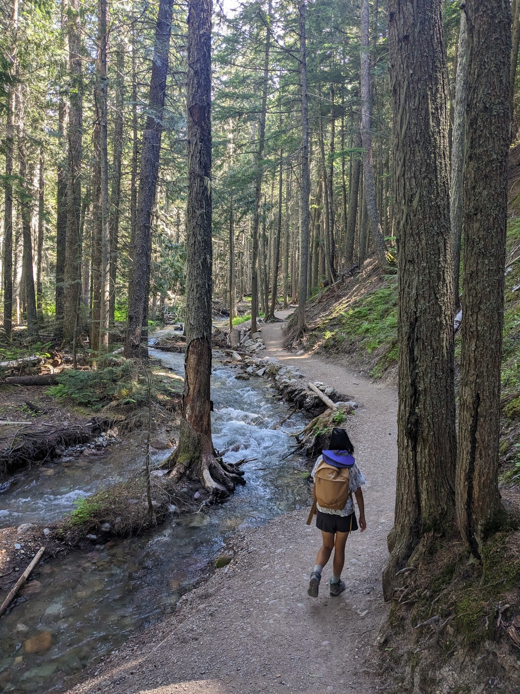
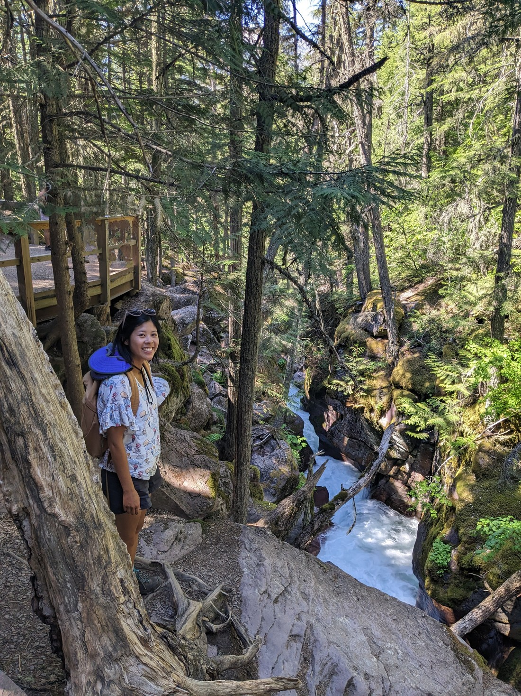
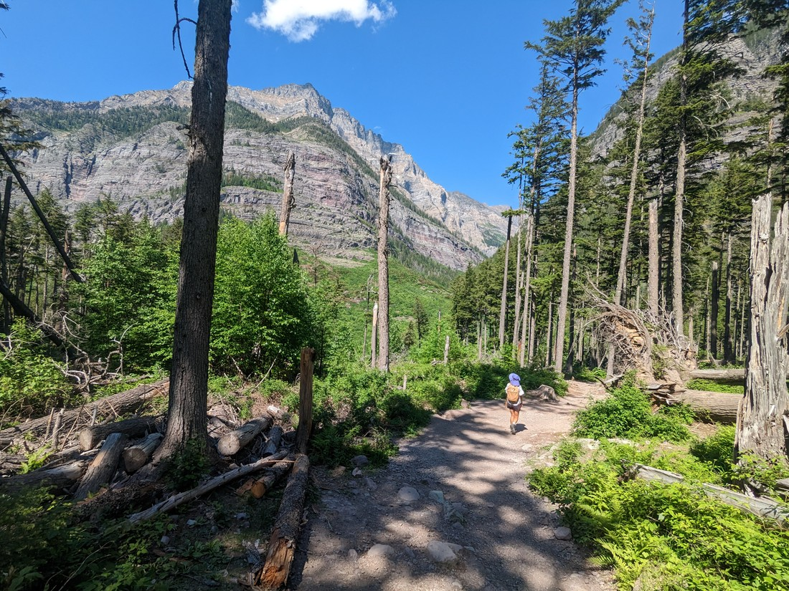
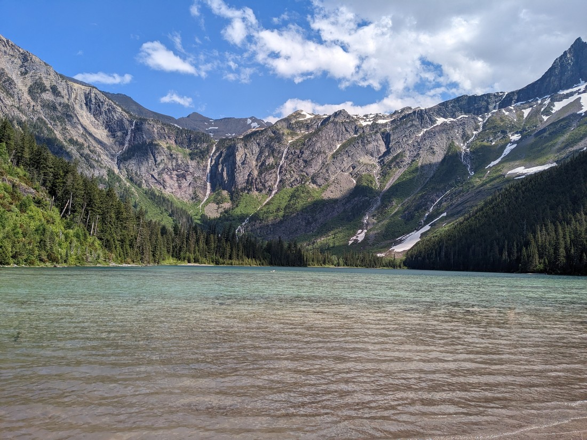
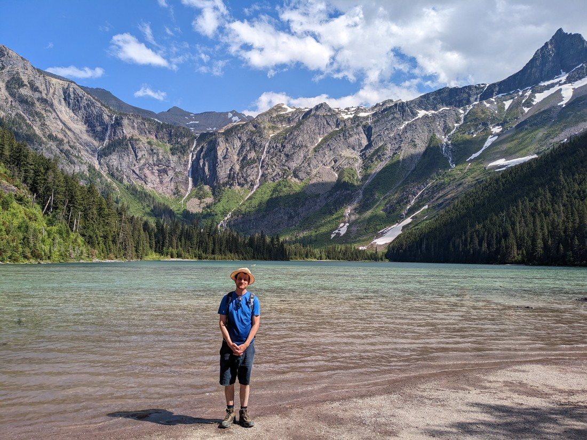
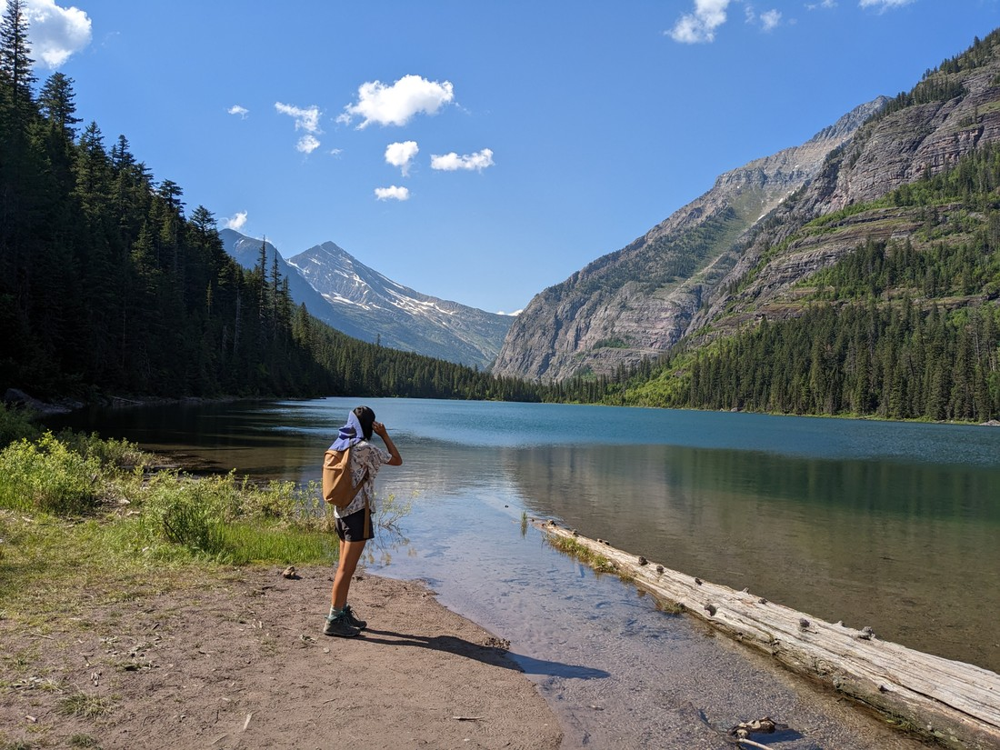
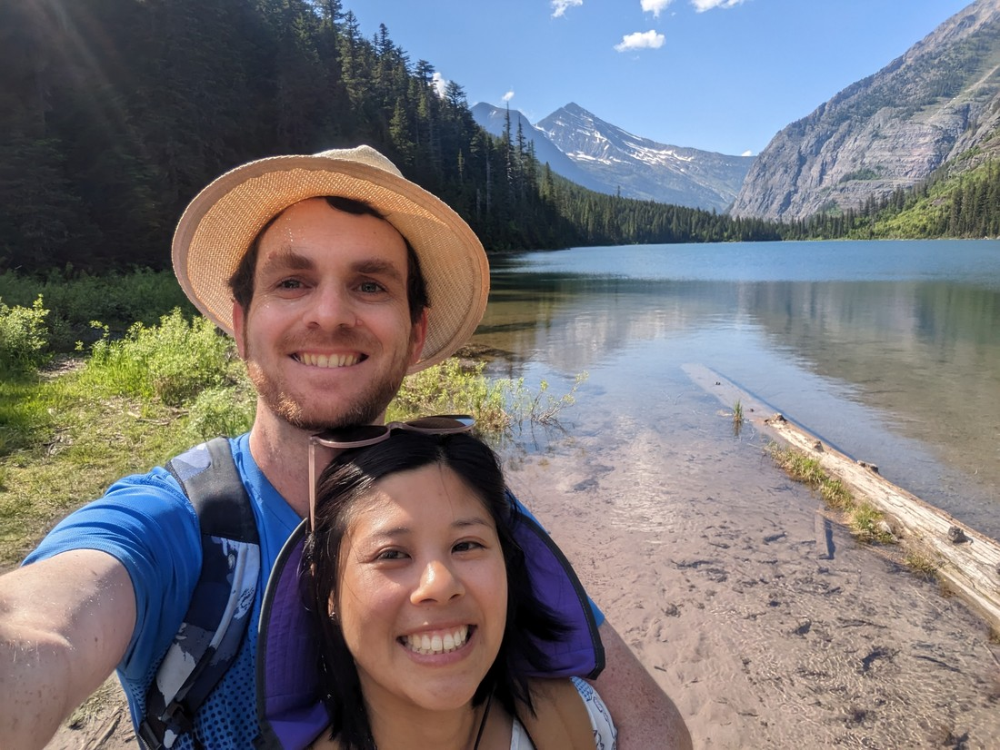
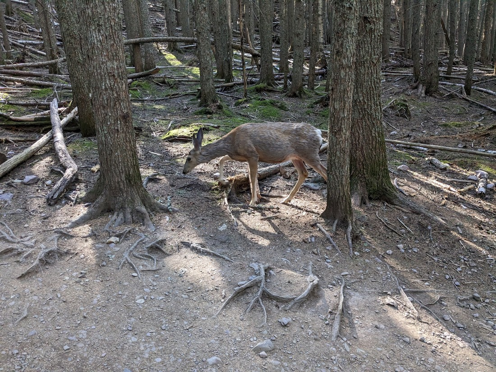
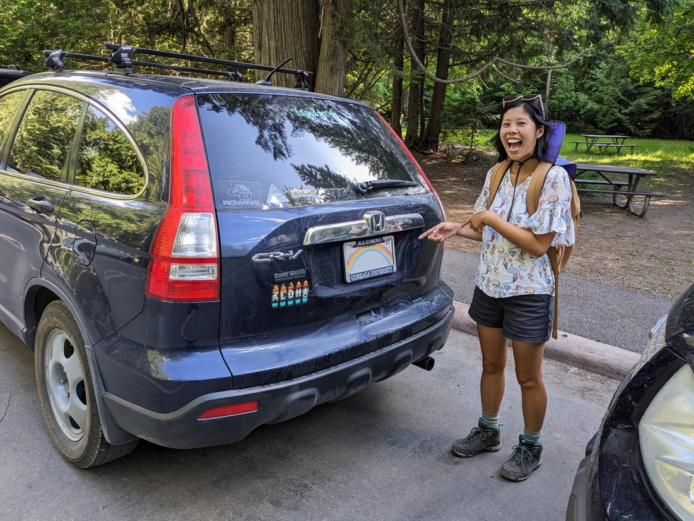
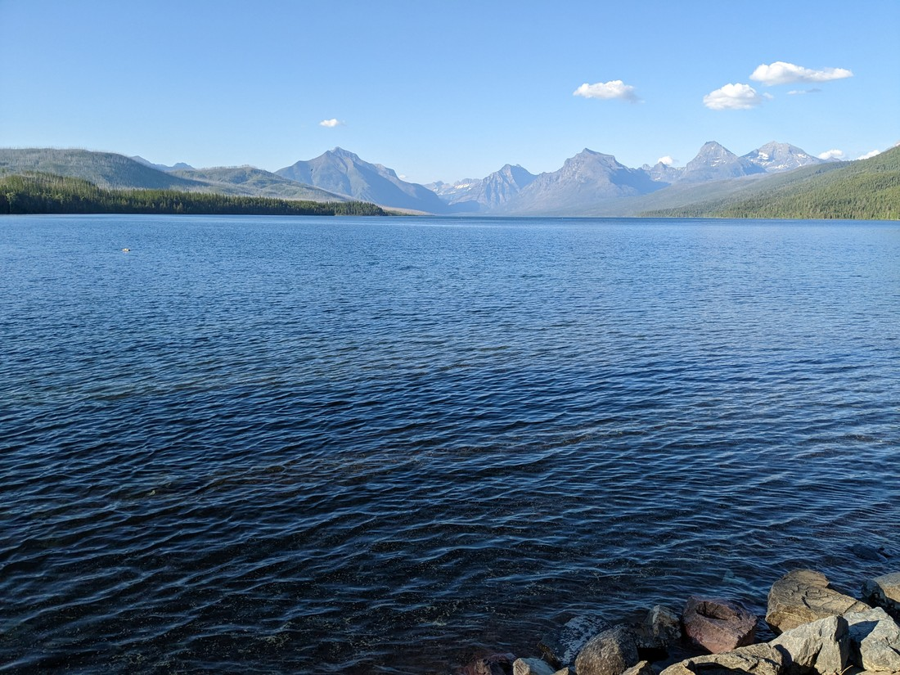

There wasn't a blog post for yesterday.  That was because we basically didn't do anything.  We drove from northern Wyoming to the middle of Montana.  We stopped to pick up supplies and browsed a Goodwill store.  I bought a book I probably won't read.  That was about it.

(Although I will share one anecdote.  We went to Walmart and figured we should pick up some extra clothing basics.  I said that I'd just go in there and buy whatever t-shirts are cheapest, since it really doesn't matter what the design is.  Well, the cheapest t-shirts were all variations on "World's Best Granddad".  Needless to say I didn't think I could wear those.)

Today we're basically driving the rest of the way across Montana.  We arrived at our final US National Park - Glacier National Park.  This park is essentially part of a mountain range crossed by a scenic road.  Unfortunately that road is mostly closed at the moment (cause snow) so we have to go round.  Today we're going to be visiting the western part of the park.  I had already picked out the most popular walk in the park for us to do today so we drove straight there.

It started as a walk through a rather peaceful forest.

We're going to a lake, and basically we're just following a stream all the way there.

I had read there was snow on the last kilometre of the trail so we were wearing our full hiking boots.  But as we walked I was starting to get sceptical.  It didn't feel like we were gaining much elevation and there were a lot of casually dressed people about.

It turns out I was wrong.  I must have been reading about something else.  The lake at the end of the walk was snow free - not at all alpine like the one from Rocky Mountain National Park.

It looked really nice, and clearly many people agreed because there were a number of them swimming.

> That blurry patch in this photo used to be a person

Since it was quite nice, we decided to continue on.  According to the map at the start the trail ended once it got to the lake, but clearly the trail continued on.

So we walked alongside the lake until we got to the end.  Then an "End of trail" sign came out of nowhere.  The trail didn't even end near the lake - really odd place for a trail to just "end".  Well, we followed some well trodden paths to the lakeside to get a good look at it from the other angle.

Cue happy selfie photo time.

On the way back we spotted a deer.  They're a bit different here to a lot of the deer we've seen previously.

And that wasn't the only thing we spotted.  But first, an explanation.

USA vehicle license plates all have the name of the state on the plate.  I think this means that the same combination of letters can exist on two different plates, as long as those plates are from a different state.  Well, it can be kind of fun to watch out for all the different plates.

After travelling for a month we think we've spotted plates from each of the continental states.  I think Rhode Island has been the rarest - I think we've only seen one of those.  We weren't sure we would be able to get Alaska.  After all, to get here that vehicle had to have driven through a LOT of Canada (since Alaska is very northerly).  But we spotted an Alaska plate at the Grand Canyon.

Well, we figured 49 out of 50 states would have to do.  After all, it'd be really hard for someone to road trip here from Hawaii.  But much to our surprise, we actually found a Hawaii vehicle plate.

> I digitally removed the plate number since the owner might not have liked me putting that on the internet

Don't know how it got here.  But that wasn't the only interesting plate we have seen.  At the Denver Zoo we saw a Guam plate.  Sure, it's a territory of the United States but across the whole Pacific is a very long way for them to have driven.

I guess I also have to mention that it's kind of my birthday.  I say "kind of" because it's not clear whether my birthday should be celebrated based on NZ Time or US Time.  I decided to go by the exact birth date AND time - which was 8pm on June 5 (Mountain Time).  So my birthday started yesterday evening, which I spent by treating myself to a pudding- cup, playing some computer games and then heading to bed - a perfect start to a birthday.  And I ended my birthday with an ice cream cone down by a lake in a National Park. 

Overall a pretty good birthday.