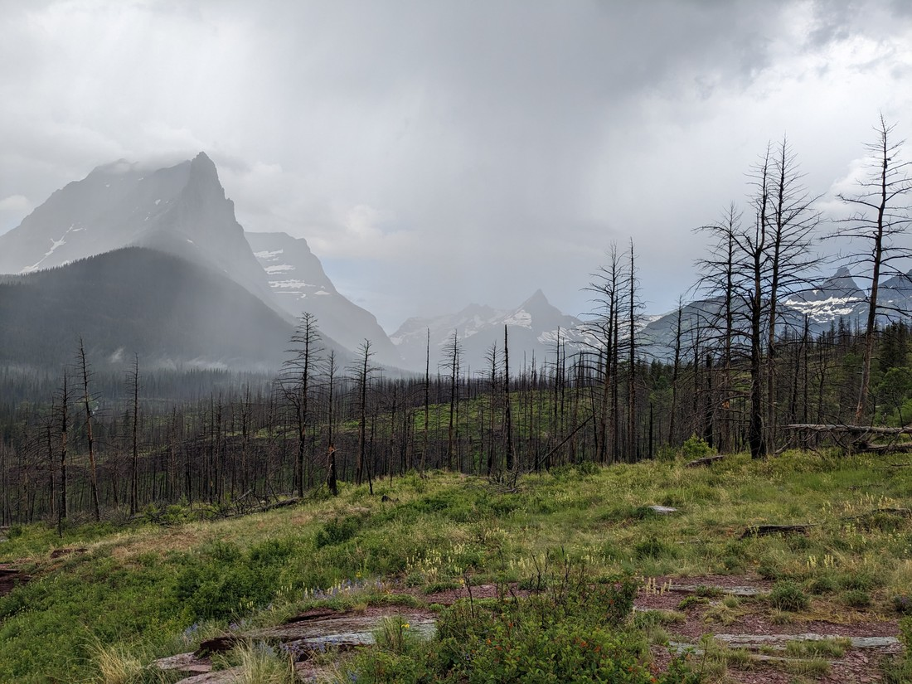
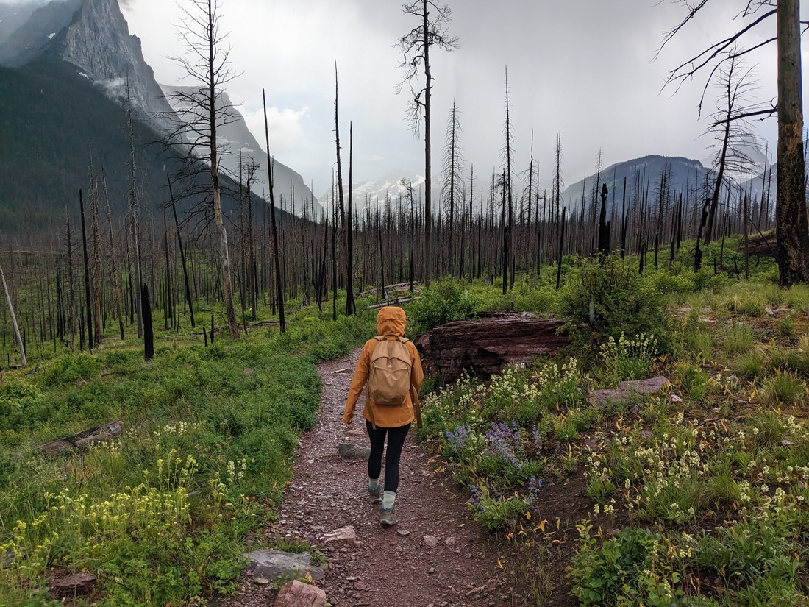
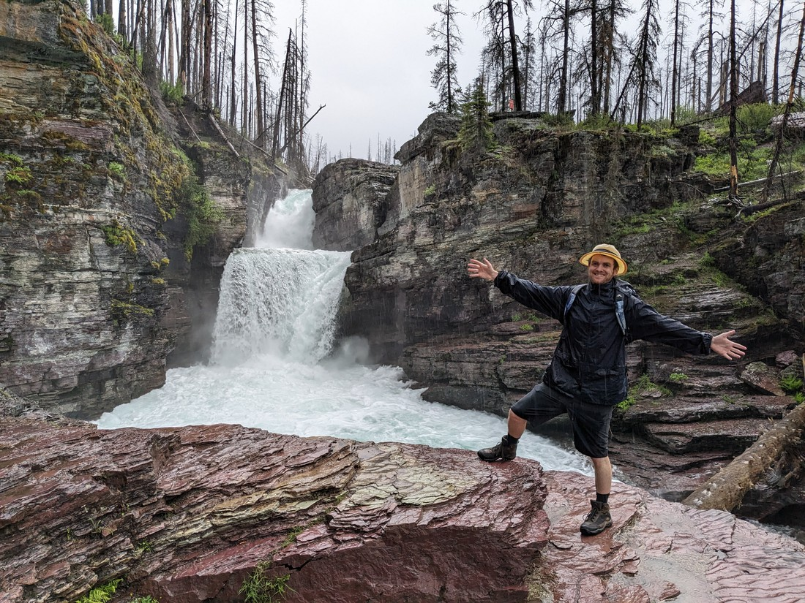
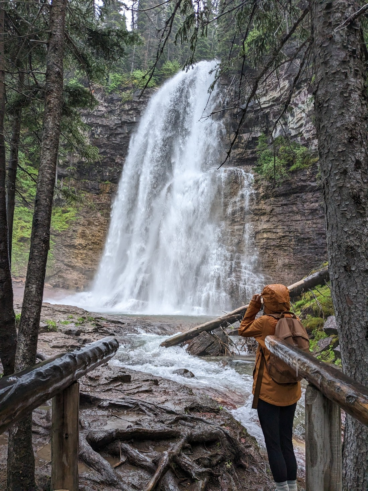
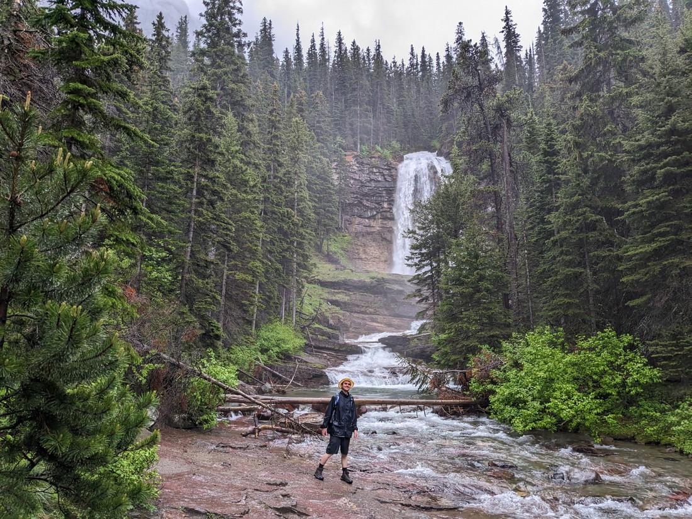

Okay, two more sections of Glacier National Park left.  We visit one today and then the last one tomorrow.

We shortlisted the walks we might want to do last night.  Because we were expecting some rain today we figured we'd do shorter walks and leave a bigger one for tomorrow.

We turned up to the east entrance after breakfast and drove along the scenic road.  This road was closed at a certain point, meaning there wasn't many trails that we could do.  But there was a reasonably high rated walk available.  But as we we arrived at the parking lot for the trail it started raining quite heavily.

> Can't see many mountain tops today

Well, no point in parking.  We decided to drive the rest of the road and come back.  But this turned out to be only another 500 metres or so.  Once we were back the rain did seem to be ceasing.  Well, we came this way - may as well put on our jackets and go for a walk.

The walk was to a couple of waterfalls.  Well, I suppose it was two trails.  One trail went to a waterfall while the other went past it to another waterfall.  We arrived at the first waterfall and found it to be perfectly okay.

> Hooray, adequacy

The rain hadn't exactly stopped.  In fact, if anything it was now raining a bit harder.  Betty asked if we should go back and I replied, "Well, we're already wet.  We may as well do more."

So we walked to the other waterfall.

It was also a perfectly okay waterfall.  A lot higher though - so that was nice.  I guess it just generally takes a lot for falling water to impress us nowadays.  Maybe it might have seemed nicer if we weren't being rained on.

But it was at this waterfall (the furthermost point from our car) that it \*really\* started raining.  It's like the amount of water falling from the sky doubled, tripled, or maybe even quadrupled.  We were pretty damp from walking here, but it didn't take long for us to become truly soaked.  Everything felt wet.  As we walked I was seriously worried about or electronic car key and gadgets.  And also Betty - one of many traits she shares with cats is a dislike of rain.

So this wasn't a fun walk back to the car.  Then at the car the question was, "What do we do now?"  Well, can't check in yet.  The towns nearby are very small so have few options of things to do.  And we really don't want to go out in the rain again. So we drove back to a town we've passed through twice already to visit the local fast food store (for the third time in three days) and then do some laundry.

This is all ultimately fine, but the most unfortunate part is that I had booked some special accommodation inside the park tonight - right next to a bunch of hiking trails.  It hadn't been cheap (because of the prime location) but also it was a historical cabin which also didn't come with a toilet or shower (those were in a shared toilet block).  So unfortunately due to the weather, we've now overpaying for no reason (since its too rainy to hike), and in addition we have to go out into the rain to poop.  And we then found out that the little WIFI that they did have was entirely insufficient to do anything.

It certainly felt like we were lacking in luck today.

But I suppose who are we to complain?  We've been on a road trip for over a month now.  Overall things have been going pretty good.  Apparently smoke from unusually early Canadian wildfires is affecting the air quality for a third of North America's population right now.  We're lucky that doesn't include us.  Probably rain is the lesser evil than the smoke that has literally turned New York's sky orange.

So we keep on going.  Tomorrow will be another day.  Probably another rainy day.  But if it is, then tomorrow's tomorrow will be another day.  And so on.