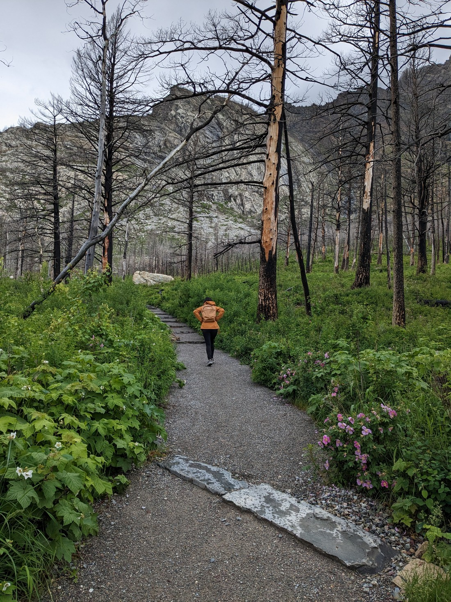
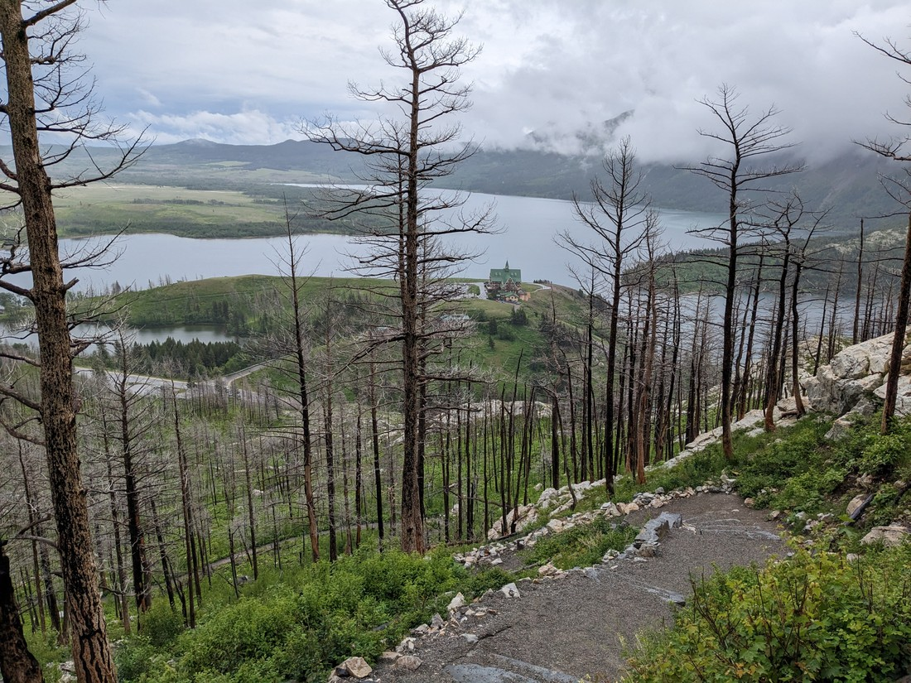
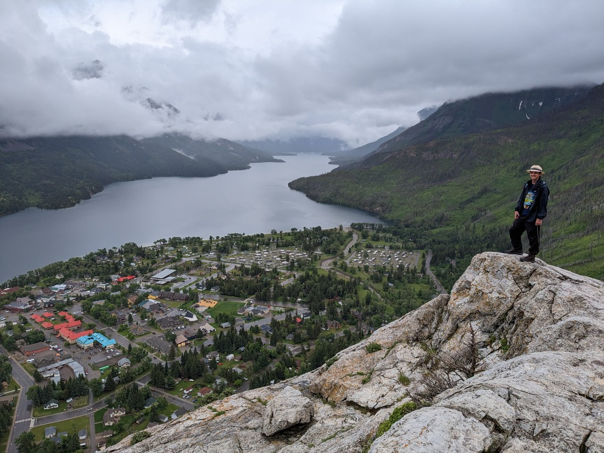
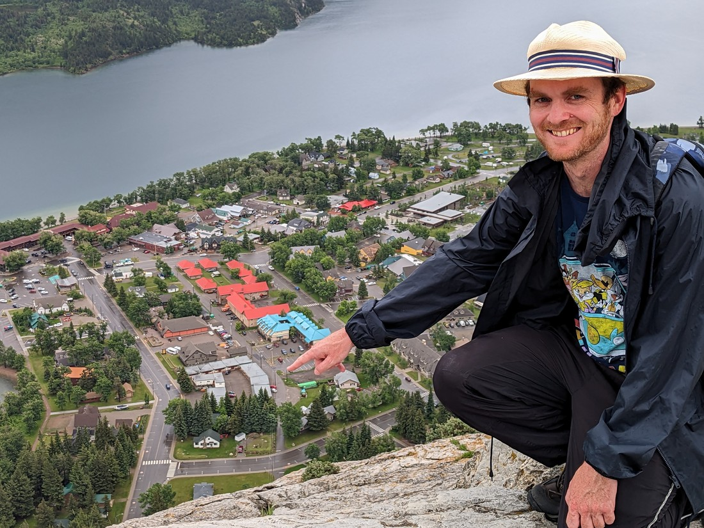
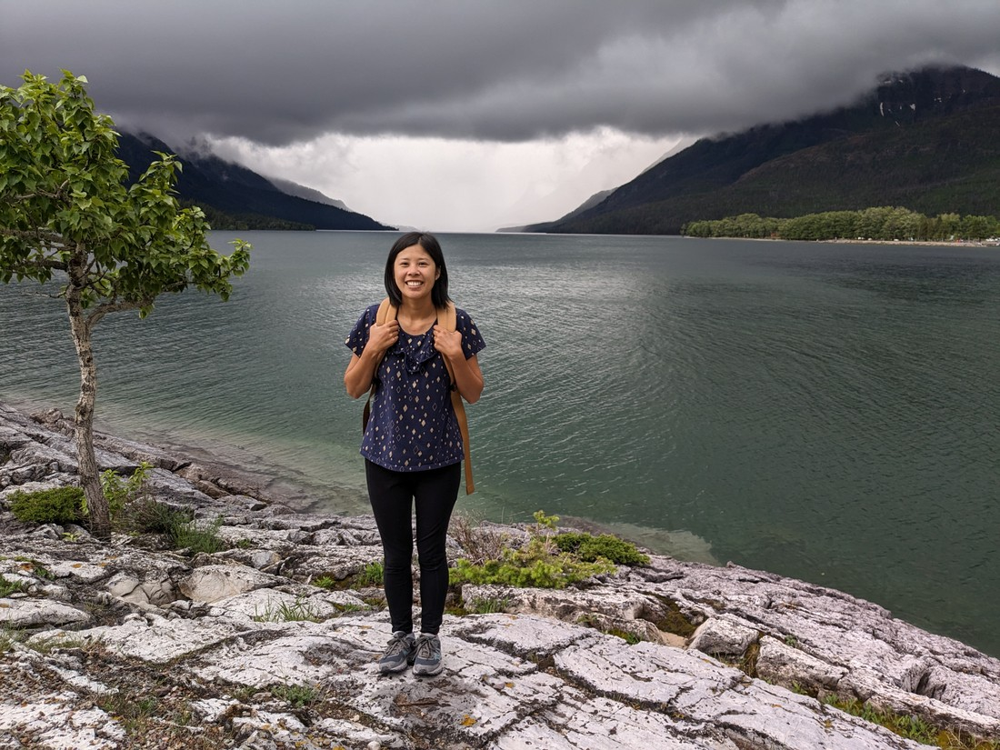
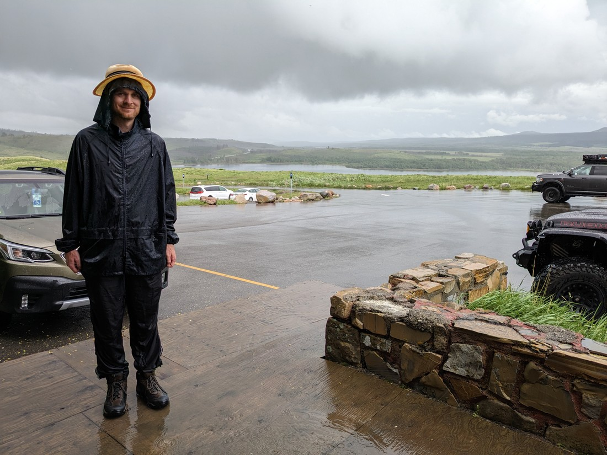
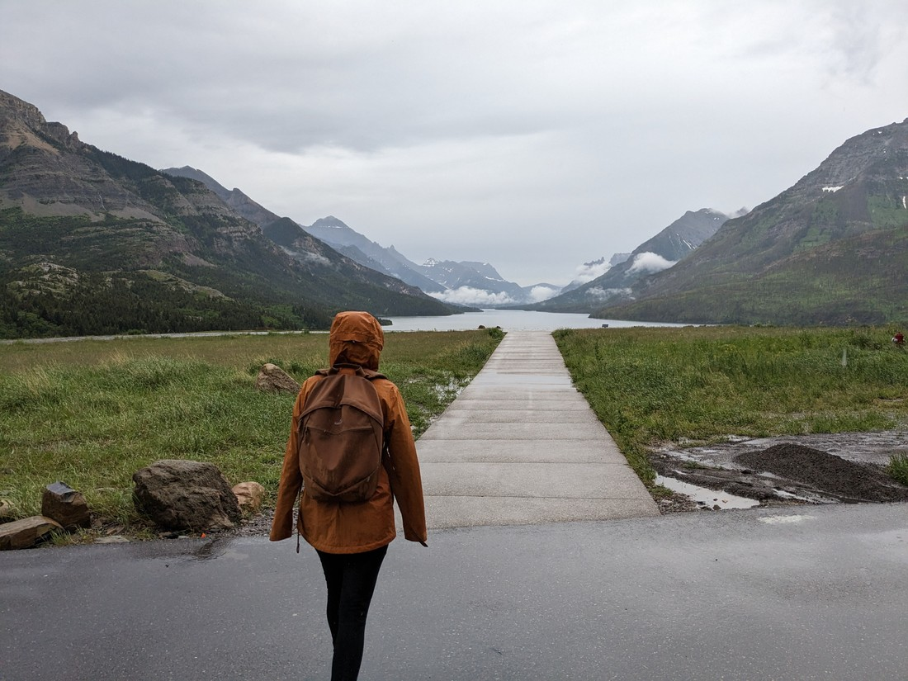
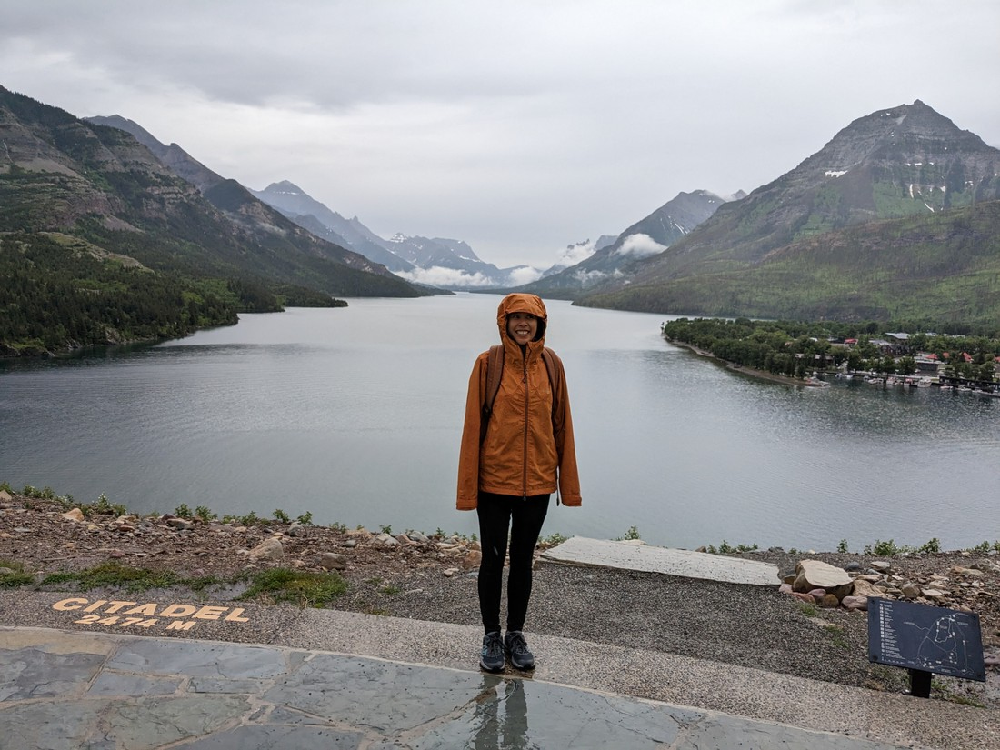
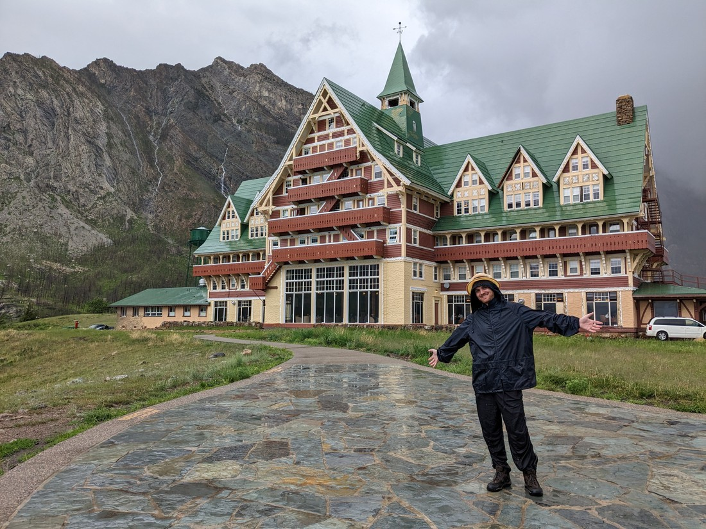
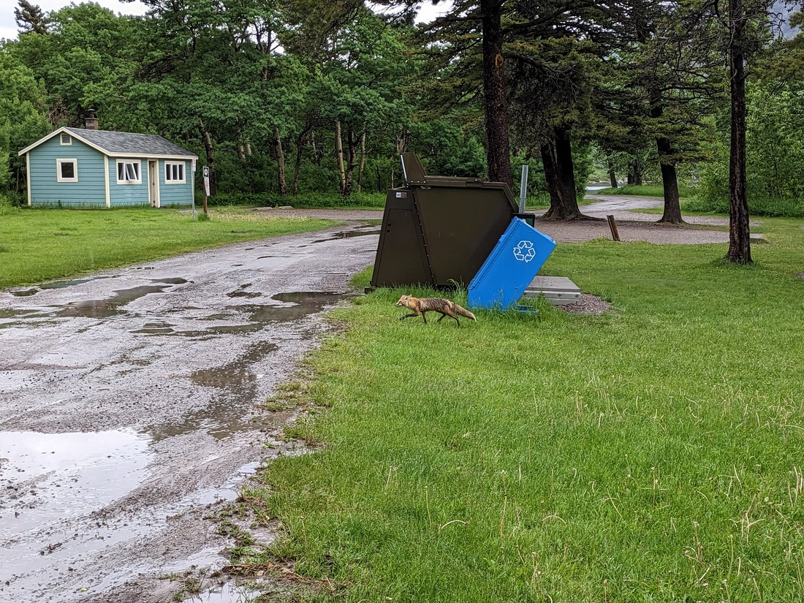

We woke up today to find it raining.  As I mentioned in the last blog post, our accommodation was right near the trailheads for some ordinarily quite enjoyable hikes.  But after yesterday's soaking we weren't really interested in risking another.  And because we didn't have internet access we had no way to confirm when or if it would stop raining.

So we decided to head on.  Within the hour we had crossed the border and we were now in the Canadian province of Alberta.  There were no troubles this time with the border crossing - we just handed over our passports and visas and confirmed we had no alcohol or cigarettes (two things that we never ever would have, but it still made me question whether I might accidentally be smuggling something).

Tonight we were staying in a Canadian National Park called Waterton Lakes.  Coincidentally it was also raining just as hard in Canada as it was in the USA so we didn't really want to go to the park just yet.  So we made our way to the only town nearby.

We figured we'd start with a drive through the main street.  That didn't take long at all (small towns are small).  There wasn't really much to see or do.  We thought we'd found a book store that sold both new and second hand books - but they catered exclusively to religions texts, so we were very quickly out of there.  Still having no access to the internet we decided to go to a fast food place and just buy a couple of things so at the very least we could use their free WIFI.

And I think we must have sat there for three hours.  The lunch rush came and went, and we were still there.  We did of course buy a few more things during this time.  And during these hours the rain did not lessen whatsoever.

Eventually we had wasted enough time that we could now check in to our next accommodation.  So we drove to Waterton Lakes National Park.

But later that afternoon it seemed like the rain had slowed.  No longer was it constant raindrops.  Instead it was raindrops - still constant, but less.  We had checked the weather forecast and it looked like there was going to be rain every day we were here.  Perhaps this weather would be good enough to try a walk?

Betty picked on called Bear's Hump.  This was a walk very close to town that basically went straight up the side of the hill to a view point.

> Just what we wanted today - hill climbing!

Something I noted on the walk up was that the trees were all dead.  Seems like there had been a wildfire in this area at some point.  I later looked it up and it happened in 2017.  Apparently 80% of the hiking trails in the park were affected by this wildfire.

There are certainly some positives to such a tree-less forest - it felt a lot more open.  But I suppose the downside is that there is less shelter for wind and rain.  Not sure how I feel about the scenic-ness of a burnt forest.  I does look kind of neat, but I think I miss how alive a regular forest feels.

It didn't take us long to get to the top.  That's the advantage of bad weather - you walk faster when you're cold.  The view at the top was quite nice.  In fact, it had an excellent view over the Waterton Lakes township.

Fortunately it had stopped raining by the time we made it to the top, so the valley was clearer.

We could even make out our accommodation.  Here I am pointing to it:

> It had all you could drink instant hot chocolates.  Also coffee.

After a quick walk back down we decided to fit in another short walk nearby.

> Hmm, the clouds are looking a bit dark \*ominous noises\*

This one did a loop along the lakeside and then back around by the Prince of Wales hotel.  This was an 85 year old building that sat atop a hill near the township.  It certainly was quite the sight.

Unfortunately as we finished walking along the lake part and began our (short) climb to the hotel, it started pouring down.  Perhaps harder than it had rained all day.  We continued on and took shelter under the eaves of the hotel.

> Basically as soaked as yesterday - the only difference is that today a hot shower is not far away

Fortunately we only had to stand there for 15 minutes before the rain basically stopped.

We found that the rain had actually cleared the cloud cover that had previously hidden the tops of the surrounding mountains.

> I guess this was worth getting wet for to see?

And here's the hotel that Betty wished we were staying in:

> Actually Betty was pretty happy with our existing accommodation, but we're not going to pretend that it is as nice as this

Back at our car we had one last surprise before we left.  A fox was walking around the parking lot.

While we had seen foxes before in wildlife parks (most recently at Bear Country USA), this was the first wild fox for both of us.  They certainly are a very pretty animal.

So it ended up being a mixed day really.  We wasted a lot of time just sitting in an A&W restaurant eating poutine and drinking hot chocolates.  But we did manage to get a fair amount of sightseeing done in the end.  Hopefully we'll have some more breaks in the weather over the coming days where we can sneak in some hiking.
