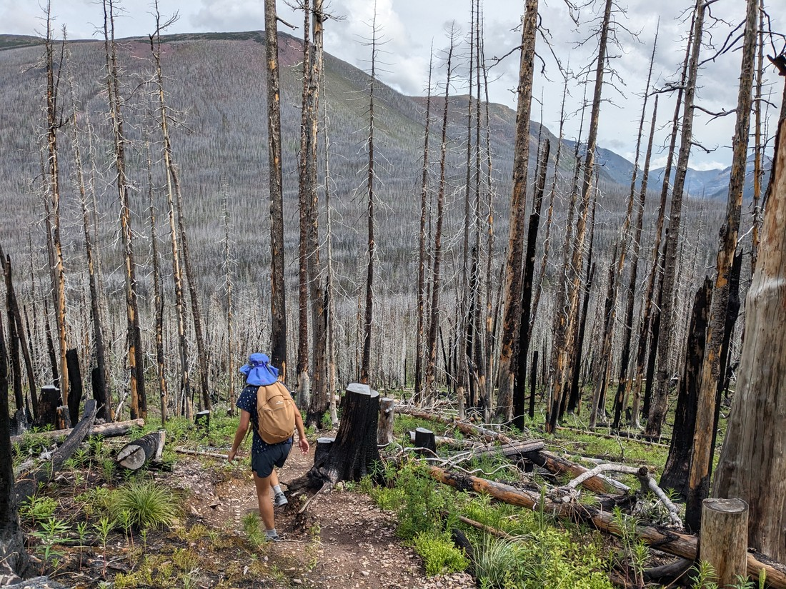
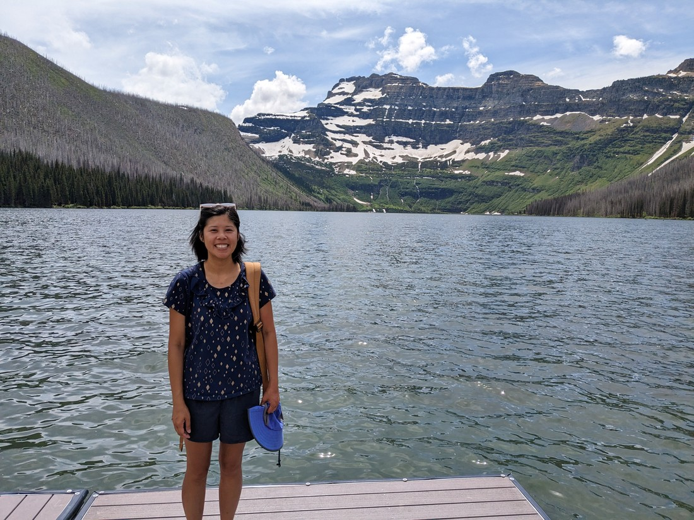

We woke today and the weather was actually fine.

Quick!  Quick!  Let's get in the car and go do some hiking.  Apparently the rain was arriving first thing in the afternoon so if we walked fast we might be able to beat it.

> Look at that - a shadow!  We haven't seen one of those in a couple of days.

After we parked, I went to go read the sign by the trailhead while Betty got her boots on.  Unfortunately, I noticed some mosquitos around.  Oh well, hopefully they won't be too bad.  When Betty walked over and (before I could inform her about the bugs) I noticed she had a mosquito firmly attached to her forehead, right between her eyes.  So that wasn't a good start.

We chose a walk that actually left Waterton Lakes.  In fact, it left the province altogether.  We got to a sign half an hour into the walk informing us that we were now entering British Columbia.

> "I was just beginning to like Alberta"

Like yesterday's walk, the forest had been hit by the 2017 wildfire and so was full of leafless, blackened trunks.  This did also mean we would be walking basically in full sunlight, but luckily it was quite a cool day so it was actually a good temperate for hiking.

Not too far after the British Columbia sign we arrived at a junction.  This trail led to two different lakes.  One was shorter, but required more uphill walking.  The other was flat, but a full kilometre longer.  We decided to try the shorter walk (after all, we're pretty good at uphill hiking) because there was also a waterfall on this path.

The falls turned out to be lacking:

> We definitely need to get over to see Niagara Falls some time - I'm sure that one won't be lacking

But we continued on.  After another while we came to something different.  The forest switched from dead to living.  Clearly the wildfire must not have touched this part of the forest.

Unfortunately this was also roughly the point when we really started experiencing problems with the mosquitos.  They were pretty constant.  As we walked I resorted to waving my arms wildly to dissuade any from landing, and swatting any I could see that managed to land on the back of Betty's legs, but also her shoulders and hair.  Despite these efforts we both took a fair number of bites.

Near the end of the trail there was a lot of leftover winter snow.  Fun, but all I could think was, "Please let the cold scare away all the bugs."

> It did not

The lake was not far after.  Overall it was pretty nice.  There were only two other people there.  One was nice enough to take our picture.  But even this turned out to be an issue due to the mosquitos.  There were still plenty at the shore of the lake, and they seemed to appreciate that we had to stand still for 20 - 30 seconds while the photographer lined up the photo.  So much so that I struggled to stay still, as you can probably tell from this photo:

We left the lake not long after that.

Back at the junction (and bug-free again - hooray) we debated what to do.  The fine weather was still holding out.  "Well," we figured, "perhaps we should go see what the other lake is all about?"  This would mean that we likely wouldn't make it back to our car before 1pm (which was the projected rain arrival time) but there's no point in going home for a lie down when we're still in a hiking mood.

The other lake was similar to the first.  Lots of dead trees but the forest near the lake was mostly un-barbequed.  And also a large rock wall loomed over the south side of the lake.

But fortunately there were basically no mosquitos.  Also, the lake felt a lot more scenic this time.

> Although that feeling might solely be due to the lack of creatures biting us

We were actually able to rest at this lake and enjoy the surrounding nature.  We also noticed (based on the number of people we passed on the trails) that this was the more popular lake.  And it makes sense.

> No hill to climb, no snow to tread, no bugs to fight, and a larger hill and cliff to gaze out at

We even managed to finish the walk without being caught in any pesky downpours.  But again we thought to ourselves, "Well it's not raining yet.  Should we try a bit more?"

The answer to that question was mostly "no" - but since we'd driven all this way we figured we should at least check out the lake at the end of the road.

It turned out to have a huge parking lot, and no wonder - because it was a magnificent lake.

It really made a person question why they spent hours walking to two lakes that ranged from "fine" to "good" when there was a better lake here all along - and it didn't even involve any walking.

There were a number of families about, sitting on the beach as if it was... well, a beach.  I guess this is what you do when you live hundreds of kilometres from the ocean.

We walked a bit around one side of the lake.  Saw a deer.  Then we walked back.  I suggested we walk a bit around the other side of the lake.  Betty reluctantly agreed.  At the start of this path was a group of people staring off into the bushes.  One was taking photos.  "Okay, what have they found," I wondered.  "Another deer.  Or could it be another moose? - that would be nice."  Well it was even better.

It was a young-ish bear.  Perhaps a couple years old.  And it was just kind of wandering around and grazing.  We watched from the path, knowing full well we are supposed to be further away - but the only way to be further away would be in the lake.

The bear continued wandering, and it was headed straight for the parking lot.  This wasn't good, but mostly because it attracted more people's attention.  The bear turned out not to be interested in the concrete parking lot (nothing to graze on).

Fortunately at this point a couple of rangers came along - one with bear spray, and one a rather dashing moustache.  But the bear wasn't really paying anyone any heed - not even when the moustached ranger yelled "Hey, get out of here."  We also heard this ranger tell his colleagues on more than one occasion that he's seen this bear many times.

Eventually another ranger turned up, bringing weapons.  The moustached ranger ended up with a paintball gun and she had something much more serious.  They shoo-ed the bear back into the bushes a bit and then a few minutes later we heard a gunshot.

No idea what happened, because they were still following the bear a few minutes later by the parking lot again.  Perhaps the loud noise was just to scare it?  Well, it didn't seem to have worked much.  This time the moustached ranger was starting to shoot it with paintballs.  Those definitely got its attention.

And that was it.  We wanted to ask the rangers questions, but they clearly had a job to do and we didn't want to be too nosey.

Afterwards I remember thinking, "Okay, we've now had a close encounter with a bear in the wild.  However, including the ones from our 2019 trip (which were all from long distances), we've only seen them because other people have seen them first.  It would be nice to be the first to spot one."

Well, my wish came true within five minutes.

This bear was just sitting in the grass on the side of the road eating the flowers.  And this time there were no other cars or people around - we were first on the scene.

Well, except for the two cars following me.  I had literally stopped in the middle of the lane.  Reluctantly we had to drive on rather than cause a traffic commotion.

So this was a good morning and early afternoon.  I know we had a surplus of bears at the wildlife park a few days ago, but there really isn't the same excitement as seeing them in the wild.  After finding out that Waterton Lakes had been basically burned to the ground six years ago I was sceptical that this park would be any good.  I need not have worried.

I think it did start raining as we ate our Subway lunch after we got back.  We were definitely not expecting the fine weather to hold out this long.  Based on how the last two days have went, we were basically expecting it to continue raining for weeks to come.

In fact, we were still in that mindset in the late afternoon when it fined up again.  But I'll separate that walk out into another blog post.  Although spoilers - it's not that remarkable.  No bears at all.  The only reason it gets to have it's own blog post is because lunchtime seemed to be a natural place to split this day up.
