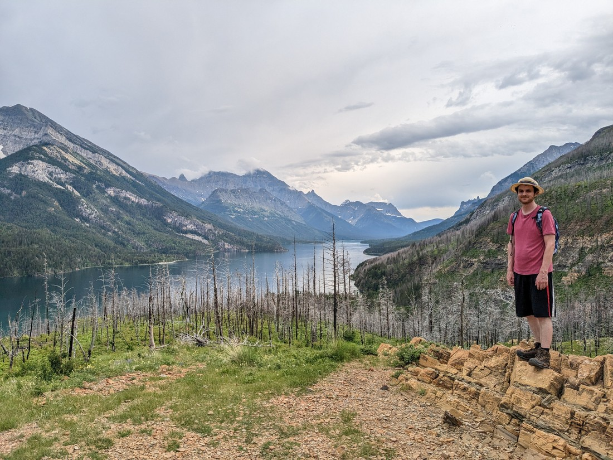
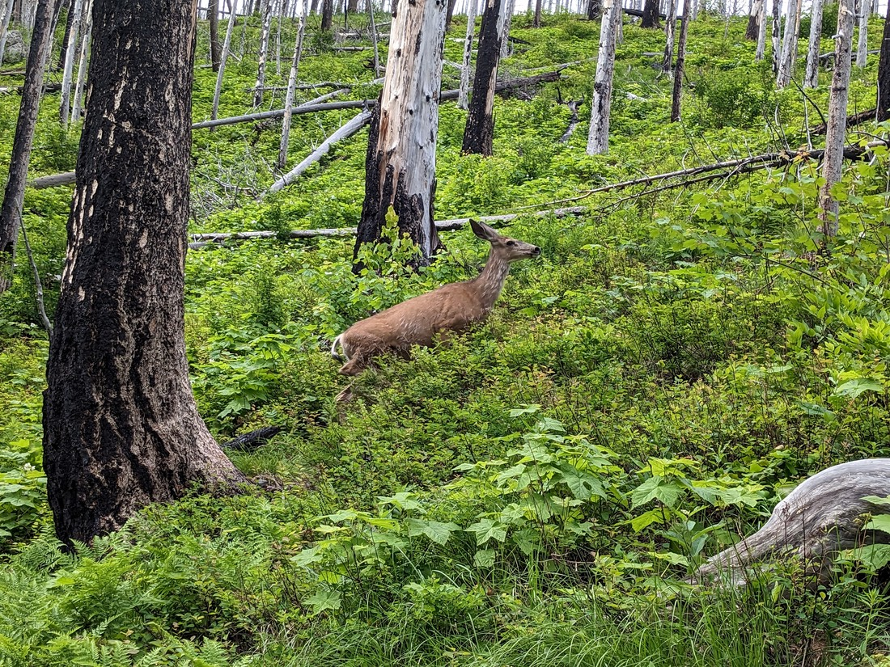
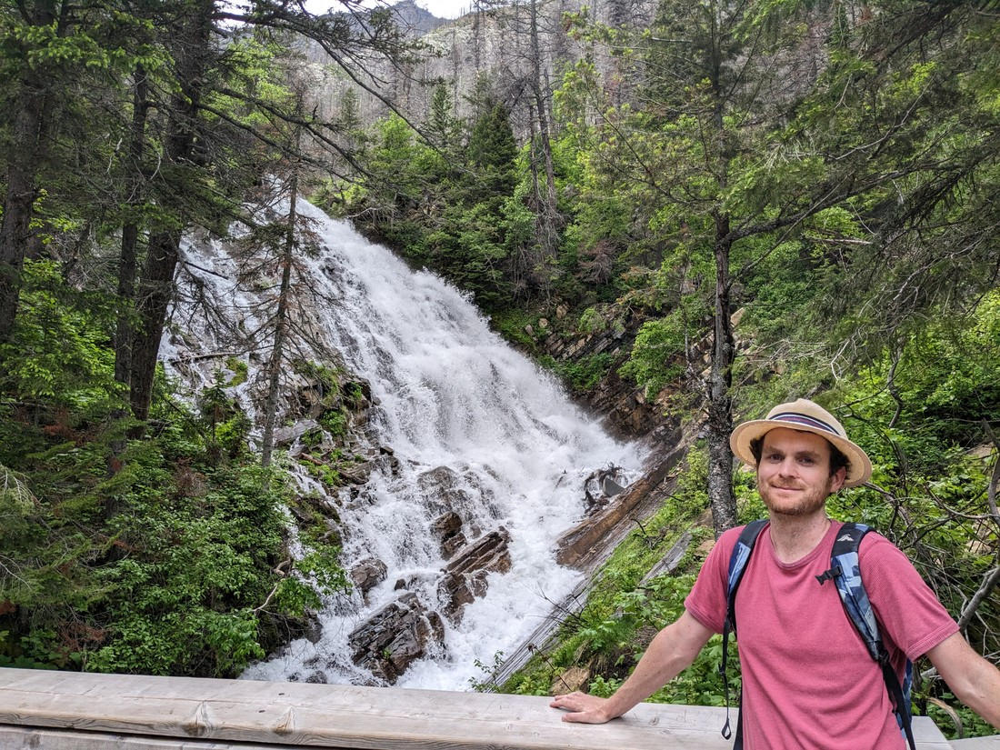
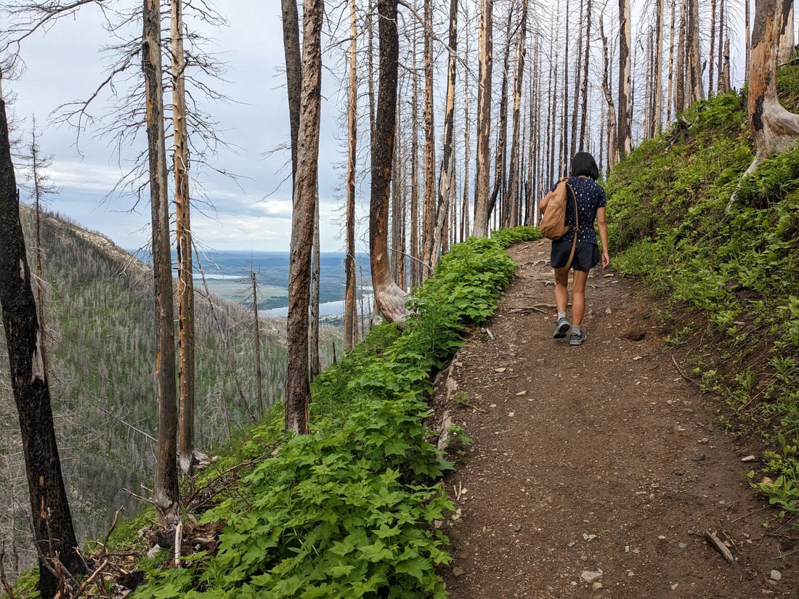
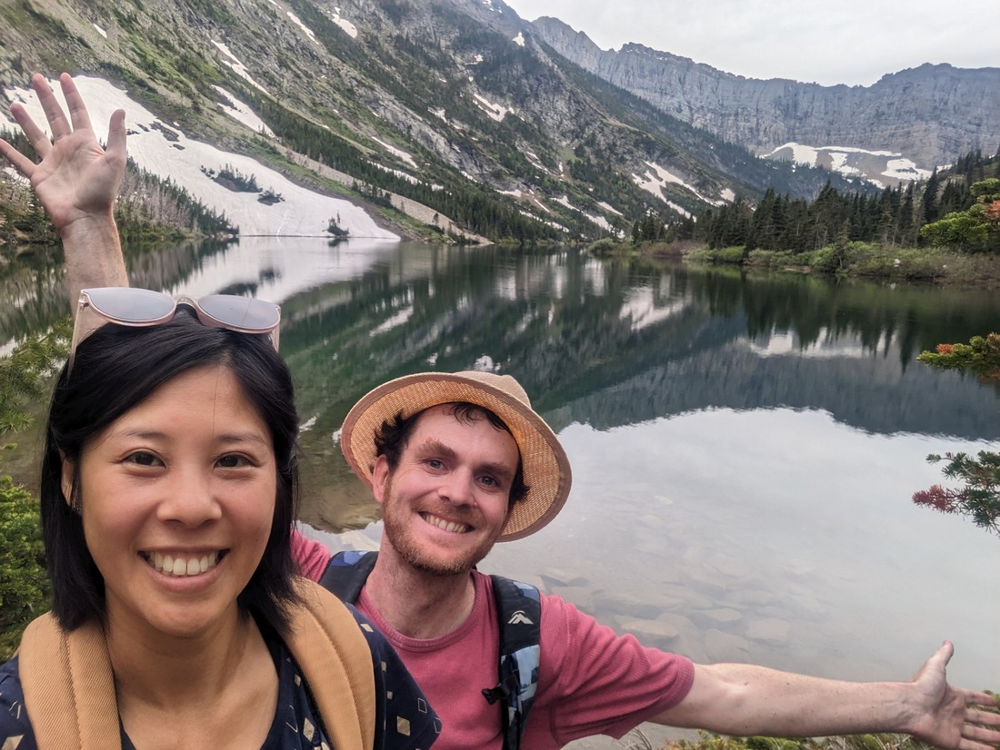
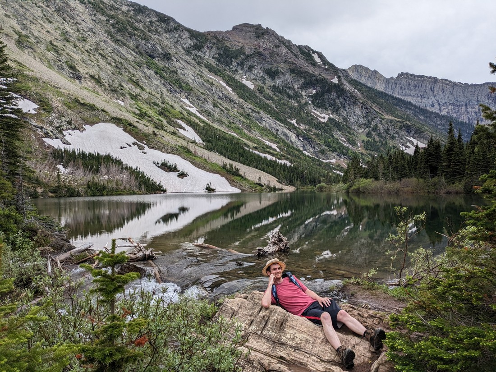
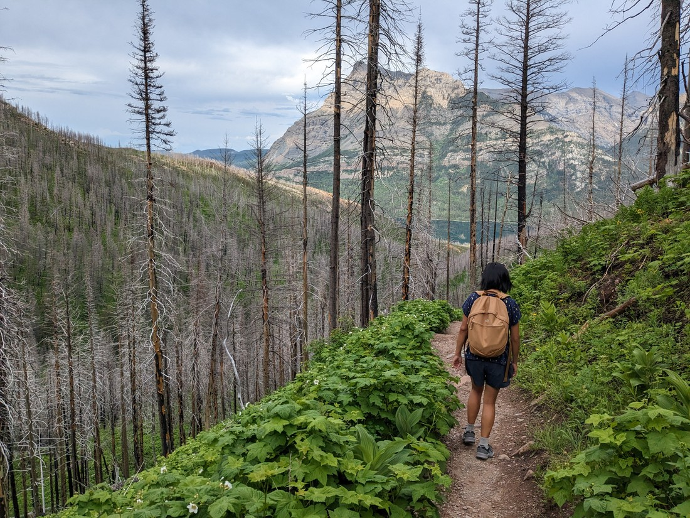
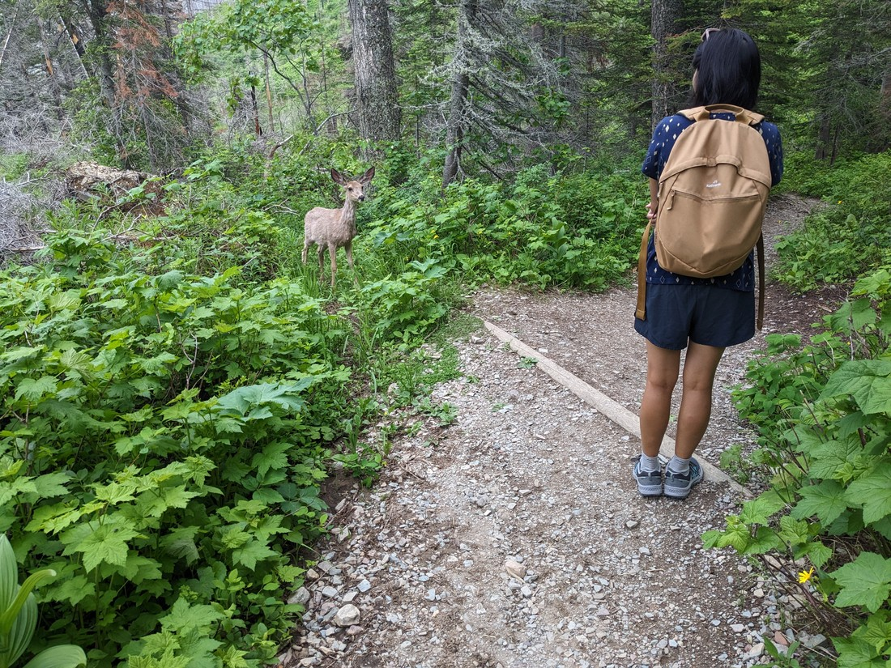
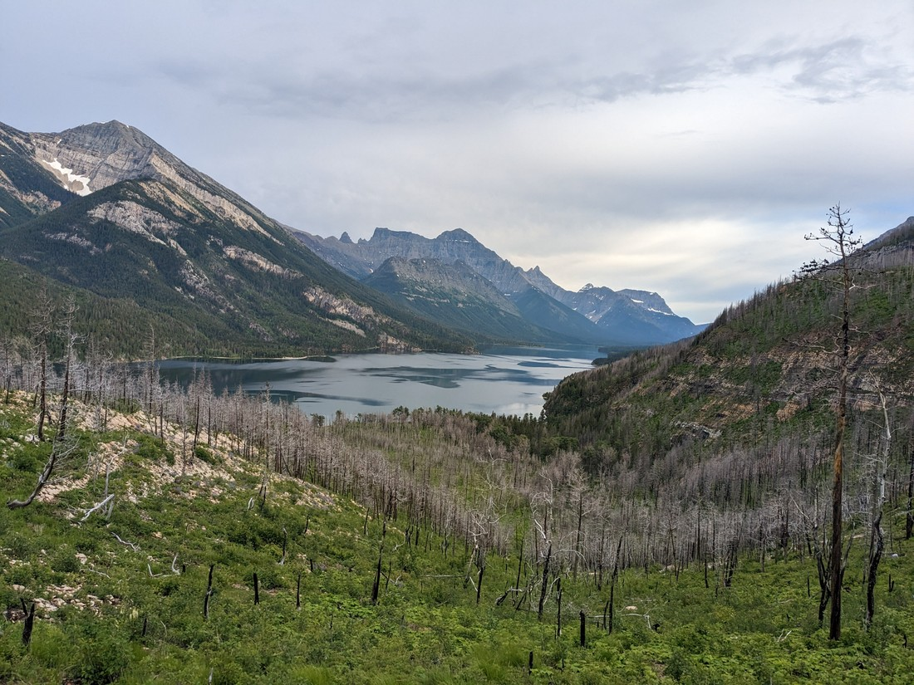

So we did a fair bit of walking this morning - in fact, more than we had planned.  Then we ate, and napped for a bit.  And then it was 5pm (or so) and the weather was kind of okay.  Again, we had no guarantees of any fine weather for our remaining day(s) here so we decided we may as well make the most of it.

We picked out a walk from Waterton Lakes township to a nearby falls.

It went up to a bit of a viewpoint over the main lake.

> Fun fact: some of this lake is in a different country

We had some company on the trail.

Until we "encouraged" them to go away.

