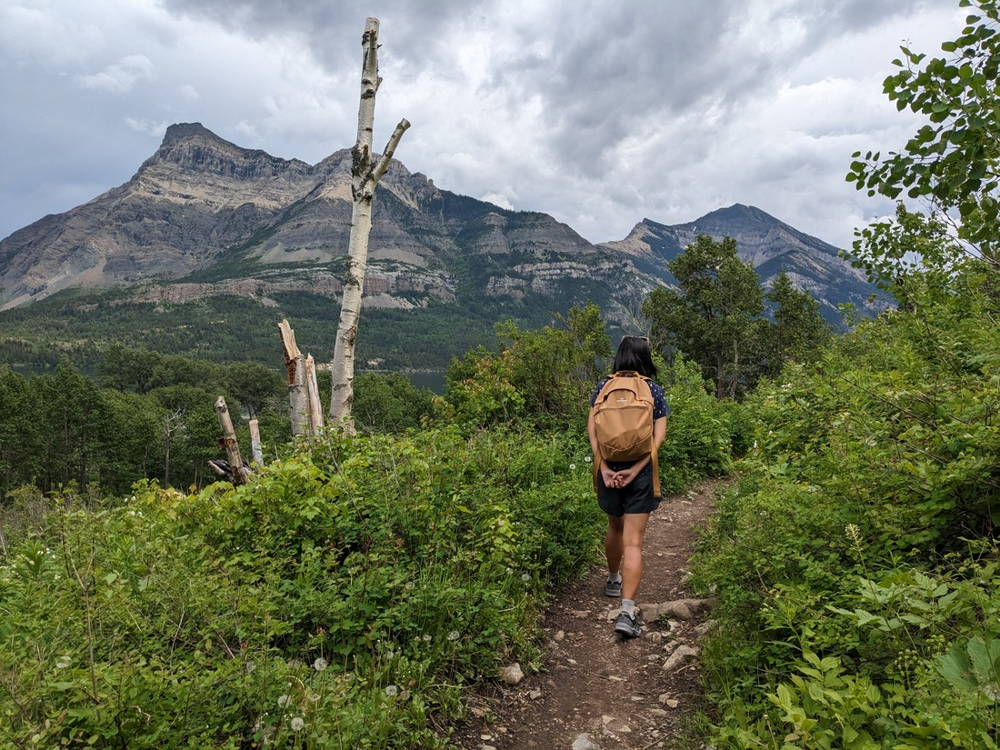
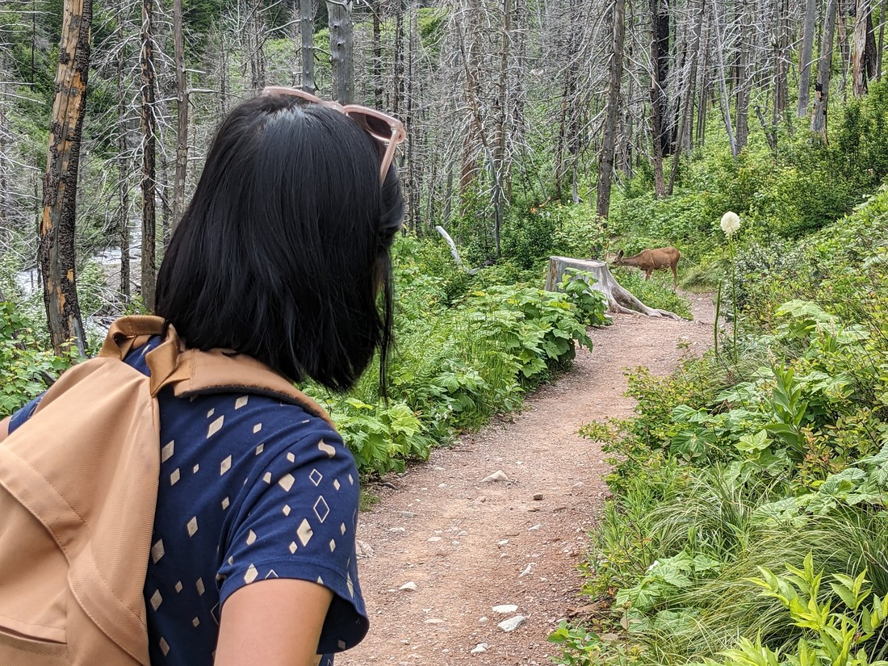
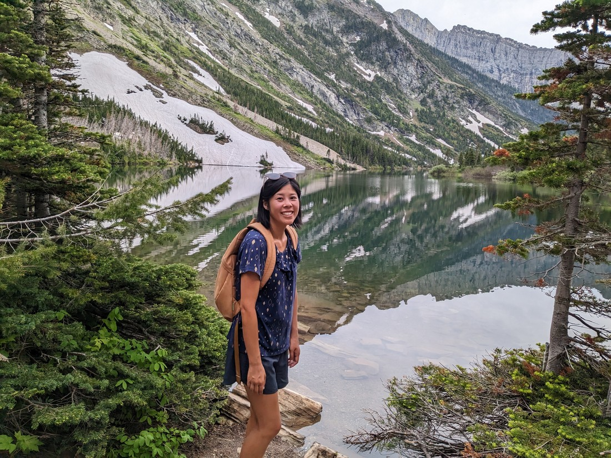
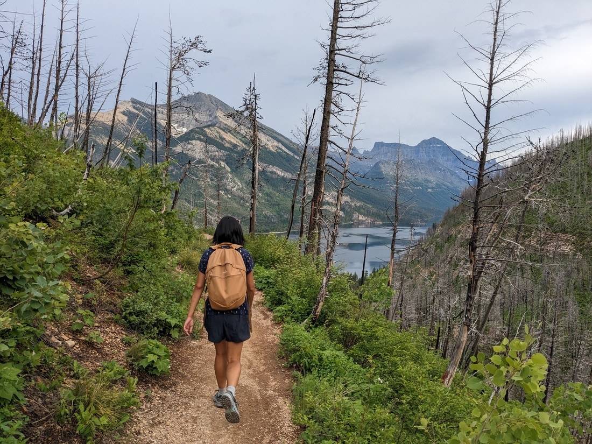

So we did a fair bit of walking this morning - in fact, more than we had planned.  Then we ate, and napped for a bit.  And then it was 5pm (or so) and the weather was kind of okay.  Again, we had no guarantees of any fine weather for our remaining day(s) here so we decided we may as well make the most of it.

We picked out a walk from Waterton Lakes township to a nearby falls.

It went up to a bit of a viewpoint over the main lake.

> Fun fact: some of this lake is in a different country

We had some company on the trail.

Until we "encouraged" them to go away.

The deer wasn't the only animal we spied.  I think we saw our first woodpecker on this trail.  Again, we might be prone to misdiagnosis so can't be sure.

Like many waterfalls we've seen, this one was fine.

> Lower Bertha Falls

At this point Betty was kind of keen to go back.  Except, I knew this trail led to an alpine lake, and if we turned back now we'd never bother to re-do this trail, and therefore we'd never get to see this lake.  So I was encouraging.

This meant more uphill walking.

> Our favourite!!!

The lake was quite nice.  We were here quite late in the day so the surface was rather still.

However it wasn't all fun and games.  There were a number of mosquitos about.

> Not our favourite!!!

Not as many as around Forum Lake, but still plenty to be annoying.  We did spend some time admiring the scenery, but more quickly than normal.

> This pose was exactly as uncomfortable as you would think - rocks are not couches

Now it was just time to go back down.

Since leaving the falls we hadn't seen anyone.  We were at the lake at 6:30pm so it's not like we were that late - sunset would not be for a while.  But we did still have up to two hours of hiking ahead of us to get back to the bottom.  We made it all the way to the end without seeing anyone.   We did however run into a familiar face.

> Probably isn't the same deer, but it might be

I think these are called mule deer.  The reason is their very mule-like ears which were frequently swishing around, as if they were trying to swat away bugs.  I don't think I've ever seen an animal move its ears this much.

And that basically wraps up a long day of walking.

We were expecting rain for a lot of the day, so we leapt at every chance we got to hit the trails.  As a result, we ended up doing many more kilometres than we might have otherwise.  Maybe tomorrow we'll take it easier.

