So today we woke up and it was fine again.  That was unexpected.  Wasn't the weather supposed to be bad?  Well, we'd better make the most of it.... again.

Today we picked out a walk to a waterfall called Lineham Falls.  We partly picked this one because it noted that the first part of the walk was through berry patches - "Prime bear territory" the description noted.

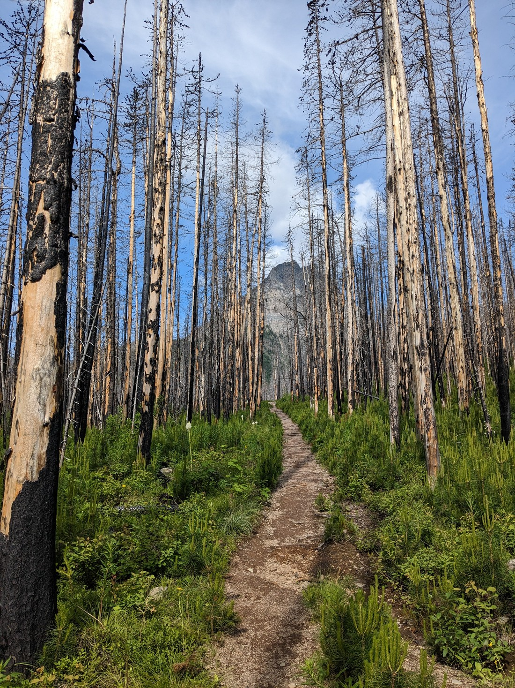

Well there was no bears today.  Not even any berries.  I guess the early bear gets the early berry and then leaves apparently.

The trail started as a slow climb.

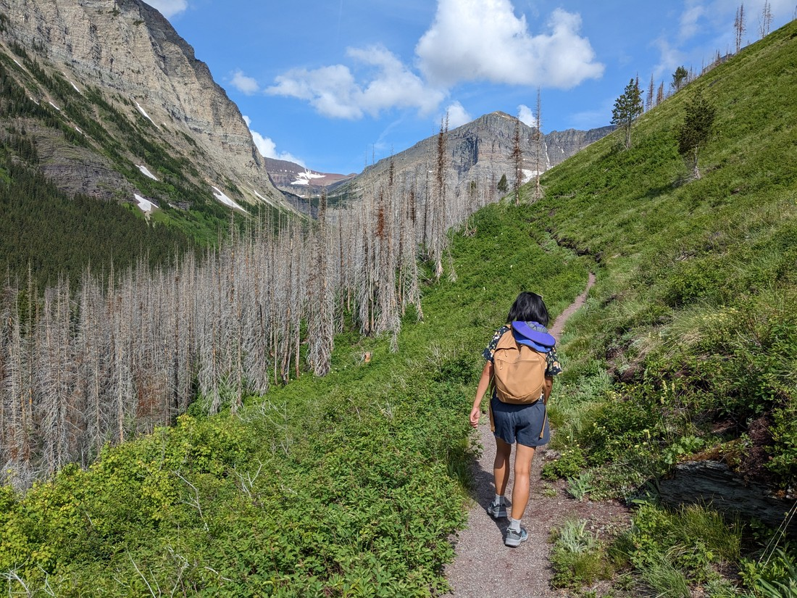

And kept climbing.

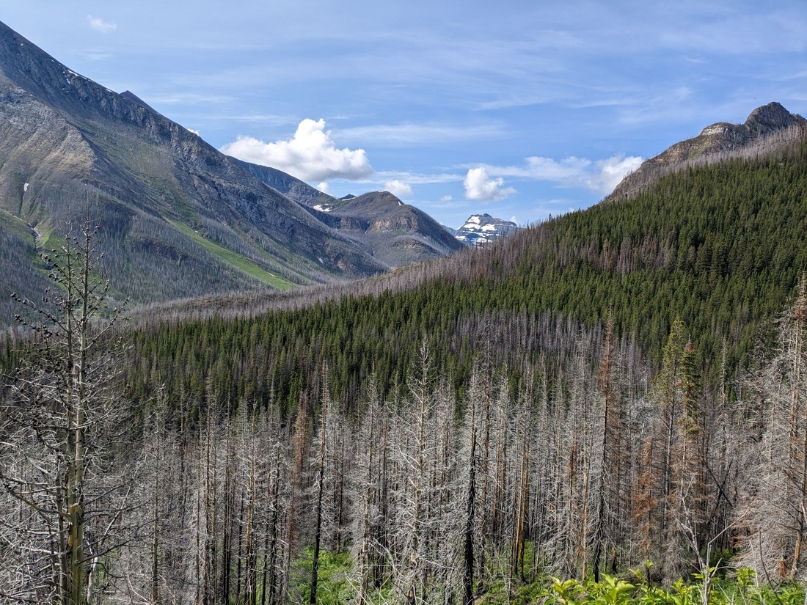

> A mixture of fire ravaged and leafy green trees

This did make it quite manageable, but it often felt like we'd been walking on the same stretch of trail for quite a while.

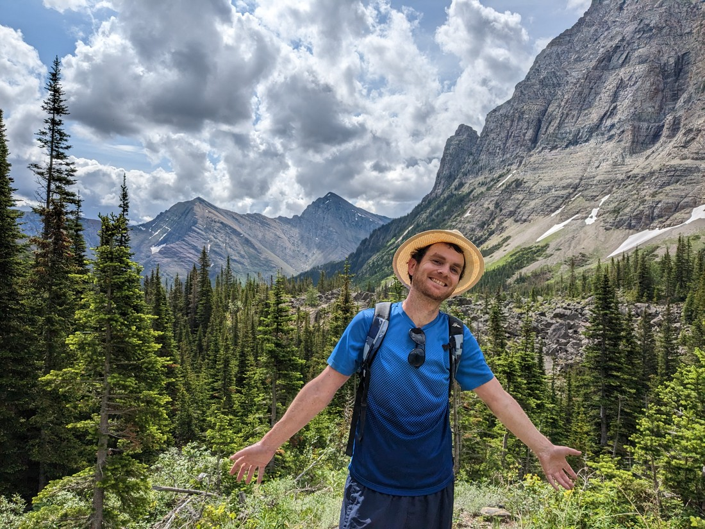

> But overall still a nice day for a walk

The waterfall we were walking to could be found at the far end of the valley.

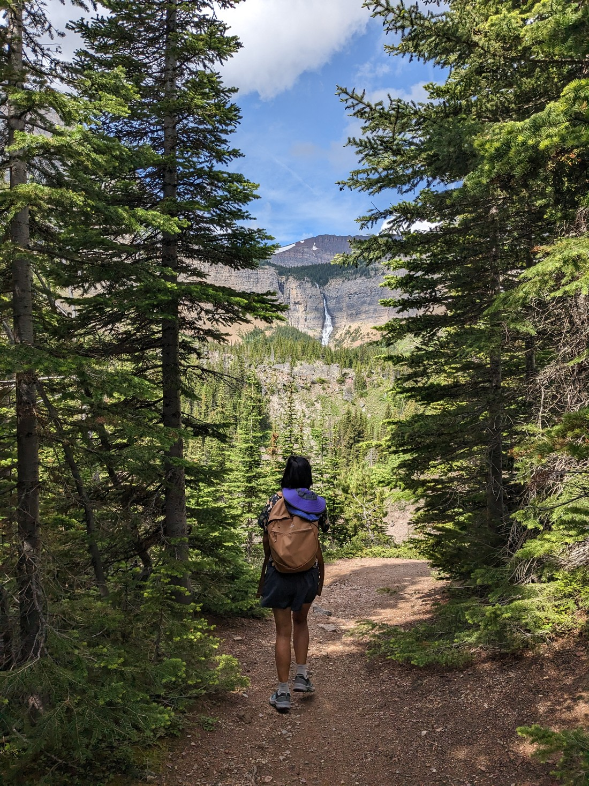

As we got near it I noticed something different.  Most of the trail had been very well made, but now we were skirting round bushes, over rocks and up and down suspiciously steep hills.  It got me wondering - were we still on the trail?  Did it just end a certain distance away, and people have since been making their own trail the rest of the way.

Once we got to the falls, we realised that maybe this close was not the best distance to view it from.

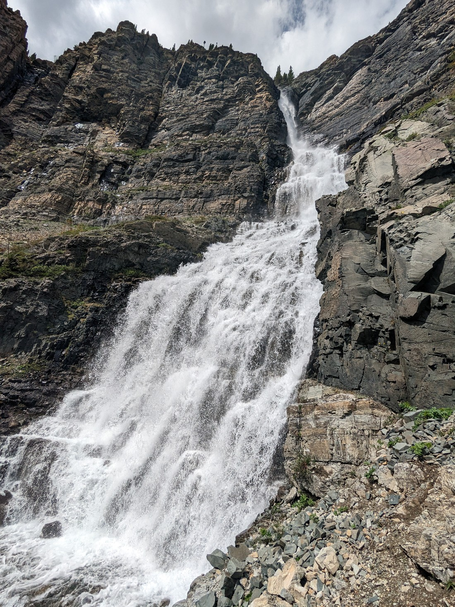

> I managed to capture all of it in one shot, but due to the angled perspective it doesn't quite look right

Made it really difficult to get a picture of both a person and the falls.

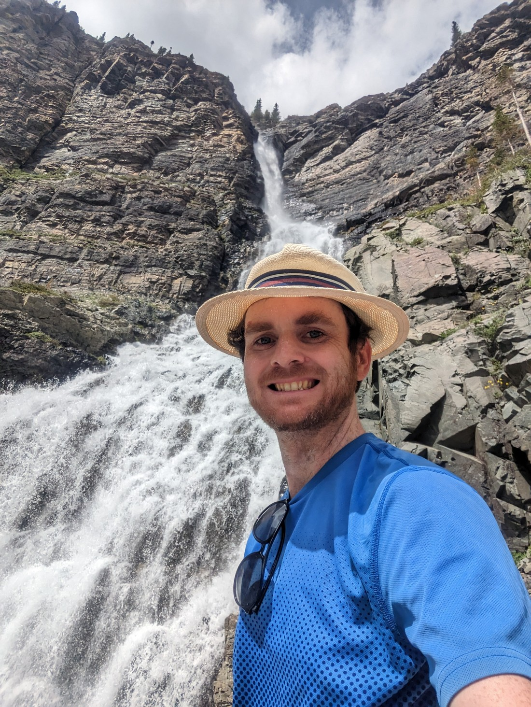

> Difficult, but not impossible

We did stop for a while to rest, as we hadn't rested at all on the way here.  Then we went back to try and figure out where the official trail had stopped.

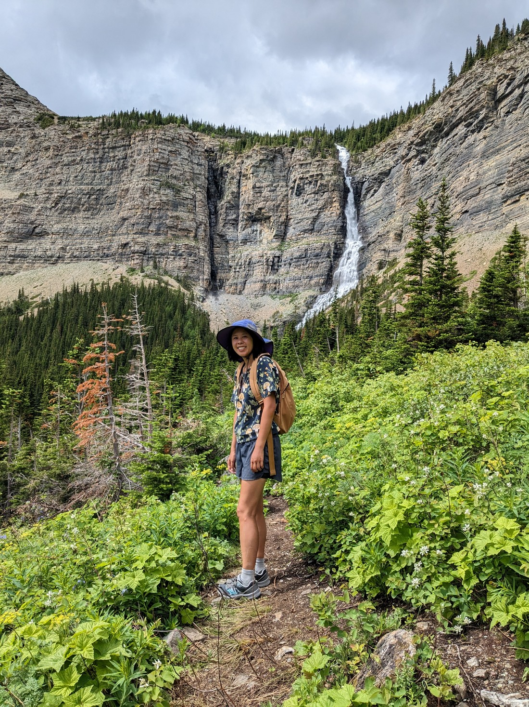

> Note all the bushes that appear to have been stamped out of existence - this is not official\

We did find a spot where the path seemed to change back to a regular walking trail.  It wasn't much of a spot.  It was a better place to take photos from (compared with at the base of the falls) but I can certainly see why people want to get closer.

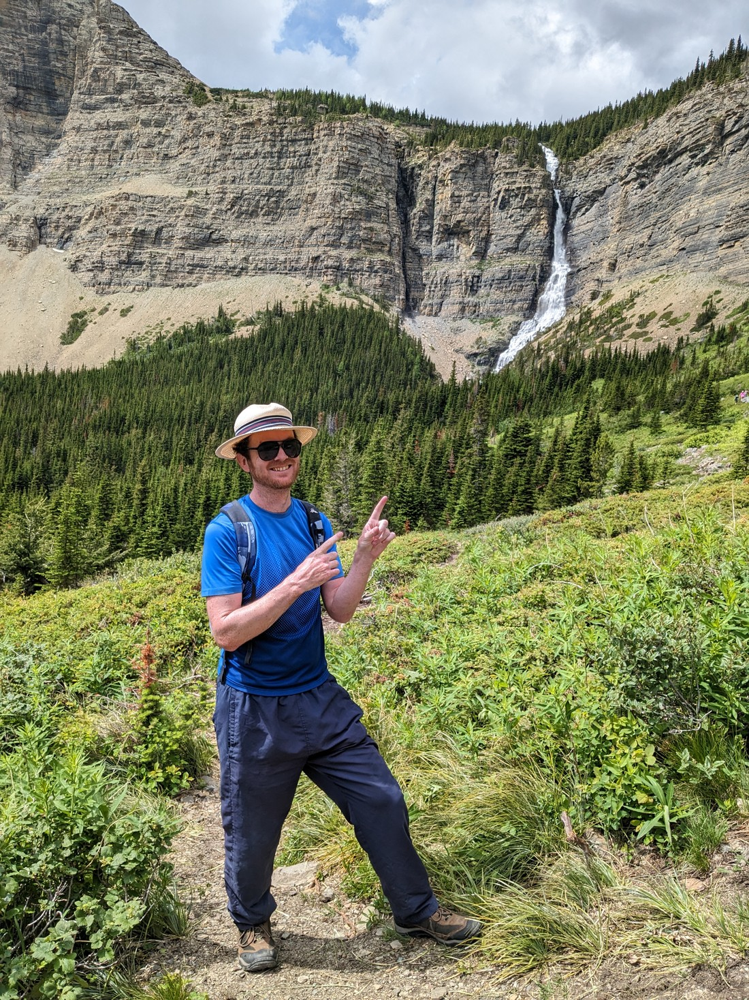

After all, why would people be happy if they thought they were walking to see a waterfall, but when they got within sight they found that no one had bothered to build the last 500 metres of trail?  They definitely should extend the official trail, although they probably ought to change the route to something better - some of the hills the the unofficial trail climbed did involve a bit of scampering.

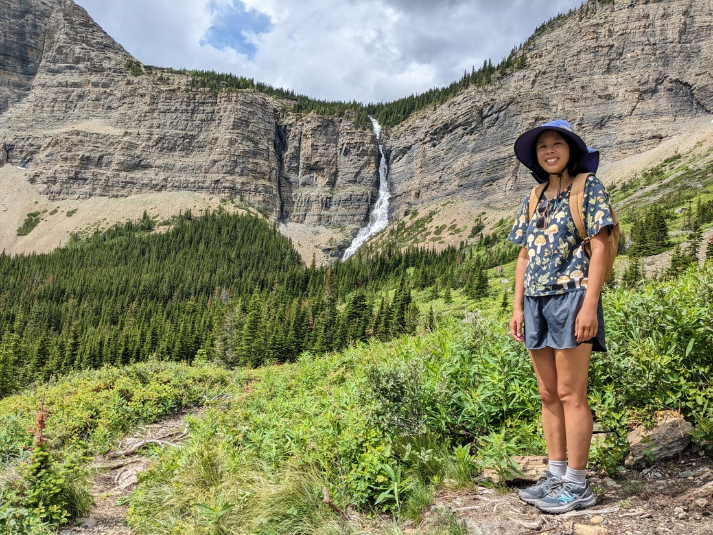

And I think I have said everything notable about this walk.  There was a disappointing lack of wildlife.  Sure, bears are always going to be a rarity - but some deer are always appreciated.  There didn't even seem to be many squirrels scurrying about.  Overall the walk was a bit disappointing based on the amount of effort we had put in.  But that's okay - not every walk can be outstanding.

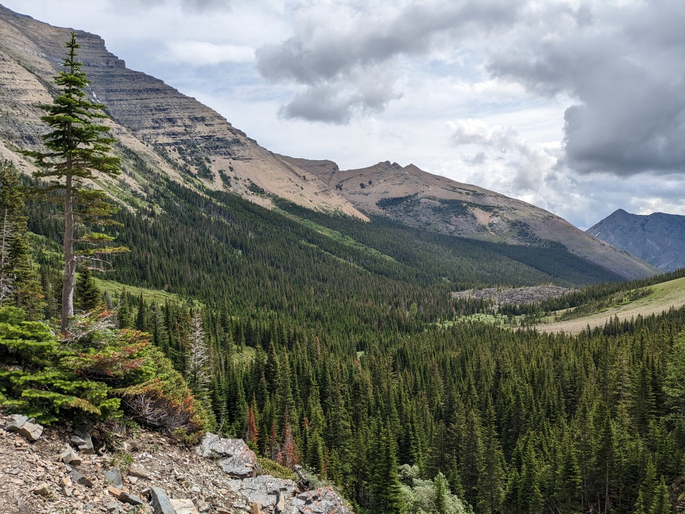

Later that day we decided we'd earned an ice cream.  One of the local souvenir shops also dabbled in ice cream - so much so that now it was an ice cream shop dabbling in souvenirs.  Then we went for a walk around the edge of the township.

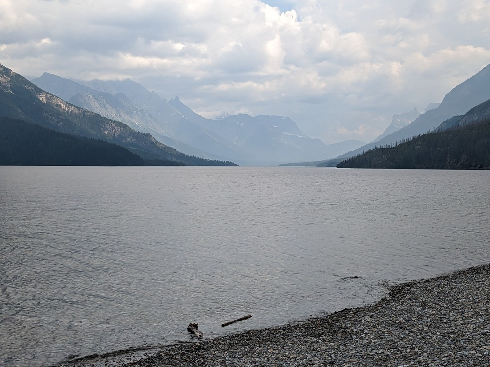

> The best views along the trail were probably just of the valley, not the waterfall

The walk was fine.  We were risking getting rained on - which it had done walking to the ice cream shop.  But fortunately we were fine.  So I'm going to spend the rest of this section talking about the ice cream.

They had a flavour called "Tiger Tiger".  It looked as you would imagine - orange with black stripes.  I asked what the flavours was and got told it was orange with licorice.  That didn't sound too enjoyable so I enquired about one called "Moose Tracks".  That one turned out to have plenty of peanut better - man North American's love their peanut butter.  So I decided to stick with the tiger ice cream.

It ended up being really good.  It was the same ice cream as Orange Chocolate Chip, but with a licorice flavoured swirl.  Probably the only reason it worked was because the swirl was not strong - so it was mostly just milky orange flavour, which I love.  It certainly beat whatever Betty had.

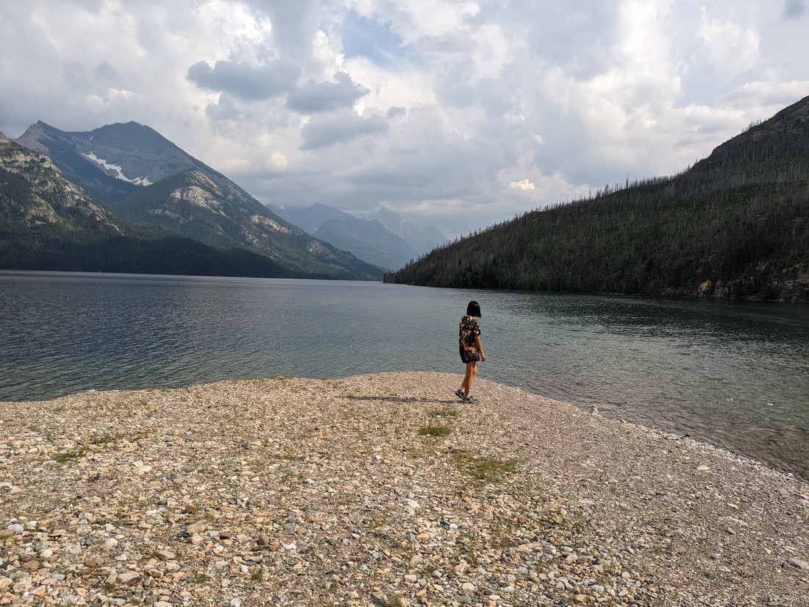

> Though likely she would disagree

And there was one last trip (well, a 600 metre walk) into town that night.  A while ago Luke had decided that he wanted to re-watch that animated spider hero movie that we saw only 10 days ago.  Well, the township of Waterton Lakes actually had a cinema and at 8pm they were currently playing Across the Spiderverse.  So that's how Luke spent an evening while Betty stayed home and didn't re-watch an amazing movie.  After the movie Luke did have to walk home in the pouring rain.  Fortunately Betty was considerate and drove to pick him up.  Unfortunately she mistimed her departure and Luke was already most of the way back already.  But fortunately he did have the foresight to bring an umbrella.

And that basically brings our time in Waterton Lakes to a close.  It has been three surprisingly good days considering we were expecting a lot of rain and a lot of the park ended up had been burned down (albeit a while ago).  Now it is time to head north and see what the rest of the Canadian Rockies will bring.  