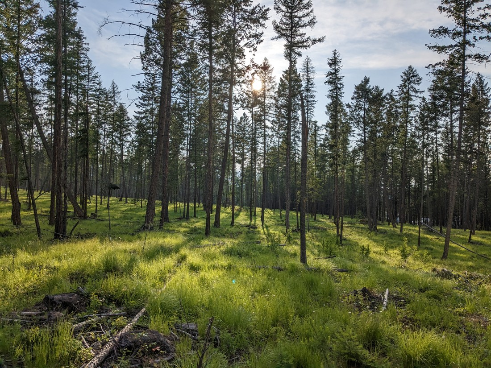

Today it was time to say goodbye to Waterton Lakes.  It had been a surprisingly good stay.  But on our way out we got a shock.  As we approached the parking lot for Bear's Hump (the first walk we did in Waterton Lakes) we noticed something different.  There was a stream crossing the road that wasn't there yesterday.  And then we saw the parking lot:

> Spot the Betty

A full half of the parking lot was covered in rocks and trees.  Remember when I said that it was raining when I had to walk home from the movies last night?  Well, it did a lot more than get me a little soaked.  In this particular place, part of the hill had been brought down.  A wave of debris had visibly swept over the track and into the parking lot - which was now closed.  Clearly a huge amount of water must have fallen last night, enough to change the face of a hill.

We found out later that night that almost all of the trails in the parks were now closed due to flooding risks.  When writing this blog post I checked and the road to most of the park's trails are still closed.  It was a good thing we were leaving and not arriving.  We took one last look out at the lakes before moving on.

Today we just planned to drive along to our next destination and make stops wherever we felt like making stops.  The first ended up being a paddock of bison, just inside the park border.  It didn't exactly overwhelm us - it very much just whelmed us.

Next we had to stop to get a photo with the park welcome sign.  But it didn't seem like Waterton Lakes had a sign like the ones we've been used to seeing in America.  This road sign was as close as we could find.

Next stop was a Walmart resupply and lunch.  We're back in the land of poutine and so we took advantage of that once again.  It's actually a surprised that chips covered in gravy hasn't caught on worldwide.

Then we found a waterfall:

This one was basically Niagara Falls but on a smaller scale.  Which reminds me again that we definitely need to get over to Ontario to see that at some point before we return to New Zealand.

Next we made a stop after seeing a sign for the "World's Biggest Truck".  It was definitely big.

There were other mining history related tourism stuff here, but does that really interest anyone?  What did interest me was a board with a bunch of holes in it:

> Some digital manipulation was done here

Our destination today was the town of Cranbrook.  After we went out for dinner we had to be deliberately vague to our hosts because we didn't want to admit that despite the many, many restaurants in town, we just bought some supermarket sushi.

The place we were staying was on the edge of the city and so for one last activity we decided to walk some trails behind their house.

