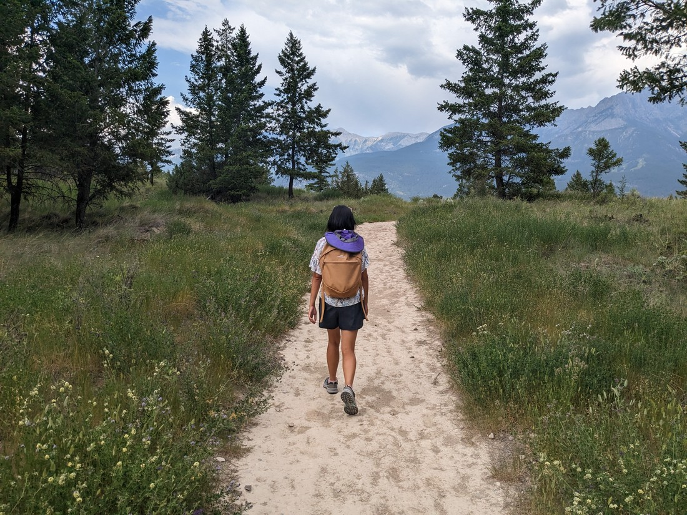
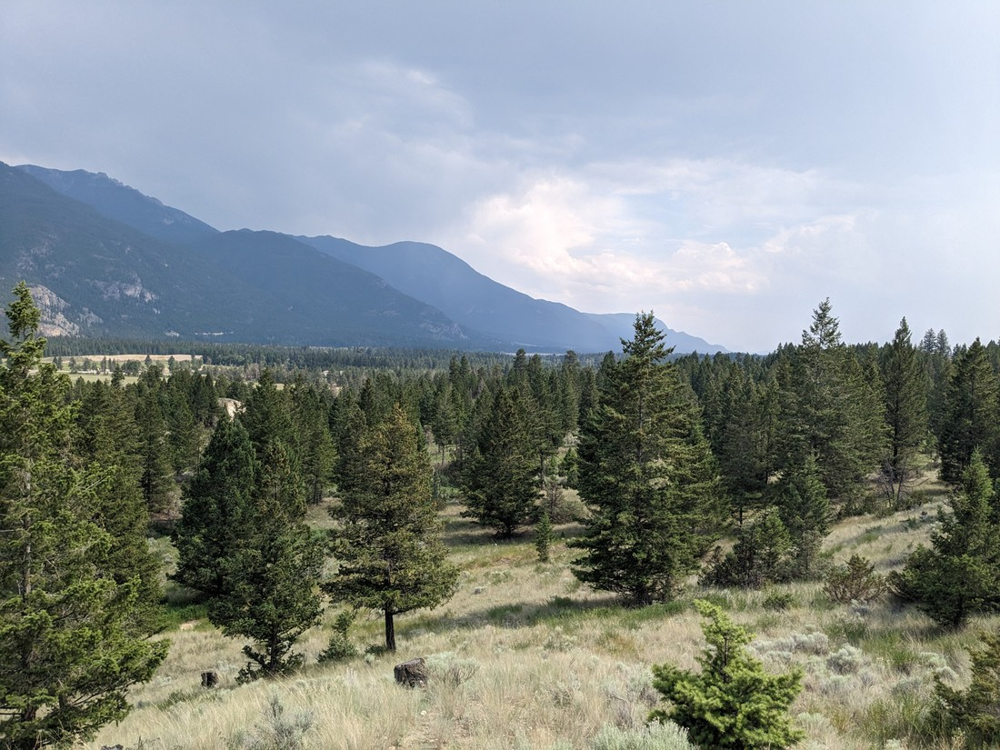
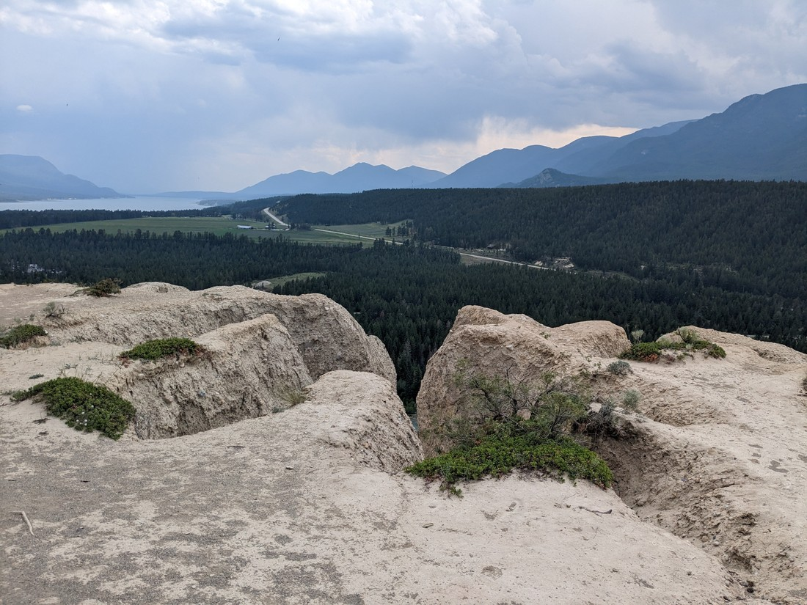
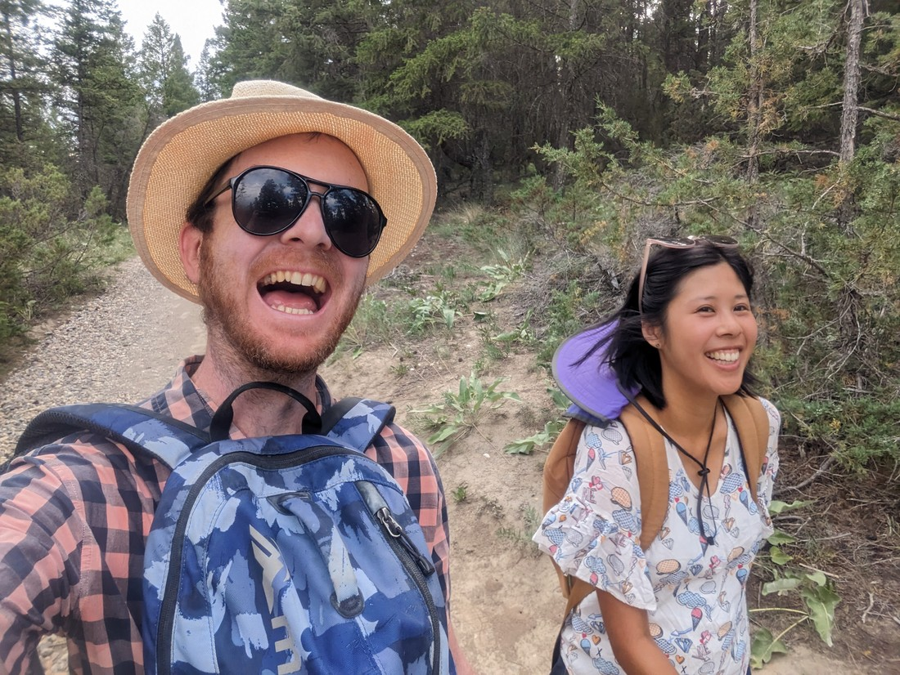

Today we were in Cranbrook.  It's a city.  It's just where I happened to pick for us to stay on our journey north.  But the most important thing about Cranbrook for us right now is that it's a city.  And being a city it has certain offices that we need to visit.

I don't think I specifically discussed in a blog post but our car was a lot pricier than we were expecting.  The asking price was already expensive.  Then taxes got added on.  After we got the final number and converted it to New Zealand dollars, it felt like the car was costing us twice what it ought to be worth.  Then we had an agonising wait while we did an international transfer for that large sum of money, hoping it wouldn't disappear into the ether.  Then when we went to pick up the car, we had to pay for insurance...

British Columbia is a bit unique in that all its vehicle insurance goes through one organisation - ICBC.  This is a blessing because it means we don't have to waste time shopping around.  But it does mean we don't have any choices.  We are required to have insurance in order to be able to drive the car.  And the way they do it is by assessing you based on your previous driving history.

And the problem here was that we had no previous driving history in Canada.

The insurance amount was eye watering.  I'm not going to name the exact number, but you'll get a sense of it later in the blog post.

But what could we do?  We had to pay it otherwise we couldn't drive.  We also had to pay it in one lump sum for the entire year because we had no bank account to set up a direct debit.  It seemed like such a good idea - come to Canada, buy a car, then go on a road trip.  But maybe there was reasons why lots of people don't do this.

Fortunately for the last month we've put all that behind us and have had a really enjoyable time touring round the USA.  But now we're back in Canada - it's time to get a few things straight.

We had set up an appointment to get Canadian licences.  This is necessary because by law we can only drive on our foreign licence for 90 days.  But it's not quite that simple.  Each province has it's own licence.  We haven't yet decided where we are going to settle so we can't really apply for a driver's license just yet.

We quite liked the Canadian Rockies last time we were here, so there is a chance we might want to reside in the province of Alberta.  But unlike many other provinces, Alberta will not allow a New Zealand driver's license to be exchanged without sitting a knowledge test.  And if we pass, we only get a learner's license.  Then we would have to apply to a thing called Service Alberta Special Investigations Unit for an exemption.  This might take two weeks, during which we'd be only on learner's licences.  And even if that is granted, we still don't get our full license - we'd still have to sit the road test first.

However Alberta will exchange a driver's license from another province without any fuss...  And apparently British Columbia does exchange a New Zealand driver's license without any fuss...  But in order to get a British Columbia license we need to be living in British Columbia.

So yeah, we decided that we're living in British Columbia right now.  We don't really have any evidence of that.  Actually that's not true - we own a British Columbia car, that sounds like something someone living in British Columbia would own.

So we booked an appointment at a government office in Cranbrook (which fortunately happens to be in British Columbia) to exchange our licenses.  We turned up at 9:45am, only to learn that their systems were down.  Probably will be working again later in the day.  So we got rebooked for 12:30pm.

We came back at 12:30pm and have to wait, but eventually we were able to start going through the process with someone.  Part of it was that we had to answer some questions about the road rules.  They weren't exactly easy, but together we were able to give enough satisfactory answers.  Then we had to say goodbye to our New Zealand licenses.  That felt weird, but the rules are that a person in Canada can't have two licenses.  Guess we'll have to ask for new ones to be reissued once we're back in New Zealand.

We walked out there with yellow papers that are temporary licenses, with the real ones being mailed to an accommodation we won't get to for another few weeks.

But that's not all the government related hoops we had to jump through today.  Remember that I said we had to pay an eye watering amount for car insurance.  Well, we were told that we could have this recalculated once our previous driving history was recognised.  And fortunately British Columbia accepted our New Zealand license issue date as when we started driving.  So now, for insurance purposes, we're no longer two individuals who have never driven a car before.  Now we're two individuals who have been driving for a combined total of 30 years.

We sat down with an insurance agent and we were able to have them recalculate our annual insurance.  The refund was over $3,300 New Zealand dollars.  That should give you an idea as to how eye watering the amount we had to originally pay for insurance was.

But this wasn't smooth sailing either.  Apparently I existed twice in the system.  Apparently the original insurance person had mistaken my middle name for my surname.  So we had to get that corrected.  Maybe it's because New Zealand licenses are a bit confusing.  Betty and I both had our licenses reissued within three months of each other, but the layout on our licenses was completely different.  Poor Cranbrook public servants - we definitely didn't make it easy for them.

It may have taken a while but today was an unequivocal success.  Failure would have been being told, "We can't do that today, you'll have to come back another day."  Well, we're only in Cranbrook for one day so that would have gotten tricky.  But no, everything worked out.  We're now free to drive north into the Canadian Rockies and spend the next few weeks or so in parks and small towns without having to worry that we won't be able to get licenses or that we're going to be stuck with crazy high insurance premiums.

Now it was the middle of the afternoon - time to do a walk.  There wasn't too much around but we did find one to some Hoodoos.

Only problem was that when we started walking it was kind of raining - albeit only slightly.  Except we could see a definite rain storm nearby.  If it came our way we were going to get soaked.

> It doesn't really show up, but trust me that the rain storm is there

We pressed on and just crossed our fingers.  Fortunately this time we got lucky.  We watched the rain storm pass us by, perhaps only a few kilometres away.

The Hoodoos at the end of the trail ended up being a bit disappointing.  We'd seen the cliffs from the road side, but now we were on top of them.  It made a good view of the surrounding valley but it was a rather poor view of the rock features.

The walk really didn't take too long, but that was fine for us.  Today wasn't about walking - it was about doing admin stuff so we could live in Canada.

> Well, we will need jobs at some point

Unfortunately when we got to the town we were staying in we'd caught back up to the rain storm.  And it looks like this rain might stick around for a while.  But the place we're staying in for the next three nights looks really nice (Betty is already calling it one of her favourites) so it should at least be a comfortable time for us.
