Hey Luke - What happened to the blog post for June 14th?

This isn't a QA blog.  How did you even get in here?  But to answer your question, rain happened to the 14th.  I don't think it stopped raining at any point during the day.  We drove to a nearby town to look in the second hand stores.  Betty is about to finish the book she brought from New Zealand and so needed another.  But we left without buying anything.  Overall not a day worth mentioning further.

But as for the 15th, it was... slightly better.  "Aggressively cloudy" is how I might have described the weather.  There was a layer of overcast-ness high up, with patchy clouds lower down obscuring the mountains, and then on top of all that there was a haziness around.

But a forecast of "cloudy" is not a forecast of "showers" - so it was time to head out.

We are staying in a town called Radium Hot Springs, which is right on the doorstep of a national park called Kootenay National Park.  So we decided to head there.  However, considering it's park border is shared with the famous Banff National Park, there isn't a whole lot to do in this park.  There's only a single road, that runs through the park.  And sure there are some walks, but not really that many.  The only trail close to half a day was a strenuous 20km return climb to an alpine lake.  Ordinarily that is something we could attempt, but given the weather it might end up being eight hours of walking through clouds, seeing nothing.

So we just picked out a bunch of short trails.

The first was Marble Canyon, which was a slot canyon of sorts.  Unlike the ones in Utah this canyon had water running through it.  In fact, it had a lot of water.

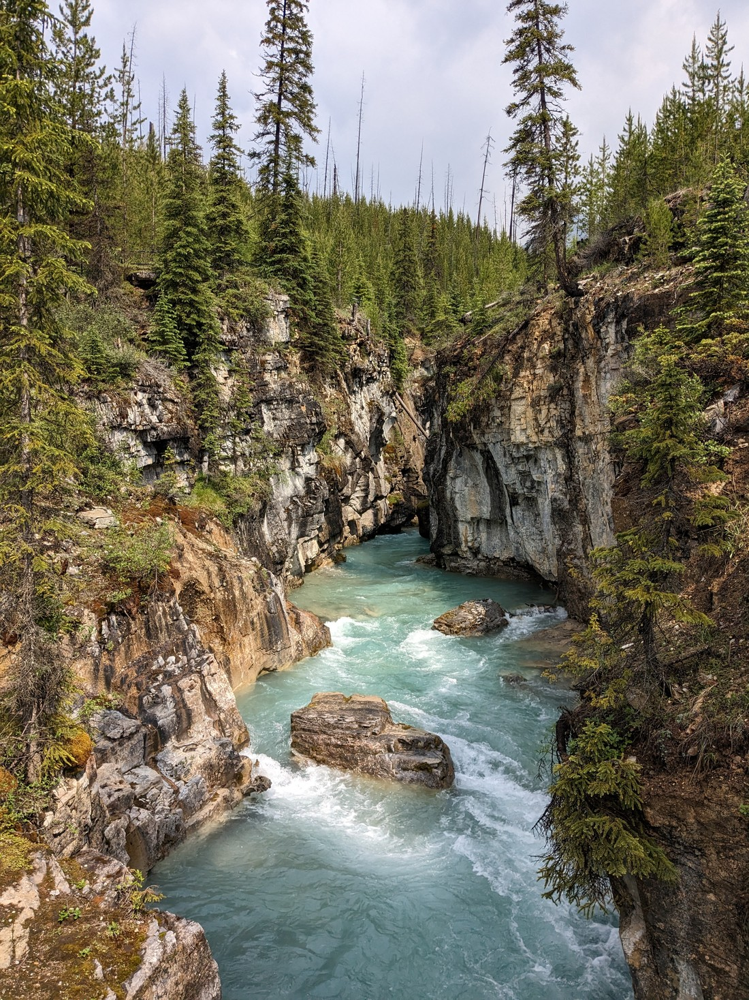

> The teal blue waters of melted snow

The walk reminded us a lot of Maligne Canyon in Jasper National Park.  A short walk crossing bridges staring down into the depths of a narrow canyon at the water rushing through.

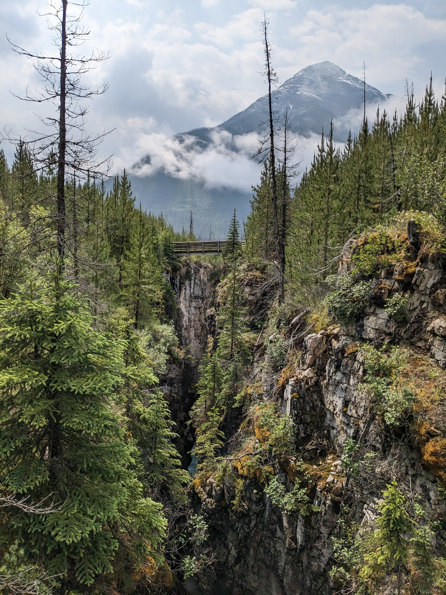

We could easily see why this was the most popular trail in the park.  The canyon certainly made interesting viewing.

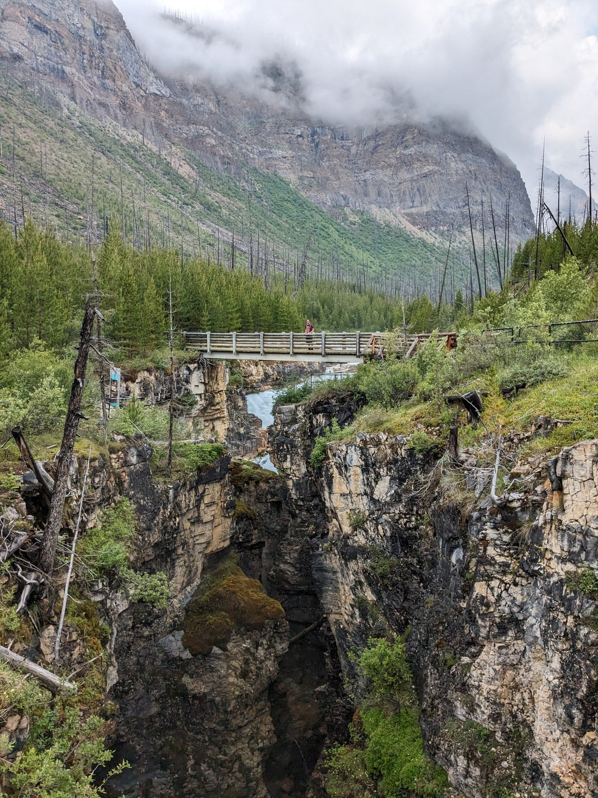

> Sorry, my hair is a mess in this photo

But the reason the walk wasn't very long was because the canyon also wasn't very long - perhaps only a couple hundred metres.  We got to see the water flowing out of the canyon at one end, and the water cascading into the canyon at the other.

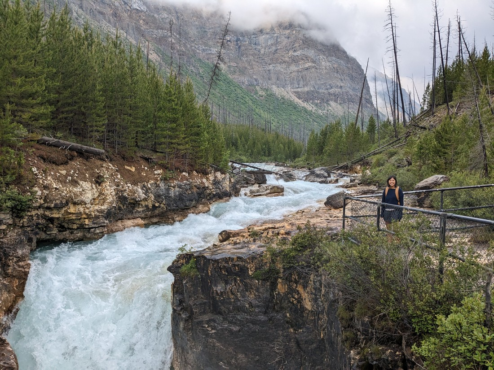

> Betty's hair is as beautiful as ever in this photo

And overall a good hour of the day spent.

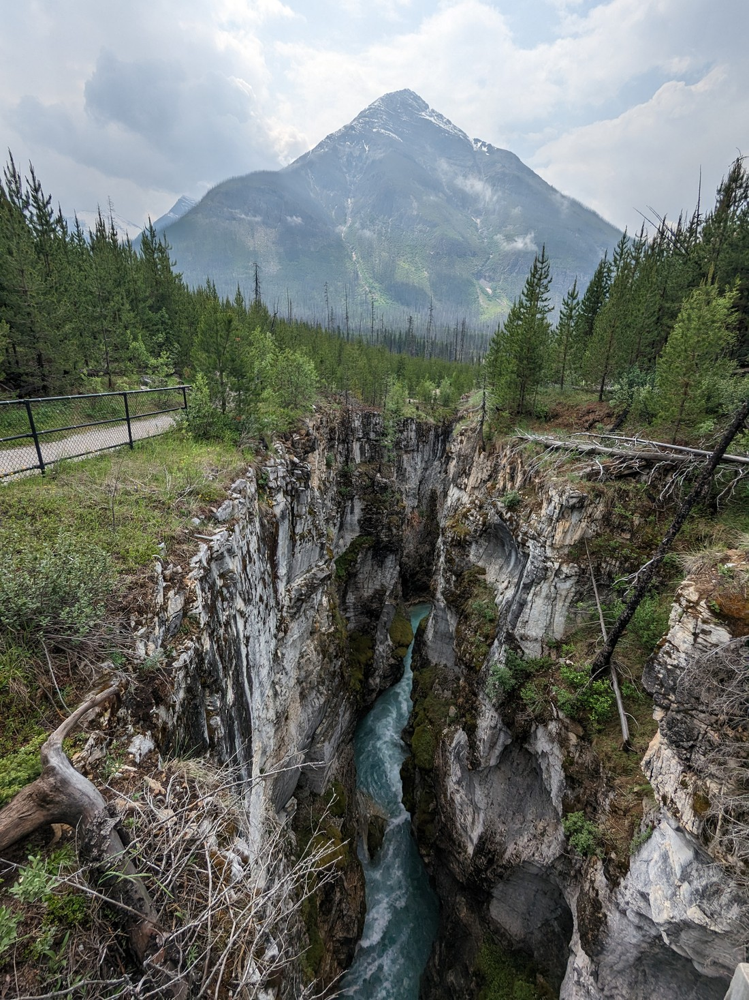

The next walk was a short one to a place called the Paint Pots.  But when we got there we found that it was closed.  Some sort of indigenous event or ritual or something - today only.  The sign letting us know this advised that there was a detour, but didn't specifically say why a person might want to use the detour.  I was 90% sure that the detour was for some other trail, but we figured that while we were here we may as well do some walking - there wasn't actually much else planned for today.

The detour started alongside the same stream that had flowed through Marble Canyon.

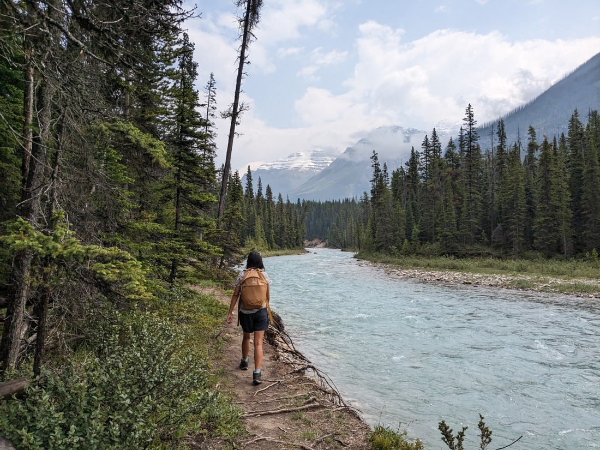

But it quickly turned away.  After maybe 20 minutes of walking we got to the end of the detour and confirmed that it did not lead to anything interesting.  So overall another 40 minutes or so spent on a not unpleasant forest walk.

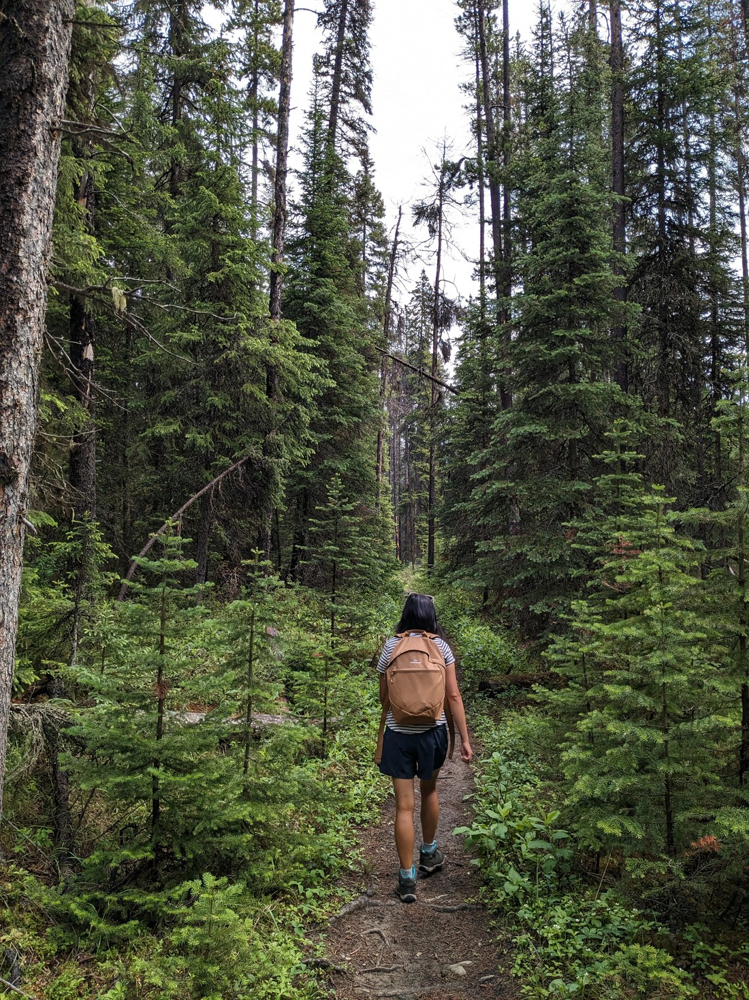

The last stop was a waterfall.  It was fine.  It had plenty of water, but it didn't exactly fall very much.

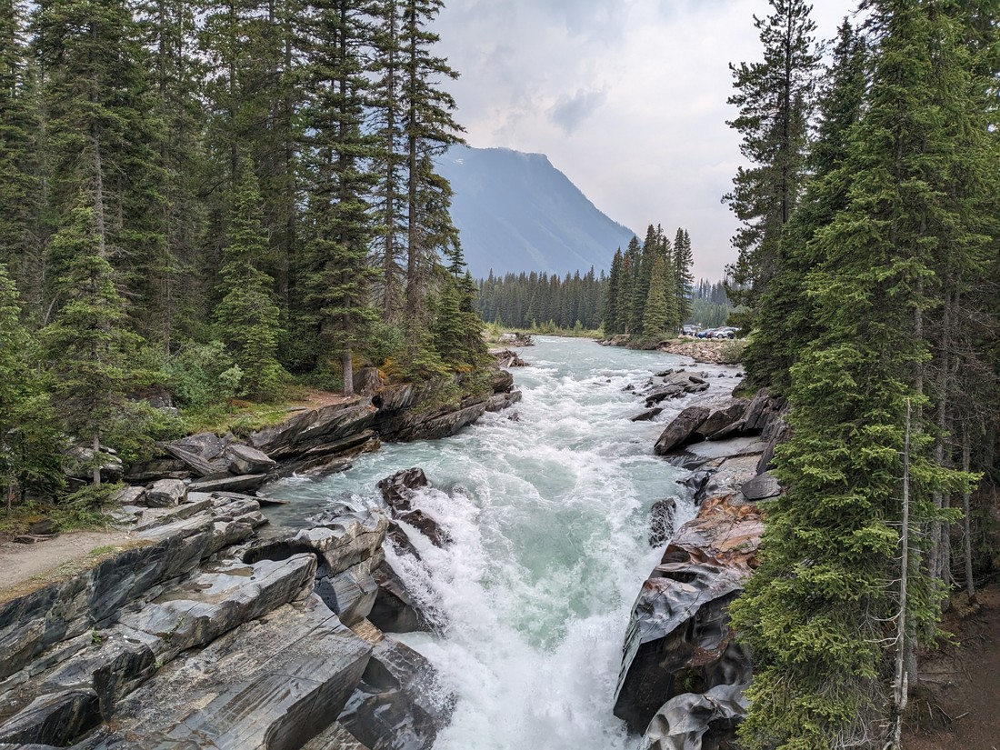

> When is it a waterfall, and when it is a very steep stream?

And with that we headed back to Radium.  There was a scenic viewpoint on the road which we could have stopped at on the way out, but there really was too much cloudiness and haziness around.

But later that day we decided to get one more walk done.  This one was on the doorstep of the park.  It first went down into a valley to see a waterfall that couldn't be properly seen (due to corners).  Then it went up the hill.

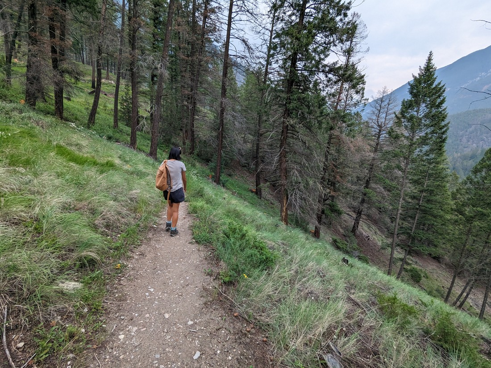

This was supposed to give us some good views over the greater Radium area.  But it really didn't look that great.

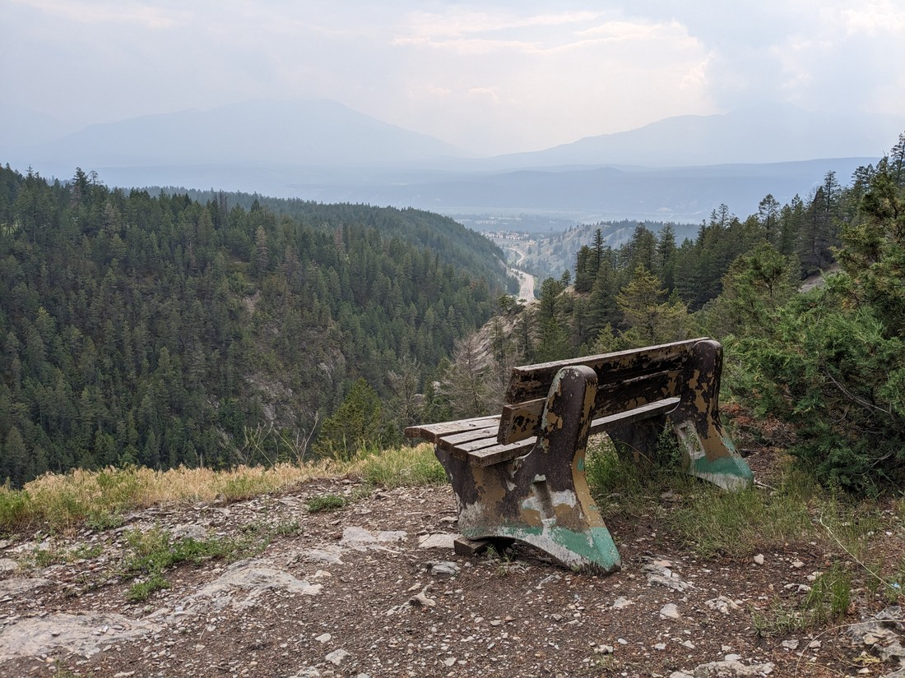

> Where are the mountains?

What was this haze?  Today was supposed to be a decently nice day, but this haze just hung everywhere and made everything seem so grey.  Is this wildfire related?  We're certainly a long way from the eastern fires.  Maybe there are other (smaller) fires around.  Maybe smoke can be blown surprisingly far.  Maybe this was just a hazy cloud that is kind of normal in these places.  Whatever it was, it really made the day less scenic for us today.

Our trail returned to the road, and supposedly continued on the other side - but we could not find this supposed trail.  So we made a different loop by walking back down the road.

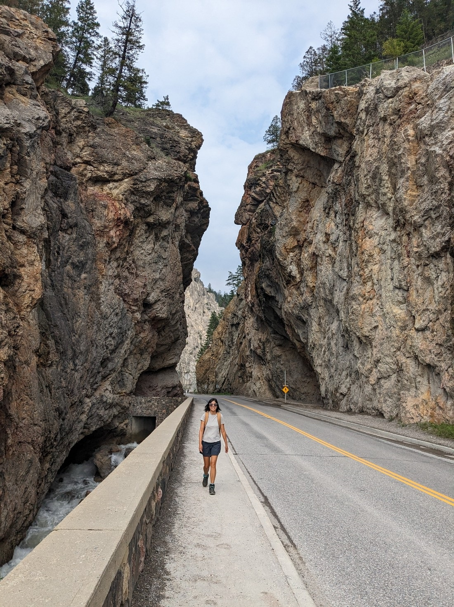

So that was it for our three nights in Radium.  We certainly didn't achieve very much.  But I suppose we would have achieved even less if we'd had fewer days here.

These days were originally intended to signify when we'd start looking for jobs.  This is why we have a longer than usual stay in one place in Waterton Lakes, Radium, and in Golden - the next place we are staying which is only one hour north of here.  With our rainy day we did get our job hunting done, but we definitely aren't putting a whole lot of effort in just yet.  This is perhaps because were not yet ready to finish holidaying.  Which is good, because there's still plenty more days of holiday accommodation still booked.

