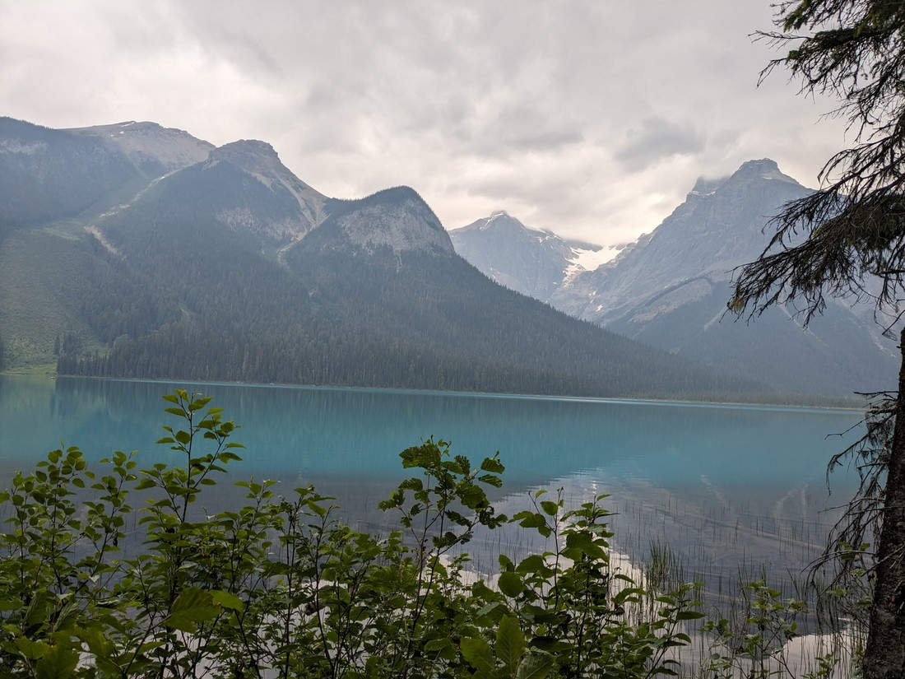
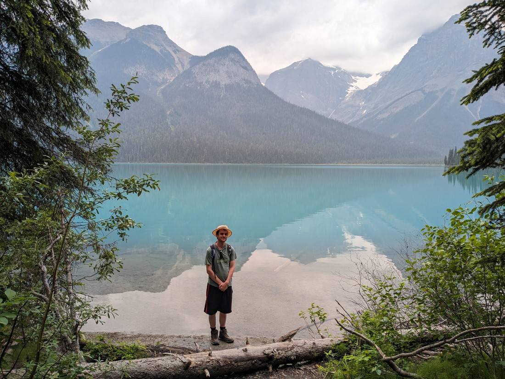
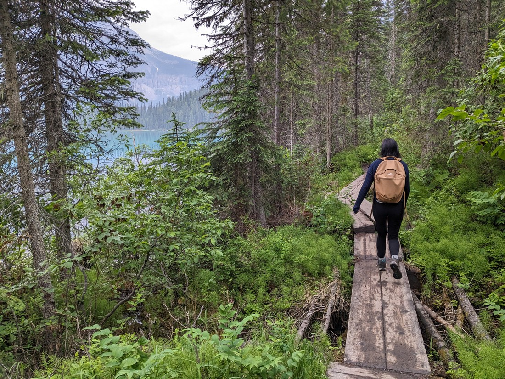
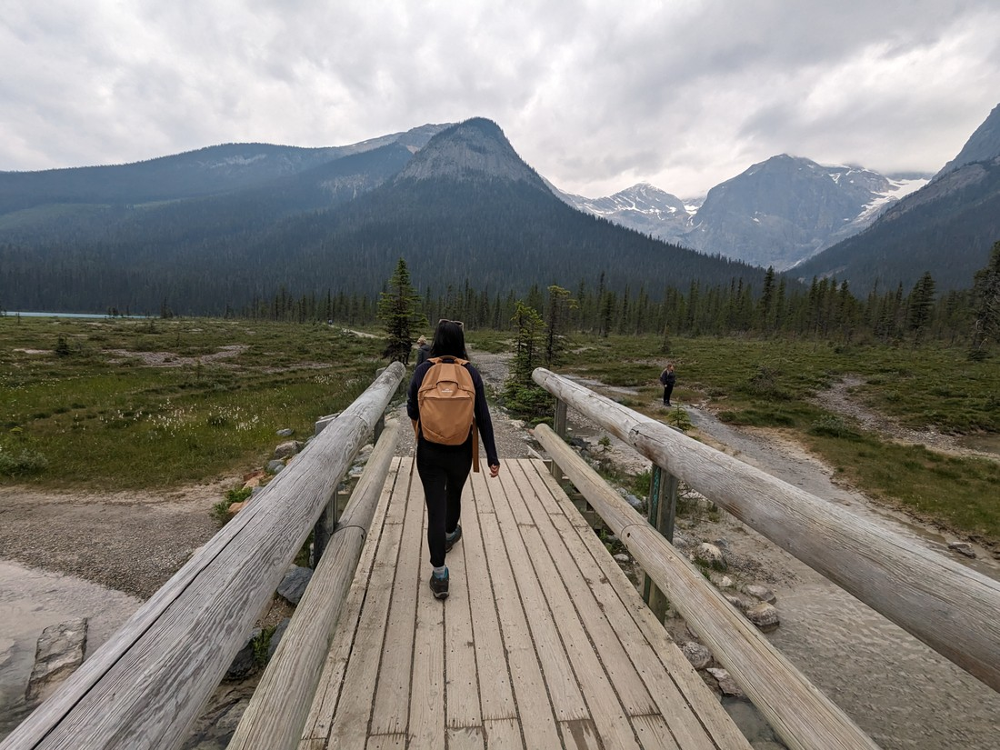
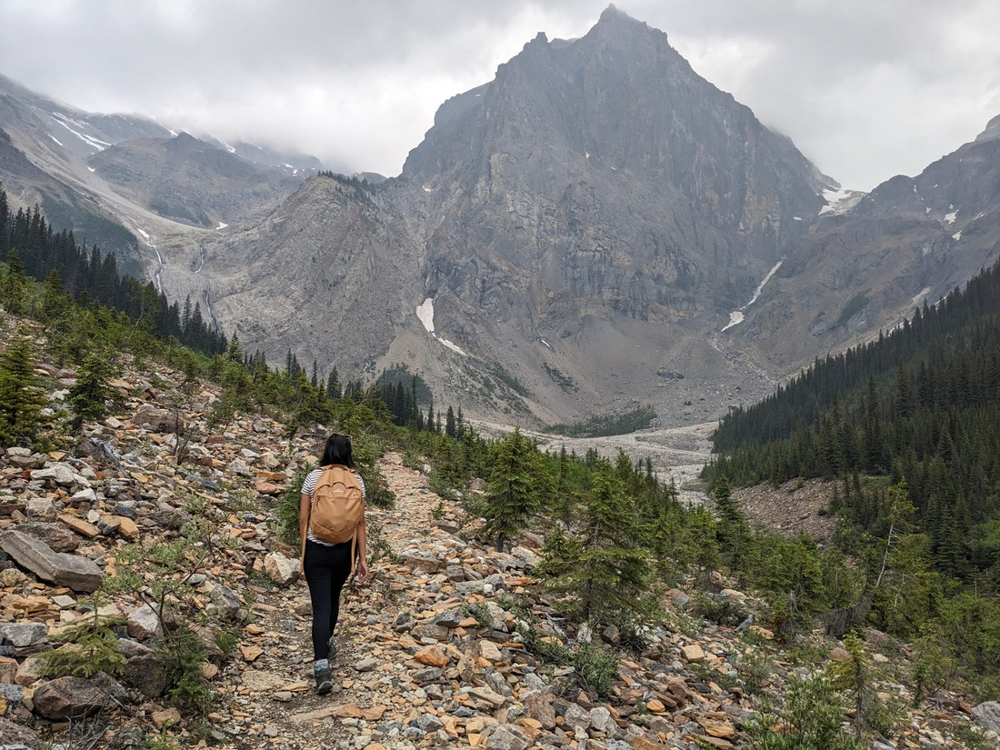
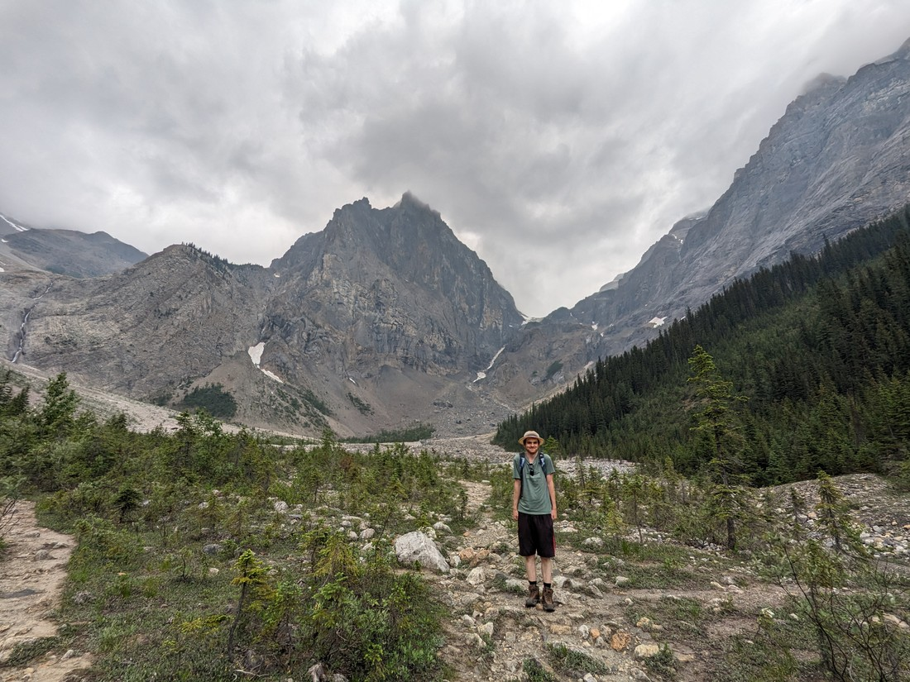
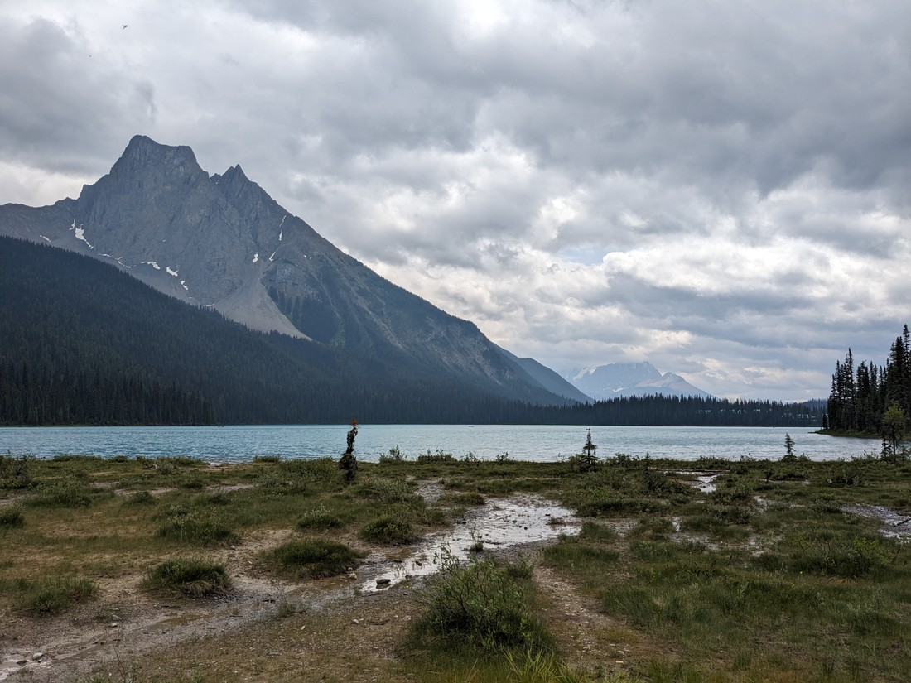
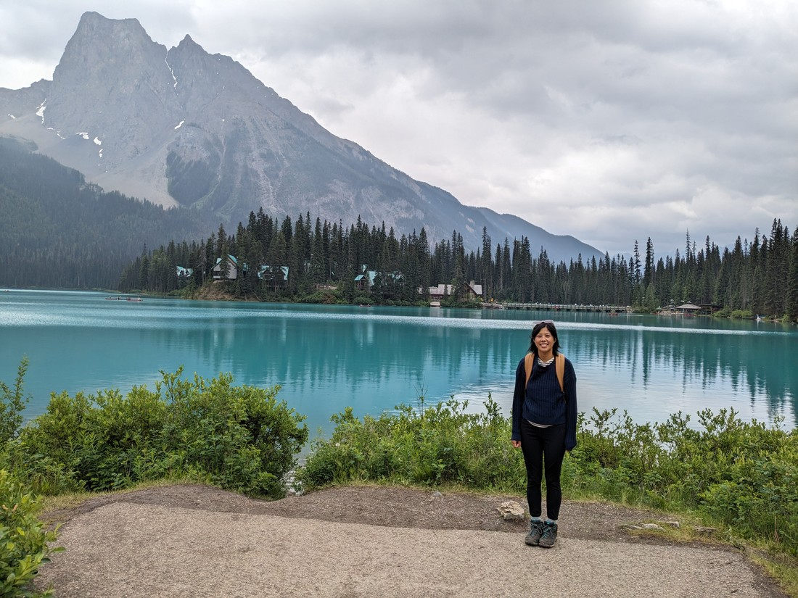
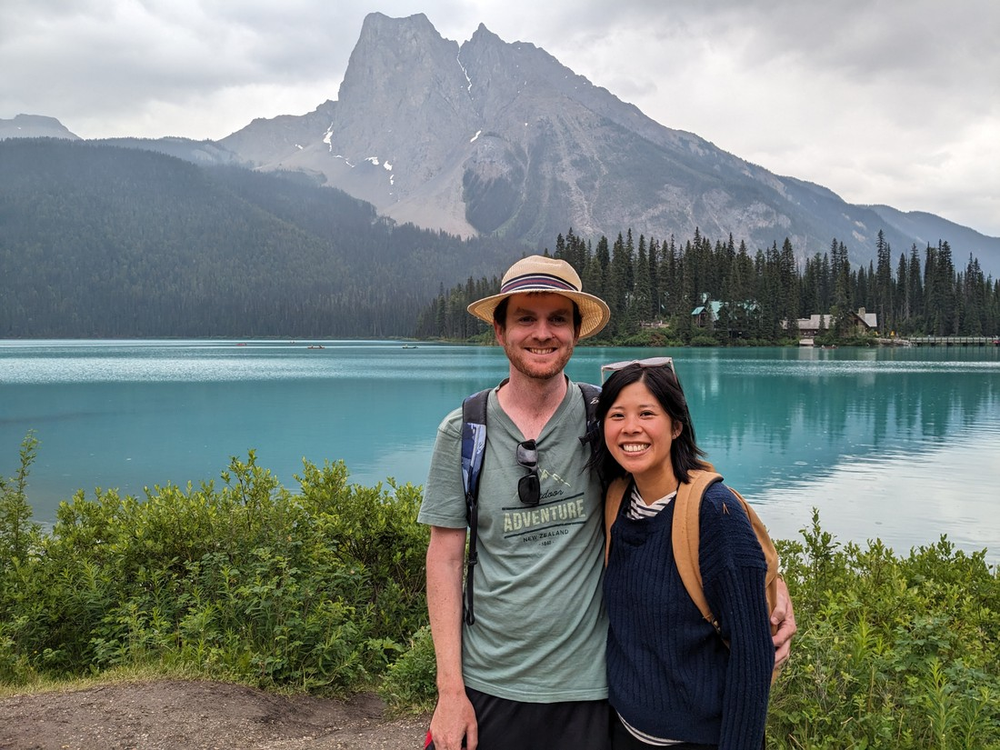

Today we were heading north to the town of Golden, which (like Radium Hot Springs) was on the doorstep of a national park.  This one was called Yoho National Park.  However Golden was also within driving distance of a second national park, so we definitely wanted to make the most of our time here.

So the first thing we did was drive straight through Golden and into Yoho National Park to see a place called Emerald Lake.  This lake is described as being very similar to Lake Louise, but less busy.  Well, on arrival we noticed that cars were parked all the way up the side of the road outside the carpark.  So we drove a loop round the carpark and found that every park, and every metre of possible roadside parking was already taken.  So much for being "less busy".

Well, we'd driven all this way and had nothing else to do, so we just resigned ourselves to driving the parking loop repeatedly until we happened upon a spot vacated by someone leaving.  Fortunately it only took one more loop to find such a spot.

Regarding the description of the lake, I will certainly agree that Emerald Lake is true to its name.  The colour is also very reminiscent of Lake Louise.

> Well...

But while the weather forecast was generally okay (more on this later), right now the sky was overcast.  In fact, it was more overcast than I had thought possible.  Everything just seemed darker than it ought to be.  I guess this is due to the same haze that plagued us yesterday.  So unfortunately we don't have a bunch of amazing photos of us with the stunningly teal-coloured water.  We just have a bunch of photos of us with the teal-coloured water.

We picked out a walk that went around the lake, and up to a place called Emerald Basin.  And that's what we did.

We (perhaps stupidly) picked the direction around the lake that was going the opposite to everyone else.  So we were regularly passing people going the other way.

> Which is not pictured in the photos of course

Then half way round we took a side track up to the Emerald Basin.  There wasn't many side tracks and this seemed the most interesting.

But as we were most of the way there (almost the furthermost point from the car) it started raining.  And while it was not a hard rain, it was not a nice light rain either.  It was a cold rain.  And this part of the track just happened to be out in the open, completely free of the tree cover.

And what did we have to show for it?  What even was the "Emerald Basin"?  I think there is supposed to be a glacier here.  Is that it in the photos?  If so, it's hard to tell what is sky and what is glacier, since they're both the same white at the moment.

So overall not the best destination.  I suppose the valley probably does look quite nice on a nice day.

> So many clouds...

Fortunately it didn't stay raining.  As we finished the walk around the lake it actually became kind of nice.

> Or maybe this part of the lake just looked a lot better

Despite the experience, I am glad we came here.  Emerald Lake is to Yoho National Park as Lake Louise is to Banff National Park.  While the parking lot was completely full when we arrived, it is possible that on a more summery day this place would have been even more populated.  It is possible that we saw it at its best.

Okay, it definitely could be better.  But we are at the mercy of the weather.  I think June is the rainiest month in this part of the country.  When booking our trip I had hoped that there would be enough fine days, but I guess I was being over-optimistic.

Still, we are having a good time.