Remember yesterday when I said that the town of Golden is within driving distance of a second national park.  Well, it's time to introduce that park.  It is called Glacier National Park, which might sound familiar.  "Hey, wasn't Glacier National Park where you got super rained on like a week ago," you might ask.  And you'd be correct - but that was back in the USA.  This park has the same name, but in Canada.  But it isn't as famous so I think people basically just refer to it was "Glacier National Park of Canada", in order to differentiate the two.

I wasn't intending for us to visit Glacier 2 while we were in Golden.  This is because this park is very alpine.  Out of all the mountainous parks in Canada, Glacier seems to be the one that takes the longest to thaw.  Many of the park's trails are above the treeline, and therefore have a high danger of avalanches.  But the park did appear to be open, so we picked out a trail that didn't go too high.  Besides, no point going too high if the peaks are going to be covered in clouds anyway.

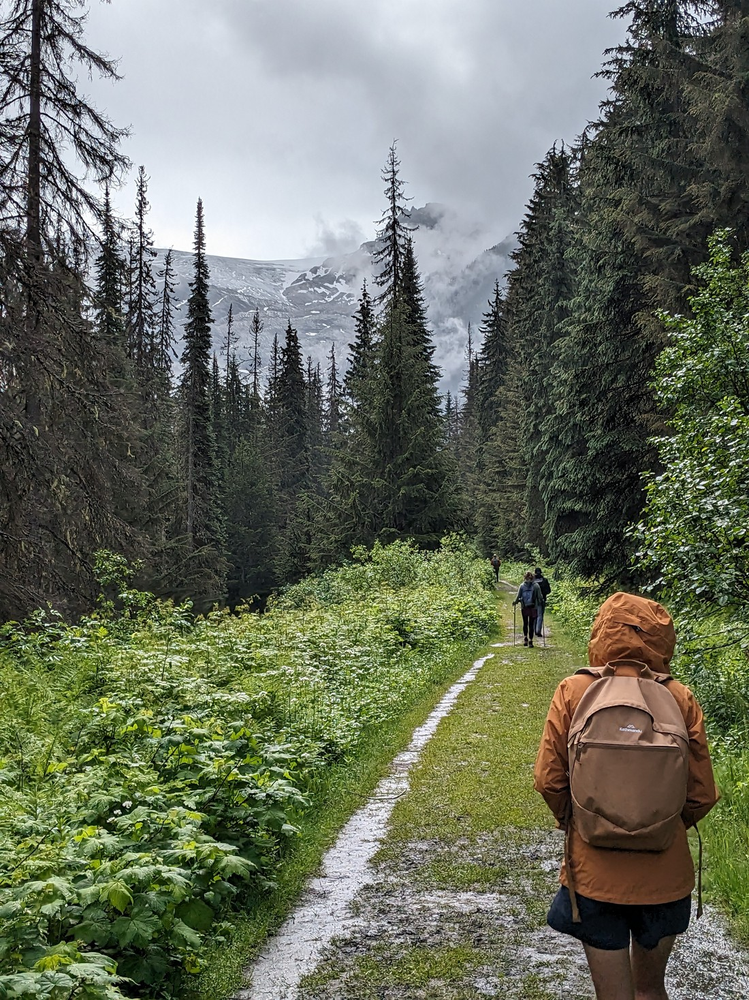

Speaking of which, I checked the weather forecast before we started driving.  The weather in the town west of the park was supposed to be fine all day.  The weather in the town east of the park was supposed to be fine all day.  So imagine my annoyance to arrive in the park and have the rain start teeming down.  I guess just because it is fine all around does not mean it can't be raining in this one particular spot.

But it was supposed to be sunnier later in the day so we made the assumption that the weather would clear.  We put on our rain jackets and headed off.

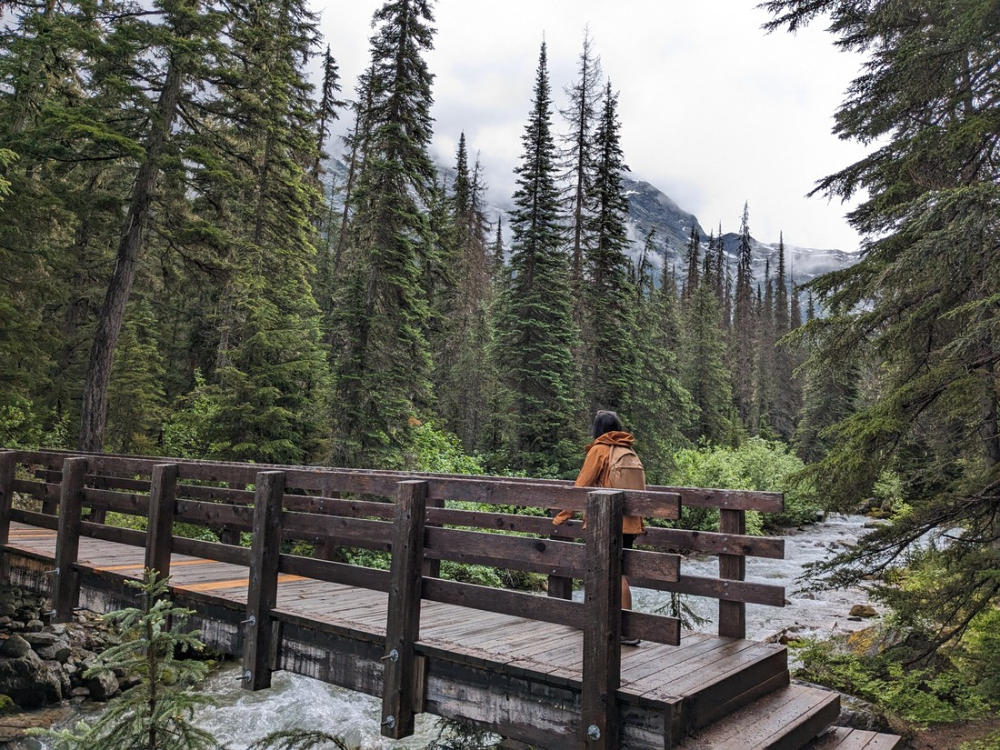

And our assumption proved correct.  The rain did clear reasonably quickly.  Which was good because we don't want to be stuck in the middle ground where we have to estimate which is greater - the amount of rainwater our jackets keep out, or the amount of sweat our jackets keep in.

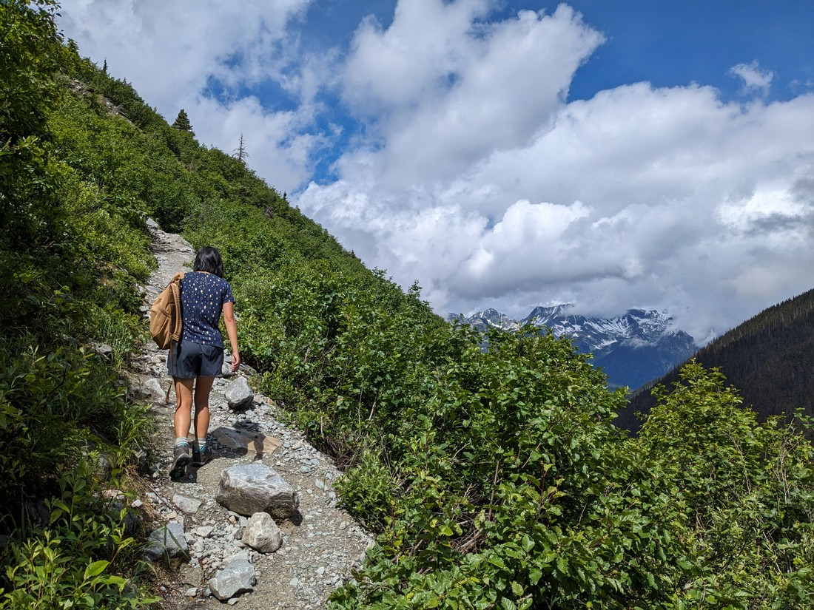

> And inclines result in a lot of sweat

It was actually quite a nice day.  We woke this morning to find the haziness of the last few days lessened, if not gone completely.  That was a relief - we were worried we might be stuck with it for a while.

As I said, we picked out an only mildly steep walk.  Only several hundred metres of elevation to climb.  It was called the Great Glacier trail - sounds promising doesn't it?

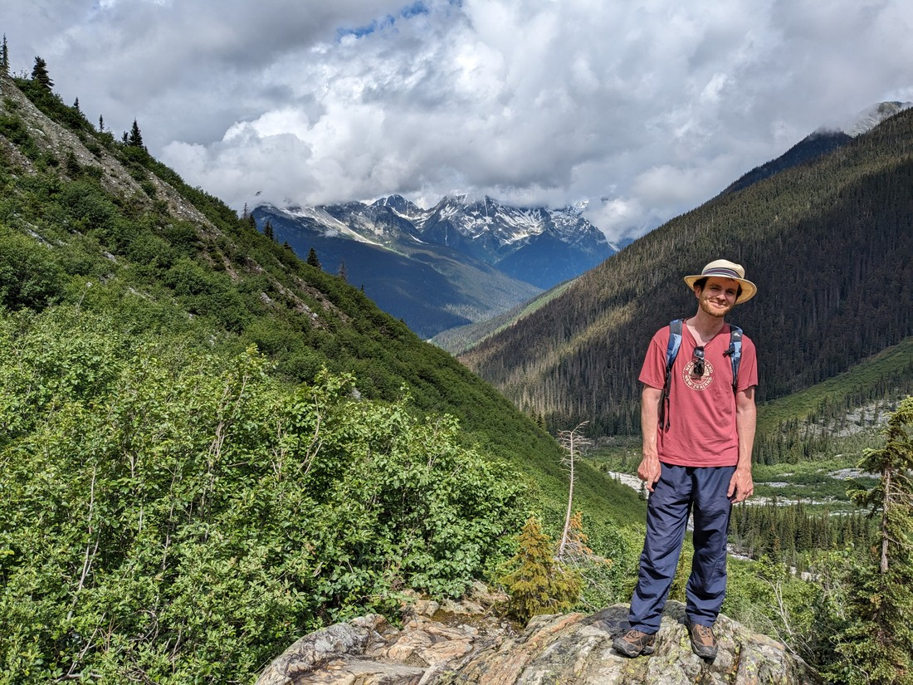

Well, not quite.  This trail was to a viewpoint to where a glacier... used to be.  The glacier is still there apparently, but it has shrunk round a corner and can no longer be seen from this particular position.  So what is this trail a walk to?  Well, it is still a nice view.

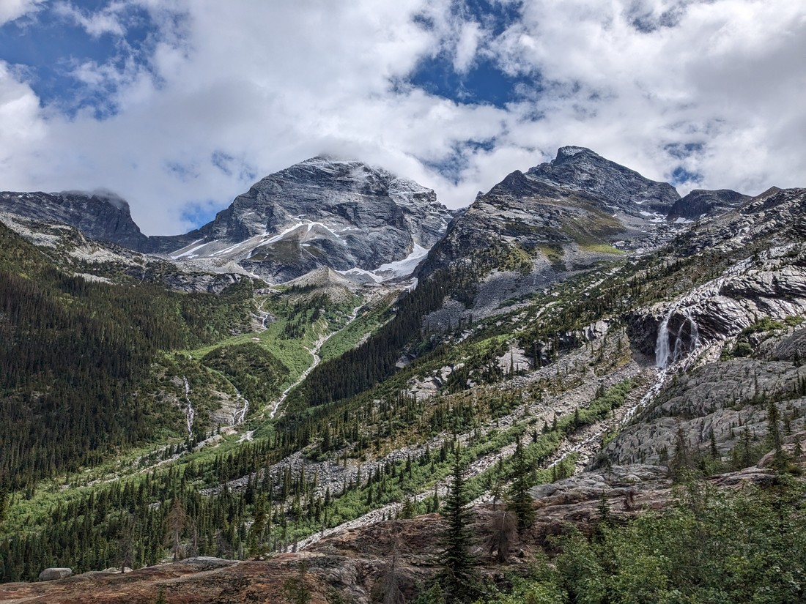

It did make us wonder whether this was the end of the trail.  We weren't even at the top of the hill we'd been climbing for the last 15 minutes or so.  We'd come round a corner, crossed a small stream and then all of a sudden there was a "Trail end" marker stuck to the rock.  You'd think that was pretty definitive - this is definitely the trail end, but that didn't stop me scampering up the rock face to see what was above.

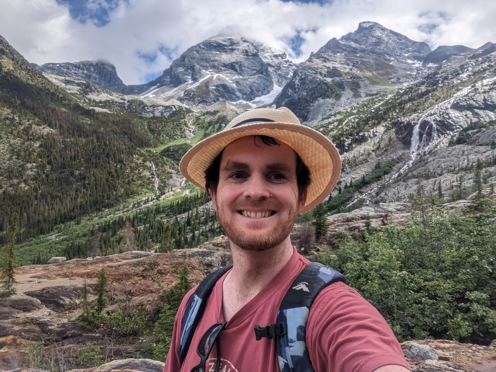

> The answer was "more rock"

So it was just the nice view that was our reward.  And while it seemed abrupt, it was still a nice place to be at this particular day and time.  After several days of rain and haze the weather finally fined up for us.

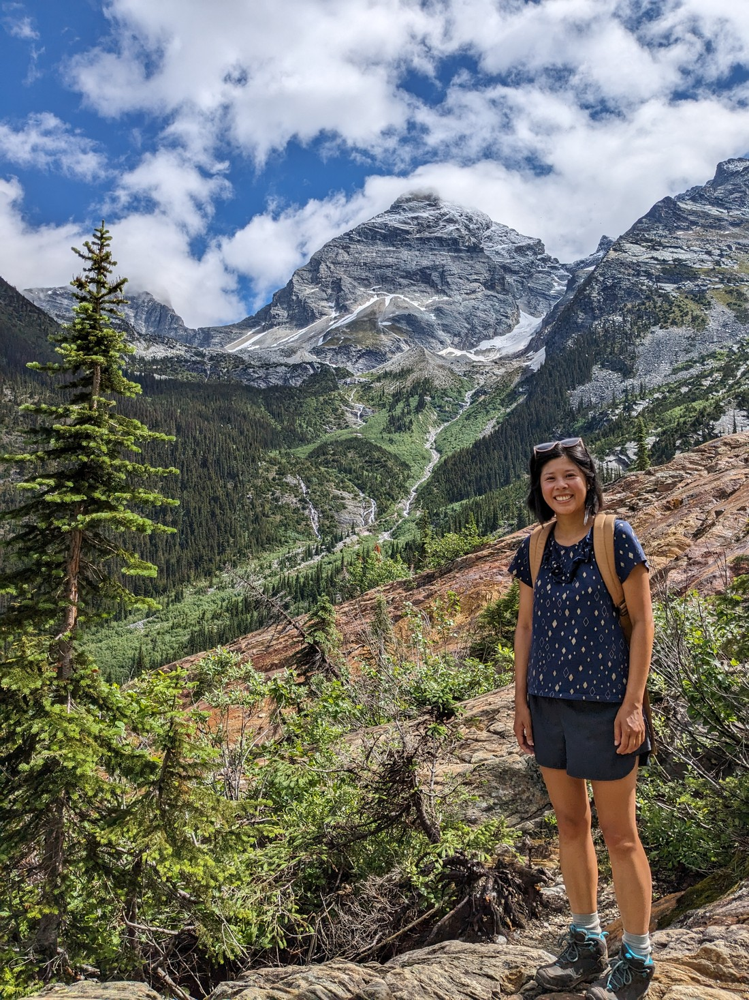

Something interesting about this park is that apparently explosives are used to deliberately trigger avalanches in order to make areas safe.  After hearing this, I imagined this process would be done by throwing dynamite out of a helicopter - I feel like I've seen videos of that in the past.  But we had passed a warning sign that showed an image of a (modern) cannon.  So many someone has the job each spring to set up a cannon and fire explosives at the mountains.  Sounds fun, but probably not a job we might be able to get.

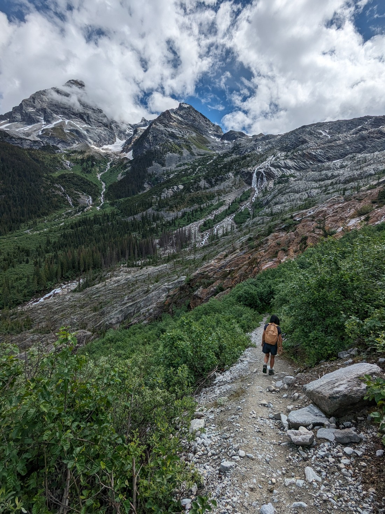

On the way back we did a short detour to a place called the "Meeting of the Waters."

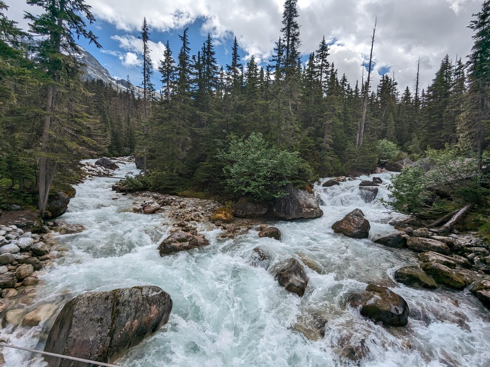

What we got was basically what we ought to have expected that we would get:

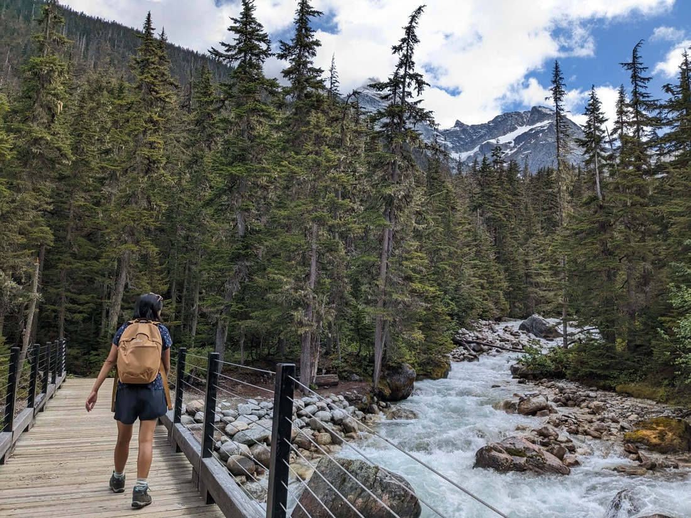

> Although "joining" might have been a better word than "meeting"

Because the walk was only mildly strenuous, we were done rather quickly - we were done not long after noon.  On the way out we passed a park ranger who had set up an info station.  Since we were heading back to Golden she recommended that we check out a waterfall walk since we'd be driving right past the trailhead.

From the parking lot the trail went straight down the side of a hill.  At the bottom of that hill was a climb back up, only for us then to have to go back down again.  This walk would definitely be one of the steepest walks we've ever done.  But that's only in terms of elevation change per metre of horizontal change.  Since the walk was rather short it was manageable.

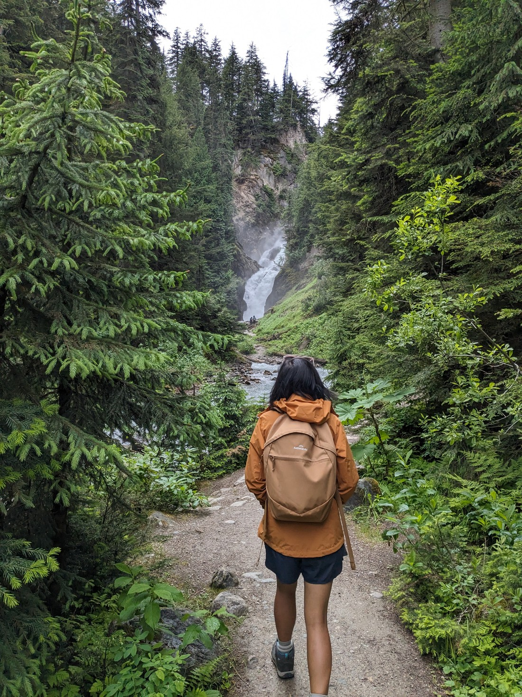

We were told to bring our coats by the ranger.  And the ranger wasn't wrong.

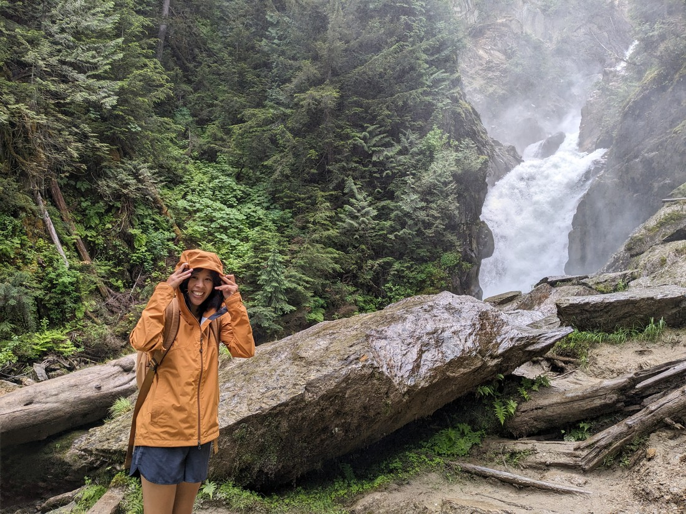

We didn't get that close to the falls, which was in a bit of a canyon.  What seemed to be happening was that the canyon was funnelling all the spray out of the canyon straight at the trail.

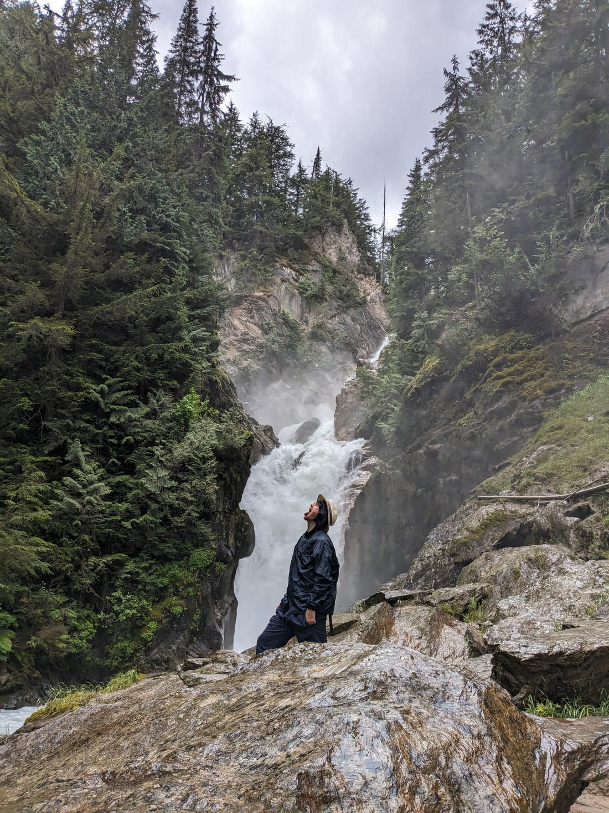

> Hiking is thirsty work

Overall it was quite an epic waterfall - so much water.  Just a shame we didn't manage to get closer.

And even after that walk we did get back to town quite quickly.  So we had a walk around.  Then we went to a pizza place recommended to us at our hostel.  We picked out a vegetarian "Samosa Pie" flavoured pizza.  It was nice, but it didn't seem like it had the promised potato pieces, to go with the baby peas and "pineapple curry" sauce.  Being impatient, I made a mess while eating.

Then later we had ice cream, which somehow made more mess.  On the walk back to our hostel Betty couldn't stop glancing at the mess I made on my pants, and then laughing hysterically.  It's always nice when food brings this much happiness - at least for one of us.

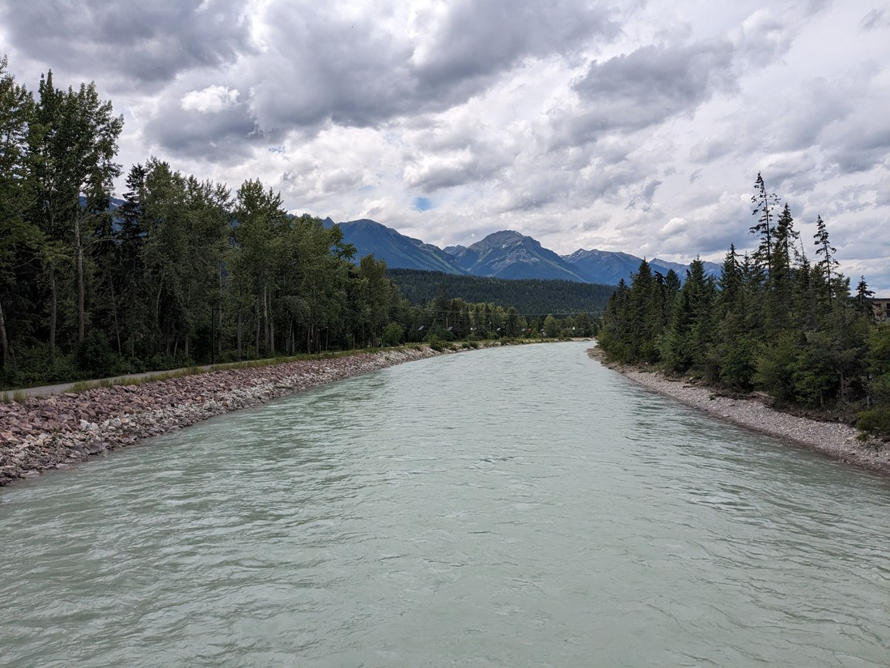

> I decided not to post the picture Betty took - instead here's one of the river flowing through the town

Glacier National Park of Canada feels smaller than I was expecting.  While we are leaving this area soon, we are returning in July to spend more time here.  I don't know how many more walks will be worth doing, but that's not really a concern right now.  Right now we are more concerned about the weather - because unfortunately the rain appears to be returning tomorrow.