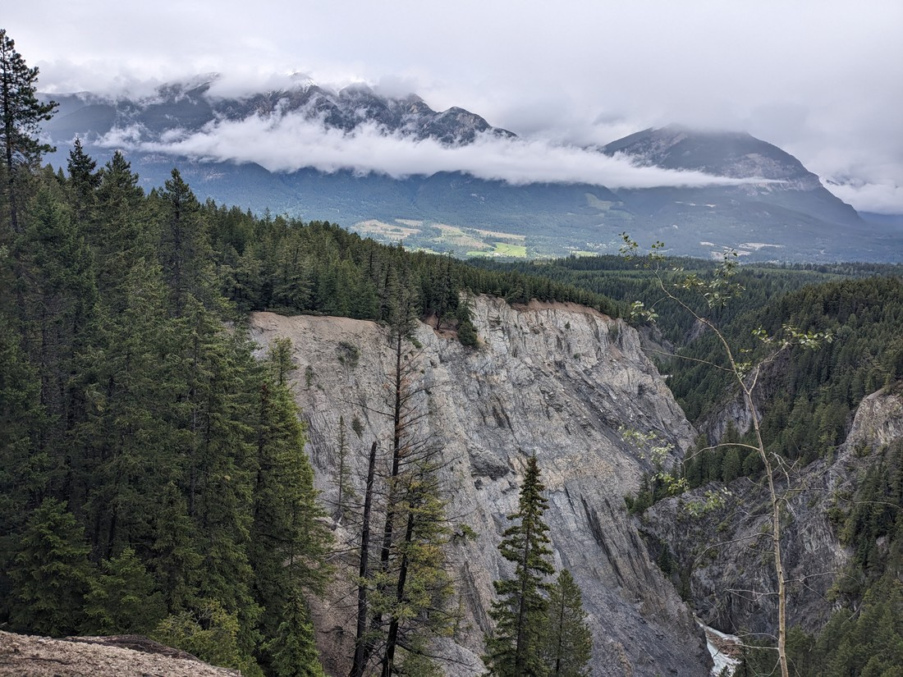
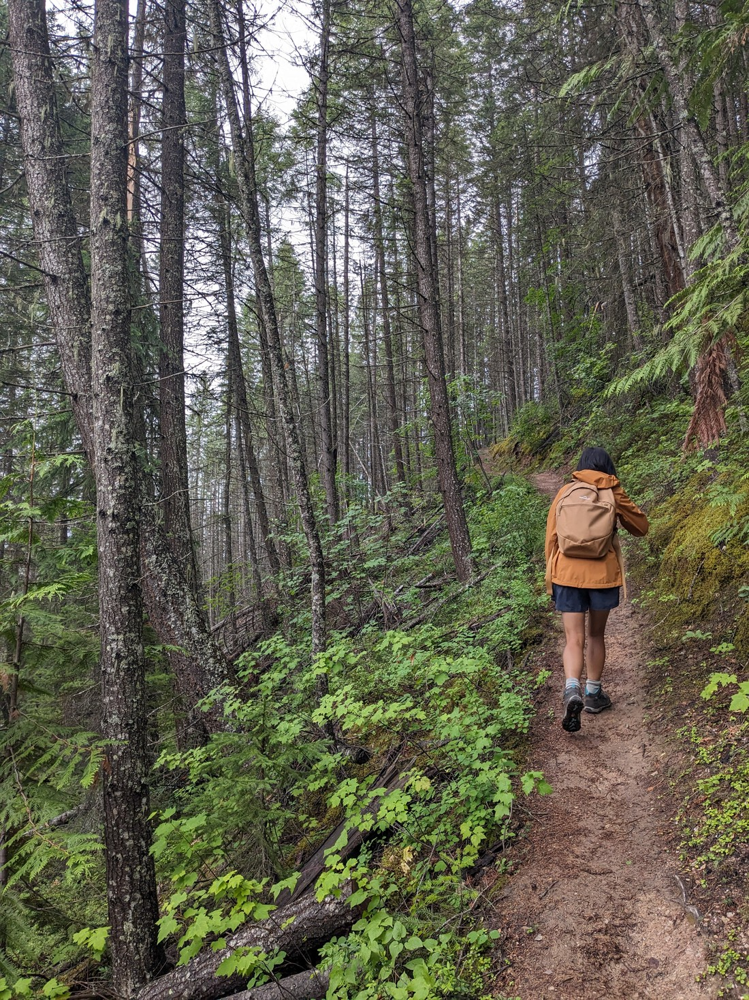
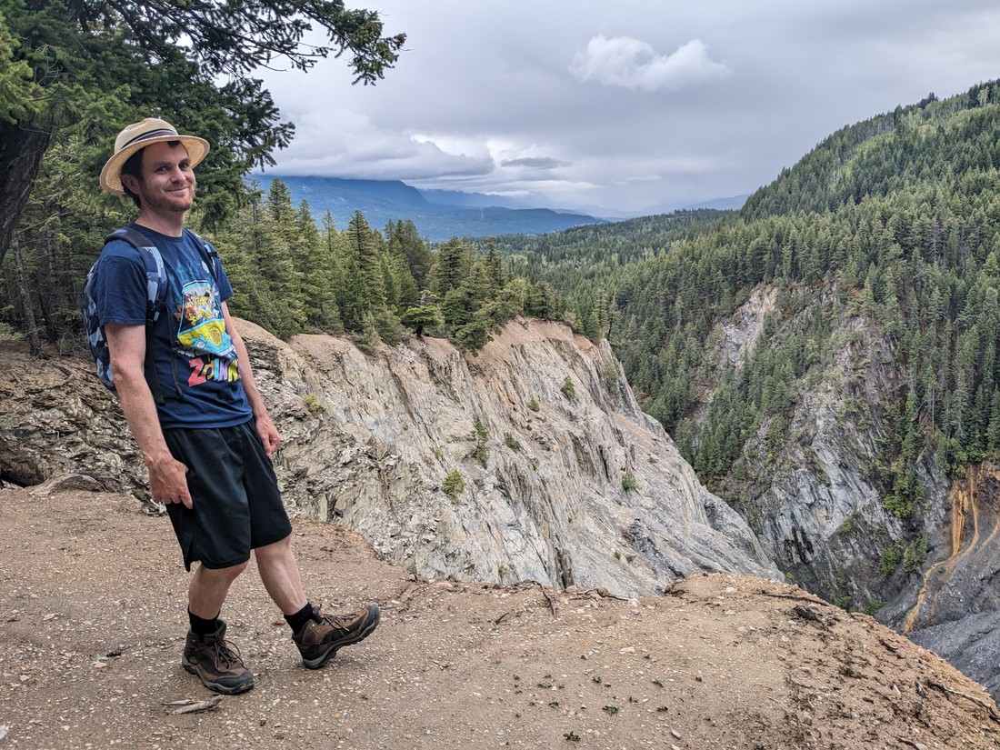
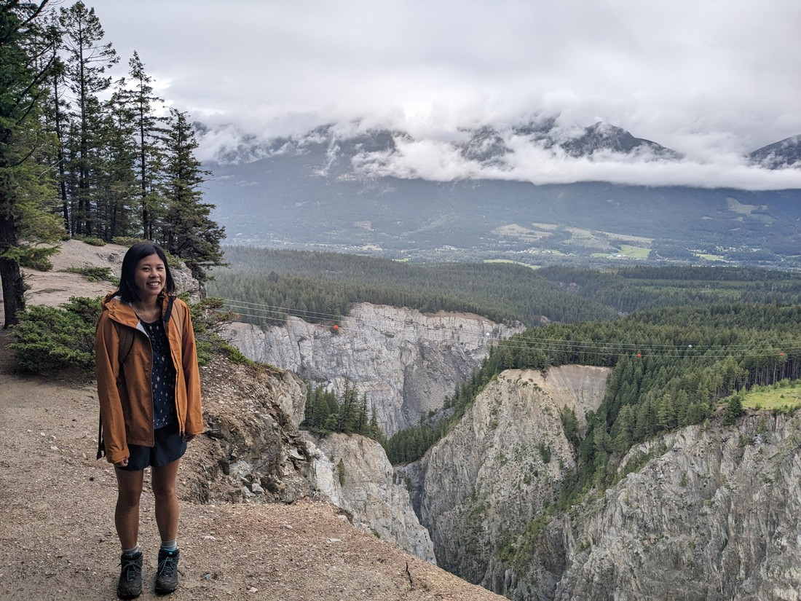
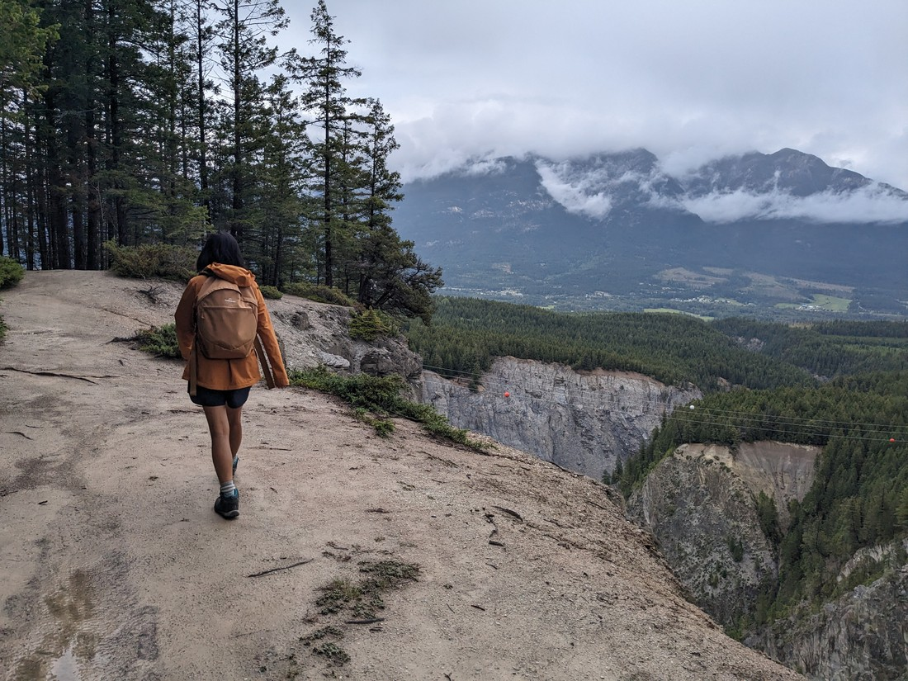

Today we woke up to rain, and so we didn't do a lot.  Usually I wouldn't even bother with a blog post but at 3pm we noticed that the weather was actually not too bad.  But from previous experience that just because it isn't bad now it doesn't mean the skies won't dump an ocean on us once we start going for a walk.

We decided just to do a nearby walk that went along a creek.  Well, kind of.  The creek's name was "Canyon Creek" which was a pretty good name.  This walk followed the rim of that canyon as it got higher and higher, and further away from the creek.

