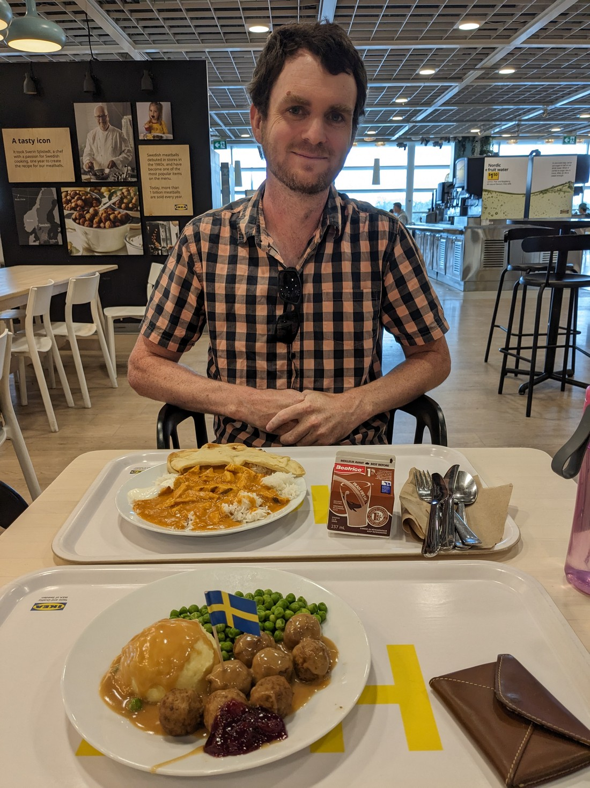
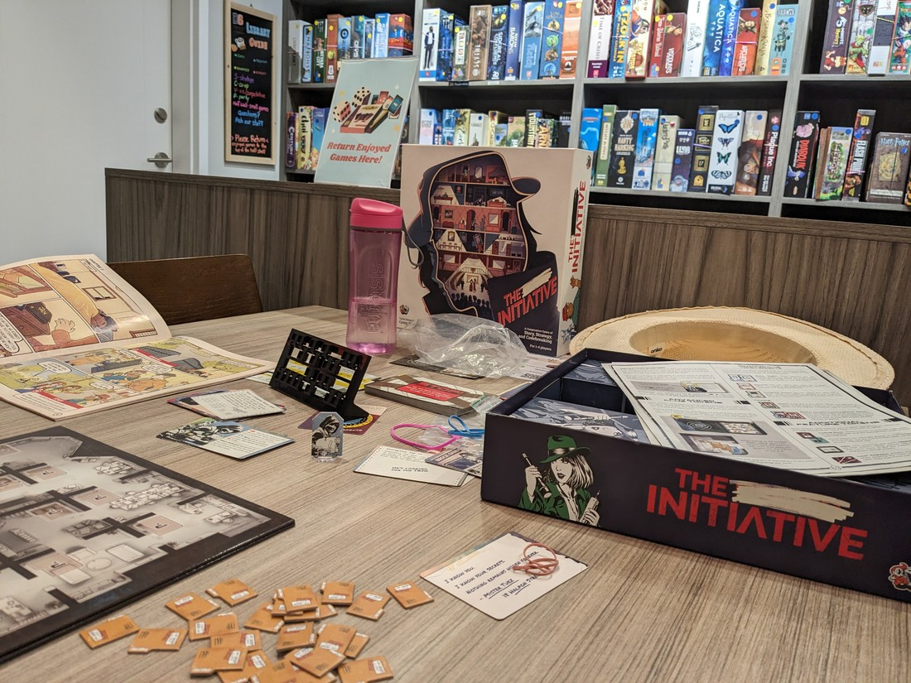

Do you remember yesterday?  It was cold, and rainy for most of the day.  Well, today was going to be worse.  But we knew that.  In fact, we'd known for several days that the weather wouldn't be good today.  And the reason we'd been keeping an eye on the weather for today in particular was because we were supposed to be camping today.

Last time we were in Canada we weren't able to spend much time in the Lake Louise area of Banff National Park.  This was because it gets extremely busy in this particular part and so the only real way to get there is by shuttle.  So this time we planned to camp at the nearby campground, to give us easy access to this part of the park.  We had planned to spend four nights here.

When we had abandoned our camping reservation at Rocky Mountain National Park we noted that not even Banff National Park got as cold as Rocky Mountain National Park happened to be then.  Well, it turns out that wasn't exactly accurate.  Banff's weather at this time of the year is usually very mild.  Unfortunately this week it just happens to be not so mild.  While we are going to be here it is going to be both cold and rainy in Banff (overnight lows of about 2 degrees Celsius).

So we knew this was going to happen.  We went out and specifically bought an extra comforter to better ensure we would be warm enough.  But still we had reservations.

Then in one of the days leading up to today  I happened to type "Lake Louise weather" instead of "Banff weather" into the search engine, and I got a surprise.  The weather results were different.  It was now predicting extra cold temperatures - maybe even as low as minus 2 Celsius.  And that made me remember something - Lake Louise is at a higher altitude than the rest of Banff National Park.  Turns out it wasn't rain we might need to be most worried about - it might snow.

So we decided to cancel our camping booking at Lake Louise.  Even though we haven't been there, we figured we probably would have more fun waiting out the cold weather in a basic motel than in this particular week of horrible weather.  This decision was made easier because in our schedule we are planning to return to Banff in July.  Likely the weather will be nicer then and so we should be able to check out Lake Louise, even if we have to take the shuttle.

So today our plan is to drive along Trans-Canada 1, through Yoho and Banff National Parks, to get to Calgary.  It has been a while since we've been in a big city so there's some big city things we plan to do.  Then we would drive north for almost an hour to get to the best cheapest motel we could find, which happens to be in an otherwise unremarkable town called Olds.  But the purpose of this stay wouldn't be for us to do a bunch of things - the purpose would just be so that we don't freeze our butts off.  Also, perhaps we ought to be putting more effort into job hunting.

So for four nights we stayed here and didn't get up to much.  This blog post will just summarise those days.

Our first day was travelling to Calgary.  I told Betty that she can pick wherever she wants to eat.  It's a huge city and so there's lots of options.  And so Betty chose this place:

> I didn't feel like the meatballs this time so I had Swedish Butter Chicken

Then we stopped by some Asian supermarkets to try and get some things Betty wanted.  And then we went to a second-hand book store.

For the last year or so Betty has been making her way through my 15 book fantasy series that I've been reading since teenage-hood.  She doesn't always enjoy it, but she's not a quitter.  When our holiday started she was on book six.  But they're big books so we couldn't really bring the other nine volumes with us to Canada.  So instead she just brought book six.  Except, now she's finished it and so now she needed book seven.  Well, it took a bit of research but we tracked down a bookstore with a cheap second-hand copy of the next two that she needs.

Then weirdly, while we were in Golden, we stopped by a geek shop - and they happened to have cheap second-hand copies of two others that she needed.  So now Betty has four volumes - over 3,000 pages - to read.  Those could easily last her for the next two years.

On our first morning in Olds we discovered that the town actually has a board game shop that also happened to have a library of games.  So we were able to get out of our motel room and try some games that were new to us.  We played a game (Tavern of Tiefenfall) about running taverns in Ye Olde Times that Betty won but Luke enjoyed more.  Then we played a Bob Ross themed game (Bob Ross: The Art of Chill) about painting that made Betty a bit angry (perhaps because she lost), despite the game supposed to be about chilling out as muh as painting.  Then we played another game (I forgot the name) about drawing bus routes in New York City, that Betty clearly had no idea what she was doing but she absolutely trounced me at it.

The next day we decided to something similar, except this time we made the 50 minute trip back to Calgary as this city had a lot of board game cafes.  We tried another game we hadn't played before (Alma Mater) which was about universities or something.  It was quite a complex game and so took us more than two hours to learn and play.  Afterwards we needed lunch.  After lunch we were like, "Well, we could do other things - Calgary is a big city after all.  But we already paid for a whole day of boardgaming so we may as well go back."

Our second game (The Initiative) was a cooperative game about spies and code cracking.  This was one had interested us before, but we never bought it because we understood that the puzzles would be too easy (it was more of a game for families).  Well, here we can try it without buying it.  So we played the first game and solved the puzzle rather quickly.  But this game was a series of scenarios with an overarching story so we figured we may as well try the next scenario - perhaps it might become more of a challenge.

Before we knew it, it was 9:45pm.  We hadn't eaten dinner.  All we had done was play scenario after scenario of this game.  It wasn't hard - we only lost one game, when we were unnecessarily rushing to solve a puzzle.  But it wasn't always straight forward either.  Each scenario added a slightly different wrinkle to the game and each scenario ended with a puzzle to solve.  Fortunately we were able to get through the entire game in one sitting - 14 scenarios in all.  Overall it was a very good game and I think neither of us have any regrets spending our entire afternoon and a large chunk of our evening on this one game.

> Mission(s) complete

After having a very late dinner we then faced the 50 minute drive back to Olds.  Despite being well past 10:30pm by this point, there was still light in the sky.  The sun had technically set but for the whole drive we got a nice orange glow as we chased the sunset north.  Well, today was June 21st - the longest day in the year.  And we are quite northerly now so the sun sets really late (when not obscured by rainclouds).  In fact, I don't think the evenings ever get completely dark as the sun is never far over the horizon.  The next day we went on a late night walk to get hot chocolates at 8pm, and the sky was still blue.

Speaking of the next day, we didn't really get up to much.  We tried to go to the nearby Botanical Gardens but we couldn't find them (they were on a university campus).  We mostly just spent the day stocking up again, and doing laundry.  The weather had definitely improved from the cold, miserable lowpoint of a day that was Monday.  But it was a bit hard to make the most of it when we were in a mostly industrial town surrounded by uninteresting farmland.

Overall it was probably a good decision to cancel our camping reservation.  There was pretty consistent rain the first two days.  Even though we weren't in the mountains, our motel room heater really struggled to warm our room up enough - so goodness knows how cold we would have got in a tent in the mountains with nothing but body heat.

So that was four days worth of activities in... 1,400 words.  Wow, that's a lot of words.  But I got this all written in sitting.  I'm getting really far behind with this blog writing thing so four days in one session of writing will go pretty far in ensuring I don't fall even further behind.  I know this blog post wasn't all that interesting, but I promise in the next one we'll be out amongst nature again.

