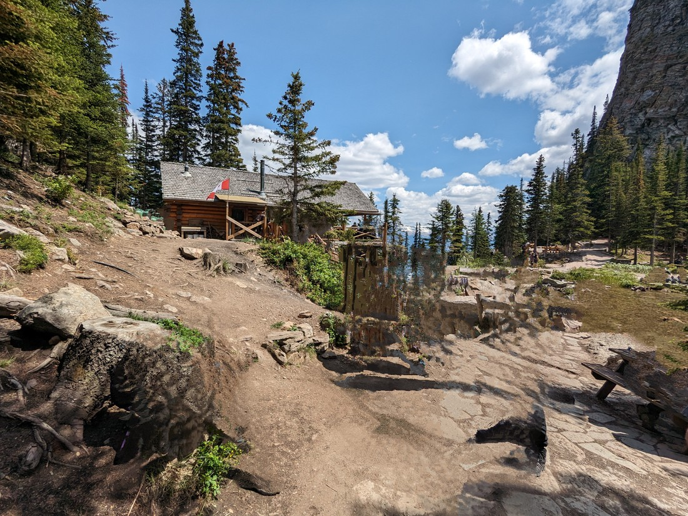
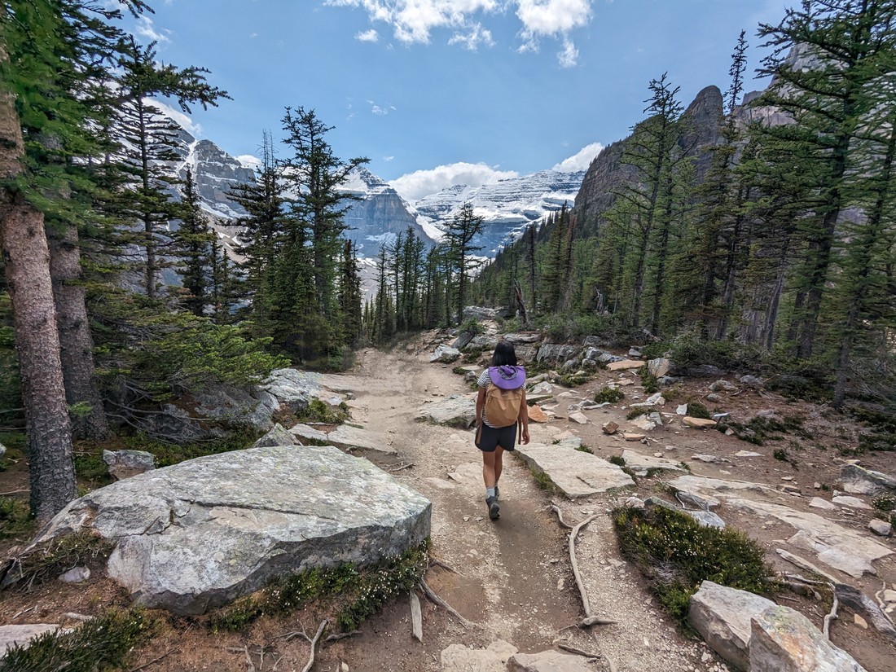

When we cancelled our Lake Louise camping reservation I told Betty that we could do so but on one condition.  Weather permitting, we should wake really early one morning and drive all the way back to Lake Louise for a day trip.  Well, after a couple of days in Olds the weather had definitely improved.  No longer were we relying on the thermostat to keep our room warm.  Instead we were cursing the thermostat for making it too warm (we're not used to such devices).

Well, the only shuttle times we could book were for today (because the earlier dates had all been booked, and the later dates hadn't finished being released).  That was very fortunate, because the weather forecast was predicting that today would be the sunniest day of the week.

So we ate our provided breakfast at the earliest time we could, and drove the 2.5 hours back to Lake Louise.  Well, I had hoped it would be 2.5 hours.  Due to road works, it was closer to 3.5 hours.  Which was a problem - we had to arrive during a certain time window to catch our shuttle.  Technically we didn't make it on time (two minutes late) but this type of thing must happen all the time so there was no issue with us boarding a bus to go the last seven kilometres to Lake Louise.

Lake Louise is a lake.  And boy is it a popular lake.  Buses and buses carry people to and from the lake area non-stop, basically all day.  And what are people coming to see?

A rather large lake, with mountains surrounding two sides, and a glacier at the far end.  And on a sunny day (like today) the water is a bright blue colour that doesn't seem like it could possibly be natural.  While I get annoyed at how busy the shore is, I can certainly understand why people flock here.

But this is not the first time we've flocked here.  In 2019 we did not plan ahead and the only way we could visit was to turn up really late in the evening when there were car parks available.  As a result, we had no time to actually do anything nearby.  Well, this time we have all day.

So let's do some walking!

Up a hill!

With hundreds of other people!

Seriously, the walk we started with was almost as populated as the lake shore.  And it wasn't even an easy walk.  Sure, the track was well made and it went through a scenic forest, but it was literally uphill the entire way.  And yet, people of all types were attempting it - not just hikers.  Which I guess is a good thing.  Lake Louise brings crowds of all kinds, and naturally they do the same thing we are doing - attempting the highly rated trail nearby.

The trail went to a pair of lakes.  The first was called Mirror Lake.  It wasn't much - just a bowl of water in the forest.

> Where are the mirrors?

And despite what it appears in the above photo, it too was busy with people doing... well, exactly the same thing I am doing in the above photo.  At this point we wanted a rest.  Not because we were tired, but because it was about time we had lunch.  Fortunately everyone trying to take the perfect photos just hung around the shore nearest the trail.  So all we needed to do was walk 40 metres along the shore and we had a nice spot to eat our treats.

After Mirror Lake, the trail climbed higher - giving us some views out over Banff.

After so many miserable rainy days, it was nice to have one day of perfectly blue skies with very little of that grey haze.

The trail finished at a lake called Lake Agnes.  This lake was famous because of the tea house that sat next to it.  Having not seen any pictures of it, Betty and I both imagined a quaint pavilion or something else European or Asian inspired.  The actual building turned out to be basically a log cabin.

> Which makes sense, given the quantity of logs in the vicinity

What's that?  There's something weird about the picture of the tea house?  Okay, you got me - I may have attempted some visual trickery.  Here is the image restored to it's original form:

> Where's the tea house?  All I see is people.

In what is becoming a theme for this blog post, the tea house was quite busy.  Even Betty, who is quite the enjoyer-of-tea, knew that it wasn't going to happen here.

So we decided to continue walking.

We followed the trail around the lake, which gave us a nice view of the tea house's surroundings.

The trail we were now following was to a viewpoint called Big Beehive.  Past the tea house we finally found a reprieve from the crowds.  Sure, there were still a lot of people.  But now it didn't feel like the trail was two queues going in opposite directions.  And part of the reason that might be was because the trail incline got very steep.

But our effort was certainly rewarded.

> Lake Louise is certainly easily identifiable

The "beehive" was a large hill with a trail on top running parallel to Lake Louise.  While none of the view points were perfect, as we walked along we were able to get a number of good looks at the mountains, the forests, and that amazing coloured water.

> So hard to get the whole lake in one photo

Again, after so many dark and rainy days, it was really pleasing to have a day like this and be in a place like this.

> The lake doesn't look as long from the shore

\*Many\* photos were taken.

> A couple of very happy hikers

But after we had admired the view for a while it was time to ask the question, "What next?"

This hill wasn't perfect.  We were only really getting views in one direction.  Of course, it was the best direction - but Lake Agnes (on the other side) would have been nice to see too.  Well, one option was to climb even further up the ridge that we were currently on to a point called Devil's SOMETHING.  However, this trail wasn't on any of the park brochures.  Apparently, someone had decided that this trail was too difficult.  That sounds horrible, but I think it goes back to what I said earlier - about how the Lake Louise area attracts people of all hiking skill levels.  If this trail was publicised then likely too many non-hiker people might get into trouble trying to climb it.

Clearly thousands of people had attempted the trail though because the ground had been stamped into a clear trail (just not a sign posted one).  Do we attempt it?  Ultimately we decided not to.  Perhaps we might be some of the people that the park people don't want attempting this hike.  Maybe it is beyond our abilities.  However the main reason we decided not to was that our time in the Lake Louise area was limited, so we thought we ought to go elsewhere.

So we followed our existing trail over Big Beehive and down the hill, back towards Lake Louise.  Then we turned west and started towards the famous glacier at the far end.

To our delight there was basically no one else on this trail.  Well, the only purpose for this particular route was to link two particular trails together.  And since Lake Agnes was certainly a sight to see, I can't really imagine why anyone would be doing the same thing we're doing but in reverse.

The place we decided to walk to was called the Plain of Six Glaciers.  It was basically a scenic point in the middle of the valley surrounded by (apparently) six glaciers.

But that's not all it had.  There was also another tea house.

> This one is less like a log cabin.  Maybe the other one looked like this too, we just couldn't get close enough.

And much to Betty's delight, there was no line.  But her immediate excitement was immediately dashed when a staff member yelled out that they had just closed.  Such a cruel trick.  Poor Betty - she never got her tea today.

All that was left to do was to sit around in the afternoon sun and rest.  We'd actually walked quite the distance already today.  And there was still more than six kilometres left to walk back to the shuttle pickup.

> On some already tired legs

In this valley there was actually one last viewpoint, another 1.2 kilometres further.  This would bring hikers quite close to the main glacier.  We decided another 2.4 kilometres might make the walk a bit too long.  We still had to make it back to the bus pickup before the final pickup time of 7:30pm.  And even if we were earlier, we did still need to drive several hours to get to our next accommodation.  But a part of me does regret that we didn't go all the way.  We walked most of it - we probably should have pushed through and done all of it.  Regardless of how our toes felt.

> Mind you, there were still plenty of good views at where we turned 

Time to head back.

> The chateau at the far end of the lake would be our finishing point

The walk back went by really quickly.  I guess this is what happens when you've already walked a long distance - your brain goes tired and doesn't bother remembering things?  Of course, there was another added incentive that there was a bathroom at the end of the trail.

We did make good time in the end, taking a little more than five hours to cover approximately 15 kilometres with more than 800 metres of elevation change.  Though after catching the bus back to our car, driving back to Calgary, eating a well deserved dinner, and then driving on to our accommodation in Strathmore it was very late.

> Although you wouldn't think so, this is Lake Louise at 6pm

It was a day spent very well.  We never want to waste a nice sunny day, especially one in the rainy month of June.  And while we had visited Lake Louise before, we can now say that we've really visited Lake Louise.  Sure, there are still a number of trails we haven't set foot on, but we've definitely covered off the ones that led to the main sightseeing spots.  So overall an excellent day.

The only thing that could have made it better would have been some tea...