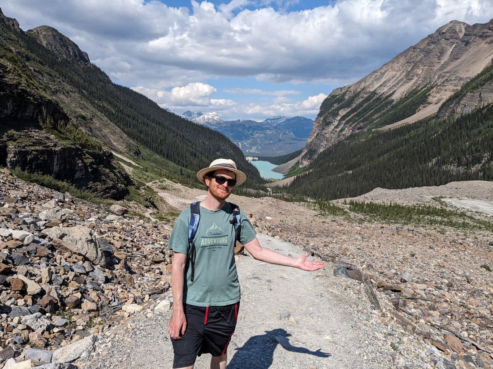

When we cancelled our Lake Louise camping reservation I convinced Betty that we should do so on one condition.  Weather permitting, we should wake really early one morning and drive all the way back to Lake Louise for a day trip.  Well, after a couple of days in Olds the weather had definitely improved.  No longer were we relying on the thermostat to keep our room warm.  Instead we were cursing the thermostat for making it too warm (we're not used to these types of things).

Well, the only shuttle times we could book were for today (because the earlier dates had all been booked, and the later dates hadn't yet released their final lot of slots to book).  That was very fortunate, because the forecast was predicting that today would be the sunniest day of the week.

