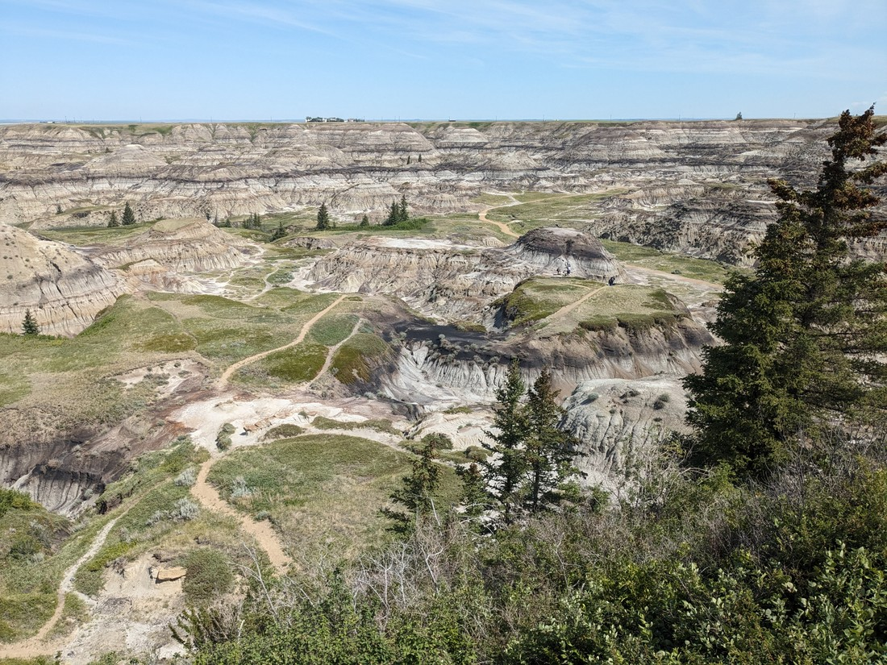
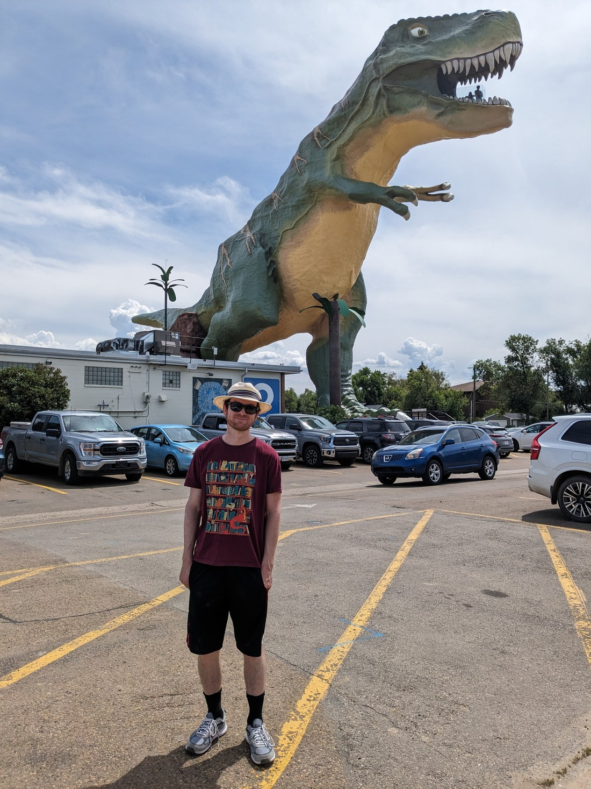
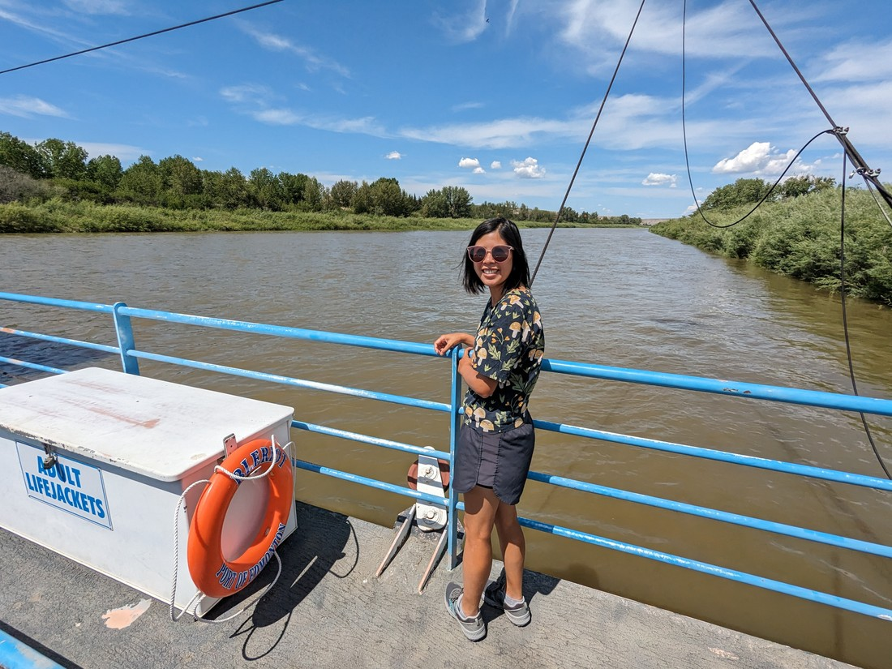
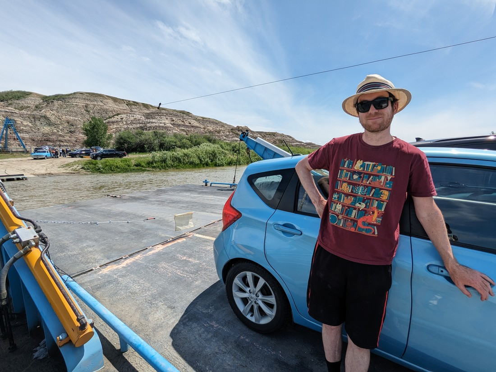

At our accommodation last night we were asked about why we had come to Strathmore.  I spoke the truth, replying that we were here because Calgary was too expensive.  Calgary does have cheap motels, but they all sounded terrible.  We'd decided that big cities were not what we wanted on this holiday so there was no need for us to stay in Calgary - cheaper satellite towns would do.

Our next destination was a park east of Calgary but because we were already 40 minutes east of Calgary, it wasn't going to be a long drive.  So we had to scramble this morning to figure out what we could spend a day doing.  We ended up finding that a nearby town called Drumheller had a bunch of sights to see in its vicinity.  So that's where we headed.

First stop was a place called Horseshoe Canyon.  And the reason it is called that is... okay, I don't know.

> It definitely wasn't horseshoe shaped

This type of terrain is described as "badlands" - which gets its name from the badlands we saw at Badlands National Park in the USA.  I don't really know how to describe it, and I guess I don't have to - because I have pictures.

> Sandy canyon-like hills?

It was an interesting place to stop.  There was a walk down into the canyon, but the walk didn't really go anywhere.  It just kind of petered out after 500 metres or so.  But unlike many parks we've been to, we weren't told to stick to the trails.  Instead we were told to "explore responsibly."  So after the trail came to an end, we just picked a direction and started walking.

As you could see from the first photo, there were a number of informal trails made by people wandering about.  We tried to stick to those trails as much as we could, as we made a loop back to the stairs.  But we were not always successful as often the trails would come to nothing as they either disappeared into the hard rock, or stopped because there was nothing interesting to see.

We did get a tad lost, but the (very hot) sun was always a reliable marker we could use to know which way to walk.

> Cacti provided no help

After Horseshoe Canyon we drove on to Drumheller.  This town turned out to be inside a badlands style canyon.  I'm not sure I got any good pictures of how the town looked, with the canyon walls on the north and south sides.  Part of me was annoyed that we spent so much time at the tiny Horseshoe Canyon when we could have seen similar rock features just by walking around this town.

Anyway, we were mostly in this town to visit the world's largest dinosaur.

The dinosaur and the rest of the stops today would just be random little touristy things near the road.  We would drive along, stop and see a particular sight, enjoy it for a small amount of time, then start driving to the next one.

So after seeing the giant dinosaur, we found ourselves outside a little church.

> I think this is also a photo of another photo being taken

We wanted to see the inside, but it looked like there might be a service going on.  Apparently this was a real church that did real church things - it just didn't seat many people.  Six in fact.  As we drove on we spotted a sign saying that the church was currently holding a wedding reception for a newly married couple.  10,000 people were welcome to come... but only six a time.

After the miniature religious building it was time for more badlands.  This time it was a view point overseeing a canyon called Horsethief Canyon.

So far on this trip we've seen a lot of things named "Horsethief something".  It's not a profession (if you could call it a profession) that you'd think would get the prestige of naming rights.  I guess it was more to do with people saying, "Hey don't go into that canyon - that's where we think the people that steal our horses flee to."

I had to apologise to Betty for the next stop.  She tends to get minorly excited about bridges.  In order to loop back to Drumheller we had to cross the canyon river, but unfortunately there was no bridge.

> What's this?

Instead there was a ferry.  No idea why.  The river wasn't all that wide and the road wasn't all that important.  I guess building a bridge tall enough that boats could go under would have been annoying.  But it still really surprised us that the local town (or whoever) still operated a ferry.  And it was free!

I am pretty certain most of the ferry passengers were just doing the same thing we were doing - driving around for no particular purpose other than enjoyment.

Our last stop before we returned to Drumheller was the viewpoint on the opposite side of the canyon to the Horsethief Canyon viewpoint.  But this one was instead called the Orkney viewpoint.

This was a weird place.  Due to the angle, the sun position in the sky, and its colouring, it was very hard to tell what we were seeing.  Even in person, the far canyon wall just appeared flat.  Without any shadow or familiar landmarks nearby, our eyes just couldn't work out what we were seeing.

> It really did look that blurry in person

Regardless, this turned out to be a nice place to sit and contemplate.

> Well, once the noisy motorcyclists had left

After one last hot dinner in Drumheller, we headed on to the park where would be camping for the night.  I'll talk about that park separately, but I will note something about the drive there.  It was over an hour of driving alongside fields, with corners few and far between.  But something there was plenty of was animals on the road.  We're not sure but they were likely either ground squirrels, prairie dogs, or something else that was similar.  And whatever they were, they did not seem to understand danger.

They would run onto the road and then stop, and as I drove past I had to guess which way they would try and run so as to avoid hitting them - something that clearly happened quite often based on the amount of roadkill about.  Usually animals are a lot more reliable at running AWAY from the oncoming car - but not these guys.  But fortunately we managed to get to our destination without hitting any (we think).