We arrived at Dinosaur Provincial Park rather late - 6pm in fact.

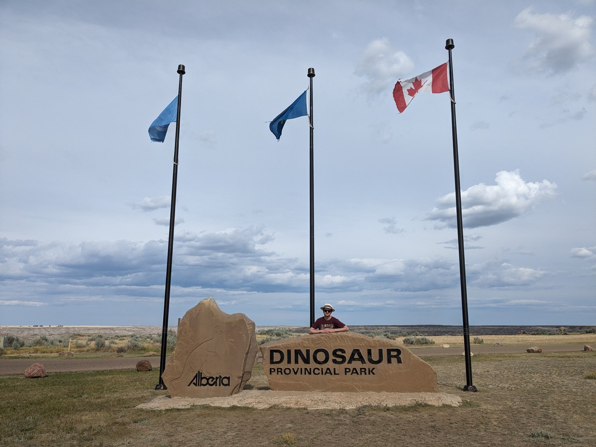

> Hooray, a proper park sign!

Okay, so not that late - but late enough that we doubted any park staff would still be around. No need to rush, so we stopped at the entrance viewpoint to... view, and... point?

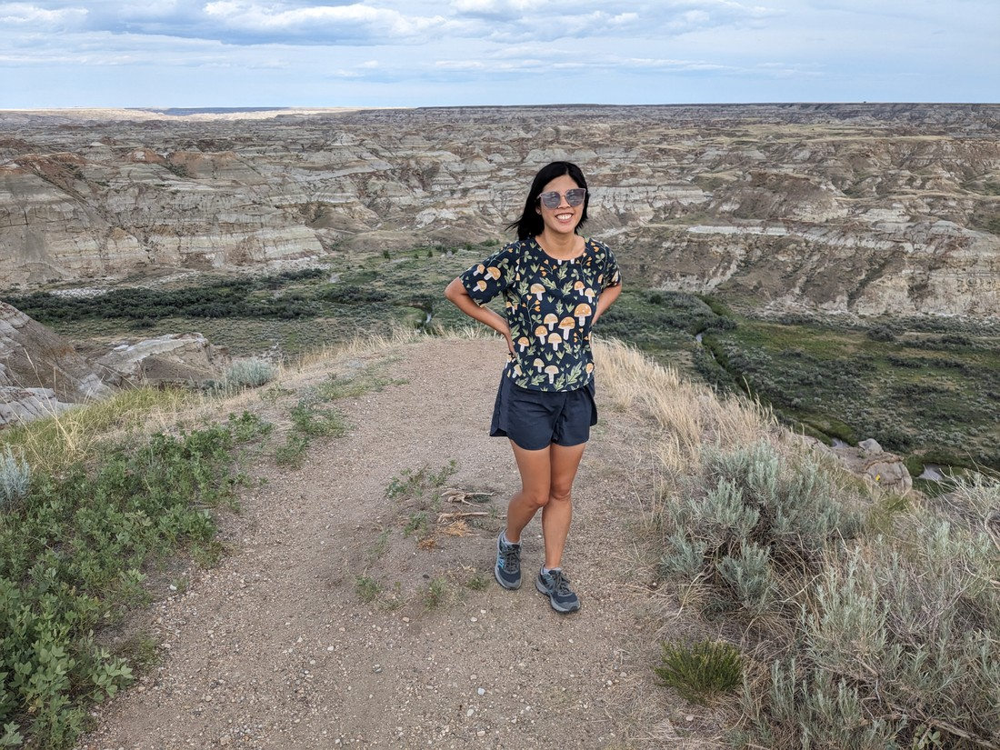

> Seriously, what is it with this terrain that makes it seem so flat and blurry?

Dinosaur Provincial Park is another badlands area, like Drumheller. It was oddly cloudy but there was still good views.

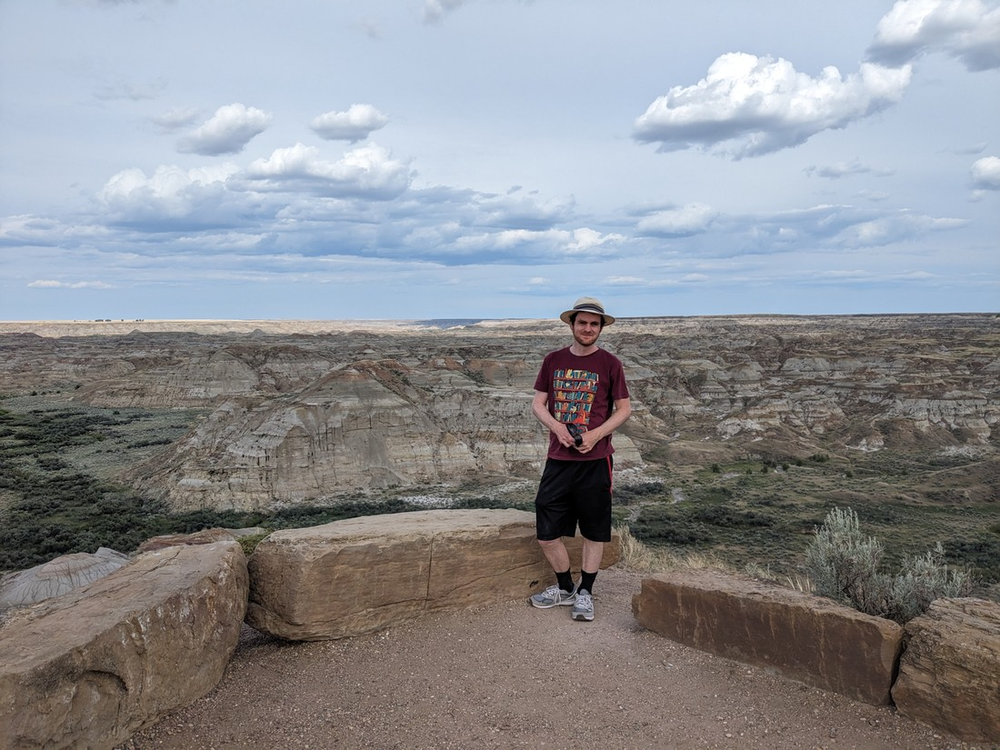

When we entered the park properly, we decided to go straight to our camp site and set up. As we assembled our tent a couple of rangers were talking to some kids nearby. I was only half listening. They were telling the kids, "you're witnessing a natural phenomenon" while staring into the trees. It sounded like the rangers were trying to make something mundane seem interesting. As we continued setting the tent up I remember hearing, "blah blah something something... bull snake."

That made my ears prick up. We left our tent unfinished and went over to have a look.

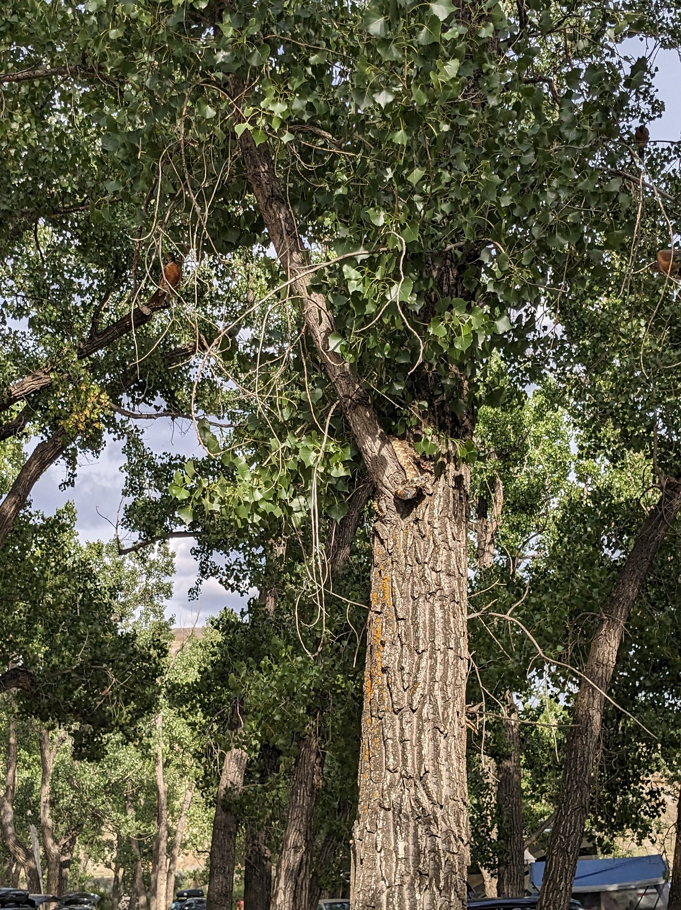

> It's hard to see - not the best photo

In the tree was a rather large snake. I have no idea how it managed to climb 2.5 metres up a tree with no branches. Unfortunately it also clearly had a bird in its mouth. The snake blended in to the tree so well that no one would have noticed, had there not been three other birds flying around squawking.

After finishing setting up our tent we went to self-register and found that the check-in was actually still open. They told us not to set up the tent on the grass. We just nodded and nodded, pretending like we were only just arriving and certainly hadn't already set up a tent on the grass.

As we walked back to our site, Betty was a bit worried about snakes being in trees. I jokingly commented that while a snake in a tree isn't great, it would be worse if we got back and the snake was gone. And of course, that is exactly what happened.

Fortunately a neighbour informed us that the rangers had sent the snake far away somehow. And also, while the snake might have a bite, it was non-venomous. So we were able to sleep that night.

Except there was still more to do tonight. The rangers had been going round letting families know that there was a \*thing\* on at the park auditorium at 7:30pm. For some reason they didn't let us know. We figured it would be more for kids, but we also figured that we had nothing else better to do. So since it was nearby, we wandered over at 7:25pm.

The \*thing\* turned out to be essentially a one woman show where one of the park rangers played Dorothy, only she is sent to Dinosaur Provincial Park instead of Oz. The lady also played all the characters, with a little help from some fathers in the audience.

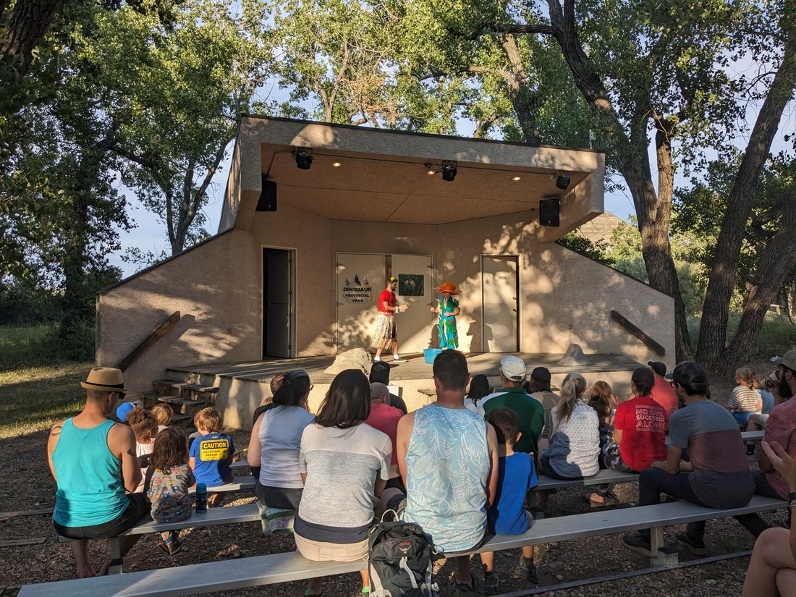

In the above photo she is dressed as a cactus, teaching another plant (played by a volunteer dad) how to survive in an arid environment by dressing him up. While doing this, she was also singing a parody of "Popular" (now titled "Prickly") from the Wicked musical. And surprisingly, she was quite a good singer. Such an interesting job she has - by day she is a regular park ranger but by night (well, some nights) she performs a one hour long musical all by herself. We were certainly wrong about staff not being around at this hour.

This was our first night camping in Canada, and while we were prepared - some things we hadn't anticipated. For starters, I had picked a bad campsite. It was right beside a pair of pit toilets. The smell was bearable (Betty might disagree), but something more annoying was the noise of people walking past, slamming the door, slamming it again on the way out, and walking noises once more. The other issue with the campsite was that it was near a group of very loud people. Quiet time was supposed to be from 11pm (which was approximately sunset), but they were sitting round a campfire talking loudly until about half past midnight. We weren't confident about the rules (and also conflict averse) so we just lay and waited.

So we didn't get to sleep until late. But we could sleep in, right? Well, just as the sun set quite late, it rose quite early. Tent fabric doesn't do much to stop sunlight, but if we're sleeping soundly enough then the morning sun can be ignored. Unfortunately, once the sun is up then other campers start getting up and making noise - like slamming toilet doors. Overall our sleep this night was definitely very poor.

So earlier than we would have liked, we packed up and set out to see what there was to see in the park. This involved driving along a scenic gravel road, making regular stops to do short walks. First there were some hoodoos:

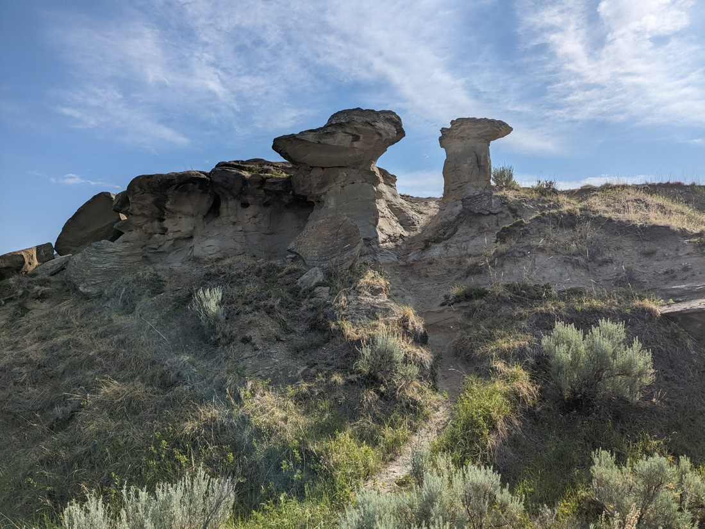

> Not all that impressive but a fair excuse for a short walk

Then there were exhibits and info boards explaining why this park is called "Dinosaur"

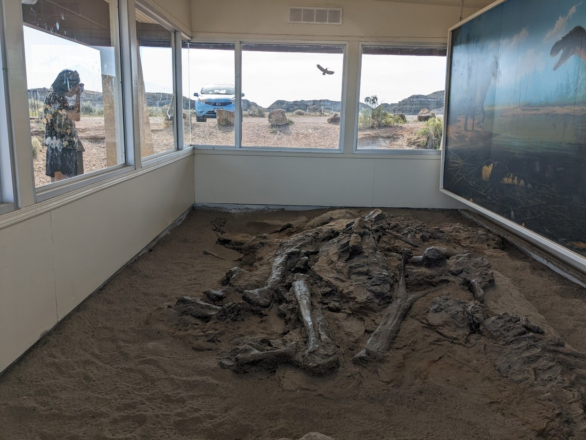

It turns out that this place was once the site of a decade long "dinosaur rush" (like a gold rush, but for dinosaur bones). It turns out this terrain is perfect for both containing dinosaur bones, covering them for millions of years, and then having them be exposed in the present day. We learned many things - like how bones need to be coated in glue immediately otherwise they just crumble to nothing.

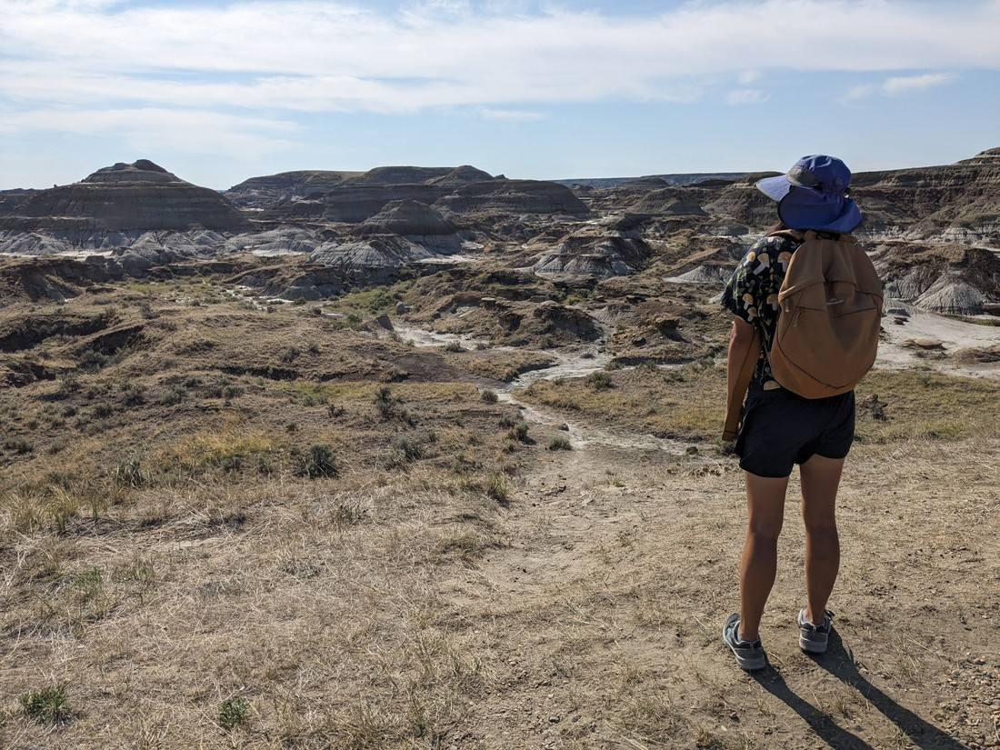

Overall it was fine, but I think neither of us was all that enthusiastic. Because of the poor sleep. But the weather was nicer now so we returned to the entrance viewpoint, which was a lot less cloudy than yesterday.

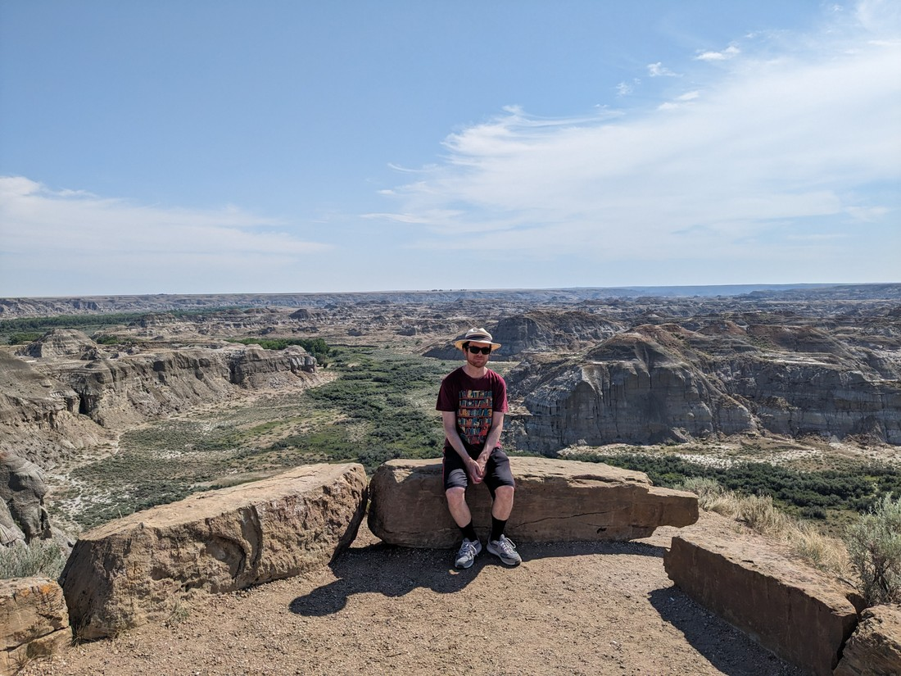

> Okay, I think it's definitely the shadows that help give the hills some definition

On our way out we made one stop to a walk round some hoodoos.

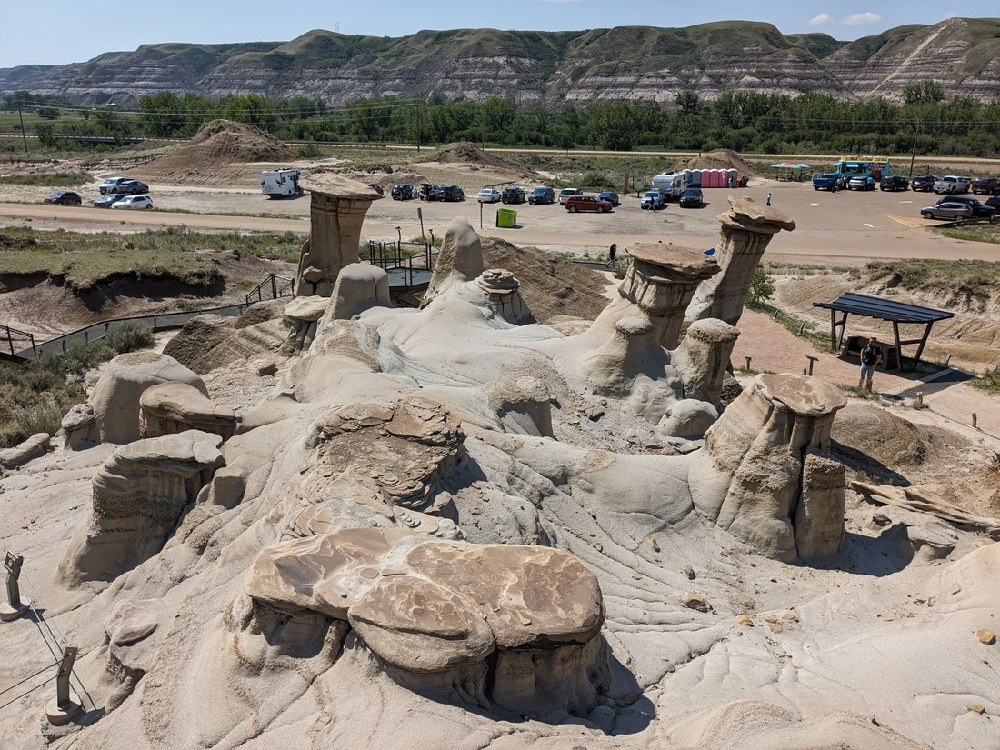

I think I've explained these before but I'll explain it once more - hoodoos are formations where a rock above has prevented the terrain directly below it from eroding, creating a structure. These hoodoos were perhaps the most impressive we've seen, with the rocks at the top being the size and shape of manhole covers. And lots of other people clearly thought so, as it was a very busy place.

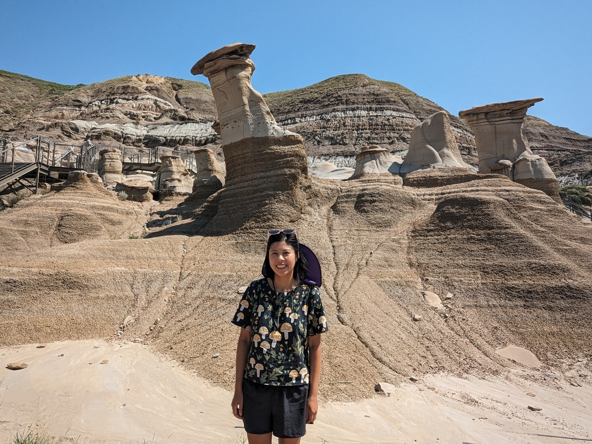

But again, we were still tired. So we didn't linger and just drove on. We had more planned today but an unexpected rain storm meant we decided not to do anything further. Neither of us admitted it, but I think we both felt it was a rather welcome rain storm.

It's a shame our experience at Dinosaur Provincial Park wasn't better. The campground was rather nice (it had proper toilets if you didn't mind walking, showers, and even a cafe). I don't know why I picked that particular campsite. I thought I had prioritised sites away from bathrooms. Perhaps I just hadn't noticed the icon on the map for this one. Likely if we had a site at the opposite end of the campground, we might have slept well and had a really good time.
