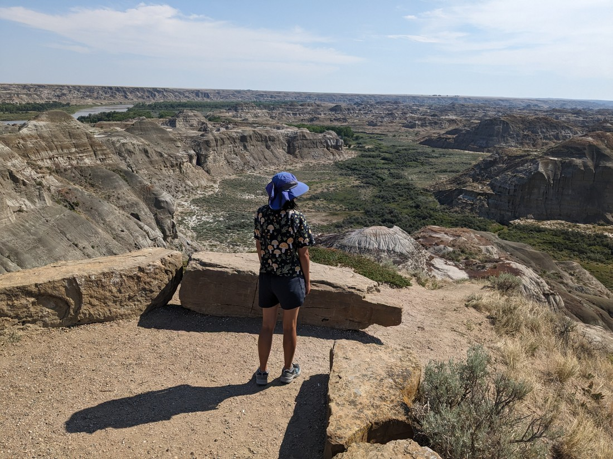
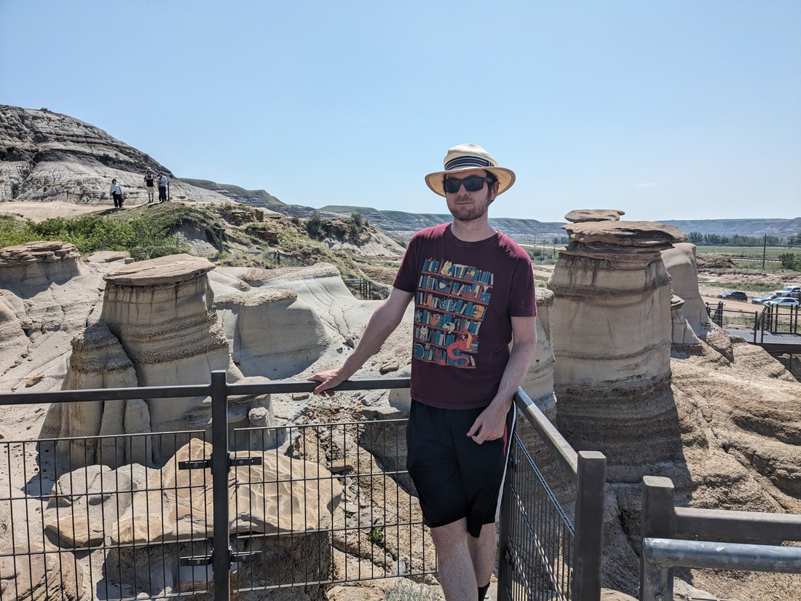

We arrived at Dinosaur Provincial Park rather late - 6pm in fact.

The check-in looked to be closed so we just drove to our camp site and set up.  As we set up a couple of rangers were talking to some kids nearby.  I was only half listening.  They were telling the kids, "you're witnessing a natural phenomenon" while staring into the trees.  Sounded like they were trying to make something seem interesting.  As we continued setting the tent up I remember hearing, "blah blah something something... bull snake."

That made my ears prick up.  We left our tent unfinished and went over to have a look.

In the tree was a rather large snake.  I have no idea how it managed to climb 2.5 metres up a tree with no branches.

We went to self-register and found that the check-in was actually still open.  They told us not to set up the tent on the grass.  We just nodded and nodded, pretending like we were only just arriving and certainly hadn't already set up a tent on the grass.

As we walked back to our site, Betty was a bit worried about snakes being in trees.  I jokingly commented that while a snake in a tree isn't great, it would be worse if we got back and the snake was gone.  And of course, that is exactly what happened.

Fortunately a neighbour informed us that the rangers had sent the snake far away somehow.  And also, while the snake might have a bite, it was non-venomous.  So we were able to sleep that night.

