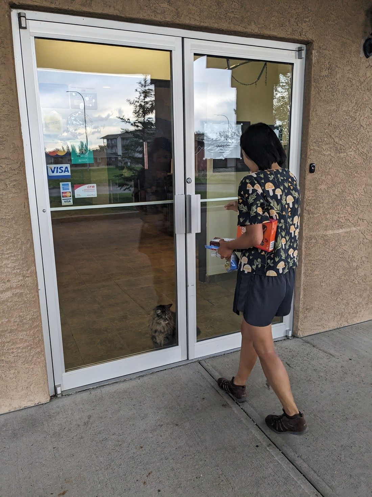
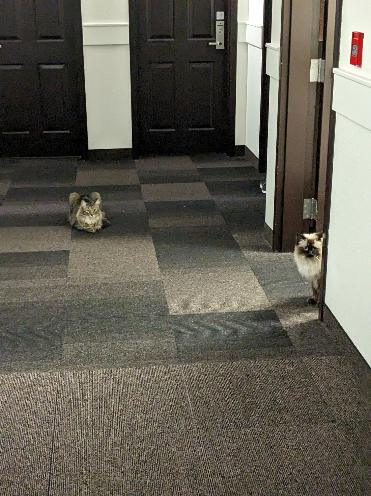
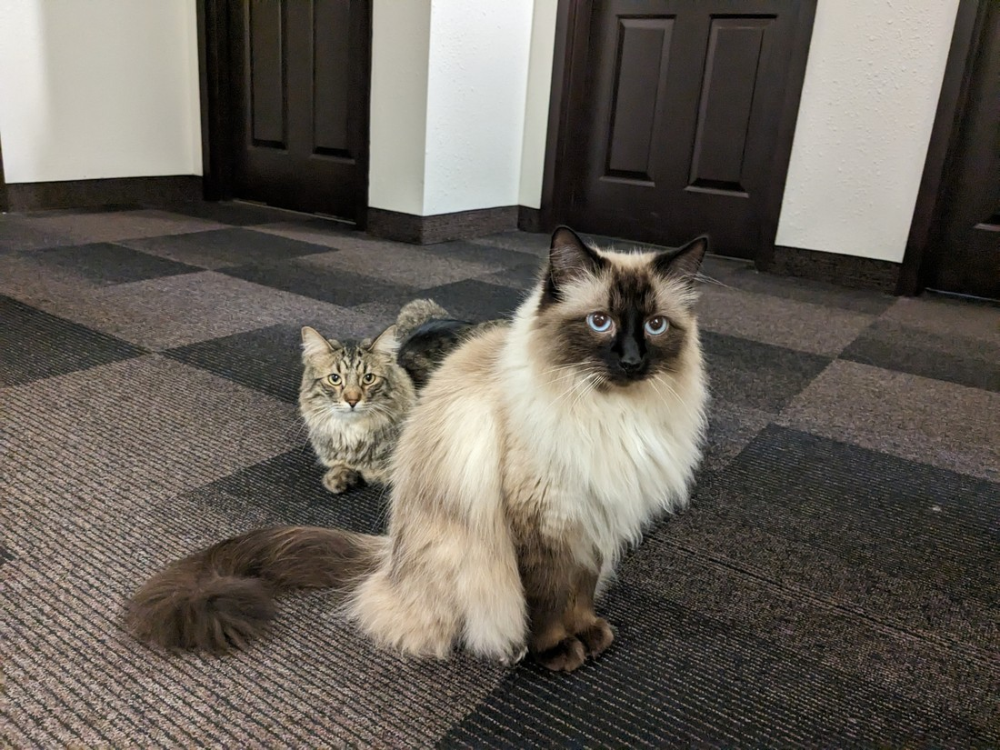
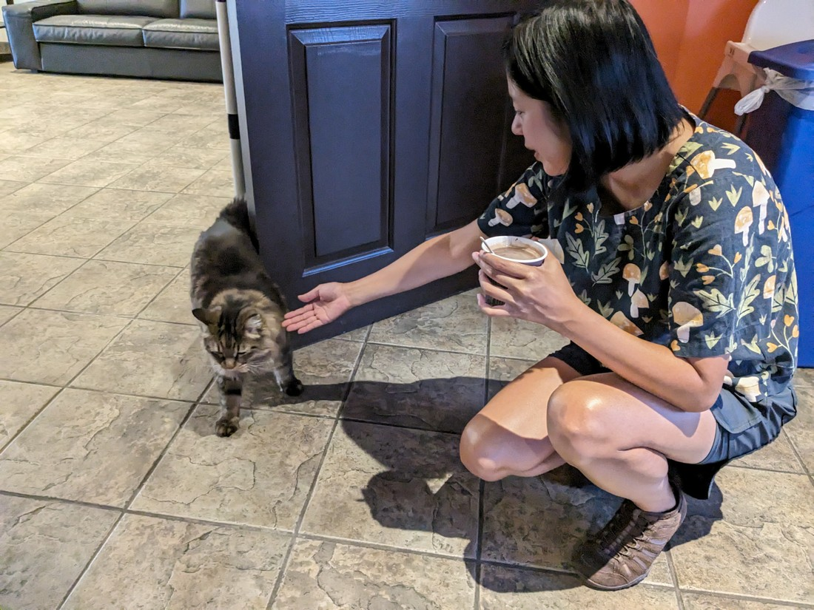
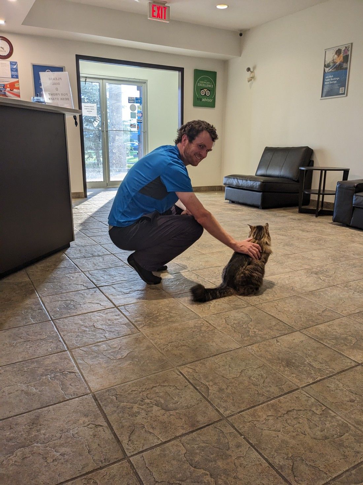

Edmonton is a city in... Northern Alberta?  Actually it might just be Central Alberta - the province is pretty big but this is as northerly as we plan to go.  I had thought it to be a small city but it turns out there's quite a lot here.  We didn't have much to do today so we figured we'd stop by another board game cafe.  It turned out there were at least four to choose from.

But I don't plan to talk much about that visit in this blog post.  Instead I just plan to talk about the accommodation from the previous night.

It was a Motel 6 in Innisfail.  It was quite cheap in an otherwise unremarkable town.  The reason it gets its own blog post is because of its residents.  At the front door was a sign that said, "Please let a staff member know if there is a cat outside."  And it didn't take long for us to be introduced to the cat.

We made a positive comment about the cat to the guy at the desk and he replied, "Oh yeah, there's about six of them."

This was an otherwise unremarkable motel, except when walking down the hallway it often felt like the place was infested with cats.

And not always in a good way.  There was a certain spot, not that far from the main reception area that often smelled of kitty litter or cat food.  I wonder how people who already don't like cats would feel to smell those odours.

But for us it was great.  I walked downstairs in the morning to grab a couple of the provided muffins and a cat stared back at me over the reception desk in the same way a receptionist would.

I should start a website that is a record of all motels and other accommodations that have resident cats.  I'm sure there must be lots of people like us out there that love their company.